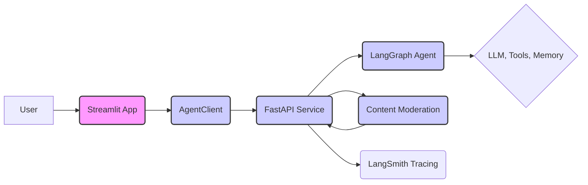

# AI Agent Service Toolkit: Build, Deploy, and Scale Your AI Agents

**Unlock the power of AI agents with a complete toolkit built on LangGraph, FastAPI, and Streamlit!**  Explore and contribute at [the original repository](https://github.com/JoshuaC215/agent-service-toolkit).

[](https://github.com/JoshuaC215/agent-service-toolkit/actions/workflows/test.yml)
[](https://codecov.io/github/JoshuaC215/agent-service-toolkit)
[](https://github.com/JoshuaC215/agent-service-toolkit/blob/main/pyproject.toml)
[](https://github.com/JoshuaC215/agent-service-toolkit/blob/main/LICENSE)
[](https://agent-service-toolkit.streamlit.app/)

This toolkit provides a comprehensive solution for building, deploying, and interacting with AI agents.  It streamlines the development process, offering a pre-built architecture with LangGraph, FastAPI, and Streamlit, along with essential features for production-ready AI agent services.

## Key Features

*   **LangGraph-Powered Agents:** Leverage the latest LangGraph v0.3 features including human-in-the-loop, flow control, long-term memory, and supervisor capabilities.
*   **FastAPI Service:** Efficiently serve your agents with streaming and non-streaming endpoints for optimal performance.
*   **Advanced Streaming Capabilities:** Support both token-based and message-based streaming for a dynamic user experience.
*   **User-Friendly Streamlit Interface:**  A built-in chat interface provides an intuitive way to interact with your agents.
*   **Multi-Agent Support:**  Easily manage and deploy multiple agents within your service, accessible via URL paths.
*   **Asynchronous Design:**  Built with async/await for efficient handling of concurrent requests.
*   **Content Moderation:** Includes LlamaGuard integration for responsible AI development (requires Groq API key).
*   **RAG Agent Implementation:**  A basic RAG agent implementation using ChromaDB is included.
*   **Feedback Mechanism:**  Integrated star-based feedback system with LangSmith.
*   **Docker Support:**  Streamline development and deployment with Dockerfiles and a Docker Compose file.
*   **Comprehensive Testing:**  Robust unit and integration tests for reliability.

## Quickstart

1.  **Environment Setup:**

    *   Create a `.env` file in the root directory.  At least one LLM API key is required. See the [`.env.example` file](./.env.example) for a full list of available environment variables.
    *   Install the project and dependencies using `uv` (recommended) or `pip`:

        ```bash
        # uv installation (recommended)
        curl -LsSf https://astral.sh/uv/0.7.19/install.sh | sh
        uv sync --frozen
        source .venv/bin/activate

        # pip installation (alternative)
        pip install .
        ```

2.  **Run the Service and App:**
    *   **Python:**

        ```bash
        python src/run_service.py
        # In another shell:
        streamlit run src/streamlit_app.py
        ```
    *   **Docker (recommended):**

        ```bash
        docker compose watch
        ```

3.  **Access the App:**  Open your browser and navigate to `http://localhost:8501` (Streamlit app).  The API will be available at `http://0.0.0.0:8080`.

## Architecture



##  Key Files and Directory Structure

*   `src/agents/`:  Agent definitions.
*   `src/schema/`:  Protocol schemas.
*   `src/core/`:  Core modules (LLM definition, settings).
*   `src/service/service.py`:  FastAPI service.
*   `src/client/client.py`:  Agent client.
*   `src/streamlit_app.py`:  Streamlit app.
*   `tests/`:  Unit and integration tests.

## Setup and Usage

1.  **Clone the Repository:**

    ```bash
    git clone https://github.com/JoshuaC215/agent-service-toolkit.git
    cd agent-service-toolkit
    ```

2.  **Configure Environment Variables:**  Create a `.env` file.  See the [`.env.example` file](./.env.example) for available environment variables including API keys and other configurations.

3.  **Run the Service:** Follow the Quickstart instructions to run with Docker or locally using Python.  Docker is the recommended setup.

## Customization and Further Development

*   **Building Your Own Agent:** Create a new agent in `src/agents/`, add it to `src/agents/agents.py`, and update `src/streamlit_app.py` as needed.
*   **File-Based Credentials:** Use the `privatecredentials/` directory for your files.

## Docker Setup

*   Follow the Quickstart instructions to run with Docker.
*   Use `docker compose watch` for automatic updates.
*   Access the Streamlit app at `http://localhost:8501`.  The API is available at `http://0.0.0.0:8080`.
*   Use `docker compose down` to stop services.

## Building Other Apps on the AgentClient

The toolkit includes a `src/client/client.AgentClient` for interacting with the agent service. See `src/run_client.py` for examples.

## Development with LangGraph Studio

Use LangGraph Studio (installed with `uv sync`) for developing agents. Customize `langgraph.json` as needed.

## Local Development Without Docker

Follow the Quickstart's Python instructions.

## Projects Built With or Inspired By

*   **[PolyRAG](https://github.com/QuentinFuxa/PolyRAG)** - Extends agent-service-toolkit with RAG capabilities.
*   **[alexrisch/agent-web-kit](https://github.com/alexrisch/agent-web-kit)** - A Next.JS frontend for agent-service-toolkit
*   **[raushan-in/dapa](https://github.com/raushan-in/dapa)** - Digital Arrest Protection App (DAPA)

## Contributing

Contributions are welcome!  See the [CONTRIBUTING.md](https://github.com/JoshuaC215/agent-service-toolkit/blob/main/CONTRIBUTING.md) for details. To run tests:

```bash
uv sync --frozen
pre-commit install
pytest
```

## License

This project is licensed under the MIT License.