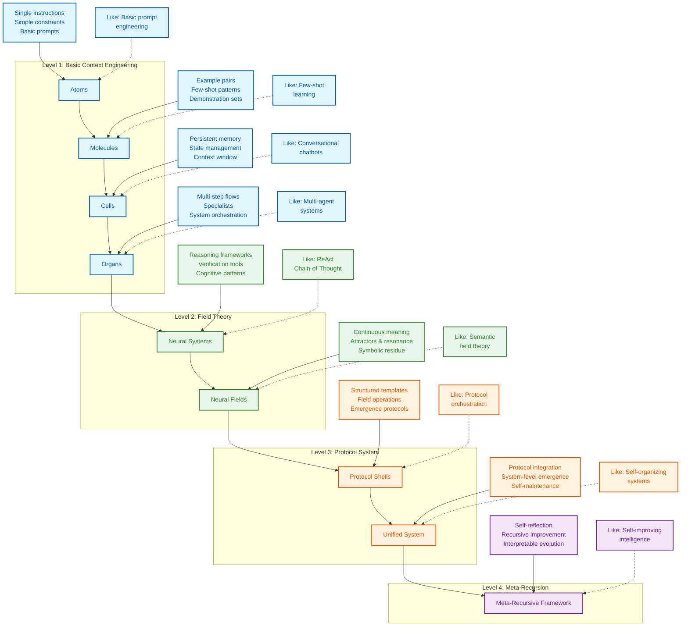

# Context Engineering: Master the Art & Science of LLM Context

**Unlock the full potential of Large Language Models (LLMs) by mastering context engineering, the key to designing, orchestrating, and optimizing the information LLMs use.**

[View the original repository on GitHub](https://github.com/davidkimai/Context-Engineering)

<div align="center">
  
</div>

> *"Context engineering is the delicate art and science of filling the context window with just the right information for the next step." — [Andrej Karpathy](https://x.com/karpathy/status/1937902205765607626)*

This repository goes beyond prompt engineering, providing a comprehensive, first-principles approach to crafting and controlling the complete context that LLMs use at inference time, encompassing all structured informational components that the model needs to plausibly accomplish a given task.

**Key Features:**

*   **First-Principles Approach:** Learn context engineering from the ground up, using a progressive, biological-inspired metaphor to build your understanding.
*   **Practical Examples:** Explore runnable code and real-world project examples to solidify your knowledge.
*   **Comprehensive Learning Path:** Follow a structured learning path to understand and master LLM context.
*   **Cutting-Edge Research:** Integrate the latest research from ICML, NeurIPS, and more.
*   **Agent Commands Support:** Includes support for tools like Claude Code, OpenCode, Amp, Kiro, Codex, and Gemini CLI.

<div align="center">

[](https://deepwiki.com/davidkimai/Context-Engineering)

</div>

**Explore Additional Resources:**

*   [DeepGraph](https://www.deepgraph.co/davidkimai/Context-Engineering)
*   [Chat with NotebookLM + Podcast Deep Dive](https://notebooklm.google.com/notebook/0c6e4dc6-9c30-4f53-8e1a-05cc9ff3bc7e)
*   [](https://discord.gg/JeFENHNNNQ)

**Course Under Construction:**
*   [Comprehensive Course Under Construction](https://github.com/davidkimai/Context-Engineering/tree/main/00_COURSE)

> ### Context Engineering Survey-Review of 1400 Research Papers](https://arxiv.org/pdf/2507.13334)

## The Foundation: From Prompt Engineering to Context Engineering

```
                    Prompt Engineering  │  Context Engineering
                       ↓                │            ↓
               "What you say"           │  "Everything else the model sees"
             (Single instruction)       │    (Examples, memory, retrieval,
                                        │     tools, state, control flow)
```

## Definition of Context Engineering

> **Context is not just the single prompt users send to an LLM. Context is the complete information payload provided to a LLM at inference time, encompassing all structured informational components that the model needs to plausibly accomplish a given task.**
>
> — [**Definition of Context Engineering from A Systematic Analysis of Over 1400 Research Papers**](https://arxiv.org/pdf/2507.13334)

```
╭─────────────────────────────────────────────────────────────╮
│              CONTEXT ENGINEERING MASTERY COURSE             │
│                    From Zero to Frontier                    │
╰─────────────────────────────────────────────────────────────╯
                          ▲
                          │
                 Mathematical Foundations
                  C = A(c₁, c₂, ..., cₙ)
                          │
                          ▼
┌─────────────┬──────────────┬──────────────┬─────────────────┐
│ FOUNDATIONS │ SYSTEM IMPL  │ INTEGRATION  │ FRONTIER        │
│ (Weeks 1-4) │ (Weeks 5-8)  │ (Weeks 9-10) │ (Weeks 11-12)   │
└─────┬───────┴──────┬───────┴──────┬───────┴─────────┬───────┘
      │              │              │                 │
      ▼              ▼              ▼                 ▼
┌─────────────┐ ┌──────────────┐ ┌──────────────┐ ┌──────────────┐
│ Math Models │ │ RAG Systems  │ │ Multi-Agent  │ │ Meta-Recurs  │
│ Components  │ │ Memory Arch  │ │ Orchestrat   │ │ Quantum Sem  │
│ Processing  │ │ Tool Integr  │ │ Field Theory │ │ Self-Improv  │
│ Management  │ │ Agent Systems│ │ Evaluation   │ │ Collaboration│
└─────────────┘ └──────────────┘ └──────────────┘ └──────────────┘
```

## Why This Repository Exists

> **"Meaning is not an intrinsic, static property of a semantic expression, but rather an emergent phenomenon"
— [Agostino et al. — July 2025, Indiana University](https://arxiv.org/pdf/2506.10077)**

This repository provides a progressive, first-principles approach to context engineering, built around a biological metaphor:

```
atoms → molecules → cells → organs → neural systems → neural & semantic field theory
  │        │         │         │             │                         │
single    few-     memory +   multi-   cognitive tools +     context = fields +
prompt    shot     agents     agents   operating systems     persistence & resonance
```
> "Abstraction is the cost of generalization"— [**Grant Sanderson (3Blue1Brown)**](https://www.3blue1brown.com/)

<div align="center">


*[A Survey of Context Engineering - July 2025](https://arxiv.org/pdf/2507.13334)*

 **[On Emergence, Attractors, and Dynamical Systems Theory](https://content.csbs.utah.edu/~butner/systems/DynamicalSystemsIntro.html) | [Columbia DST](http://wordpress.ei.columbia.edu/ac4/about/our-approach/dynamical-systems-theory/)**
</div>



## Quick Start: Dive In

1.  **Understand the Basics:** Read [`00_foundations/01_atoms_prompting.md`](00_foundations/01_atoms_prompting.md) (5 min)
2.  **Experiment:** Run [`10_guides_zero_to_hero/01_min_prompt.py`](10_guides_zero_to_hero/01_min_prompt.py) (Jupyter Notebook style)
3.  **Explore Templates:**  Examine [`20_templates/minimal_context.yaml`](20_templates/minimal_context.yaml)
4.  **See it in Action:** Study [`30_examples/00_toy_chatbot/`](30_examples/00_toy_chatbot/)

## Learning Path: Explore the Roadmap

```
┌─────────────────┐     ┌──────────────────┐     ┌────────────────┐
│ 00_foundations/ │     │ 10_guides_zero_  │     │ 20_templates/  │
│                 │────▶│ to_one/          │────▶│                │
│ Theory & core   │     │ Hands-on         │     │ Copy-paste     │
│ concepts        │     │ walkthroughs     │     │ snippets       │
└─────────────────┘     └──────────────────┘     └────────────────┘
         │                                                │
         │                                                │
         ▼                                                ▼
┌─────────────────┐                             ┌────────────────┐
│ 40_reference/   │◀───────────────────────────▶│ 30_examples/   │
│                 │                             │                │
│ Deep dives &    │                             │ Real projects, │
│ eval cookbook   │                             │ progressively  │
└─────────────────┘                             │ complex        │
         ▲                                      └────────────────┘
         │                                                ▲
         │                                                │
         └────────────────────┐               ┌───────────┘
                              ▼               ▼
                         ┌─────────────────────┐
                         │ 50_contrib/         │
                         │                     │
                         │ Community           │
                         │ contributions       │
                         └─────────────────────┘
```

## What You'll Learn: Core Concepts

| Concept                 | What It Is                                         | Why It Matters                                                                 |
| ----------------------- | -------------------------------------------------- | ------------------------------------------------------------------------------ |
| **Token Budget**        | Optimizing every token in your context             | Reduces costs, speeds up responses                                            |
| **Few-Shot Learning**   | Teaching by showing examples                      | Often more effective than explanations                                         |
| **Memory Systems**      | Persisting information across turns                | Enables stateful, coherent interactions                                          |
| **Retrieval Augmentation** | Finding & injecting relevant documents           | Grounds responses in facts, reduces hallucinations                              |
| **Control Flow**        | Breaking complex tasks into steps                  | Solves harder problems with simpler prompts                                     |
| **Context Pruning**     | Removing irrelevant information                   | Improves performance                                                           |
| **Metrics & Evaluation** | Measuring context effectiveness                   | Enables iterative optimization                                                  |
| **Cognitive Tools & Prompt Programming** | Build custom tools and templates                | Enables new layers for context engineering                                          |
| **Neural Field Theory** | Context as a Neural Field                          | Modeling context as a dynamic neural field allows for iterative context updating |
| **Symbolic Mechanisms**   | Symbolic architectures enable higher order reasoning | Smarter systems = less work                                                   |
| **Quantum Semantics**    | Meaning as observer-dependent                    | Design context systems leveraging superpositional techniques                      |

## Research Evidence: Key Findings

### **[MEM1: Learning to Synergize Memory and Reasoning for Efficient Long-Horizon Agents - Singapore-MIT June 2025](https://www.arxiv.org/pdf/2506.15841)**
*   MEM1 trains AI agents to merge memory and reasoning at every step.
*   It blends memory and thinking into a single flow.
*   It tags and structures everything the agent does.
*   It prioritizes only the latest and most relevant insights.
*   It outperforms traditional methods in speed and accuracy.

### **[Eliciting Reasoning in Language Models with Cognitive Tools - IBM Zurich June 2025](https://www.arxiv.org/pdf/2506.12115)**
*   Breaks complex tasks into modular cognitive tools.
*   Cognitive tools work like inner mental shortcuts.
*   Modular approach prevents confusion and reduces errors.
*   These templates scaffold reasoning layers similar to cognitive mental shortcuts, commonly studied as "heuristics".

### **[Emergent Symbolic Mechanisms Support Abstract Reasoning in Large Language Models - ICML Princeton June 18, 2025](https://openreview.net/forum?id=y1SnRPDWx4)**

*   LLMs develop their own inner symbolic “logic circuits”.
*   Three-stage process: abstracting symbols, then reasoning, and then mapping the answer.
*   This supports why Markdown, Json, and similar structured, symbolic formats are more easily LLM parsable
*   This means LLMs create internal, flexible representations.
*   These emergent mechanisms mean LLMs don’t just memorize—they actually create internal, flexible representations that let them generalize to new problems and analogies.

## Star History

[](https://www.star-history.com/#davidkimai/Context-Engineering&Date)

## Contribute

We welcome contributions!  See [.github/CONTRIBUTING.md](.github/CONTRIBUTING.md) for guidelines.

## License

[MIT License](LICENSE)

## Citation

```bibtex
@misc{context-engineering,
  author = {Context Engineering Contributors},
  title = {Context Engineering: Beyond Prompt Engineering},
  year = {2025},
  publisher = {GitHub},
  url = {https://github.com/davidkimai/context-engineering}
}
```

## Acknowledgements

*   Inspired by [Andrej Karpathy](https://x.com/karpathy/status/1937902205765607626) for coining "context engineering".
*   Thanks to all contributors and the open source community.