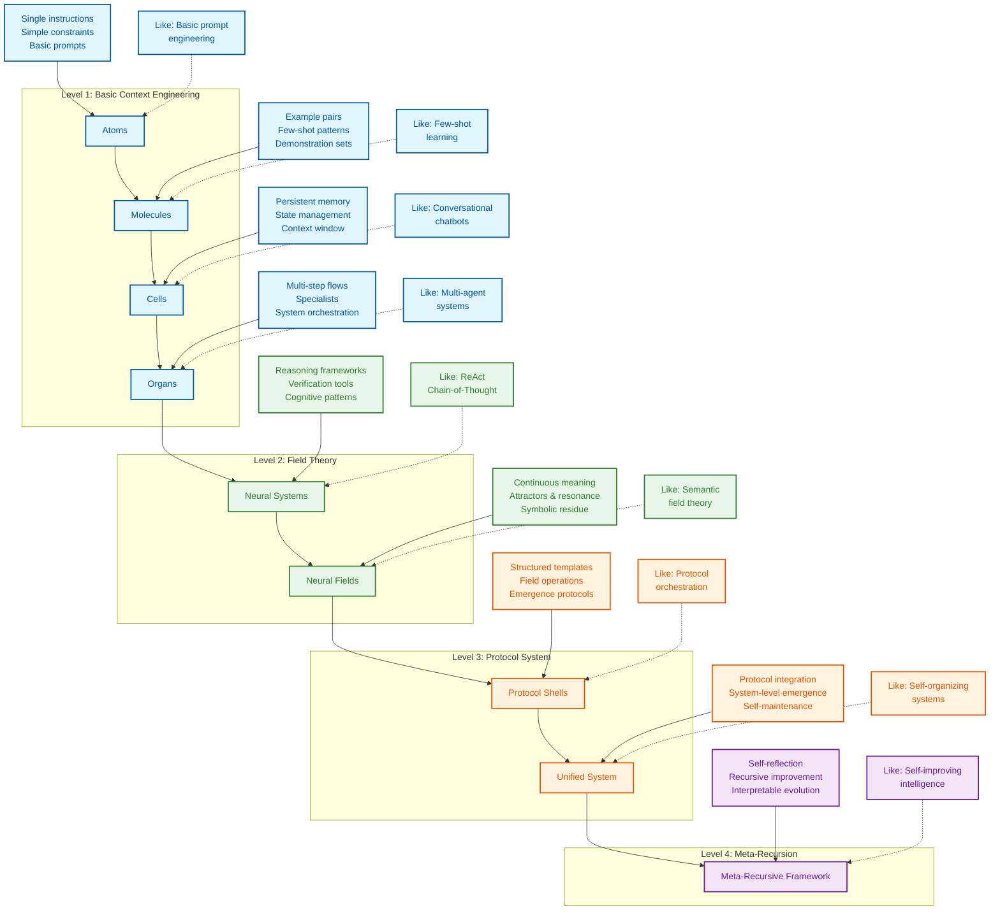

# Context Engineering: Level Up Your LLM Performance

**Go beyond prompt engineering and master the art and science of crafting the perfect context for your Large Language Models (LLMs) – explore the cutting-edge techniques to unlock their full potential at [davidkimai/Context-Engineering](https://github.com/davidkimai/Context-Engineering)!**

This repository is a comprehensive guide to **Context Engineering**, a discipline focused on optimizing the information provided to LLMs at inference time, surpassing the limitations of simple prompt engineering.  Learn how to design, orchestrate, and refine the "everything else" that influences a model's output—examples, memory, tools, state, and control flow—for superior results.

## Key Features

*   **First-Principles Approach:** Learn from fundamental concepts and build your understanding iteratively.
*   **Practical Examples:** Experiment with runnable code snippets, complete implementations, and real-world project examples.
*   **Visual Learning:** Understand complex concepts through diagrams, code, and illustrations.
*   **Cutting-Edge Research:** Stay ahead with insights from leading research papers, including recent advances in memory, reasoning, and cognitive tools.
*   **Comprehensive Learning Path:** Navigate a structured curriculum to master all facets of context design.

## Why Context Engineering Matters

Context is not just the single prompt users send to an LLM. Context is the complete information payload provided to a LLM at inference time, encompassing all structured informational components that the model needs to plausibly accomplish a given task.

## Core Concepts You'll Master

*   **Token Budget Optimization:** Maximize efficiency and minimize costs.
*   **Few-Shot Learning:** Leverage the power of examples.
*   **Memory Systems:** Enable stateful, coherent interactions.
*   **Retrieval Augmentation (RAG):** Ground responses in factual data.
*   **Control Flow:** Orchestrate complex tasks with modular steps.
*   **Context Pruning:** Refine and remove irrelevant information.
*   **Evaluation Metrics:** Measure and improve context effectiveness.
*   **Cognitive Tools & Prompt Programming:** Build custom tools and workflows.
*   **Neural Field Theory:** Modeling context as a dynamic neural field.
*   **Symbolic Mechanisms:** Enable higher-order reasoning capabilities.
*   **Quantum Semantics:** Employ observer-dependent meaning and superpositional techniques.

## Quick Start

1.  **Explore the Fundamentals:** Start with [`00_foundations/01_atoms_prompting.md`](00_foundations/01_atoms_prompting.md) (5 minutes)
2.  **Run a Minimal Example:** Try [`10_guides_zero_to_hero/01_min_prompt.py`](10_guides_zero_to_hero/01_min_prompt.py) (Jupyter Notebook)
3.  **Examine a Template:** Review [`20_templates/minimal_context.yaml`](20_templates/minimal_context.yaml)
4.  **See a Complete Implementation:** Check out [`30_examples/00_toy_chatbot/`](30_examples/00_toy_chatbot/)

## Roadmap

```
┌─────────────────┐     ┌──────────────────┐     ┌────────────────┐
│ 00_foundations/ │     │ 10_guides_zero_  │     │ 20_templates/  │
│                 │────▶│ to_one/          │────▶│                │
│ Theory & core   │     │ Hands-on         │     │ Copy-paste     │
│ concepts        │     │ walkthroughs     │     │ snippets       │
└─────────────────┘     └──────────────────┘     └────────────────┘
         │                                                │
         │                                                │
         ▼                                                ▼
┌─────────────────┐                             ┌────────────────┐
│ 40_reference/   │◀───────────────────────────▶│ 30_examples/   │
│                 │                             │                │
│ Deep dives &    │                             │ Real projects, │
│ eval cookbook   │                             │ progressively  │
└─────────────────┘                             │ complex        │
         ▲                                      └────────────────┘
         │                                                ▲
         │                                                │
         └────────────────────┐               ┌───────────┘
                              ▼               ▼
                         ┌─────────────────────┐
                         │ 50_contrib/         │
                         │                     │
                         │ Community           │
                         │ contributions       │
                         └─────────────────────┘
```

## What You Will Learn

| Concept                         | What It Is                                           | Why It Matters                                                              |
| ------------------------------- | ---------------------------------------------------- | --------------------------------------------------------------------------- |
| **Token Budget**                | Optimizing every token in your context              | Reduces costs, speeds up responses.                                         |
| **Few-Shot Learning**           | Teaching by showing examples                       | Often surpasses explanation alone.                                         |
| **Memory Systems**              | Persisting information across turns                  | Enables stateful, coherent interactions.                                    |
| **Retrieval Augmentation**      | Finding & injecting relevant documents             | Grounds responses in facts, reduces hallucination.                          |
| **Control Flow**                | Breaking complex tasks into steps                  | Solves harder problems with simpler prompts.                                |
| **Context Pruning**             | Removing irrelevant information                    | Keeps performance focused.                                                 |
| **Metrics & Evaluation**        | Measuring context effectiveness                    | Guides iterative optimization.                                               |
| **Cognitive Tools & Prompt Programming** | Building custom tools and templates                 | Enables layers for context engineering.                                     |
| **Neural Field Theory**         | Context as a Neural Field                          | Models context for iterative updating                                        |
| **Symbolic Mechanisms**         | Symbolic architectures enable higher order reasoning | Leads to smarter and more efficient systems.                                |
| **Quantum Semantics**           | Meaning as observer-dependent                    | Design context systems leveraging superpositional techniques.       |

## Research Highlights

*   **MEM1 (Singapore-MIT):** Efficient long-horizon agent training by synergizing memory and reasoning.
*   **Cognitive Tools (IBM Zurich):** Eliciting Reasoning in Language Models with Cognitive Tools and structured prompt templates.
*   **Emergent Symbolic Mechanisms (ICML Princeton):** Architectures that support abstract reasoning via a set of emergent symbol-processing mechanisms.

## Diagrams

Include some of the diagrams from the original README, properly formatted.  (I've kept the mermaid diagram for now, which is very good.)



## Star History

Include star history chart (use the same code from the original)

## Contributing

Explore [CONTRIBUTING.md](.github/CONTRIBUTING.md) for contribution guidelines.

## License

[MIT License](LICENSE)

## Citation

```bibtex
@misc{context-engineering,
  author = {Context Engineering Contributors},
  title = {Context Engineering: Beyond Prompt Engineering},
  year = {2025},
  publisher = {GitHub},
  url = {https://github.com/davidkimai/context-engineering}
}
```

## Acknowledgements

*   [Andrej Karpathy](https://x.com/karpathy/status/1937902205765607626) for coining the term "context engineering."
*   All contributors and the open-source community.