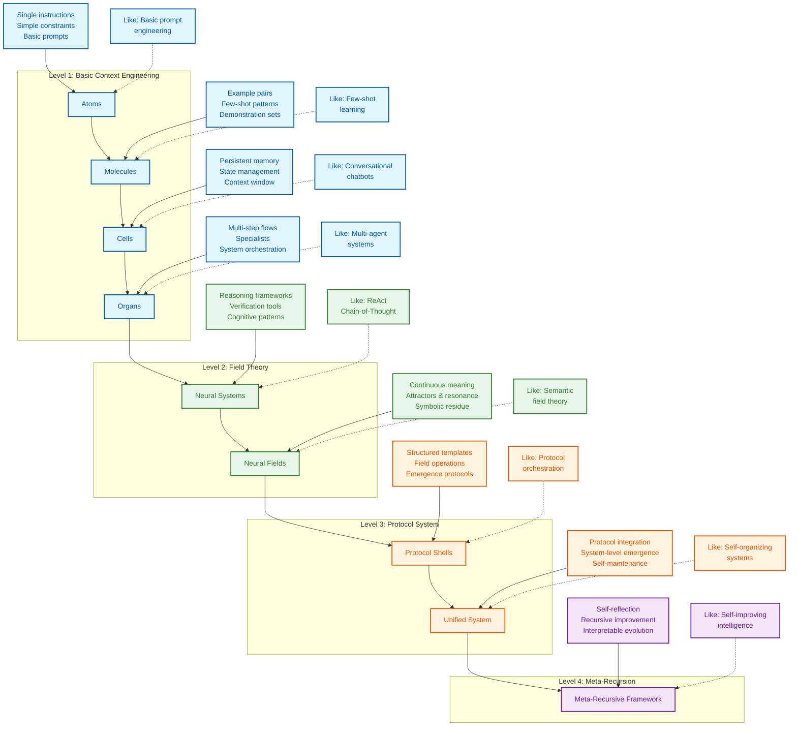

# Context Engineering: Master the Art and Science of LLM Context 🚀

**Unlocking the full potential of Large Language Models (LLMs) goes beyond just prompts; this is your guide to context engineering, a first-principles approach to designing and orchestrating the information that surrounds your prompts, leading to enhanced LLM performance.** Discover the groundbreaking research and practical techniques driving the next generation of AI interactions. ➡️ [Explore the Original Repo](https://github.com/davidkimai/Context-Engineering)

## Key Features

*   **Comprehensive Course Under Construction:** A progressive, first-principles handbook for moving beyond prompt engineering to the wider discipline of context design, orchestration, and optimization
*   **First-Principles Approach:** Learn foundational concepts and progressively advanced techniques.
*   **Hands-on Tutorials:** Practical guides and code examples for building real-world solutions.
*   **Research-Backed:** Dive deep into cutting-edge research papers and explore the latest advancements.
*   **Modular Design:**  The project is structured as a series of modules. This structure follows a progression from theoretical foundations to hands-on applications.
*   **Community-Driven:** Collaborate and contribute to the project with contribution guidelines.

## What is Context Engineering?

> Context is the complete information payload provided to an LLM at inference time, encompassing all structured informational components that the model needs to plausibly accomplish a given task.

Context engineering takes you beyond basic prompt engineering by focusing on designing, orchestrating, and optimizing the entire context window. This includes examples, memory, retrieval tools, state, and control flow to achieve the desired outcomes from your LLMs.

## Why Context Engineering Matters

In the evolving world of AI, context engineering is the key to unlocking true LLM potential. By mastering context, you will learn to:

*   **Enhance LLM Performance:** Improve accuracy, reasoning, and problem-solving abilities.
*   **Reduce Costs:** Optimize token usage for more efficient and cost-effective LLM interactions.
*   **Build Smarter Applications:** Create AI systems that are more intelligent and better adapted to real-world scenarios.

## Learning Path

This project follows a structured learning path:

*   **Foundations:** Build a strong understanding of the underlying principles.
*   **Guides:** Practical tutorials and code examples to get hands-on experience.
*   **Templates:** Reusable components to accelerate your development.
*   **Examples:** Real-world implementations to inspire innovation.
*   **Reference:** In-depth documentation and resources.
*   **Community Contribution:** Join the community, collaborate, and share contributions.

## The Context Engineering Ecosystem:



## Research Highlights

This repository is built upon cutting-edge research.  Here are some key findings:

### MEM1: Learning to Synergize Memory and Reasoning

MEM1 agents merge memory and reasoning, optimizing efficiency.

### Cognitive Tools

Cognitive tools allow specialized prompt templates to handle distinct mental operations.

### Emergent Symbolic Mechanisms

Large language models develop inner symbolic "logic circuits" by reasoning with abstract variables.

## Contribute

We welcome contributions! See the [CONTRIBUTING.md](.github/CONTRIBUTING.md) file for guidelines.

## License

[MIT License](LICENSE)

## Citation

```bibtex
@misc{context-engineering,
  author = {Context Engineering Contributors},
  title = {Context Engineering: Beyond Prompt Engineering},
  year = {2025},
  publisher = {GitHub},
  url = {https://github.com/davidkimai/context-engineering}
}
```

## Acknowledgements

Thank you to [Andrej Karpathy](https://x.com/karpathy/status/1937902205765607626) for coining "context engineering" and inspiring this project.