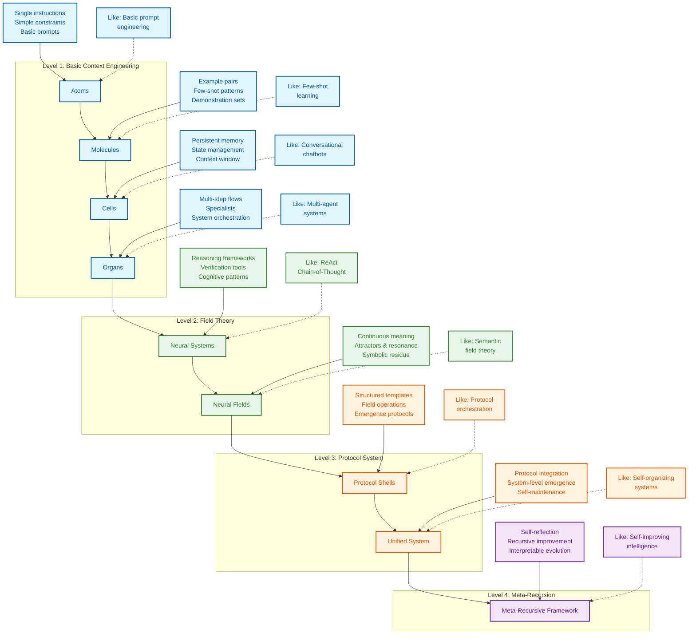

# Context Engineering: Master the Art of Guiding LLMs

**Tired of just prompt engineering? Dive into Context Engineering and unlock the full potential of Large Language Models by mastering the complete information payload they process.**

[Go to the original repository](https://github.com/davidkimai/Context-Engineering)

<div align="center">
  


> **"Context engineering is the delicate art and science of filling the context window with just the right information for the next step." — [**Andrej Karpathy**](https://x.com/karpathy/status/1937902205765607626)**

</div>

## Key Features

*   **Comprehensive, First-Principles Approach:**  Move beyond simple prompts and into the structured world of context design, orchestration, and optimization.
*   **Biological Metaphor:** Understand context engineering through the lens of atoms, molecules, cells, organs, and neural systems, building up to complex neural and semantic field theory.
*   **Practical Learning Path:** From foundational concepts to real-world examples, quickly grasp the core principles and apply them to your projects.
*   **Code-Centric & Visualized:**  Learn by doing with runnable code examples, ASCII diagrams, and symbolic representations.
*   **Progressive Learning:** Start with the basics and gradually explore advanced topics.
*   **Community-Driven:**  Join the community and contribute to the evolving field of context engineering!

### Context Engineering in Action

```
                    Prompt Engineering  │  Context Engineering
                       ↓                │            ↓                      
               "What you say"           │  "Everything else the model sees"
             (Single instruction)       │    (Examples, memory, retrieval,
                                        │     tools, state, control flow)
```

## Core Concepts

*   **Token Budget:** Optimize every token in your context for cost-effectiveness and speed.
*   **Few-Shot Learning:** Learn how to teach models through example.
*   **Memory Systems:** Persist information across turns for stateful interactions.
*   **Retrieval Augmentation (RAG):** Inject relevant documents to ground responses in facts.
*   **Control Flow:** Break down complex tasks into manageable steps.
*   **Context Pruning:** Remove irrelevant data to improve performance.
*   **Metrics & Evaluation:** Measure and iterate on your context engineering strategies.
*   **Cognitive Tools & Prompt Programming:** Build custom tools and templates to expand functionality.

## Learning Path

**Get started today!**

1.  **Foundations**: Understand the core concepts.
2.  **Guides**: Follow step-by-step walkthroughs.
3.  **Templates**: Copy and paste snippets.
4.  **Examples**: Apply the principles to real projects.
5.  **Reference**: Deep dives and evaluation techniques.
6.  **Contribute**:  Join the community and contribute.

```
┌─────────────────┐     ┌──────────────────┐     ┌────────────────┐
│ 00_foundations/ │     │ 10_guides_zero_  │     │ 20_templates/  │
│                 │────▶│ to_one/          │────▶│                │
│ Theory & core   │     │ Hands-on         │     │ Copy-paste     │
│ concepts        │     │ walkthroughs     │     │ snippets       │
└─────────────────┘     └──────────────────┘     └────────────────┘
         │                                                │
         │                                                │
         ▼                                                ▼
┌─────────────────┐                             ┌────────────────┐
│ 40_reference/   │◀───────────────────────────▶│ 30_examples/   │
│                 │                             │                │
│ Deep dives &    │                             │ Real projects, │
│ eval cookbook   │                             │ progressively  │
└─────────────────┘                             │ complex        │
         ▲                                      └────────────────┘
         │                                                ▲
         │                                                │
         └────────────────────┐               ┌───────────┘
                              ▼               ▼
                         ┌─────────────────────┐
                         │ 50_contrib/         │
                         │                     │
                         │ Community           │
                         │ contributions       │
                         └─────────────────────┘
```

## Research Insights and Resources

### Survey of Context Engineering


### **Memory + Reasoning**

> **MEM1: Learning to Synergize Memory and Reasoning for Efficient Long-Horizon Agents - Singapore-MIT June 2025**

*   Trains agents to merge memory and reasoning.
*   Compresses interactions into a compact "internal state."
*   Blends memory and thinking.
*   Structured memory, clear auditability.
*   Pruning outdated data.
*   Recursive memory outperforms "add more context" strategies.

### Cognitive Tools

> **Eliciting Reasoning in Language Models with Cognitive Tools - IBM Zurich June 2025**

*   Modular “cognitive tools” lets AI solve problems more thoughtfully.
*   Specialized prompt templates, aka cognitive tools.
*   Tools act like inner mental shortcuts.
*   Tools compartmentalize reasoning steps.
*   Improves performance without additional training.

### Emergent Symbols

> **Emergent Symbolic Mechanisms Support Abstract Reasoning in Large Language Models - ICML Princeton June 18, 2025**

*   LLMs create internal symbolic “logic circuits.”
*   A three-stage architecture for abstract reasoning.
*   LLMs develop abstract representations.
*   Attention heads act as “symbol extractors".
*   Bridging the gap between symbolic AI and neural nets.

<div align="center">

##  Additional Resources

###  Ask DeepWiki
[](https://deepwiki.com/davidkimai/Context-Engineering)

### DeepGraph
[DeepGraph](https://www.deepgraph.co/davidkimai/Context-Engineering)

### Chat with NotebookLM + Podcast Deep Dive
[Chat with NotebookLM + Podcast Deep Dive](https://notebooklm.google.com/notebook/0c6e4dc6-9c30-4f53-8e1a-05cc9ff3bc7e)

### Join the Community
[](https://discord.gg/JeFENHNNNQ)

</div>



## Quick Start

1.  **Read [`00_foundations/01_atoms_prompting.md`](00_foundations/01_atoms_prompting.md)** (5 min)
2.  **Run [`10_guides_zero_to_hero/01_min_prompt.py`](10_guides_zero_to_hero/01_min_prompt.py)**
3.  **Explore [`20_templates/minimal_context.yaml`](20_templates/minimal_context.yaml)**
4.  **Study [`30_examples/00_toy_chatbot/`](30_examples/00_toy_chatbot/)**

## Contributing

We welcome contributions! Check out [CONTRIBUTING.md](.github/CONTRIBUTING.md) for guidelines.

## License

[MIT License](LICENSE)

## Citation

```bibtex
@misc{context-engineering,
  author = {Context Engineering Contributors},
  title = {Context Engineering: Beyond Prompt Engineering},
  year = {2025},
  publisher = {GitHub},
  url = {https://github.com/davidkimai/context-engineering}
}
```

## Acknowledgements

*   [Andrej Karpathy](https://x.com/karpathy/status/1937902205765607626) for coining "context engineering".
*   All contributors and the open source community.