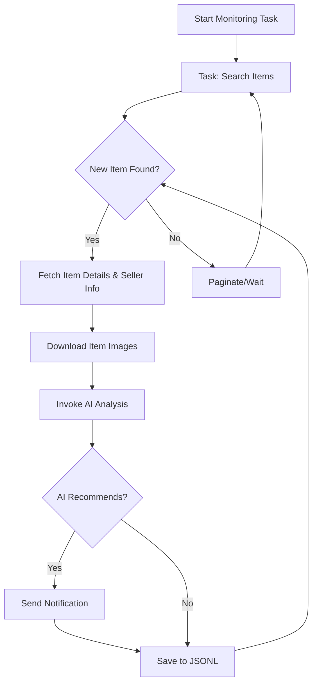

# AI-Powered Goofish (Xianyu) Smart Monitoring Robot

**Tired of missing out on great deals?** This project provides a smart, AI-driven monitoring solution for Xianyu (Goofish), featuring a user-friendly web interface for real-time monitoring and intelligent analysis of product listings. ([Original Repository](https://github.com/dingyufei615/ai-goofish-monitor))

## Key Features

*   ✅ **Web UI:** Intuitive web interface for task management, AI prompt editing, real-time logs, and result filtering.
*   🧠 **AI-Driven Task Creation:** Generate monitoring tasks with complex filtering using natural language descriptions of your needs.
*   🚀 **Concurrent Tasks:** Monitor multiple keywords simultaneously with independent task execution.
*   ⚡️ **Real-time Processing:** Analyze new listings instantly, eliminating batch processing delays.
*   💡 **Deep AI Analysis:** Integrates multimodal LLMs (e.g., GPT-4o) for in-depth analysis of product images, descriptions, and seller profiles.
*   ⚙️ **Highly Customizable:** Configure individual keywords, price ranges, filters, and AI prompts for each task.
*   🔔 **Instant Notifications:** Receive alerts via [ntfy.sh](https://ntfy.sh/), WeChat Work group bots, and [Bark](https://bark.day.app/) for AI-recommended items.
*   🗓️ **Scheduled Tasks:** Utilize Cron expressions for automated, periodic task execution.
*   🐳 **Docker Deployment:** Simple one-click deployment using Docker Compose for easy setup and standardization.
*   🛡️ **Robust Anti-Scraping:** Employs human-like behavior and random delays for stable operation.

## Key Screenshots

<details>
  <summary>Expand to view screenshots</summary>
  <br/>
  **Backend Task Management**
  

  **Backend Monitoring**
  

  **ntfy Notifications**
  
</details>

## 🚀 Quick Start (Web UI Recommended)

The Web UI offers the best experience and is the recommended way to use this project.

### Step 1: Environment Setup

> ⚠️ **Python Version:** Python 3.10 or higher is recommended for local deployment and debugging. Earlier versions may cause dependency installation failures or runtime errors.

1.  Clone the repository:

    ```bash
    git clone https://github.com/dingyufei615/ai-goofish-monitor
    cd ai-goofish-monitor
    ```

2.  Install dependencies:

    ```bash
    pip install -r requirements.txt
    ```

### Step 2: Configuration

1.  **Configure Environment Variables:** Copy `.env.example` to `.env` and modify the settings.

    Windows:

    ```cmd
    copy .env.example .env
    ```

    Linux/MacOS:

    ```bash
    cp .env.example .env
    ```

    Available environment variables:

    | Environment Variable | Description                                                   | Required | Notes                                                                                                                               |
    | :------------------- | :------------------------------------------------------------ | :------- | :---------------------------------------------------------------------------------------------------------------------------------- |
    | `OPENAI_API_KEY`     | Your AI model provider's API key.                             | Yes      |                                                                                                                                     |
    | `OPENAI_BASE_URL`    | API endpoint for your AI model, compatible with OpenAI format. | Yes      |                                                                                                                                     |
    | `OPENAI_MODEL_NAME`  | The name of the model you wish to use.                        | Yes      | **Must** choose a multimodal model that supports image analysis, such as `doubao-seed-1-6-250615`, `gemini-2.5-pro` etc.             |
    | `PROXY_URL`          | (Optional) HTTP/S proxy for accessing the internet.           | No       | Supports `http://` and `socks5://`. For example, `http://127.0.0.1:7890`.                                                           |
    | `NTFY_TOPIC_URL`     | (Optional) [ntfy.sh](https://ntfy.sh/) topic URL for notifications. | No       | If empty, ntfy notifications will be disabled.                                                                                   |
    | `GOTIFY_URL`         | (Optional) Gotify service address.                            | No       |                                                                                                                                     |
    | `GOTIFY_TOKEN`       | (Optional) Gotify application token.                            | No       |                                                                                                                                     |
    | `BARK_URL`           | (Optional) [Bark](https://bark.day.app/) push address.        | No       | For example, `https://api.day.app/your_key`. If empty, Bark notifications will be disabled.                                       |
    | `WX_BOT_URL`         | (Optional) WeChat Work group bot webhook address.              | No       | If empty, WeChat Work notifications will be disabled. **Ensure the URL is enclosed in double quotes in the `.env` file.**                |
    | `WEBHOOK_URL`        | (Optional) Generic Webhook URL.                               | No       | If empty, generic Webhook notifications will be disabled.                                                                           |
    | `WEBHOOK_METHOD`     | (Optional) Webhook request method.                            | No       | Supports `GET` or `POST`, defaults to `POST`.                                                                                       |
    | `WEBHOOK_HEADERS`    | (Optional) Custom headers for the Webhook.                    | No       | Must be a valid JSON string, for example, `'{"Authorization": "Bearer xxx"}'`.                                                        |
    | `WEBHOOK_CONTENT_TYPE` | (Optional) Content type for POST requests.                    | No       | Supports `JSON` or `FORM`, defaults to `JSON`.                                                                                         |
    | `WEBHOOK_QUERY_PARAMETERS` | (Optional) Query parameters for GET requests.             | No       | JSON string, supports `{{title}}` and `{{content}}` placeholders.                                                                    |
    | `WEBHOOK_BODY`       | (Optional) Request body for POST requests.                    | No       | JSON string, supports `{{title}}` and `{{content}}` placeholders.                                                                    |
    | `LOGIN_IS_EDGE`      | Whether to use the Edge browser for login and scraping.     | No       | Defaults to `false`, using Chrome/Chromium.                                                                                         |
    | `PCURL_TO_MOBILE`    | Whether to convert PC product links to mobile links in notifications. | No       | Defaults to `true`.                                                                                                                |
    | `RUN_HEADLESS`       | Whether to run the browser in headless mode.                | No       | Defaults to `true`. Set to `false` for local debugging of CAPTCHA issues. **Must be `true` for Docker deployments.**                     |
    | `AI_DEBUG_MODE`      | Enable AI debug mode (prints detailed AI request/response logs). | No       | Defaults to `false`.                                                                                                                |
    | `SKIP_AI_ANALYSIS`   | Skip AI analysis and send notifications directly.           | No       | Defaults to `false`. If `true`, all scraped items will be notified without AI analysis.                                             |
    | `ENABLE_THINKING`    | Whether to enable the enable_thinking parameter for the AI.  | No       | Defaults to `false`. Some AI models require this parameter, while others do not support it. If you encounter the error "Invalid JSON...",  |
    | `SERVER_PORT`        | Port on which the Web UI service runs.                        | No       | Defaults to `8000`.                                                                                                                   |
    | `WEB_USERNAME`       | Web UI login username.                                        | No       | Defaults to `admin`.  **Important: Change in production.**                                                                        |
    | `WEB_PASSWORD`       | Web UI login password.                                        | No       | Defaults to `admin123`. **Important: Change to a strong password in production.**                                                |

    > 💡 **Debugging Tip:** If you encounter 404 errors when configuring the AI API, try using an API from Alibaba Cloud or Volces for initial testing to ensure basic functionality before attempting other providers.  Some API providers may have compatibility issues or require special configurations.

    > 🔐 **Security Reminder:** The Web interface uses basic authentication. The default username and password are `admin` / `admin123`.  **Change these to strong passwords in a production environment!**

2.  **Obtain Login State (Important!)**: This step is crucial to allow the scraper to access Xianyu while logged in. The Web UI method is highly recommended.

    **Recommended: Update via Web UI**
    1.  Skip this step and proceed to Step 3 to start the Web service.
    2.  Open the Web UI and go to the "System Settings" page.
    3.  Find "Login State File" and click the "Manual Update" button.
    4.  Follow the instructions in the popup:
        -   Install the [Xianyu Login State Extraction Extension](https://chromewebstore.google.com/detail/xianyu-login-state-extrac/eidlpfjiodpigmfcahkmlenhppfklcoa) in your Chrome browser.
        -   Open the Xianyu website and log in.
        -   After successful login, click the extension icon in your browser toolbar.
        -   Click the "Extract Login State" button.
        -   Click the "Copy to Clipboard" button.
        -   Paste the copied content into the Web UI and save.

    This approach is the most convenient as it avoids the need to run a program with a graphical interface on the server.

    **Alternative: Run Login Script**
    If you can run programs on your local machine or a server with a desktop, you can use the script method:

    ```bash
    python login.py
    ```

    This will open a browser window. Use the **Xianyu mobile app to scan the QR code** to log in. Upon successful login, the script closes automatically, and a `xianyu_state.json` file will be generated in the project's root directory.

### Step 3: Start the Web Service

```bash
python web_server.py
```

### Step 4: Start Monitoring

1.  Open your web browser and go to `http://127.0.0.1:8000` to access the web UI.
2.  Go to the **“Task Management”** page and click **“Create New Task”**.
3.  Describe your purchase requirements using natural language (e.g., "I want to buy a used Sony A7M4 camera, 95% new, budget under 13,000, less than 5000 shutter counts"), and fill in the task name, keywords, etc.
4.  Click "Create," and the AI will automatically generate a set of complex analysis criteria.
5.  Return to the main interface, schedule the task with Cron or click "Start" directly to begin automated monitoring!

## 🐳 Docker Deployment (Recommended)

Docker simplifies deployment by packaging the application and its dependencies into a standardized unit.

### Step 1: Environment Preparation (Similar to Local Deployment)

1.  **Install Docker:** Ensure [Docker Engine](https://docs.docker.com/engine/install/) is installed on your system.

2.  **Clone the project and configure:**

    ```bash
    git clone https://github.com/dingyufei615/ai-goofish-monitor
    cd ai-goofish-monitor
    ```

3.  **Create `.env` file:** Follow the instructions in the **[Quick Start](#-quick-start-web-ui-recommended)** section to create and populate your `.env` file in the project root.

4.  **Obtain Login State (Critical!)**:  You cannot log in using QR code scanning within a Docker container. Set your login state using the Web UI *after* the container is running:
    1.  (On your host machine) Run `docker-compose up -d` to start the service.
    2.  Open `http://127.0.0.1:8000` in your browser to access the Web UI.
    3.  Go to "System Settings" and click the "Manual Update" button.
    4.  Follow the instructions in the popup:
        -   Install the [Xianyu Login State Extraction Extension](https://chromewebstore.google.com/detail/xianyu-login-state-extrac/eidlpfjiodpigmfcahkmlenhppfklcoa) in your Chrome browser.
        -   Open the Xianyu website and log in.
        -   After successful login, click the extension icon in your browser toolbar.
        -   Click the "Extract Login State" button.
        -   Click the "Copy to Clipboard" button.
        -   Paste the copied content into the Web UI and save.

> ℹ️ **Python Version:** Docker deployments utilize Python 3.11, specified in the Dockerfile, eliminating local Python version compatibility concerns.

### Step 2: Run the Docker Container

The project includes `docker-compose.yaml`.  We recommend using `docker-compose` for container management.

In your project's root directory, run:

```bash
docker-compose up --build -d
```

This starts the service in the background. `docker-compose` automatically reads your `.env` and `docker-compose.yaml` configurations to build and run the container.

If you encounter network issues within the container, troubleshoot or use a proxy.

> ⚠️ **OpenWrt Deployment Considerations:** If you deploy on an OpenWrt router, you might experience DNS resolution problems. This can happen because the default network created by Docker Compose might not correctly inherit OpenWrt's DNS settings. If you receive `ERR_CONNECTION_REFUSED`, check your container network configuration; you may need to manually configure DNS or adjust the network mode to ensure the container can access the external network.

### Step 3: Access and Manage

-   **Access Web UI:** Open `http://127.0.0.1:8000` in your browser.
-   **View Real-time Logs:** `docker-compose logs -f`
-   **Stop Container:** `docker-compose stop`
-   **Start Stopped Container:** `docker-compose start`
-   **Stop and Remove Container:** `docker-compose down`

## 📸 Web UI Functionality Overview

*   **Task Management:**
    *   **AI Task Creation:** Generate monitoring tasks with AI by describing your needs in natural language.
    *   **Visual Editing & Control:** Modify task parameters (keywords, price, schedule, etc.) and independently start/stop, and delete each task directly in the table.
    *   **Scheduled Tasks:** Configure Cron expressions for automatic periodic task execution.
*   **Results Viewing:**
    *   **Card View:** Clearly display items that match the criteria in a card format with images and information.
    *   **Smart Filtering & Sorting:** Quickly filter for AI-recommended items, and sort by time crawled, publication time, price, and more.
    *   **Deep Details:** Click to view complete scraped data and detailed AI analysis JSON results for each item.
*   **Runtime Logs:**
    *   **Real-time Log Streaming:** View detailed logs as the crawler runs, facilitating progress tracking and troubleshooting directly within the web UI.
    *   **Log Management:** Supports automatic and manual refresh and one-click clearing of logs.
*   **System Settings:**
    *   **Status Check:** Quickly check the `.env` configuration and login status.
    *   **Prompt Online Editing:** Edit and save the `prompt` files used for AI analysis directly in the web UI, allowing you to adjust the AI's reasoning logic in real time.

## 🚀 Workflow

This diagram describes a single monitoring task from start to finish. The `web_server.py` script acts as the primary service, and launches one or more task processes based on user actions or scheduled events.



## 🔐 Web Interface Authentication

### Authentication Configuration

The web interface is secured with Basic authentication, ensuring that only authorized users can access the management interface and API endpoints.

#### Configuration

Set your credentials in the `.env` file:

```bash
# Web Service Authentication Configuration
WEB_USERNAME=admin
WEB_PASSWORD=admin123
```

#### Default Credentials

If authentication credentials are not set in the `.env` file, the system will use these defaults:

*   Username: `admin`
*   Password: `admin123`

**⚠️ Important: Change these default credentials in production!**

#### Authentication Scope

*   **Requires Authentication:** All API endpoints, web interface, and static resources.
*   **No Authentication Required:** Health check endpoint (`/health`).

#### Usage

1.  **Browser Access:** Accessing the web interface will prompt an authentication dialog.
2.  **API Calls:** You must include Basic authentication information in the request headers.
3.  **Frontend JavaScript:** Authentication is handled automatically, so no modifications are necessary.

#### Security Recommendations

1.  Change the default password to a strong password.
2.  Use HTTPS in production environments.
3.  Change authentication credentials periodically.
4.  Restrict access by limiting IP ranges through a firewall.

See [AUTH_README.md](AUTH_README.md) for more detailed configuration information.

## Frequently Asked Questions (FAQ)

A detailed FAQ document addresses issues ranging from environment setup and AI configuration to anti-scraping strategies.

👉 **[View the FAQ (FAQ.md)](FAQ.md)**

## Acknowledgments

This project was developed with inspiration from:

*   [superboyyy/xianyu_spider](https://github.com/superboyyy/xianyu_spider)

And thanks to the script contributions from the LinuxDo community.

*   [@jooooody](https://linux.do/u/jooooody/summary)

Thank you to the [LinuxDo](https://linux.do/) community as well.

And thanks to ClaudeCode/ModelScope/Gemini and other models/tools for helping to liberate hands and experience the joy of Vibe Coding.

## Personal Reflection

This project's code is over 90% AI-generated, including PRs.

The danger of Vibe Coding is that if one does not actively participate in project development, does not carefully review the AI-generated code, or does not consider why AI writes the code in a specific way, and blindly verifies functionality with test cases, then the project becomes a black box.

Similarly, using AI to review AI-generated code is like using AI to verify whether another AI's response is AI.  This leads to a self-proving problem. Therefore, AI can assist in the analysis, but it should not be the arbiter of truth.

AI is universal and can help developers solve 99% of coding problems, but AI is also not universal, and every problem it solves needs to be verified and considered by the developer.  AI is an assistant; the output of AI can only be an assistant.

## ⚠️ Important Notes

*   Please adhere to Xianyu's user agreement and `robots.txt` rules.  Avoid excessive requests to prevent server strain and potential account restrictions.
*   This project is for educational and technical research purposes only.  Do not use it for illegal activities.
*   This project is released under the [MIT License](LICENSE) and is provided "as is" without any warranty.
*   The project author and contributors are not liable for any direct, indirect, incidental, or special damages or losses resulting from the use of this software.
*   For more detailed information, please refer to the [DISCLAIMER.md](DISCLAIMER.md) file.

[](https://star-history.com/#dingyufei615/ai-goofish-monitor&Date)