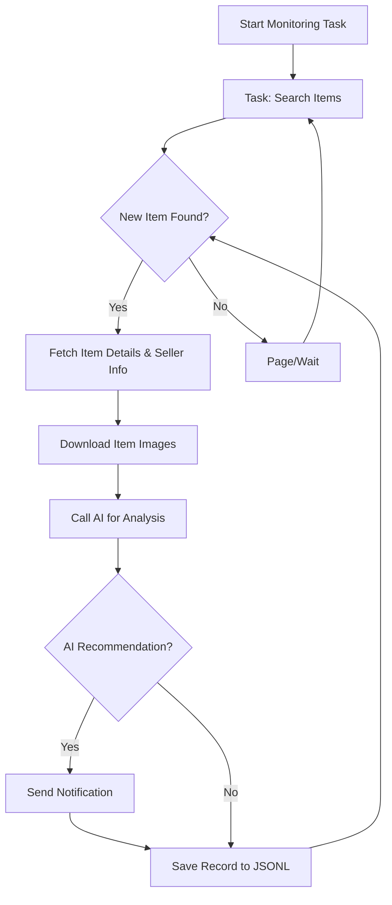

# AI-Powered Goofish (Xianyu) Monitor: Real-time Smart Shopping

**Tired of missing out on the best deals?** This AI-driven tool uses Playwright and large language models to intelligently monitor Xianyu (Goofish) for you, providing real-time analysis and instant notifications for your desired items, all through a user-friendly web interface. [View the original repository](https://github.com/dingyufei615/ai-goofish-monitor).

## Key Features:

*   **Intuitive Web UI:** Manage tasks, edit AI criteria, view real-time logs, and filter results without needing to touch the command line.
*   **AI-Driven Task Creation:**  Describe your ideal purchase in natural language, and the AI will create a sophisticated monitoring task for you.
*   **Concurrent Multi-Tasking:** Monitor multiple keywords simultaneously with independent, non-interfering tasks via `config.json`.
*   **Real-Time Streaming:**  Get instant analysis as new items appear, eliminating batch processing delays.
*   **Deep AI Analysis:** Integrates multimodal large language models (like GPT-4o) to analyze item descriptions, images, and seller profiles for precise filtering.
*   **Highly Customizable:** Configure individual keywords, price ranges, filtering conditions, and AI analysis prompts for each task.
*   **Instant Notifications:**  Receive immediate alerts via [ntfy.sh](https://ntfy.sh/), WeChat group bots, and [Bark](https://bark.day.app/) when items match your criteria.
*   **Scheduled Task Execution:** Supports Cron expressions for setting up automated, periodic monitoring.
*   **Docker Deployment:**  Deploy quickly and consistently with provided `docker-compose` configurations.
*   **Robust Anti-Scraping:** Mimics human behavior with random delays and user actions to improve stability and avoid detection.

## Key Screenshots:

*   **Task Management:**  
*   **Monitoring View:**  
*   **Notification Example:**  

## Getting Started:

### 1. Prerequisites:

*   **Python Version:** Python 3.10 or higher is recommended.  Older versions may cause installation issues.

1.  **Clone the repository:**

    ```bash
    git clone https://github.com/dingyufei615/ai-goofish-monitor
    cd ai-goofish-monitor
    ```

2.  **Install dependencies:**

    ```bash
    pip install -r requirements.txt
    ```

### 2. Configuration:

1.  **Configure Environment Variables:** Copy and rename `.env.example` to `.env` and customize the values.

    *   **Windows:**

        ```cmd
        copy .env.example .env
        ```

    *   **Linux/macOS:**

        ```shell
        cp .env.example .env
        ```

    | Variable          | Description                                    | Required? | Notes                                                                                                                                     |
    | :---------------- | :--------------------------------------------- | :-------- | :------------------------------------------------------------------------------------------------------------------------------------------ |
    | `OPENAI_API_KEY`  | Your AI model provider's API Key.                | Yes       | Some local/proxy services may allow this to be optional.                                                                                    |
    | `OPENAI_BASE_URL` | AI Model API endpoint (OpenAI compatible).      | Yes       | Fill in the base URL, like `https://ark.cn-beijing.volces.com/api/v3/`.                                                                   |
    | `OPENAI_MODEL_NAME`| Specific model name (must support image analysis).| Yes       |  Choose a multimodal model like `doubao-seed-1-6-250615`, `gemini-2.5-pro`, or similar.                                                       |
    | `PROXY_URL`       | Optional HTTP/S proxy for bypassing geo-restrictions.         | No        | Supports `http://` and `socks5://`. E.g., `http://127.0.0.1:7890`.                                                                        |
    | `NTFY_TOPIC_URL`  | [ntfy.sh](https://ntfy.sh/) topic URL.        | No        | Leave blank to disable ntfy notifications.                                                                                                |
    | ...               | ...                                          | ...       | ...                                                                                                                                         |

    > 💡 **Debugging Tip:** If you encounter 404 errors when configuring the AI API, start by testing with Alibaba Cloud or Volcengine APIs to ensure basic functionality before switching providers.

    > 🔐 **Security Note:** The web interface uses Basic authentication. The default username/password are `admin` / `admin123`. **Change these in production!**

2.  **Get Login Credentials (Crucial!):** This is required for the scraper to access Xianyu in a logged-in state.

    *   **Recommended:  Using the Web UI:**
        1.  Start the web server as described in Step 3.
        2.  Open the Web UI and navigate to "System Settings."
        3.  Click the "Manual Update" button next to the "Login State File" setting.
        4.  Follow the instructions in the modal:
            *   Install the Xianyu Login State Extractor extension in your Chrome browser.
            *   Log in to Xianyu via the official website.
            *   Click the extension icon and then "Extract Login State."
            *   Click "Copy to Clipboard."
            *   Paste the contents into the Web UI and save.

    *   **Alternative:  Running the `login.py` script (if you have a local GUI):**

        ```bash
        python login.py
        ```

        A browser window will open.  Scan the QR code with the Xianyu App to log in.  The script will then generate an `xianyu_state.json` file in the project root.

### 3. Start the Web Server:

```bash
python web_server.py
```

### 4. Start Monitoring:

1.  Open your browser and go to `http://127.0.0.1:8000`.
2.  In the **"Task Management"** section, click **"Create New Task."**
3.  Describe your desired item in natural language (e.g., "I want to buy a Sony A7M4 camera, used, over 95% new, under 13,000 RMB, less than 5000 shutter counts").  Enter a task name and keywords.
4.  Click "Create." The AI will generate the monitoring logic.
5.  Start the task by scheduling it or clicking the start button!

##  🐳 Docker Deployment (Recommended):

Docker simplifies deployment, packaging the application and its dependencies into a standardized unit.

### 1. Prepare the Environment (Similar to Local Deployment):

1.  **Install Docker:**  Make sure [Docker Engine](https://docs.docker.com/engine/install/) is installed.
2.  **Clone and Configure:**

    ```bash
    git clone https://github.com/dingyufei615/ai-goofish-monitor
    cd ai-goofish-monitor
    ```

3.  **Create `.env` file:** As above in [Getting Started](#2-configuration).
4.  **Get Login Credentials (IMPORTANT!):**  You *cannot* scan the QR code from within a Docker container.  Therefore, after deploying the container, use the Web UI to get the login state:
    1. (On the host machine) Run `docker-compose up -d`.
    2. Open `http://127.0.0.1:8000` in your browser.
    3. Go to "System Settings" and click "Manual Update" for the Login State File.
    4. Follow the UI instructions to get login credentials.

> ℹ️ **Python Version:** Docker uses Python 3.11, defined in the Dockerfile, so you do not need to worry about local Python compatibility.

### 2. Run Docker Container:

The `docker-compose.yaml` file is included.  Use `docker-compose` for ease of use.

```bash
docker-compose up --build -d
```

This will start the service in the background.  `docker-compose` uses the `.env` file and `docker-compose.yaml` to create and run the container.

If you encounter network issues within the container, check your proxy settings or consider network configuration adjustments, particularly if deploying on OpenWrt routers.

### 3. Access and Manage:

*   **Web UI:**  `http://127.0.0.1:8000`
*   **View Logs:** `docker-compose logs -f`
*   **Stop Container:** `docker-compose stop`
*   **Start Stopped Container:** `docker-compose start`
*   **Stop and Remove Container:** `docker-compose down`

## Web UI Features at a Glance:

*   **Task Management:**  AI-powered task creation, visualize task parameters, CRUD operations, time-based job scheduling.
*   **Result Viewing:**  Card-based display, AI filter based result set, view detailed info, easy sorting.
*   **Real-time Logs:** Detailed runtime logs for real time monitor.
*   **System Settings:** Dependencies check, prompt file modification.

## Workflow Diagram:



## Web Interface Authentication:

### Authentication Configuration

The Web interface uses Basic authentication to protect the management UI and API.

#### Configuration

Set credentials in your `.env` file:

```bash
# Web service authentication settings
WEB_USERNAME=admin
WEB_PASSWORD=admin123
```

#### Default Credentials

If you don't configure them in `.env`, it will use:

*   Username: `admin`
*   Password: `admin123`

**⚠️ Important:  Change the default password in production!**

#### Authentication Scope

*   **Authenticated:** All API endpoints, Web UI, static resources.
*   **Unauthenticated:** Health check endpoint (`/health`).

#### Usage

1.  **Browser Access:**  The browser will prompt for credentials.
2.  **API Calls:**  Include Basic authentication information in the request headers.
3.  **Frontend JavaScript:**  Automatically handles authentication.

#### Security Recommendations

1.  Change the default password to a strong one.
2.  Use HTTPS in production.
3.  Rotate credentials periodically.
4.  Restrict access by IP address via a firewall.

See [AUTH_README.md](AUTH_README.md) for detailed configuration.

## Frequently Asked Questions (FAQ):

A comprehensive FAQ document addressing environment setup, AI configuration, and anti-scraping strategies is available:

👉 **[View the FAQ (FAQ.md)](FAQ.md)**

## Acknowledgements:

This project is built upon the foundations of several excellent projects. Thanks to:

*   [superboyyy/xianyu_spider](https://github.com/superboyyy/xianyu_spider)

And many thanks to the LinuxDo community, and the contribution from [@jooooody](https://linux.do/u/jooooody/summary).

Also thanks to ClaudeCode/Aider/Gemini tools, making coding a lot easier～

## Support & Sponsoring

If this project is helpful to you, please consider buying me a coffee , your support will be much appreciated!

<table>
  <tr>
    <td></td>
    <td></td>
  </tr>
</table>

## ⚠️ Important Notes:

*   Adhere to Xianyu's user agreement and `robots.txt` rules.  Avoid excessive requests.
*   This project is for educational and research purposes only; do not use it for illegal activities.
*   It is released under the [MIT License](LICENSE), "as is," without any warranty.
*   The author and contributors are not responsible for any direct or indirect damages arising from the use of this software.
*   See [DISCLAIMER.md](DISCLAIMER.md) for further details.

[](https://star-history.com/#dingyufei615/ai-goofish-monitor&Date)