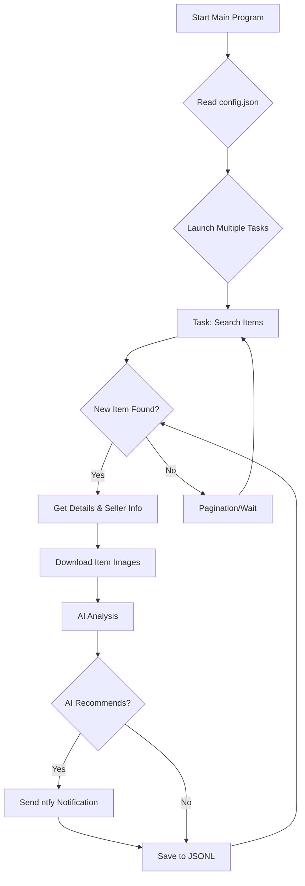

# AI-Powered Xianyu Monitor: Intelligent Shopping Made Easy

**Effortlessly monitor Xianyu (闲鱼) for your desired items using natural language and AI analysis.**  [View the original repository](https://github.com/dingyufei615/ai-goofish-monitor)

## Key Features

*   ✅ **AI-Driven Task Creation:** Describe your ideal item in natural language, and the AI generates a complete monitoring task.
*   ✅ **Visual Web Interface:** Manage tasks, view real-time logs, and filter results with an intuitive web UI.
*   ✅ **Multi-Task Concurrency:** Monitor multiple keywords simultaneously without interference.
*   ✅ **Real-time Analysis:** Instant analysis of new listings for faster results.
*   ✅ **Deep AI Analysis:** Utilizes multimodal large language models (e.g., GPT-4o) to analyze images, text, and seller profiles for precise filtering.
*   ✅ **Highly Customizable:** Configure keywords, price ranges, AI analysis prompts, and more for each task.
*   ✅ **Instant Notifications:** Receive immediate alerts via [ntfy.sh](https://ntfy.sh/) when matching items are found.
*   ✅ **Robust Anti-Detection:** Mimics human behavior with random delays and actions to enhance stability.

## Key Benefits

*   **Save Time:** Automate your Xianyu shopping and find deals without constant manual searching.
*   **Get the Best Deals:** Leverage AI to identify high-quality items meeting your specific criteria.
*   **Stay Informed:** Receive real-time notifications the moment a desired item is listed.

## Quick Start

### Step 1: Environment Setup

1.  **Clone the Repository:**
    ```bash
    git clone https://github.com/dingyufei615/ai-goofish-monitor
    cd ai-goofish-monitor
    ```

2.  **Install Dependencies:**
    ```bash
    pip install -r requirements.txt
    ```

### Step 2: Configuration

1.  **Configure Environment Variables:** Create a `.env` file in the project root with the following settings:

    ```env
    # --- AI Model Configuration ---
    OPENAI_API_KEY="sk-..."     # Your API Key
    OPENAI_BASE_URL="https://generativelanguage.googleapis.com/v1beta/openai/" # AI Model API Endpoint (See FAQ for other providers)
    OPENAI_MODEL_NAME="gemini-2.5-pro" # The model to use, must support image analysis (Vision/Multi-modal).
    PROXY_URL=""             # Optional: HTTP/S proxy (e.g., http://127.0.0.1:7890 or socks5://127.0.0.1:1080)

    # Notification Configuration
    NTFY_TOPIC_URL="https://ntfy.sh/your-topic-name" # Replace with your ntfy topic URL
    WX_BOT_URL="https://qyapi.weixin.qq.com/cgi-bin/webhook/send?key=xxxxx" # Optional: Enterprise WeChat bot webhook.

    # Browser Settings
    LOGIN_IS_EDGE=false         # Use Edge browser (default: Chrome)
    PCURL_TO_MOBILE=true       # Convert PC URLs to mobile URLs
    RUN_HEADLESS=true         # Run headless browser mode (required for Docker). Set to false to solve Captchas.
    AI_DEBUG_MODE=false       # Enable detailed AI debugging logs (optional)
    SERVER_PORT=8000          # Optional: Change the web server port
    ```

2.  **Get Login Status (Critical!):** **Run the login script *once* to generate the session file.**
    ```bash
    python login.py
    ```
    A browser window will open.  **Scan the QR code with your Xianyu app** to log in.  A `xianyu_state.json` file will be created in the project root.

### Step 3: Start the Web Server

```bash
python web_server.py
```

### Step 4: Start Monitoring

1.  Open `http://127.0.0.1:8000` in your browser.
2.  Go to "Task Management" and click "Create New Task."
3.  Describe your desired item in natural language (e.g., "Sony A7M4 camera, new condition, under 13000 yuan, shutter count below 5000").
4.  Click "Create," and the AI will generate the monitoring criteria.
5.  Click "🚀 Start All" to begin automated monitoring!

## Docker Deployment (Recommended)

Deploying with Docker ensures easy and consistent deployments.

### Step 1: Preparation (Similar to Local)

1.  **Install Docker:**  Ensure Docker Engine is installed.
2.  **Clone and Configure:**
    ```bash
    git clone https://github.com/dingyufei615/ai-goofish-monitor
    cd ai-goofish-monitor
    ```
3.  **Create `.env` File:** Follow the instructions in the Quick Start section.
4.  **Get Login Status (Critical!):**  **Run `login.py` on your host machine (outside the Docker container) to generate `xianyu_state.json`.**
    ```bash
    pip install -r requirements.txt  # Ensure dependencies are installed on your host
    python login.py
    ```
    Scan the QR code, and `xianyu_state.json` will be created.

### Step 2: Run the Docker Container

The project includes `docker-compose.yaml`.

```bash
docker-compose up -d
```

### Step 3: Access and Manage

*   **Web UI:** `http://127.0.0.1:8000`
*   **Real-time Logs:** `docker-compose logs -f`
*   **Stop Container:** `docker-compose stop`
*   **Start Stopped Container:** `docker-compose start`
*   **Stop and Remove Container:** `docker-compose down`

## Web UI Features

*   **Task Management:**
    *   AI-powered task creation using natural language.
    *   Visual editing of task parameters.
    *   Start/stop individual or all tasks.
*   **Result Viewing:**
    *   Card-based display of matching items.
    *   Intelligent filtering (e.g., show only AI-recommended items).
    *   Detailed data and AI analysis results.
*   **Run Logs:** Real-time, detailed logs.
*   **System Settings:**
    *   Configuration checks.
    *   Prompt editing.

## Advanced Command-Line Usage

### Start Monitoring

```bash
python spider_v2.py
```
**Debug Mode:**
```bash
python spider_v2.py --debug-limit 2
```

### Create Tasks with Script

```bash
python prompt_generator.py \
  --description "Sony A7M4 camera, 95% new, budget 10000-13000 yuan, shutter count under 5000, mainland China version, complete accessories, individual seller preferred." \
  --output prompts/sony_a7m4_criteria.txt \
  --task-name "Sony A7M4" \
  --keyword "a7m4" \
  --min-price "10000" \
  --max-price "13000"
```

## Workflow



## Technology Stack

*   **Core Framework:** Playwright (asynchronous) + asyncio
*   **Web Server:** FastAPI
*   **AI Model:** OpenAI API (supports GPT-4o and other multimodal models)
*   **Notifications:** ntfy
*   **Configuration:** JSON
*   **Dependencies:** pip

## Project Structure

```
.
├── .env
├── .gitignore
├── config.json
├── login.py
├── spider_v2.py
├── prompt_generator.py
├── web_server.py
├── requirements.txt
├── README.md
├── prompts/
│   ├── base_prompt.txt
│   └── ..._criteria.txt
├── static/
│   ├── css/style.css
│   └── js/main.js
├── templates/
│   └── index.html
├── images/
├── logs/
└── jsonl/
```

## Frequently Asked Questions (FAQ)

*   **Encoding Errors on Windows:** Set `PYTHONUTF8=1` environment variable or use `chcp 65001` before running scripts to fix.
*   **"playwright install" Error:** Ensure all dependencies are installed via `pip install -r requirements.txt` and/or install Chromium manually (`playwright install chromium`).
*   **"Request timed out" or "Connection error":** Check network connectivity and verify the `OPENAI_BASE_URL` and if required, configure `PROXY_URL` in `.env`.
*   **AI Model Needs Image Analysis:**  Use a multimodal AI model supporting image input, and update  `OPENAI_MODEL_NAME` in `.env`.
*   **Docker on Synology NAS:** Follow standard Docker deployment, generating `xianyu_state.json` on a separate machine and mapping volumes correctly.
*   **Configuring Non-OpenAI Models (Gemini, Qwen, Grok, etc.):** Configure `OPENAI_API_KEY`, `OPENAI_BASE_URL`, and `OPENAI_MODEL_NAME` in `.env` based on your model provider.  The model *must* support image analysis.
*   **Getting Blocked by Xianyu:**
    *   Set `RUN_HEADLESS=false` to manually solve captchas.
    *   Reduce the number of running tasks and be careful using non-residential IPs.

## Acknowledgements

This project is inspired by:
- [superboyyy/xianyu_spider](https://github.com/superboyyy/xianyu_spider)
And thanks to the contributors from LinuxDo.
[@jooooody](https://linux.do/u/jooooody/summary)
Thank you to Aider and Gemini.

## Important Notes

*   Please respect Xianyu's terms of service and robots.txt to avoid account restrictions.
*   This project is for educational and research purposes only; do not use it for illegal activities.

[](https://star-history.com/#dingyufei615/ai-goofish-monitor&Date)