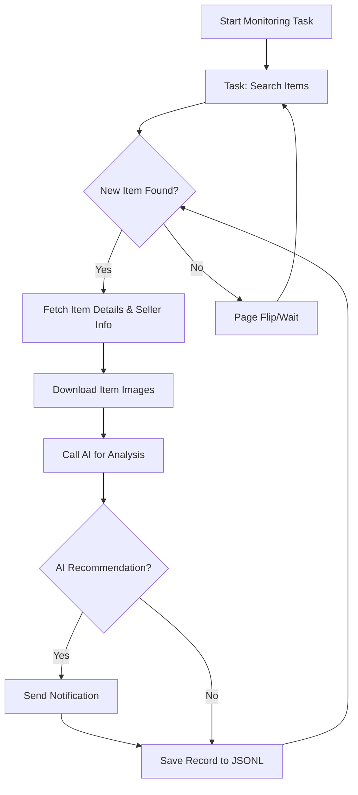

# AI-Powered Goofish (Xianyu) Monitor: Your Smart Assistant for Second-Hand Shopping

Tired of endlessly scrolling through Xianyu? This AI-powered tool ([original repo](https://github.com/dingyufei615/ai-goofish-monitor)) uses Playwright and AI to intelligently monitor Xianyu (闲鱼) for you, providing real-time tracking and smart analysis with a user-friendly Web UI.

## Key Features:

*   ✅ **AI-Driven Task Creation:** Describe your desired item in natural language, and the system will create a sophisticated monitoring task for you.
*   ✅ **Visual Web Interface:** Manage tasks, view real-time logs, filter results, and edit AI analysis prompts without touching the command line.
*   ✅ **Multi-Task Concurrency:** Monitor multiple keywords simultaneously with independent task execution.
*   ✅ **Real-time Streaming:** Instantly analyze new listings for immediate results.
*   ✅ **Deep AI Analysis:** Leverage multimodal LLMs (e.g., GPT-4o) to analyze item descriptions, images, and seller profiles for precise filtering.
*   ✅ **Highly Customizable:** Configure each monitoring task with individual keywords, price ranges, filters, and AI analysis prompts.
*   ✅ **Instant Notifications:** Receive notifications via ntfy.sh, WeChat Enterprise Bot, and Bark for matched items.
*   ✅ **Scheduled Tasks:** Schedule tasks using Cron expressions for automated monitoring.
*   ✅ **Docker Deployment:** Easily deploy with Docker Compose for rapid and standardized deployment.
*   ✅ **Robust Anti-Scraping:** Employs realistic user behavior and delays to enhance stability.

## Screenshots

**Task Management (Web UI)**


**Monitoring Interface (Web UI)**


**Notification Example (ntfy)**


## Quickstart

We recommend using the Web UI for the best user experience.

### Step 1: Environment Setup

>   ⚠️ **Python Version:** Requires Python 3.10 or higher.

1.  **Clone the repository:**

    ```bash
    git clone https://github.com/dingyufei615/ai-goofish-monitor
    cd ai-goofish-monitor
    ```

2.  **Install dependencies:**

    ```bash
    pip install -r requirements.txt
    ```

### Step 2: Configuration

1.  **Configure Environment Variables:** Create a `.env` file by copying `.env.example`.  Customize the variables within.

    ```bash
    # Windows
    copy .env.example .env
    # Linux/MacOS
    cp .env.example .env
    ```

    Available environment variables:

    | Variable            | Description                                                      | Required? | Notes                                                                                                                                                                  |
    | :------------------ | :--------------------------------------------------------------- | :-------- | :--------------------------------------------------------------------------------------------------------------------------------------------------------------------- |
    | `OPENAI_API_KEY`    | Your AI model provider's API Key.                                | Yes       | May be optional for some local or proxy services.                                                                                                                   |
    | `OPENAI_BASE_URL`   | AI model API endpoint (OpenAI-compatible format).               | Yes       |  Use the base URL, e.g., `https://ark.cn-beijing.volces.com/api/v3/`.                                                                                                  |
    | `OPENAI_MODEL_NAME` | The specific model name.                                         | Yes       | **Must** select a multimodal model that supports image analysis, like `doubao-seed-1-6-250615`, `gemini-2.5-pro`, etc.                                                 |
    | `PROXY_URL`         | (Optional) HTTP/S proxy for bypassing restrictions.                | No        | Supports `http://` and `socks5://` formats. e.g., `http://127.0.0.1:7890`.                                                                                           |
    | `NTFY_TOPIC_URL`    | (Optional) [ntfy.sh](https://ntfy.sh/) topic URL for notifications.  | No        |  Leave blank to disable ntfy notifications.                                                                                                                         |
    | `GOTIFY_URL`        | (Optional) Gotify server address.                                | No        |  e.g., `https://push.example.de`.                                                                                                                                    |
    | `GOTIFY_TOKEN`      | (Optional) Gotify application Token.                           | No        |                                                                                                                                                                      |
    | `BARK_URL`          | (Optional) [Bark](https://bark.day.app/) push address.            | No        | e.g., `https://api.day.app/your_key`. Leave blank to disable Bark notifications.                                                                                   |
    | `WX_BOT_URL`        | (Optional) WeChat Enterprise Bot Webhook address.                 | No        |  Leave blank to disable WeChat notifications.                                                                                                                       |
    | `WEBHOOK_URL`       | (Optional) Generic Webhook URL.                                  | No        |  Leave blank to disable generic Webhook notifications.                                                                                                                 |
    | `WEBHOOK_METHOD`    | (Optional) Webhook request method.                               | No        |  Supports `GET` or `POST`, defaults to `POST`.                                                                                                                       |
    | `WEBHOOK_HEADERS`   | (Optional) Webhook custom request headers.                       | No        |  Must be a valid JSON string, e.g., `'{"Authorization": "Bearer xxx"}'`.                                                                                           |
    | `WEBHOOK_CONTENT_TYPE`| (Optional) Content type for POST requests.                      | No        |  Supports `JSON` or `FORM`, defaults to `JSON`.                                                                                                                        |
    | `WEBHOOK_QUERY_PARAMETERS`| (Optional) Query parameters for GET requests.               | No        |  JSON string, supports `{{title}}` and `{{content}}` placeholders.                                                                                                       |
    | `WEBHOOK_BODY`      | (Optional) Body for POST requests.                               | No        |  JSON string, supports `{{title}}` and `{{content}}` placeholders.                                                                                                       |
    | `LOGIN_IS_EDGE`     | Use Edge browser for login and crawling.                           | No        | Defaults to `false` (Chrome/Chromium).                                                                                                                                 |
    | `PCURL_TO_MOBILE`   | Convert PC item links to mobile links in notifications.          | No        | Defaults to `true`.                                                                                                                                                     |
    | `RUN_HEADLESS`      | Run the browser in headless mode.                                | No        | Defaults to `true`. Set to `false` for local debugging when encountering captchas. **Must be `true` for Docker deployments.**                                        |
    | `AI_DEBUG_MODE`     | Enable AI debug mode.                                             | No        | Defaults to `false`.  Prints detailed AI request/response logs.                                                                                                       |
    | `SERVER_PORT`       | Web UI service port.                                             | No        | Defaults to `8000`.                                                                                                                                                  |

    >   💡 **Debugging Tip:** If you encounter 404 errors when configuring the AI API, consider using the API from Alibaba Cloud or Volcengine for initial testing to ensure basic functionality before trying other providers.

2.  **Obtain Login Status (Important!)**: You need to provide valid login credentials for the crawler to access Xianyu. We recommend using the Web UI for this:

    **Recommended: Update via Web UI**
    1.  Skip this step and run `web_server.py` in step 3.
    2.  Open the Web UI and go to the **"System Settings"** page.
    3.  Find "Login State File" and click the **"Manual Update"** button.
    4.  Follow the instructions in the pop-up window:
        -   Install the [Xianyu Login State Extraction Extension](https://chromewebstore.google.com/detail/xianyu-login-state-extrac/eidlpfjiodpigmfcahkmlenhppfklcoa) in Chrome on your personal computer.
        -   Open the Xianyu official website and log in.
        -   After successful login, click the extension icon in the browser toolbar.
        -   Click the "Extract Login State" button to get the login information.
        -   Click the "Copy to Clipboard" button.
        -   Paste the copied content into the Web UI and save.

    This method is the most convenient as it doesn't require a graphical environment on the server.

    **Alternative: Run Login Script (if you have a desktop environment)**

    ```bash
    python login.py
    ```

    A browser window will open.  Use your **mobile Xianyu app to scan the QR code** to log in.  The program will close automatically after a successful login, and an `xianyu_state.json` file will be generated in the project root.

### Step 3: Launch the Web Service

Once ready, start the Web UI server:

```bash
python web_server.py
```

### Step 4: Get Started

Open `http://127.0.0.1:8000` in your browser.

1.  In the **"Task Management"** page, click **"Create New Task"**.
2.  Describe your needs in natural language (e.g., "I want to buy a Sony A7M4 camera, 95% new or better, under 13,000 RMB, with less than 5000 shutter counts"), fill in the task name and keywords.
3.  Click "Create", and the AI will generate a complex analysis standard.
4.  Back in the main interface, schedule your task or click "Start" to begin automated monitoring!

## Docker Deployment (Recommended)

Docker allows you to package the application and its dependencies for consistent deployments.

### Step 1: Environment Preparation (similar to local)

1.  **Install Docker:** Ensure [Docker Engine](https://docs.docker.com/engine/install/) is installed.

2.  **Clone and configure:**

    ```bash
    git clone https://github.com/dingyufei615/ai-goofish-monitor
    cd ai-goofish-monitor
    ```

3.  **Create the `.env` file:** Follow the instructions in the **[Quickstart](#quickstart)** section.

4.  **Obtain Login Status (Key Step!)**:  You cannot perform QR code login inside the Docker container.  Get login status by visiting the Web UI *after* starting the container:
    1.  (On your host machine) Run `docker-compose up -d` to start the service.
    2.  Open `http://127.0.0.1:8000` in your browser to access the Web UI.
    3.  Go to **"System Settings"** and click the **"Manual Update"** button.
    4.  Follow the on-screen instructions:
        -   Install the [Xianyu Login State Extraction Extension](https://chromewebstore.google.com/detail/xianyu-login-state-extrac/eidlpfjiodpigmfcahkmlenhppfklcoa) in Chrome on your personal computer.
        -   Open and log in to the Xianyu official website.
        -   Click the extension icon in the browser toolbar after logging in.
        -   Click the "Extract Login State" button.
        -   Click the "Copy to Clipboard" button.
        -   Paste the content into the Web UI to save it.

>   ℹ️ **Python Version Note:** Docker uses the Python 3.11 version specified in the Dockerfile.

### Step 2: Run the Docker Container

The project includes a `docker-compose.yaml` file.  Using `docker-compose` is recommended.

In the project root directory, run:

```bash
docker-compose up --build -d
```

This will start the service in the background.

If you encounter network issues inside the container, troubleshoot your proxy settings.

>   ⚠️ **OpenWrt Deployment Notes**: If deploying on an OpenWrt router, you might face DNS resolution issues due to Docker Compose's default network settings. If you get `ERR_CONNECTION_REFUSED`, check your container's network configuration, potentially needing manual DNS configuration.

### Step 3: Access and Management

*   **Access Web UI:** Open `http://127.0.0.1:8000` in your browser.
*   **View Logs:** `docker-compose logs -f`
*   **Stop Container:** `docker-compose stop`
*   **Start Stopped Container:** `docker-compose start`
*   **Stop and Remove Container:** `docker-compose down`

## Web UI Features

*   **Task Management:**
    *   **AI Task Creation:** Create monitoring tasks with natural language descriptions.
    *   **Visual Editing and Control:** Modify task parameters (keywords, price, scheduling) and start/stop/delete tasks directly.
    *   **Scheduling:** Use Cron expressions for automated task execution.
*   **Result Viewing:**
    *   **Card View:** Clear display of matched items in a card format.
    *   **Smart Filtering & Sorting:** Filter for "Recommended" items and sort by time, price, etc.
    *   **Detailed Item Information:** View complete item data and AI analysis results.
*   **Running Logs:**
    *   **Real-time Log Stream:** View detailed logs in real-time for troubleshooting.
    *   **Log Management:** Auto-refresh, manual refresh, and clear log functionality.
*   **System Settings:**
    *   **Status Check:** Verify `.env` configuration and login status.
    *   **Prompt Editing:** Edit and save the `prompt` file used for AI analysis directly through the web interface.

## Workflow

The diagram illustrates the core logic of a single monitoring task:



## Frequently Asked Questions (FAQ)

1.  **Q:  `'gbk' codec can't encode character` error when running `login.py` or `spider_v2.py`?**
    *   **A:** This is a common encoding issue on Windows.  The code defaults to UTF-8.
    *   **Solution:** Set the `PYTHONUTF8=1` environment variable before running the script, or set the code page to UTF-8 using `chcp 65001`.

2.  **Q:  `playwright install` needed when running `login.py`?**
    *   **A:** This means the necessary browser files for Playwright are missing.
    *   **Solution:**  Ensure all dependencies are installed via `requirements.txt`.  If the problem persists, try `playwright install chromium`.

3.  **Q:  "Request timed out" or "Connection error"?**
    *   **A:** Usually a network problem, unable to connect to `OPENAI_BASE_URL`. Check:
        *   Your server's network connection.
        *   If in mainland China, set a proxy using `PROXY_URL` in `.env`.
        *   Confirm that `OPENAI_BASE_URL` is correct and the service is running.

4.  **Q:  AI model doesn't support image analysis?**
    *   **A:** Image analysis is a core feature, so you **must** choose a Vision / Multi-modal AI model. Change `OPENAI_MODEL_NAME` to a model that supports image input, such as `gpt-4o`, `gemini-1.5-pro`, `deepseek-v2`, or `qwen-vl-plus`.

5.  **Q:  Deploy on Synology NAS via Docker?**
    *   **A:** Yes. Follow standard Docker deployment:
        1.  Complete `login.py` on your computer (not the NAS) and create `xianyu_state.json`.
        2.  Upload the project folder (including `.env` and `xianyu_state.json`) to your Synology NAS.
        3.  Use `docker-compose up -d` in Container Manager (or older Docker) on the NAS to start the project.  Ensure correct volume mappings in `docker-compose.yaml`.

6.  **Q:  Configure Gemini / Qwen / Grok or other non-OpenAI LLMs?**
    *   **A:** The project theoretically supports any OpenAI-compatible API.  Configure in `.env`:
        *   `OPENAI_API_KEY`: Your model provider's API key.
        *   `OPENAI_BASE_URL`: API-Compatible Endpoint address. Refer to the model's documentation.  Typically like `https://api.your-provider.com/v1` (without `/chat/completions`).
        *   `OPENAI_MODEL_NAME`: Your model name, which *must* support image recognition, e.g. `gemini-2.5-flash`.
    *   **Example:** If the Completions endpoint is `https://xx.xx.com/v1/chat/completions`, set `OPENAI_BASE_URL` to `https://xx.xx.com/v1`.

7.  **Q:  Detected by Xianyu? "Abnormal traffic" or captcha?**
    *   **A:** Xianyu's anti-scraping measures. To reduce detection:
        *   **Disable headless mode:** Set `RUN_HEADLESS=false` in `.env` to manually solve captchas.
        *   **Reduce monitoring frequency.**
        *   **Use a clean network environment.**

8.  **Q:  pyzbar installation fails on Windows?**
    *   **A:**  pyzbar needs zbar DLLs.
    *   **Solutions (Windows):**
        *   **Method 1 (Recommended):** Use Chocolatey: `choco install zbar`
        *   **Method 2:** Manual download and add to PATH.
            1.  Download `libzbar-64.dll` from [zbar releases](https://github.com/NaturalHistoryMuseum/pyzbar/releases).
            2.  Place the file in your Python installation directory or add it to your system PATH.
        *   **Method 3:** Use conda: `conda install -c conda-forge zbar`
    *   **Linux Users:** Install system packages:  (e.g., `sudo apt-get install libzbar0` for Ubuntu/Debian).

9.  **Q:  `ModuleNotFoundError: No module named 'PIL'` when running `login.py`?**
    *   **A:**  Python version too low or incomplete dependencies.  Recommend Python 3.10+.
    *   **Solution:**
        *   Use Python 3.10+.
        *   Reinstall dependencies: `pip install -r requirements.txt`
        *   If the issue persists, try installing Pillow: `pip install Pillow`

10. **Q: 404 errors when configuring AI API?**
    *   **A:** Check the basics:
        *   `OPENAI_BASE_URL` is correct and the service is running.
        *   Network connection.
        *   API Key and access permissions.
        *   Review the API provider's documentation for specific header or parameter requirements.  Consider testing the API with Alibaba Cloud's API service for initial debugging.

## Acknowledgements

Thanks to the following projects:

*   [superboyyy/xianyu_spider](https://github.com/superboyyy/xianyu_spider)

And contributions from LinuxDo users:

*   [@jooooody](https://linux.do/u/jooooody/summary)

And also thanks to Aider and Gemini for freeing hands.

## Support & Sponsoring

If this project helps you, please consider buy a coffe for me , very grateful for your support!

<table>
  <tr>
    <td></td>
    <td></td>
  </tr>
</table>

## Important Notes

*   Respect Xianyu's user agreement and `robots.txt`. Avoid excessive requests to prevent account restrictions.
*   This project is for educational and technical research purposes only. Do not use it for illegal activities.

[](https://star-history.com/#dingyufei615/ai-goofish-monitor&Date)