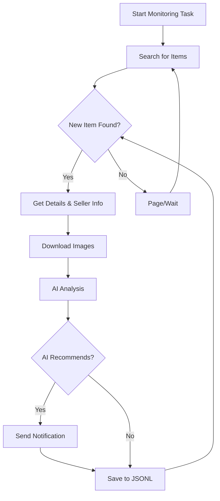

# AI-Powered Goofish Monitor: Real-time, Intelligent, and Customizable

Tired of missing out on the best deals? This project leverages AI and web automation to provide real-time monitoring and intelligent analysis of the Goofish (Xianyu) marketplace, with a user-friendly web interface.

## Key Features

*   ✅ **User-Friendly Web UI:** Manage tasks, view results, and monitor logs without command-line fuss.
*   🤖 **AI-Driven Task Creation:** Describe your desired item in natural language, and the AI creates the monitoring task for you!
*   🔄 **Concurrent Monitoring:** Monitor multiple keywords simultaneously, each with independent settings.
*   ⚡ **Real-time Analysis:** Analyze new listings instantly, avoiding batch processing delays.
*   🧠 **Deep AI Analysis:** Leverage multimodal LLMs (like GPT-4o) for comprehensive analysis of images, text, and seller profiles.
*   ⚙️ **Highly Customizable:** Tailor each task with specific keywords, price ranges, filtering criteria, and AI prompts.
*   🔔 **Instant Notifications:** Receive alerts via [ntfy.sh](https://ntfy.sh/), WeChat group bots, or [Bark](https://bark.day.app/).
*   📅 **Scheduled Tasks:** Utilize cron expressions for automated task execution.
*   🐳 **Dockerized Deployment:** Deploy quickly and easily with a provided `docker-compose` configuration.
*   🛡️ **Robust Anti-Scraping:** Mimics human behavior with random delays and user actions for improved stability.

## Screenshots

*   **Task Management:**
    
*   **Monitoring Results:**
    
*   **Notification Example:**
    

## Getting Started

Choose either the Web UI or Docker deployment for the best experience.

### 1.  Prerequisites

> ⚠️ **Python Version:** Python 3.10+ is recommended for local deployment.

*   **Clone the repository:**
    ```bash
    git clone https://github.com/dingyufei615/ai-goofish-monitor
    cd ai-goofish-monitor
    ```

*   **Install dependencies:**
    ```bash
    pip install -r requirements.txt
    ```

### 2.  Configuration

1.  **Configure Environment Variables:** Copy `.env.example` to `.env` and customize:

    ```bash
    # Windows
    copy .env.example .env

    # Linux/macOS
    cp .env.example .env
    ```

    Key variables:

    | Variable          | Description                                       | Required | Notes                                                                                                                                                                                                              |
    | :---------------- | :------------------------------------------------ | :------- | :----------------------------------------------------------------------------------------------------------------------------------------------------------------------------------------------------------------- |
    | `OPENAI_API_KEY`  | Your AI model provider API key.                   | Yes      |                                                                                                                                                                                                                    |
    | `OPENAI_BASE_URL` | API endpoint compatible with OpenAI format.         | Yes      | E.g., `https://ark.cn-beijing.volces.com/api/v3/`                                                                                                                                                                  |
    | `OPENAI_MODEL_NAME` | The specific AI model to use.                     | Yes      | **Must** select a multimodal model like `doubao-seed-1-6-250615`, `gemini-2.5-pro`, etc.                                                                                                                              |
    | `PROXY_URL`       | (Optional) HTTP/S proxy (e.g., `http://...`).     | No       |                                                                                                                                                                                                                    |
    | ...             | (Other Notification/Webhook settings, etc. See `.env.example` for all options) | No       |                                                                                                                                                                                                                    |

    > 💡 **Debugging Tip:** If you encounter 404 errors with the AI API, try the Alibaba Cloud or Volcano Engine API for initial testing.

    > 🔐 **Security Reminder:** The Web UI uses Basic Authentication. The default username/password is `admin`/`admin123`.  **Change these in production!**

2.  **Get Login Credentials (Essential!)** The crawler needs valid login credentials:

    **Recommended:  Web UI Update**
    1.  Start the Web UI (step 3).
    2.  Go to "System Settings" in the Web UI.
    3.  Click "Manual Update" for "Login State File".
    4.  Follow instructions to extract the login state using the Xianyu login state extension.

    **Alternative:  Login Script (if you can run a browser on your server)**

    ```bash
    python login.py
    ```

    Use your mobile Xianyu app to scan the QR code. This creates a `xianyu_state.json` file.

### 3.  Start the Web Server

```bash
python web_server.py
```

### 4.  Start Monitoring

1.  Open `http://127.0.0.1:8000` in your browser.
2.  Go to "Task Management" and click "Create New Task".
3.  Describe your desired item (e.g., "Sony A7M4 camera, mint condition, under $1300").
4.  The AI will generate the task.  Configure scheduling and start monitoring.

## 🐳 Docker Deployment (Recommended)

1.  **Install Docker and Clone Project (Same as local).**
2.  **Create `.env` File:**  Configure as in Step 2 of "Getting Started".
3.  **Get Login Credentials:** **Crucial!**  After starting the container, use the Web UI (accessed via `http://127.0.0.1:8000` on your host) to set the login state (see Web UI instructions above).

> ℹ️ **Python Version:** Docker uses Python 3.11 (specified in the Dockerfile).

4.  **Run Docker Compose:**

    ```bash
    docker-compose up --build -d
    ```

    *   **Access Web UI:**  `http://127.0.0.1:8000`
    *   **View Logs:** `docker-compose logs -f`
    *   **Stop/Start/Remove:**  `docker-compose stop`, `docker-compose start`, `docker-compose down`

## Web UI Features

*   **Task Management:** Create, edit, start/stop, and schedule monitoring tasks using the AI.
*   **Result Viewing:** Browse results with image previews, smart filtering, and detailed analysis.
*   **Real-time Logs:** Monitor crawling activity and troubleshoot issues.
*   **System Settings:** Configure settings and manage prompts.

## Workflow Overview



## Authentication

See [AUTH_README.md](AUTH_README.md) for detailed authentication configuration instructions.

## FAQ

**See [FAQ.md](FAQ.md) for a comprehensive FAQ.**

## Acknowledgements

*   [superboyyy/xianyu\_spider](https://github.com/superboyyy/xianyu_spider)
*   LinuxDo community
*   ClaudeCode/ModelScope/Gemini (and others) for the AI tools.

## Disclaimer

*   Adhere to Xianyu's terms of service and robots.txt.
*   For educational and research purposes only; no illegal use.
*   Released under the [MIT License](LICENSE).
*   The author is not responsible for any damages or losses.
*   See [DISCLAIMER.md](DISCLAIMER.md) for more information.

[](https://star-history.com/#dingyufei615/ai-goofish-monitor&Date)