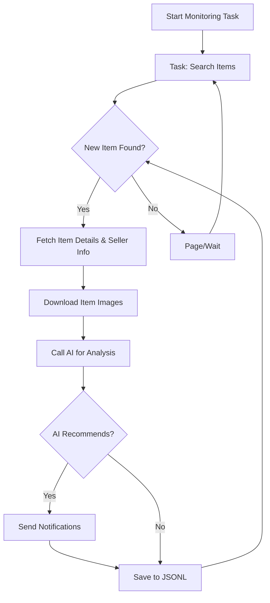

# AI-Powered Goofish (Xianyu) Smart Monitor: Get instant alerts for your desired used goods!

[View the original repository on GitHub](https://github.com/dingyufei615/ai-goofish-monitor)

This project is a powerful, AI-driven tool for real-time monitoring and intelligent analysis of Xianyu (Goofish) listings, complete with a user-friendly web interface.  It helps you find the best deals on secondhand items.

## Key Features

*   ✅ **Intuitive Web UI:** Manage tasks, edit AI criteria, view logs, and filter results directly from a web interface.
*   🧠 **AI-Driven Task Creation:** Describe your desired item in natural language, and the AI creates a complex monitoring task.
*   🚀 **Concurrent Multi-Tasking:** Monitor multiple keywords simultaneously, each running independently without interference.
*   ⚡️ **Real-time Processing:**  Analyze new listings immediately, eliminating batch processing delays.
*   💡 **Deep AI Analysis:** Integrates multimodal LLMs (e.g., GPT-4o) to analyze item descriptions, images, and seller profiles for precise filtering.
*   ⚙️ **Highly Customizable:** Configure each task with independent keywords, price ranges, filters, and AI analysis prompts.
*   🔔 **Instant Notifications:** Receive alerts via [ntfy.sh](https://ntfy.sh/), WeChat Work group bots, and [Bark](https://bark.day.app/) when a suitable item is found.
*   🗓️ **Scheduled Task Execution:** Schedule tasks using Cron expressions for automated monitoring.
*   🐳 **Docker Deployment:** Deploy quickly and reliably using pre-configured `docker-compose`.
*   🛡️ **Robust Anti-Scraping Measures:** Mimics human behavior with random delays and user actions to enhance stability.

## Web UI Screenshots

**Task Management:**


**Monitoring Dashboard:**


**Notification Example (ntfy):**


## Quick Start (Web UI Recommended)

For the best experience, we recommend using the Web UI to manage the project.

### Step 1: Environment Setup

> ⚠️ **Python Version Requirement:**  Use Python 3.10 or higher for local development. Lower versions may cause dependency installation errors or runtime issues (e.g., `ModuleNotFoundError: No module named 'PIL'`).

1.  Clone the repository:

    ```bash
    git clone https://github.com/dingyufei615/ai-goofish-monitor
    cd ai-goofish-monitor
    ```

2.  Install dependencies:

    ```bash
    pip install -r requirements.txt
    ```

### Step 2: Configuration

1.  **Configure Environment Variables**:  Copy `.env.example` to `.env` and modify the values.

    **Windows:**

    ```cmd
    copy .env.example .env
    ```

    **Linux/MacOS:**

    ```shell
    cp .env.example .env
    ```

    Here's a table of available environment variables:

    | Variable | Description | Required | Notes |
    | :--- | :--- | :--- | :--- |
    | `OPENAI_API_KEY` | Your AI model provider's API Key. | Yes | May be optional for certain local or proxy services. |
    | `OPENAI_BASE_URL` | AI model API endpoint, must be OpenAI-compatible. | Yes |  Fill in the base URL, e.g., `https://ark.cn-beijing.volces.com/api/v3/`. |
    | `OPENAI_MODEL_NAME` | The specific model name you want to use. | Yes | **Must** select a multimodal model that supports image analysis, such as `doubao-seed-1-6-250615` or `gemini-2.5-pro`. |
    | `PROXY_URL` | (Optional) HTTP/S proxy for bypassing restrictions. | No | Supports `http://` and `socks5://` formats, e.g., `http://127.0.0.1:7890`. |
    | `NTFY_TOPIC_URL` | (Optional)  [ntfy.sh](https://ntfy.sh/) topic URL for sending notifications. | No |  If empty, ntfy notifications will be disabled. |
    | `GOTIFY_URL` | (Optional) Gotify server address. | No |  e.g., `https://push.example.de`. |
    | `GOTIFY_TOKEN` | (Optional) Gotify application token. | No |  |
    | `BARK_URL` | (Optional) [Bark](https://bark.day.app/) push address. | No | e.g., `https://api.day.app/your_key`. If empty, Bark notifications are disabled. |
    | `WX_BOT_URL` | (Optional) WeChat Work group bot Webhook address. | No | If empty, WeChat Work notifications are disabled.  **Important**:  Wrap the URL in double quotes in the `.env` file. |
    | `WEBHOOK_URL` | (Optional) Generic Webhook URL. | No |  If empty, generic Webhook notifications are disabled. |
    | `WEBHOOK_METHOD` | (Optional) Webhook request method. | No |  `GET` or `POST`, defaults to `POST`. |
    | `WEBHOOK_HEADERS` | (Optional) Custom Webhook request headers. | No | Valid JSON string, e.g., `'{"Authorization": "Bearer xxx"}'`. |
    | `WEBHOOK_CONTENT_TYPE` | (Optional) POST request content type. | No | `JSON` or `FORM`, defaults to `JSON`. |
    | `WEBHOOK_QUERY_PARAMETERS` | (Optional) GET request query parameters. | No |  JSON string, supporting `{{title}}` and `{{content}}` placeholders. |
    | `WEBHOOK_BODY` | (Optional) POST request body. | No |  JSON string, supporting `{{title}}` and `{{content}}` placeholders. |
    | `LOGIN_IS_EDGE` | Use Edge browser for login and scraping. | No |  Defaults to `false` (Chrome/Chromium). |
    | `PCURL_TO_MOBILE` | Convert desktop item links to mobile links in notifications. | No | Defaults to `true`. |
    | `RUN_HEADLESS` | Run the browser in headless mode. | No |  Defaults to `true`. Set to `false` for local debugging when encountering captchas.  **Must be `true` for Docker deployment.** |
    | `AI_DEBUG_MODE` | Enable AI debugging mode. | No |  Defaults to `false`.  Prints detailed AI request/response logs to the console. |
    | `SKIP_AI_ANALYSIS` | Skip AI analysis and send notifications directly. | No | Defaults to `false`.  Set to `true` to notify directly without AI analysis. |
    | `ENABLE_THINKING` | Enable the `enable_thinking` parameter. | No | Defaults to `false`. Some AI models require this parameter, while others do not support it. If you encounter "Invalid JSON payload received. Unknown name "enable_thinking"", try setting to `false`. |
    | `SERVER_PORT` | Web UI service port. | No | Defaults to `8000`. |
    | `WEB_USERNAME` | Web UI login username. | No | Defaults to `admin`.  **Modify in production.** |
    | `WEB_PASSWORD` | Web UI login password. | No | Defaults to `admin123`.  **Modify in production with a strong password.** |

    > 💡 **Debugging Tip:**  If you get 404 errors configuring the AI API, test with the API provided by Alibaba Cloud or Volcano Engine first to ensure basic functionality before trying other providers. Some API providers may have compatibility issues or require special configurations.

    > 🔐 **Security Reminder:** The Web interface uses Basic Authentication. The default username/password is `admin` / `admin123`.  **Change these in production!**

2.  **Get Login Status (Important!)**: You need a valid login to access Xianyu.  Web UI is recommended.

    **Recommended: Update via Web UI**

    1.  Skip this step and start the Web service (Step 3).
    2.  Go to **"System Settings"** in the Web UI.
    3.  Find "Login Status File" and click **"Manual Update"**.
    4.  Follow the on-screen instructions:
        -   Install the [Xianyu Login State Extractor extension](https://chromewebstore.google.com/detail/xianyu-login-state-extrac/eidlpfjiodpigmfcahkmlenhppfklcoa) in Chrome.
        -   Open the Xianyu website and log in.
        -   Click the extension icon in your browser toolbar.
        -   Click "Extract Login Status".
        -   Click "Copy to Clipboard".
        -   Paste the content into the Web UI and save.

    This method avoids the need to run a GUI-enabled program on your server.

    **Alternative: Run Login Script**

    If you can run programs locally or on a server with a desktop environment:

    ```bash
    python login.py
    ```

    This will open a browser window.  **Use the Xianyu app on your phone to scan the QR code** to log in.  The program will then close, and a `xianyu_state.json` file will be created.

### Step 3: Start the Web Service

Run the Web UI server:

```bash
python web_server.py
```

### Step 4: Start Monitoring

1.  Open `http://127.0.0.1:8000` in your browser.
2.  In the "Task Management" page, click "Create New Task".
3.  Describe your needs in natural language (e.g., "I want a Sony A7M4 camera, 95% new or better, budget under 13,000, shutter count less than 5000"), and fill out the task name, keywords, etc.
4.  Click Create.  The AI generates the criteria.
5.  Start or schedule your task!

## 🐳 Docker Deployment (Recommended)

Docker provides a streamlined and reliable deployment method.

### Step 1: Environment Setup (Similar to Local Deployment)

1.  **Install Docker**: Ensure [Docker Engine](https://docs.docker.com/engine/install/) is installed.

2.  **Clone the Project & Configure**:

    ```bash
    git clone https://github.com/dingyufei615/ai-goofish-monitor
    cd ai-goofish-monitor
    ```

3.  **Create `.env` File**: Create and populate the `.env` file in the project root based on the [Quick Start](#-quick-start-web-ui-recommended) instructions.

4.  **Get Login Status (Critical!)**: You must set the login status through the Web UI *after* starting the Docker container:
    1.  Start the service with `docker-compose up -d`.
    2.  Open `http://127.0.0.1:8000` in your browser.
    3.  Go to "System Settings" and click "Manual Update".
    4.  Follow the same steps to extract and paste the login state as described in the **"Get Login Status"** instructions in the local setup section.

> ℹ️ **Regarding Python Version**: Docker uses Python 3.11 (specified in the Dockerfile), so you don't have to worry about local Python compatibility.

### Step 2: Run Docker Container

Use `docker-compose` to manage the container.

Run this in your project's root:

```bash
docker-compose up --build -d
```

This builds and runs the container in the background.  `docker-compose` uses the `.env` file and `docker-compose.yaml`.

If you encounter network issues in the container, troubleshoot or use a proxy.

> ⚠️ **OpenWrt Deployment Notes**: If deploying on an OpenWrt router, you might encounter DNS resolution issues, because the Docker Compose default network might not inherit the OpenWrt DNS settings correctly. If you get `ERR_CONNECTION_REFUSED`, review your container network configuration, and possibly manually configure DNS or adjust network modes.

### Step 3: Access and Management

-   **Access Web UI**: Open `http://127.0.0.1:8000` in your browser.
-   **View Real-time Logs**: `docker-compose logs -f`
-   **Stop Container**: `docker-compose stop`
-   **Start Stopped Container**: `docker-compose start`
-   **Stop and Remove Container**: `docker-compose down`

## 📸 Web UI Feature Overview

*   **Task Management:**
    *   **AI Task Creation:**  Create monitoring tasks and AI analysis criteria with natural language descriptions.
    *   **Visual Editing & Control:** Directly modify parameters (keywords, price, scheduling) and start/stop/delete tasks.
    *   **Scheduled Tasks:** Set up automated recurring execution with Cron expressions.
*   **Result Viewing:**
    *   **Card-Based Browsing:** Display matching items clearly in a card format with images.
    *   **Smart Filtering & Sorting:** Filter for AI-recommended items and sort by time, price, etc.
    *   **Detailed Views:** Click to see complete data and the AI analysis (JSON).
*   **Running Logs:**
    *   **Real-time Log Streaming:** View detailed logs in the Web UI to track progress and troubleshoot.
    *   **Log Management:** Auto-refresh, manual refresh, and clear logs.
*   **System Settings:**
    *   **Status Check:** Verify the `.env` configuration and login status.
    *   **Prompt Editing:** Edit and save the `prompt` file used for AI analysis.

## 🚀 Workflow



## 🔐 Web Interface Authentication

### Authentication Configuration

The Web interface uses Basic Authentication.

#### Configuration

Set credentials in your `.env` file:

```bash
# Web service authentication configuration
WEB_USERNAME=admin
WEB_PASSWORD=admin123
```

#### Default Credentials

If not configured in `.env`, the defaults are:
- Username: `admin`
- Password: `admin123`

**⚠️ Important: Change the default password in production!**

#### Authentication Scope

- **Protected**: All API endpoints, Web interface, and static resources
- **Unprotected**: Health check endpoint (`/health`)

#### Usage

1.  **Browser Access:**  The authentication dialog appears.
2.  **API Calls:** Include Basic Authentication in the request headers.
3.  **Frontend JavaScript:** Handles authentication automatically; no code changes needed.

#### Security Recommendations

1.  Change the default password to a strong password.
2.  Use HTTPS in production.
3.  Change credentials regularly.
4.  Restrict access by firewall rules (IP address).

See [AUTH_README.md](AUTH_README.md) for more details.

## Frequently Asked Questions (FAQ)

Comprehensive answers to common questions are available in [FAQ.md](FAQ.md).

👉 **[Click here to view the FAQ (FAQ.md)](FAQ.md)**

## Acknowledgements

We'd like to thank the following projects for their contributions to this project:

-   [superboyyy/xianyu_spider](https://github.com/superboyyy/xianyu_spider)

And thanks to the scripts contributions from LinuxDo members

-   [@jooooody](https://linux.do/u/jooooody/summary)

And thanks to [LinuxDo](https://linux.do/) community.

And thanks to ClaudeCode/ModelScope/Gemini models/tools, freeing hands to experience Vibe Coding.

## Experience

90%+ of this project's code was generated by AI, including pull requests in the Issues.

The terrifying thing about Vibe Coding is that if you do not participate much in project construction, do not carefully review the AI-generated code, do not think about why the AI writes it this way, and blindly pass test cases to verify functionality, the project will only become a black box.

Similarly, when using AI to code review AI-generated code, it's like using AI to verify whether another AI's answer is AI, falling into a self-proving dilemma. Therefore, AI can help with analysis, but it shouldn't become the arbitrator of truth.

AI is omnipotent and can help developers solve 99% of coding problems. AI is also not omnipotent, and every problem solved needs to be verified and thought through by the developer. AI is assistance, and the content produced by AI can only be assistance.

## ⚠️ Important Notes

-   Comply with Xianyu's user agreement and robots.txt to avoid excessive requests, which could strain the server or lead to account restrictions.
-   This project is for educational and research purposes only. Do not use it for illegal activities.
-   This project is released under the [MIT License](LICENSE) and is provided "as is" without any warranty.
-   The project authors and contributors are not liable for any direct, indirect, incidental, or special damages or losses resulting from the use of this software.
-   See the [DISCLAIMER.md](DISCLAIMER.md) for more details.

[](https://star-history.com/#dingyufei615/ai-goofish-monitor&Date)