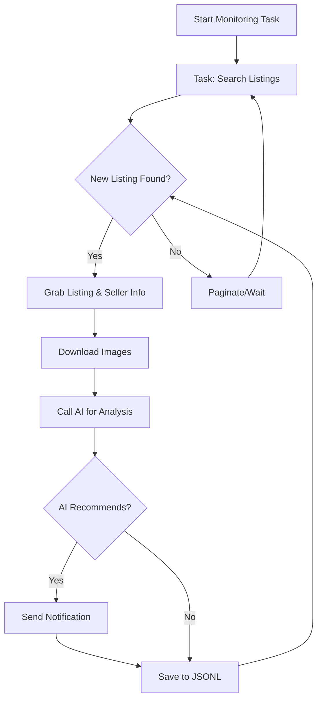

# AI-Powered Goofish (Xianyu) Monitor: Get the Best Deals with Smart Automation!

This project is a smart monitoring tool that leverages Playwright and AI to track and analyze listings on Xianyu (Goofish), a popular second-hand marketplace in China, with a user-friendly web interface.

[View the original repository](https://github.com/dingyufei615/ai-goofish-monitor)

## Key Features:

*   🔍 **Smart Monitoring**: Uses AI (like GPT-4o) to analyze listings based on your custom criteria, including text and images.
*   💻 **Web UI**:  A user-friendly web interface for easy management of tasks, AI prompt editing, and real-time log viewing.
*   💬 **AI-Driven Task Creation**: Describe your needs in natural language and let the AI create sophisticated monitoring tasks for you.
*   ⚙️ **Multi-Tasking**: Monitor multiple keywords simultaneously, with each task operating independently.
*   ⚡ **Real-time Analysis**: Instant analysis of new listings to minimize delays.
*   🔔 **Instant Notifications**: Receive alerts via ntfy.sh, WeChat Work group bots, Bark, and webhooks when a matching item is found.
*   📅 **Scheduled Tasks**: Utilize Cron expressions for automated, scheduled monitoring.
*   🐳 **Docker Support**: Quick and easy deployment with Docker Compose.
*   🛡️ **Robust Anti-Scraping**: Mimics human behavior, including random delays, to maintain stability.

## Getting Started:

Follow these steps to set up the AI-Powered Goofish Monitor.

### Prerequisites:

*   **Python 3.10+**:  Ensure you have Python 3.10 or higher installed.
*   **Git**: For cloning the repository.
*   **Docker & Docker Compose** (Recommended for deployment)

### Step 1: Clone the Repository & Install Dependencies:

```bash
git clone https://github.com/dingyufei615/ai-goofish-monitor
cd ai-goofish-monitor
pip install -r requirements.txt
```

### Step 2: Configure Environment Variables (.env):

1.  Create a `.env` file by copying `.env.example`:

    ```bash
    # Windows
    copy .env.example .env
    # Linux/MacOS
    cp .env.example .env
    ```

2.  Edit the `.env` file to configure your settings:

    | Environment Variable   | Description                                             | Required | Notes                                                                                      |
    | ---------------------- | ------------------------------------------------------- | -------- | ------------------------------------------------------------------------------------------ |
    | `OPENAI_API_KEY`       | Your AI model provider's API Key.                      | Yes      |                                                                                            |
    | `OPENAI_BASE_URL`      | AI model API base URL (OpenAI compatible).             | Yes      |                                                                                            |
    | `OPENAI_MODEL_NAME`    | Your AI model name (e.g., `doubao-seed-1-6-250615`).    | Yes      | Requires a multimodal model (capable of handling images).                                 |
    | `PROXY_URL`            | (Optional) HTTP/S proxy (e.g., `http://127.0.0.1:7890`). | No       |                                                                                            |
    | `NTFY_TOPIC_URL`       | (Optional) ntfy.sh topic URL.                          | No       |                                                                                            |
    | `GOTIFY_URL`           | (Optional) Gotify service address.                      | No       |                                                                                            |
    | `GOTIFY_TOKEN`         | (Optional) Gotify application token.                    | No       |                                                                                            |
    | `BARK_URL`             | (Optional) Bark notification URL.                      | No       |                                                                                            |
    | `WX_BOT_URL`           | (Optional) WeChat Work bot webhook URL.                | No       |                                                                                            |
    | `WEBHOOK_URL`          | (Optional) Generic Webhook URL.                         | No       |                                                                                            |
    | `WEBHOOK_METHOD`       | (Optional) Webhook method (GET or POST, default POST). | No       |                                                                                            |
    | `WEBHOOK_HEADERS`      | (Optional) Webhook custom headers (JSON).               | No       |                                                                                            |
    | `WEBHOOK_CONTENT_TYPE` | (Optional) POST content type (JSON or FORM, default JSON). | No       |                                                                                            |
    | `WEBHOOK_QUERY_PARAMETERS` | (Optional) GET query parameters (JSON).              | No       |                                                                                            |
    | `WEBHOOK_BODY`         | (Optional) POST body (JSON).                           | No       |                                                                                            |
    | `LOGIN_IS_EDGE`        | Use Edge browser for login and scraping (default false).  | No       |                                                                                            |
    | `PCURL_TO_MOBILE`      | Convert PC links to mobile links in notifications.     | No       |                                                                                            |
    | `RUN_HEADLESS`         | Run browser in headless mode (default true).           | No       | Set to `false` for local debugging if encountering CAPTCHAs.  Required `true` for Docker. |
    | `AI_DEBUG_MODE`        | Enable AI debugging mode (default false).               | No       | Prints detailed AI logs.                                                                 |
    | `SKIP_AI_ANALYSIS`     | Skip AI analysis (default false).                       | No       | Send notifications without AI analysis.                                                  |
    | `ENABLE_THINKING`      | Enable enable_thinking parameter (default false).      | No       |                                                                                            |
    | `SERVER_PORT`          | Web UI server port (default 8000).                      | No       |                                                                                            |
    | `WEB_USERNAME`         | Web UI login username (default admin).                  | No       | **IMPORTANT: Change in production.**                                                      |
    | `WEB_PASSWORD`         | Web UI login password (default admin123).                | No       | **IMPORTANT: Change to a strong password in production.**                                |

    **Troubleshooting**: If you encounter 404 errors when configuring the AI API, try testing with a service like Alibaba Cloud or Volcengine to ensure functionality.

    **Security**: The Web UI has Basic Authentication.  Change the default credentials (`admin` / `admin123`) in production!

3.  **Get Login State (Essential!)**: You need a valid login to access Xianyu. The recommended way is through the Web UI.

    1.  **Recommended: Using Web UI**:
        1.  Start the Web server in step 3.
        2.  Open the Web UI and go to **"System Settings"**.
        3.  Click the **"Manual Update"** button next to "Login State File".
        4.  Follow the instructions in the popup to install the [Xianyu login state extension](https://chromewebstore.google.com/detail/xianyu-login-state-extrac/eidlpfjiodpigmfcahkmlenhppfklcoa) in Chrome.
        5.  Log in to Xianyu in your browser, use the extension to extract your login state, and paste it into the Web UI.
    2.  **Alternative: Run Login Script (if you have a browser environment)**:

        ```bash
        python login.py
        ```

        This will open a browser window.  Scan the QR code with your Xianyu app to log in. This will generate `xianyu_state.json` in the root directory.

### Step 3: Start the Web Server:

```bash
python web_server.py
```

### Step 4: Start Monitoring!

1.  Open your web browser and go to `http://127.0.0.1:8000`.
2.  Go to the **"Task Management"** page and click **"Create New Task"**.
3.  Describe your needs in natural language (e.g., "I want a Sony A7M4 camera, 95% new or better, under 13,000 yuan, shutter count less than 5000").
4.  Fill in the task name, keywords, etc. The AI will generate the analysis criteria for you.
5.  Go back to the main page, set a schedule if required and click "Start" to begin monitoring!

## Docker Deployment (Recommended)

Docker provides a consistent, reliable deployment environment.

### Step 1: Preparation (Similar to Local Setup)

1.  **Install Docker**: Make sure Docker Engine is installed.
2.  **Clone the Project & Configure**:

    ```bash
    git clone https://github.com/dingyufei615/ai-goofish-monitor
    cd ai-goofish-monitor
    ```
3.  **Create `.env`**: Follow the instructions in Step 2 of the Local Setup to create and populate the `.env` file.
4.  **Get Login State (Crucial!)**: You MUST set the login state via the Web UI AFTER starting the Docker container:
    1.  Start the service using `docker-compose up -d`.
    2.  Open `http://127.0.0.1:8000` in your browser.
    3.  Go to **"System Settings"** and click **"Manual Update"**.
    4.  Follow the instructions to use the Xianyu login state extension (as above) to get your login state and paste it into the Web UI.

### Step 2: Run the Docker Container

Run this command in the project root:

```bash
docker-compose up --build -d
```

This starts the service in the background, using the configurations in your `.env` and `docker-compose.yaml` files.

### Step 3: Access and Manage

*   **Web UI**: Open `http://127.0.0.1:8000` in your browser.
*   **Real-time Logs**: `docker-compose logs -f`
*   **Stop Container**: `docker-compose stop`
*   **Start Container**: `docker-compose start`
*   **Stop and Remove Container**: `docker-compose down`

## Web UI Overview:

*   **Task Management**: Create tasks with AI, edit parameters, start/stop tasks, and set schedules.
*   **Result Viewing**: Browse results with visual cards, AI-driven filtering, and detailed item views.
*   **Running Logs**: View real-time logs to track progress and diagnose problems.
*   **System Settings**: Check system status, edit AI prompts, and configure the server.

## Workflow:



## Web UI Authentication:

The Web UI uses Basic Authentication.

### Configuration

Set credentials in `.env`:

```bash
WEB_USERNAME=admin
WEB_PASSWORD=admin123
```

### Default Credentials

If not set in `.env`:

*   Username: `admin`
*   Password: `admin123`

**IMPORTANT: Change the default password in production!**

### Scope

*   **Authenticated**: All API endpoints, Web UI, static resources.
*   **Unauthenticated**: Health check endpoint (`/health`).

## FAQ

Find detailed troubleshooting in [FAQ.md](FAQ.md).

## Acknowledgements

This project is built with the help of these excellent resources:

*   [superboyyy/xianyu_spider](https://github.com/superboyyy/xianyu_spider)
*   LinuxDo community
*   ClaudeCode/ModelScope/Gemini and related AI models/tools

## Disclaimer

*   Please adhere to Xianyu's terms of service.
*   This project is for educational and technical purposes.
*   Use at your own risk; the developers are not liable for any damages.
*   See [DISCLAIMER.md](DISCLAIMER.md) for full details.

[](https://star-history.com/#dingyufei615/ai-goofish-monitor&Date)