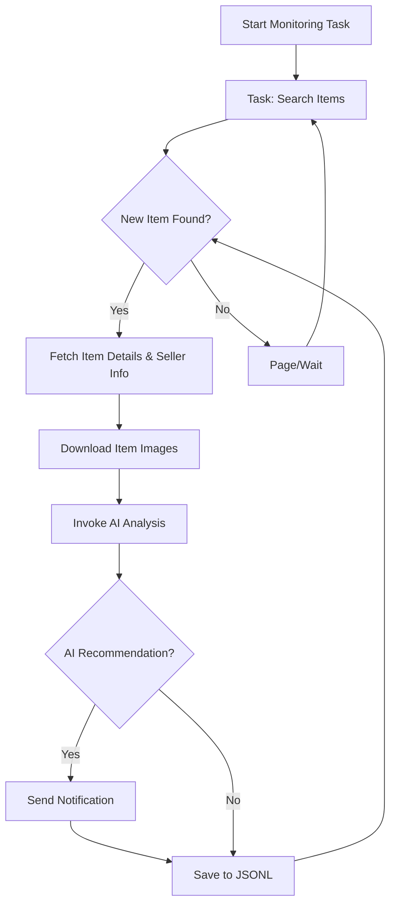

# AI-Powered Goofish (Xianyu) Monitor: Effortlessly Track and Analyze Second-Hand Goods

This project leverages Playwright and AI to create a smart monitor for the Goofish (Xianyu) marketplace, providing real-time monitoring and intelligent analysis with a user-friendly Web UI.  [View the original repository](https://github.com/dingyufei615/ai-goofish-monitor).

**Key Features:**

*   **Intuitive Web UI:** Manage tasks, edit AI criteria, view real-time logs, and browse results – all without command-line hassles.
*   **AI-Driven Task Creation:** Describe your desired purchase in natural language, and let AI generate sophisticated monitoring tasks.
*   **Concurrent Multi-Tasking:** Monitor multiple keywords simultaneously via `config.json`, with each task operating independently.
*   **Real-time Processing:** Analyze new listings instantly, eliminating batch processing delays.
*   **Deep AI Analysis:** Utilize multimodal large language models (e.g., GPT-4o) to analyze product images, descriptions, and seller profiles for precise filtering.
*   **Highly Customizable:** Configure individual keywords, price ranges, filter conditions, and AI analysis prompts for each monitoring task.
*   **Instant Notifications:** Receive immediate notifications via [ntfy.sh](https://ntfy.sh/), Enterprise WeChat group bots, and [Bark](https://bark.day.app/) to your mobile device or desktop.
*   **Scheduled Task Execution:** Employ Cron expressions to schedule independent execution for each task.
*   **One-Click Docker Deployment:** Benefit from a streamlined and standardized containerized deployment with `docker-compose`.
*   **Robust Anti-Scraping Strategies:** Simulate human behavior using random delays and user actions to enhance stability.

## Getting Started

**Recommended Approach: Web UI Setup**
The Web UI offers the best user experience for setting up and managing the project.

1.  **Environment Setup:**
    *   **Python Version:** Use Python 3.10 or higher for local development to avoid dependency issues (like `ModuleNotFoundError: No module named 'PIL'`).
    *   Clone the project:

        ```bash
        git clone https://github.com/dingyufei615/ai-goofish-monitor
        cd ai-goofish-monitor
        ```

    *   Install dependencies:

        ```bash
        pip install -r requirements.txt
        ```

2.  **Configuration:**
    *   Create a `.env` file by copying `.env.example`:

        ```bash
        # Windows
        copy .env.example .env
        # Linux/macOS
        cp .env.example .env
        ```

    *   Populate the `.env` file with your settings. Key environment variables include:

        | Variable             | Description                                                       | Required | Notes                                                                                                                             |
        | -------------------- | ----------------------------------------------------------------- | -------- | --------------------------------------------------------------------------------------------------------------------------------- |
        | `OPENAI_API_KEY`     | Your AI model provider's API key.                                  | Yes      |                                                                                                                                   |
        | `OPENAI_BASE_URL`    | AI model API endpoint (OpenAI format compatible).                   | Yes      |                                                                                                                                   |
        | `OPENAI_MODEL_NAME`  | Name of the multimodal model to use (e.g., `doubao-seed-1-6-250615`, `gemini-2.5-pro`). | Yes      | **Important:** Must be a multimodal model.                                                                                         |
        | `PROXY_URL`          | (Optional) HTTP/S proxy for internet access.                       | No       | Supports `http://` and `socks5://` formats.                                                                                      |
        | `NTFY_TOPIC_URL`     | (Optional) [ntfy.sh](https://ntfy.sh/) topic URL for notifications. | No       |                                                                                                                                   |
        | `GOTIFY_URL`         | (Optional) Gotify server address.                                  | No       |                                                                                                                                   |
        | `GOTIFY_TOKEN`       | (Optional) Gotify app token.                                         | No       |                                                                                                                                   |
        | `BARK_URL`           | (Optional) [Bark](https://bark.day.app/) push address.           | No       |                                                                                                                                   |
        | `WX_BOT_URL`         | (Optional) Enterprise WeChat bot webhook URL.                     | No       | Ensure URLs in the `.env` file are enclosed in double quotes.                                                                      |
        | `WEBHOOK_URL`        | (Optional) Generic Webhook URL.                                    | No       |                                                                                                                                   |
        | `WEBHOOK_METHOD`     | (Optional) Webhook request method (GET or POST).                     | No       | Defaults to POST.                                                                                                                 |
        | `WEBHOOK_HEADERS`    | (Optional) Webhook custom headers (JSON string).                    | No       | Example: `'{"Authorization": "Bearer xxx"}'`                                                                                       |
        | `WEBHOOK_CONTENT_TYPE` | (Optional) POST request content type (JSON or FORM).             | No       | Defaults to JSON.                                                                                                               |
        | `WEBHOOK_QUERY_PARAMETERS` | (Optional) GET request query parameters (JSON string).           | No       | Supports `{{title}}` and `{{content}}` placeholders.                                                                                |
        | `WEBHOOK_BODY`       | (Optional) POST request body (JSON string).                      | No       | Supports `{{title}}` and `{{content}}` placeholders.                                                                                |
        | `LOGIN_IS_EDGE`      | Use Edge browser for login and scraping.                            | No       | Defaults to `false` (Chrome/Chromium).                                                                                              |
        | `PCURL_TO_MOBILE`    | Convert PC product links to mobile versions in notifications.        | No       | Defaults to `true`.                                                                                                                |
        | `RUN_HEADLESS`       | Run the browser in headless mode.                                 | No       | Defaults to `true`. Set to `false` for local debugging, especially for handling CAPTCHAs. **Must be `true` for Docker deployments.** |
        | `AI_DEBUG_MODE`      | Enable AI debugging mode.                                         | No       | Defaults to `false`.                                                                                                               |
        | `SKIP_AI_ANALYSIS`   | Skip AI analysis and send notifications directly.                  | No       | Defaults to `false`.                                                                                                               |
        | `ENABLE_THINKING`    | Enable the `enable_thinking` parameter for the AI model.             | No       | Defaults to `false`.  May be required by some AI models.  If you encounter "Invalid JSON payload received. Unknown name "enable_thinking"", try setting to `false`. |
        | `SERVER_PORT`        | Web UI service port.                                                | No       | Defaults to `8000`.                                                                                                                |
        | `WEB_USERNAME`       | Web UI login username.                                              | No       | Defaults to `admin`.  **Change in production!**                                                                                   |
        | `WEB_PASSWORD`       | Web UI login password.                                              | No       | Defaults to `admin123`.  **Change to a strong password in production!**                                                            |

    *   **Important:**  Test your AI API configuration with a service like AliCloud or VolcEngine to verify basic functionality before proceeding.

    *   **Security:** The Web UI uses Basic Authentication.  Change the default username/password (`admin`/`admin123`) in production.

3.  **Login Credentials:**
    *   **Recommended:**  Use the Web UI to set login state:
        1.  Start the Web service (see Step 3).
        2.  Access the Web UI and navigate to "System Settings".
        3.  Click the "Manually Update" button under "Login State File".
        4.  Follow the instructions in the popup:
            *   Install the [Xianyu Login State Extraction Extension](https://chromewebstore.google.com/detail/xianyu-login-state-extrac/eidlpfjiodpigmfcahkmlenhppfklcoa) in Chrome.
            *   Log in to Xianyu on the website.
            *   Click the extension icon and then the "Extract Login State" button.
            *   Copy the extracted state and paste it into the Web UI.

    *   **Alternative:** If you can run a program locally, you can use `login.py`:

        ```bash
        python login.py
        ```

        This will open a browser window; scan the QR code with the Xianyu app to log in. This will generate an `xianyu_state.json` file.

4.  **Start the Web Server:**

    ```bash
    python web_server.py
    ```

5.  **Get Started:**

    1.  Open your browser and go to `http://127.0.0.1:8000`.
    2.  In the "Task Management" section, click "Create New Task".
    3.  Describe your desired product (e.g., "Looking for a Sony A7M4 camera, mint condition, under 13000 RMB, shutter count below 5000").
    4.  Enter a task name and keywords, and click "Create". AI will generate the criteria.
    5.  Start your task (set a schedule or run it immediately).

## Docker Deployment (Recommended)

Deploy the application using Docker for portability and ease of management.

1.  **Prerequisites:**
    *   Install [Docker Engine](https://docs.docker.com/engine/install/).
    *   Clone the project and configure your `.env` file as described in the **Getting Started** section.

2.  **Login Credentials (Critical!):**  You must use the Web UI to set the login state *after* the container is running:
    1.  Run `docker-compose up -d` to start the services.
    2.  Open your browser and visit `http://127.0.0.1:8000`.
    3.  Go to "System Settings".
    4.  Click "Manually Update" and follow the instructions (install extension, log in on Xianyu, get login state, paste to UI).

    >   **Note:** Docker containers cannot perform QR code login directly.

3.  **Run the Docker Container:**

    ```bash
    docker-compose up --build -d
    ```

4.  **Access and Manage:**

    *   **Web UI:** `http://127.0.0.1:8000`
    *   **Real-time logs:** `docker-compose logs -f`
    *   **Stop the container:** `docker-compose stop`
    *   **Start the container:** `docker-compose start`
    *   **Stop and remove:** `docker-compose down`

## Web UI Functionality

*   **Task Management:**
    *   AI-powered task creation: Generate tasks based on natural language descriptions.
    *   Visualize editing, start/stop/delete tasks
    *   Schedule tasks using Cron expressions.
*   **Result Viewing:**
    *   Card-based browsing of matching items.
    *   Smart filtering to view AI-recommended items.
    *   Detailed view with all data and AI analysis.
*   **Running Logs:**
    *   Real-time logging.
    *   Log management: refresh, auto-refresh, and clear.
*   **System Settings:**
    *   Dependency and login status checks.
    *   Prompt editing within the UI.

## Workflow Diagram



## Authentication

The Web UI implements Basic Authentication to control access.

*   **Configuration:** Set `WEB_USERNAME` and `WEB_PASSWORD` in `.env`.
*   **Defaults:** Username: `admin`, Password: `admin123` (Change in production!)
*   **Scope:** All API endpoints, Web UI and static resources.
*   **Exempt:** `/health` endpoint.
*   **Usage:** Browser access requires a login dialog. API calls must include Basic authentication headers.

See [AUTH_README.md](AUTH_README.md) for more details.

## FAQ

Find answers to common questions about setup, AI configuration, and anti-scraping in [FAQ.md](FAQ.md).

## Acknowledgements

This project builds upon the work of [superboyyy/xianyu_spider](https://github.com/superboyyy/xianyu_spider) and the contributions from the LinuxDo community, and thanks to ClaudeCode/ModelScope/Gemini and other models/tools.

## Important Notes

*   Adhere to Xianyu's terms of service and `robots.txt` rules. Avoid excessive requests.
*   This project is for educational purposes only.
*   It's released under the [MIT License](LICENSE).
*   The author and contributors are not liable for any damages.
*   See [DISCLAIMER.md](DISCLAIMER.md) for more details.

[](https://star-history.com/#dingyufei615/ai-goofish-monitor&Date)