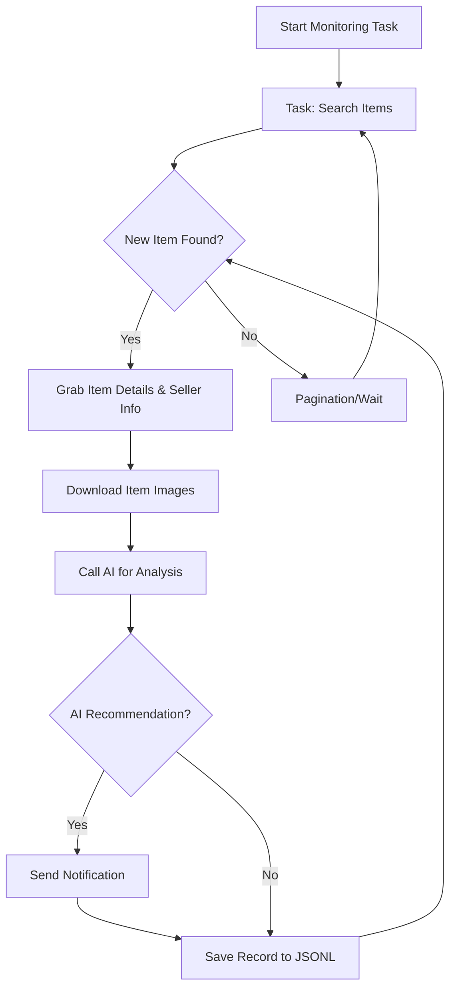

# AI-Powered Goofish (Xianyu) Monitor: Effortlessly Track and Analyze Secondhand Goods

**Keep up to date on the latest deals on Xianyu (Goofish) with this AI-powered monitoring tool, complete with a user-friendly web interface.**  [View the original repo](https://github.com/dingyufei615/ai-goofish-monitor)

## Key Features:

*   🎯 **AI-Driven Task Creation:** Simply describe your desired item in natural language, and the system will create a monitoring task with complex filtering logic.
*   🖥️ **Web UI for Easy Management:** Manage tasks, view real-time logs, filter results, and edit AI criteria all from a user-friendly web interface.
*   🤖 **Multi-Tasking:** Monitor multiple keywords simultaneously with independent tasks, without interference.
*   ⚡ **Real-time Processing:** Analyze new listings instantly to avoid delays.
*   🧠 **Deep AI Analysis:** Utilizes multimodal large language models (e.g., GPT-4o) to analyze item descriptions, images, and seller profiles for precise filtering.
*   ⚙️ **Highly Customizable:** Configure individual keywords, price ranges, filters, and AI analysis prompts for each task.
*   🔔 **Instant Notifications:** Receive alerts on your phone or desktop via [ntfy.sh](https://ntfy.sh/), Enterprise WeChat group bots, and [Bark](https://bark.day.app/).
*   📅 **Scheduled Tasks:** Schedule tasks using Cron expressions.
*   🐳 **Docker Deployment:** Deploy quickly and reliably with the provided `docker-compose` configuration.
*   🛡️ **Robust Anti-Scraping:** Employs human-like actions and random delays to enhance stability and avoid detection.

## Core Functionality - Workflow



## Getting Started

### Prerequisites

*   **Python:** Python 3.10 or higher is recommended for local development.

### 1. Clone the Repository

```bash
git clone https://github.com/dingyufei615/ai-goofish-monitor
cd ai-goofish-monitor
```

### 2. Install Dependencies

```bash
pip install -r requirements.txt
```

### 3. Configure Environment Variables (.env)

1.  Copy `.env.example` to `.env`:

    *   **Windows:** `copy .env.example .env`
    *   **Linux/MacOS:** `cp .env.example .env`

2.  Edit the `.env` file with the necessary configurations.  **Required configurations include:**

    *   `OPENAI_API_KEY`: Your AI model service API key.
    *   `OPENAI_BASE_URL`: The API base URL (compatible with OpenAI format).
    *   `OPENAI_MODEL_NAME`: The name of the multimodal model you will be using (e.g.  `doubao-seed-1-6-250615`,  `gemini-2.5-pro`).

    **Important:**  Configure the Web UI Username (`WEB_USERNAME`) and Password (`WEB_PASSWORD`) in the .env file, and make sure they are unique.

### 4. Get Login Credentials (Essential)

Obtain valid login credentials to access Xianyu. The recommended way is through the Web UI:

1.  Start the web server (as described in step 3 below).
2.  Access the Web UI at `http://127.0.0.1:8000`.
3.  Go to the "System Settings" page.
4.  Click the "Manual Update" button for the "Login Status File".
5.  Follow the instructions in the pop-up window:
    *   Install the [Xianyu Login State Extractor](https://chromewebstore.google.com/detail/xianyu-login-state-extrac/eidlpfjiodpigmfcahkmlenhppfklcoa) Chrome extension.
    *   Open and log in to Xianyu in Chrome.
    *   Click the extension icon and select "Extract Login State".
    *   Click "Copy to Clipboard."
    *   Paste the copied content into the Web UI and save.

**Alternative (for local development):** Run `python login.py` (requires a graphical environment) to log in via QR code and generate the `xianyu_state.json` file.

### 5. Start the Web Service

```bash
python web_server.py
```

### 6. Use the Web UI

1.  Open your web browser and go to `http://127.0.0.1:8000`.
2.  Log into the Web UI using the credentials specified in the .env file.
3.  In the "Task Management" section, click "Create New Task".
4.  Describe your desired item in natural language, and provide a task name and keywords.
5.  Click "Create" and the AI will generate an appropriate monitoring task.
6.  Start the task to begin automated monitoring.

## 🐳 Docker Deployment (Recommended)

### 1. Docker Setup

1.  **Install Docker** (if you haven't already).
2.  **Clone the Repository:**
    ```bash
    git clone https://github.com/dingyufei615/ai-goofish-monitor
    cd ai-goofish-monitor
    ```
3.  **Create the .env file** (as described above).
4.  **Get Login Credentials** (as described above).  **Important:** Complete the login via the Web UI after the Docker container is running, by accessing the UI at http://127.0.0.1:8000 and using the login method described earlier.

### 2. Build and Run with Docker Compose

```bash
docker-compose up --build -d
```

### 3. Access and Manage

*   **Web UI:** `http://127.0.0.1:8000`
*   **View Logs:** `docker-compose logs -f`
*   **Stop Container:** `docker-compose stop`
*   **Start Stopped Container:** `docker-compose start`
*   **Stop and Remove Container:** `docker-compose down`

## Web UI Functionality

*   **Task Management:** AI-powered task creation, visual editing and control, and cron job scheduling.
*   **Result Viewing:** Card-based display of matching items, smart filtering and sorting, and detailed item data.
*   **Real-time Logs:** Monitor progress and troubleshoot issues.
*   **System Settings:** Configuration of .env settings, login status, and AI prompt editing.

## Security

*   The web interface uses Basic Authentication.
*   **Change the default username and password in the .env file (WEB_USERNAME & WEB_PASSWORD) for security!**
*   Protect your instance with HTTPS in production.
*   Restrict access to the web interface via firewall rules.

## FAQ

Comprehensive answers to common questions, from environment setup to anti-scraping strategies, are available in [FAQ.md](FAQ.md).

## Acknowledgements

This project leverages work from other open-source projects including [superboyyy/xianyu_spider](https://github.com/superboyyy/xianyu_spider), the LinuxDo community, and AI models from providers like ClaudeCode, ModelScope, and Gemini.

## Disclaimer

*   Please adhere to Xianyu's terms of service.
*   Use this project for educational and technical purposes only.
*   The project is provided "as is" under the [MIT License](LICENSE).
*   The developers are not liable for any damages resulting from the use of this software.
*   See [DISCLAIMER.md](DISCLAIMER.md) for more details.

[](https://star-history.com/#dingyufei615/ai-goofish-monitor&Date)