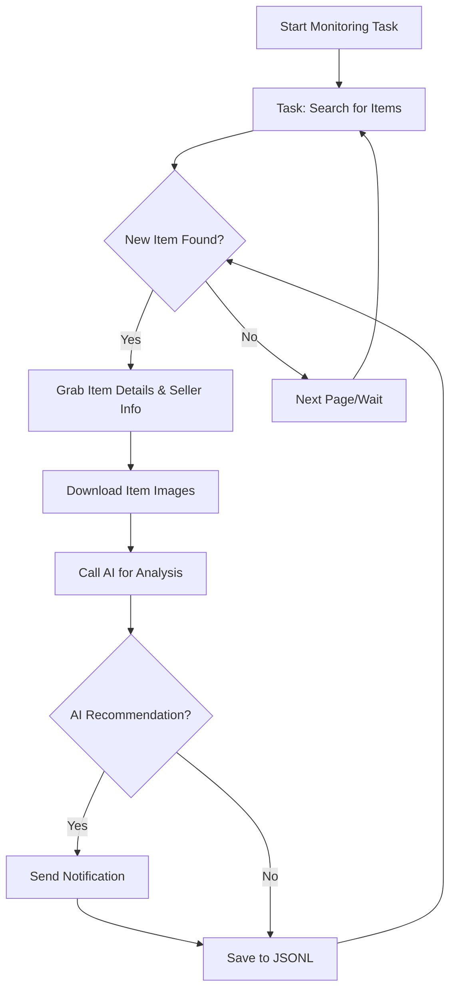

# AI-Powered Goofish (闲鱼) Monitor: Real-time Smart Item Tracking

**Tired of missing out on great deals?**  This AI-powered tool utilizes Playwright and advanced AI to intelligently monitor Goofish (闲鱼) for desired items, providing real-time alerts and a user-friendly web interface for comprehensive management.  [Visit the original repository](https://github.com/dingyufei615/ai-goofish-monitor) for more details.

## Key Features

*   ✅ **Intuitive Web UI:** Manage tasks visually, edit AI analysis criteria, view logs, and filter results without command-line fuss.
*   🤖 **AI-Driven Task Creation:** Describe your desired item in natural language, and the AI will generate a complex monitoring task.
*   🔄 **Concurrent Multi-Tasking:** Monitor multiple keywords simultaneously through `config.json`, with each task running independently.
*   ⚡️ **Real-time Stream Processing:**  Receive instant analysis and alerts upon new item discoveries, eliminating batch processing delays.
*   🧠 **Deep AI Analysis:** Leverages multimodal large language models (like GPT-4o) to analyze item descriptions, images, and seller profiles for accurate filtering.
*   ⚙️ **Highly Customizable:** Configure keywords, price ranges, filters, and AI analysis prompts for each monitoring task individually.
*   🔔 **Instant Notifications:** Get notified via [ntfy.sh](https://ntfy.sh/), WeChat group bots, and [Bark](https://bark.day.app/) for instant alerts on your phone or desktop.
*   ⏰ **Scheduled Task Execution:** Set up automated runs using Cron expressions for each task.
*   🐳 **Dockerized Deployment:**  Simplified deployment with `docker-compose` for quick and standardized containerization.
*   🛡️ **Robust Anti-Scraping:** Employs simulated human behavior with random delays to enhance stability.

## Key Features Illustrated

*   **Task Management:** Easily create, configure, and manage your monitoring tasks via the web interface.
*   **AI-Powered Recommendations:** AI analysis identifies promising items, making it easier to find what you're looking for.
*   **Notification Examples:** Receive immediate alerts on your preferred notification channels to act fast.

## 🚀 Getting Started (Web UI Recommended)

The Web UI offers the best user experience for this project.

### Step 1: Environment Setup

> ⚠️ **Python Version Requirement:** Python 3.10 or higher is recommended for local development and debugging.  Older versions may cause dependency installation failures or runtime errors (e.g., `ModuleNotFoundError: No module named 'PIL'`).

1.  **Clone the Repository:**

    ```bash
    git clone https://github.com/dingyufei615/ai-goofish-monitor
    cd ai-goofish-monitor
    ```

2.  **Install Dependencies:**

    ```bash
    pip install -r requirements.txt
    ```

### Step 2: Configuration

1.  **Configure Environment Variables:**  Copy `.env.example` to `.env` and edit the values.

    *   **Windows:**

        ```cmd
        copy .env.example .env
        ```

    *   **Linux/macOS:**

        ```bash
        cp .env.example .env
        ```

    | Environment Variable     | Description                                                    | Required? | Notes                                                                                                                                                              |
    | :----------------------- | :------------------------------------------------------------- | :-------- | :----------------------------------------------------------------------------------------------------------------------------------------------------------------- |
    | `OPENAI_API_KEY`         | Your AI model provider's API key.                              | Yes       | May be optional for local or proxy services.                                                                                                                    |
    | `OPENAI_BASE_URL`        | The API endpoint for your AI model, must be OpenAI-compatible. | Yes       | Fill in the base path of the API, e.g., `https://ark.cn-beijing.volces.com/api/v3/`.                                                                           |
    | `OPENAI_MODEL_NAME`      | The specific model name you want to use.                       | Yes       | **Required** Choose a multimodal model supporting image analysis, e.g., `doubao-seed-1-6-250615`, `gemini-2.5-pro`.                                                   |
    | `PROXY_URL`              | (Optional) HTTP/S proxy for bypassing network restrictions.      | No        | Supports `http://` and `socks5://` formats.  Example: `http://127.0.0.1:7890`.                                                                                     |
    | `NTFY_TOPIC_URL`         | (Optional) [ntfy.sh](https://ntfy.sh/) topic URL for notifications. | No        | Leave empty to disable ntfy notifications.                                                                                                                     |
    | `GOTIFY_URL`             | (Optional) Gotify service address.                             | No        | Example: `https://push.example.de`.                                                                                                                             |
    | `GOTIFY_TOKEN`           | (Optional) Gotify application token.                           | No        |                                                                                                                                                                 |
    | `BARK_URL`               | (Optional) [Bark](https://bark.day.app/) push address.          | No        | Example: `https://api.day.app/your_key`. Leave empty to disable Bark notifications.                                                                              |
    | `WX_BOT_URL`             | (Optional) WeChat group bot webhook address.                  | No        | Leave empty to disable WeChat notifications.                                                                                                                     |
    | `WEBHOOK_URL`            | (Optional) General webhook URL.                                | No        | Leave empty to disable generic webhook notifications.                                                                                                              |
    | `WEBHOOK_METHOD`         | (Optional) Webhook request method.                            | No        | Supports `GET` or `POST`, defaults to `POST`.                                                                                                                      |
    | `WEBHOOK_HEADERS`        | (Optional) Custom headers for webhook requests.               | No        | Must be a valid JSON string, e.g., `'{"Authorization": "Bearer xxx"}'`.                                                                                       |
    | `WEBHOOK_CONTENT_TYPE`   | (Optional) POST request content type.                         | No        | Supports `JSON` or `FORM`, defaults to `JSON`.                                                                                                                   |
    | `WEBHOOK_QUERY_PARAMETERS` | (Optional) Query parameters for GET requests.                  | No        | JSON string, supports `{{title}}` and `{{content}}` placeholders.                                                                                               |
    | `WEBHOOK_BODY`           | (Optional) POST request body.                                  | No        | JSON string, supports `{{title}}` and `{{content}}` placeholders.                                                                                               |
    | `LOGIN_IS_EDGE`          | Whether to use the Edge browser for login and scraping.       | No        | Defaults to `false`, using Chrome/Chromium.                                                                                                                     |
    | `PCURL_TO_MOBILE`        | Whether to convert computer links to mobile links in the notifications. | No        | Defaults to `true`.                                                                                                                                        |
    | `RUN_HEADLESS`           | Whether to run the crawler browser in headless mode.          | No        | Defaults to `true`. Set to `false` during local debugging when encountering CAPTCHAs. **Must be `true` for Docker deployments.**                                |
    | `AI_DEBUG_MODE`          | Whether to enable AI debugging mode.                         | No        | Defaults to `false`. When enabled, detailed AI request and response logs are printed to the console.                                                             |
    | `SERVER_PORT`            | The port the Web UI service runs on.                          | No        | Defaults to `8000`.                                                                                                                                            |
    | `WEB_USERNAME`           | Web UI login username.                                        | No        | Defaults to `admin`.  **Change this in production!**                                                                                                              |
    | `WEB_PASSWORD`           | Web UI login password.                                        | No        | Defaults to `admin123`. **Change this to a strong password in production!**                                                                                          |

    > 💡 **Debugging Tip:** If you encounter 404 errors when configuring the AI API, try using the APIs provided by AliCloud or VolcEngine for debugging.  Ensure basic functionality is working before trying other providers, as some may have compatibility issues or require specific configurations.

    > 🔐 **Security Reminder:** The Web interface uses Basic Authentication.  The default username/password is `admin` / `admin123`. **Change this to a strong password in production!**

2.  **Get Login Status (IMPORTANT!)**: The crawler requires valid login credentials to access Goofish. We recommend using the Web UI to obtain these credentials.

    **Recommended Method:  Web UI Update**

    1.  Skip this step and start the Web service in Step 3.
    2.  Access the "System Settings" page in the Web UI.
    3.  Click the "Manually Update" button next to the "Login Status File" setting.
    4.  Follow the instructions in the pop-up:
        *   Install the [Goofish login status extraction extension](https://chromewebstore.google.com/detail/xianyu-login-state-extrac/eidlpfjiodpigmfcahkmlenhppfklcoa) in your Chrome browser.
        *   Log in to the Goofish website.
        *   After a successful login, click the extension icon in your browser toolbar.
        *   Click the "Extract Login Status" button.
        *   Click the "Copy to Clipboard" button.
        *   Paste the copied content into the Web UI and save it.

    This method avoids running a GUI program on the server, making it the most convenient option.

    **Alternative Method: Run Login Script**

    If you can run programs locally or on a server with a desktop environment, you can use this script:

    ```bash
    python login.py
    ```

    This will open a browser window; scan the QR code with your **Goofish app** to log in.  The program will close automatically, and a `xianyu_state.json` file will be generated in the project root.

### Step 3: Start the Web Server

Once set up, start the Web UI server:

```bash
python web_server.py
```

### Step 4: Start Monitoring

1.  Open `http://127.0.0.1:8000` in your browser to access the Web UI.
2.  Go to **"Task Management"** and click **"Create New Task."**
3.  Describe your desired item using natural language (e.g., "I want to buy a Sony A7M4 camera, 95% new or better, budget under 13000 yuan, shutter count below 5000").  Enter a task name and keywords.
4.  Click "Create" and the AI will generate the analysis criteria.
5.  Go back to the main interface, schedule the task or click start to begin automated monitoring!

## 🐳 Docker Deployment (Recommended)

Docker simplifies deployment by packaging the application and dependencies into a standard unit.

### Step 1: Environment Setup (Similar to Local Deployment)

1.  **Install Docker:** Make sure [Docker Engine](https://docs.docker.com/engine/install/) is installed.

2.  **Clone the Project and Configure:**

    ```bash
    git clone https://github.com/dingyufei615/ai-goofish-monitor
    cd ai-goofish-monitor
    ```

3.  **Create the `.env` file:**  Follow the instructions in the **[Getting Started](#-getting-started-web-ui-recommended)** section and create and populate the `.env` file.

4.  **Get Login Status (Critical Step!)**: The login process by scanning QR code is not supported inside the docker container.
    1.  Run `docker-compose up -d` (on the host machine) to start the service.
    2.  Open `http://127.0.0.1:8000` in your browser to access the Web UI.
    3.  Go to the "System Settings" page.
    4.  Click the "Manually Update" button next to the "Login Status File" setting.
    5.  Follow the instructions in the pop-up:
        *   Install the [Goofish login status extraction extension](https://chromewebstore.google.com/detail/xianyu-login-state-extrac/eidlpfjiodpigmfcahkmlenhppfklcoa) in your Chrome browser.
        *   Log in to the Goofish website.
        *   After a successful login, click the extension icon in your browser toolbar.
        *   Click the "Extract Login Status" button.
        *   Click the "Copy to Clipboard" button.
        *   Paste the copied content into the Web UI and save it.

> ℹ️ **About Python Version:** When deployed using Docker, the project utilizes the Python 3.11 version specified in the Dockerfile, so you don't have to worry about local Python version compatibility issues.

### Step 2: Run the Docker Container

The project includes a `docker-compose.yaml` file.  Use `docker-compose` for easier container management.

Run this command in the project's root directory:

```bash
docker-compose up --build -d
```

This starts the service in the background.  `docker-compose` automatically reads the `.env` and `docker-compose.yaml` files to create and start the container.

If there are network issues inside the container, troubleshoot or use a proxy.

> ⚠️ **OpenWrt Deployment Notes:** If deploying on an OpenWrt router, you might encounter DNS resolution problems. This is because the default network created by Docker Compose might not inherit the OpenWrt DNS settings correctly.  If you encounter an `ERR_CONNECTION_REFUSED` error, check your container's network configuration; you may need to manually configure DNS or adjust the network mode to ensure the container can access the external network.

### Step 3: Access and Manage

*   **Access Web UI:** Open `http://127.0.0.1:8000` in your browser.
*   **View Real-time Logs:** `docker-compose logs -f`
*   **Stop Container:** `docker-compose stop`
*   **Start Stopped Container:** `docker-compose start`
*   **Stop and Remove Container:** `docker-compose down`

## 📸 Web UI Feature Overview

*   **Task Management:**
    *   **AI-Driven Task Creation:** Generate monitoring tasks with AI by describing your requirements in natural language, including AI analysis criteria.
    *   **Visual Editing and Control:** Modify task parameters (keywords, prices, schedules) directly in a table and control the status of each task.
    *   **Scheduled Execution:** Configure Cron expressions for automated runs.
*   **Result Viewing:**
    *   **Card-Based Browsing:** Clearly display items with images and details.
    *   **Smart Filtering and Sorting:** Filter results, filter all the recommended items and sort by the time.
    *   **Deep Detail:** View complete item data and detailed AI analysis in JSON format.
*   **Runtime Logs:**
    *   **Real-time Log Stream:** View detailed crawler logs for monitoring.
    *   **Log Management:** Supports automatic refresh, manual refresh, and one-click log clearing.
*   **System Settings:**
    *   **Status Check:** Verify key dependencies and settings, including your .env configuration and login status.
    *   **Prompt Editing:** Edit and save the AI analysis prompt directly in the web interface, and modify the analysis logic.

## 🚀 Workflow

The diagram below demonstrates the core process of a single monitoring task.



## 🔐 Web UI Authentication

### Authentication Configuration

The Web UI uses Basic Authentication for access control.

#### Configuration Method

Set authentication credentials in the `.env` file:

```bash
# Web Service Authentication Configuration
WEB_USERNAME=admin
WEB_PASSWORD=admin123
```

#### Default Credentials

If no credentials are set in `.env`, the system uses these defaults:

*   Username: `admin`
*   Password: `admin123`

**⚠️ Important: Change the default password in production!**

#### Authentication Scope

*   **Requires Authentication:** All API endpoints, Web interface, static resources.
*   **No Authentication Required:** Health check endpoint (`/health`).

#### Usage

1.  **Browser Access:** The browser will prompt for authentication when accessing the Web UI.
2.  **API Calls:** Include Basic Authentication information in the request headers.
3.  **Frontend JavaScript:** Authentication is handled automatically, no code changes are needed.

#### Security Recommendations

1.  Change the default password to a strong password.
2.  Use HTTPS in production.
3.  Change authentication credentials periodically.
4.  Use a firewall to restrict IP address access.

For more details, see the [AUTH_README.md](AUTH_README.md) file.

## Frequently Asked Questions (FAQ)

Find answers to common questions, from environment setup to anti-scraping measures, in the FAQ.

👉 **[Click here to view the Frequently Asked Questions (FAQ.md)](FAQ.md)**

## Acknowledgements

This project draws inspiration from these projects:

-   [superboyyy/xianyu_spider](https://github.com/superboyyy/xianyu_spider)

and contributions from LinuxDo community members.

-   [@jooooody](https://linux.do/u/jooooody/summary)

And thanks to Aider and Gemini for making code writing feel so efficient!

## Support & Sponsoring

If this project is helpful to you, please consider supporting the author!

<table>
  <tr>
    <td></td>
    <td></td>
  </tr>
</table>

## ⚠️ Important Notes

*   Comply with Goofish's terms of service and `robots.txt` rules. Avoid excessive requests to prevent server load or account restrictions.
*   This project is for educational and technical research purposes only and should not be used for illegal activities.
*   The project is released under the [MIT License](LICENSE) "as is" without warranties.
*   The project author and contributors are not liable for any direct, indirect, incidental, or special damages resulting from using this software.
*   See the [DISCLAIMER.md](DISCLAIMER.md) file for additional information.

[](https://star-history.com/#dingyufei615/ai-goofish-monitor&Date)