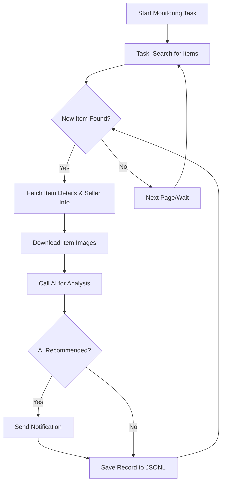

# AI-Powered Goofish (Xianyu) Monitor: Effortlessly Track & Analyze Used Goods with AI 🤖

**Tired of missing out on the best deals?**  This AI-powered monitor uses Playwright and AI to intelligently track and analyze used goods on the Goofish (Xianyu) platform, providing real-time alerts and a user-friendly web interface.  [View the original repo](https://github.com/dingyufei615/ai-goofish-monitor).

## Key Features:

*   ✅ **Intuitive Web UI:** Manage tasks, edit AI criteria, view logs, and filter results without coding.
*   💬 **AI-Driven Task Creation:**  Simply describe what you want to buy in natural language, and let AI create your monitoring task.
*   🚦 **Concurrent Monitoring:**  Monitor multiple keywords simultaneously with independent tasks, defined in `config.json`.
*   ⚡ **Real-time Processing:**  Receive instant analysis and notifications when new items are found.
*   🧠 **Deep AI Analysis:** Integrates multimodal LLMs (e.g., GPT-4o) to analyze images, text, and seller profiles for precise filtering.
*   ⚙️ **Highly Customizable:**  Configure individual keywords, price ranges, filters, and AI prompts for each task.
*   🔔 **Instant Notifications:** Get notified via ntfy.sh, WeChat group robots, and Bark.
*   📅 **Scheduled Tasks:**  Utilize cron expressions for automated task execution.
*   🐳 **Docker Ready:** One-click deployment with Docker Compose for quick and standardized setup.
*   🛡️ **Robust Anti-Scraping:** Mimics human behavior with randomized delays and actions to maintain stability.

## Screenshots:

*   **Task Management:**
    
*   **Monitoring Interface:**
    
*   **Notification Example:**
    

## Quick Start (Web UI Recommended):

The Web UI offers the best experience and is the recommended way to use this project.

### Step 1: Prerequisites

> ⚠️ **Python Version:**  Requires Python 3.10 or higher for local debugging to avoid dependency issues like `ModuleNotFoundError: No module named 'PIL'`.

1.  **Clone the repository:**

    ```bash
    git clone https://github.com/dingyufei615/ai-goofish-monitor
    cd ai-goofish-monitor
    ```

2.  **Install dependencies:**

    ```bash
    pip install -r requirements.txt
    ```

### Step 2: Configuration

1.  **Configure Environment Variables:** Copy `.env.example` to `.env` and customize the settings.

    *   **Windows:**

        ```cmd
        copy .env.example .env
        ```

    *   **Linux/MacOS:**

        ```bash
        cp .env.example .env
        ```

    Environment Variables:

    | Variable              | Description                                  | Required | Notes                                                                                        |
    | :-------------------- | :------------------------------------------- | :------- | :------------------------------------------------------------------------------------------- |
    | `OPENAI_API_KEY`      | Your AI model provider's API key.            | Yes      |                                                                                              |
    | `OPENAI_BASE_URL`     | API endpoint compatible with OpenAI format.  | Yes      | e.g., `https://ark.cn-beijing.volces.com/api/v3/`                                            |
    | `OPENAI_MODEL_NAME`   | The specific multimodal model to use.       | Yes      | **REQUIRED**: Choose a model that supports image analysis, e.g., `doubao-seed-1-6-250615`. |
    | `PROXY_URL`           | (Optional) HTTP/S proxy for bypassing firewalls. | No       | Supports `http://` and `socks5://` formats.                                                  |
    | `NTFY_TOPIC_URL`      | (Optional) ntfy.sh topic URL for notifications.     | No       |                                                                                              |
    | `GOTIFY_URL`          | (Optional) Gotify server address.              | No       | e.g., `https://push.example.de`                                                             |
    | `GOTIFY_TOKEN`        | (Optional) Gotify application token.           | No       |                                                                                              |
    | `BARK_URL`            | (Optional) Bark notification URL.            | No       | e.g., `https://api.day.app/your_key`                                                         |
    | `WX_BOT_URL`          | (Optional) WeChat group bot webhook.       | No       | Ensure the URL is enclosed in double quotes in `.env`.                                       |
    | `WEBHOOK_URL`         | (Optional) General Webhook URL.              | No       |                                                                                              |
    | `WEBHOOK_METHOD`      | (Optional) Webhook request method.          | No       | Defaults to `POST`.                                                                          |
    | `WEBHOOK_HEADERS`     | (Optional) Custom webhook headers (JSON).  | No       | e.g., `'{"Authorization": "Bearer xxx"}'`                                                   |
    | `WEBHOOK_CONTENT_TYPE` | (Optional) POST content type.              | No       | Defaults to `JSON`.                                                                          |
    | `WEBHOOK_QUERY_PARAMETERS` | (Optional) GET query parameters (JSON).    | No       | Supports `{{title}}` and `{{content}}` placeholders.                                       |
    | `WEBHOOK_BODY`          | (Optional) POST request body (JSON).       | No       | Supports `{{title}}` and `{{content}}` placeholders.                                       |
    | `LOGIN_IS_EDGE`       | Use Edge browser for login and scraping.     | No       | Defaults to `false` (Chrome/Chromium).                                                      |
    | `PCURL_TO_MOBILE`     | Convert PC links to mobile links in notifications. | No       | Defaults to `true`.                                                                         |
    | `RUN_HEADLESS`        | Run the browser in headless mode.          | No       | Defaults to `true`.  Set to `false` for local debugging with CAPTCHAs.  **MUST be `true` for Docker.** |
    | `AI_DEBUG_MODE`       | Enable AI debugging mode.                   | No       | Defaults to `false`.  Prints detailed AI request/response logs.                               |
    | `SKIP_AI_ANALYSIS`    | Skip AI analysis and send notifications directly. | No       | Defaults to `false`.                                                                      |
    | `ENABLE_THINKING`      | Enable `enable_thinking` parameter for AI models. | No       | Defaults to `false`.  May be needed/unsupported by specific models.                          |
    | `SERVER_PORT`         | Web UI service port.                         | No       | Defaults to `8000`.                                                                           |
    | `WEB_USERNAME`        | Web UI login username.                      | No       | Defaults to `admin`. **Change in production.**                                                |
    | `WEB_PASSWORD`        | Web UI login password.                      | No       | Defaults to `admin123`. **Change to a strong password in production!**                        |

    > 💡 **Debugging Tip:**  If you get a 404 error when configuring the AI API, test with an API like Alibaba Cloud or Volcano Engine first to ensure basic functionality before trying other providers.

    > 🔐 **Security Note:** The Web UI uses Basic Authentication.  Default credentials: `admin`/`admin123`.  **CHANGE THESE IN PRODUCTION!**

2.  **Get Login State (Important!)**: To access Xianyu in a logged-in state, you need valid login credentials. The Web UI simplifies this:

    **Recommended: Web UI Update**
    1. Skip this step and proceed to Step 3 to start the Web service.
    2. Access the **"System Settings"** page in the Web UI.
    3. Click the **"Manual Update"** button next to "Login State File".
    4. Follow the instructions in the popup:
        -   Install the [Xianyu Login State Extractor extension](https://chromewebstore.google.com/detail/xianyu-login-state-extrac/eidlpfjiodpigmfcahkmlenhppfklcoa) in Chrome.
        -   Open and log in to the Xianyu website.
        -   Click the extension icon and then the "Extract Login State" button.
        -   Click the "Copy to Clipboard" button.
        -   Paste the content into the Web UI and save.

    **Alternative: Login Script (for local/desktop server)**

    ```bash
    python login.py
    ```

    This will open a browser window.  Use the **Xianyu mobile app to scan the QR code** to log in.  A `xianyu_state.json` file will be created in the project root.

### Step 3: Start the Web Server

```bash
python web_server.py
```

### Step 4: Begin Monitoring

1.  Open your browser and go to `http://127.0.0.1:8000`.
2.  In the "Task Management" page, click "Create New Task".
3.  Describe your desired purchase in natural language (e.g., "Looking for a Sony A7M4 camera, mint condition, budget under $1000, shutter count below 5000"), along with the task name and keywords.
4.  Click "Create".  AI will automatically generate the analysis criteria.
5.  Return to the main interface and either schedule the task or start it immediately to begin automated monitoring.

## Docker Deployment (Recommended):

Docker simplifies deployment with its containerization approach.

### Step 1: Environment Setup (Similar to Local)

1.  **Install Docker:** Ensure [Docker Engine](https://docs.docker.com/engine/install/) is installed.

2.  **Clone and Configure:**

    ```bash
    git clone https://github.com/dingyufei615/ai-goofish-monitor
    cd ai-goofish-monitor
    ```

3.  **Create `.env` File:**  Follow the instructions in the **[Quick Start](#-quick-start-web-ui-recommended)** section to create and populate your `.env` file.

4.  **Get Login State (Crucial!)**:  **After starting the container**, set the login state through the Web UI:
    1.  (On your host machine) Run `docker-compose up -d` to start the service.
    2.  Open `http://127.0.0.1:8000` in your browser.
    3.  Go to the **"System Settings"** page and click the **"Manual Update"** button.
    4.  Follow the popup instructions to extract the login state from your browser.

> ℹ️ **Python Version Note:**  Docker uses Python 3.11, specified in the Dockerfile, so you don't need to worry about local Python compatibility issues.

### Step 2: Run the Docker Container

This project includes a `docker-compose.yaml` file.

Run this command in your project root:

```bash
docker-compose up --build -d
```

This starts the service in the background. `docker-compose` reads `.env` and `docker-compose.yaml` to manage the container.

If you encounter network issues within the container, check your network configuration or use a proxy.

> ⚠️ **OpenWrt Deployment Note:**  If deploying on an OpenWrt router, you might face DNS resolution problems.  The default network created by Docker Compose may not inherit OpenWrt's DNS settings.  If you get an `ERR_CONNECTION_REFUSED` error, check your container's network settings and configure DNS or adjust your network mode to ensure the container can access external networks.

### Step 3: Access and Manage

*   **Access Web UI:** Open `http://127.0.0.1:8000` in your browser.
*   **View Real-time Logs:**  `docker-compose logs -f`
*   **Stop Container:** `docker-compose stop`
*   **Start Stopped Container:** `docker-compose start`
*   **Stop and Remove Container:** `docker-compose down`

## Web UI Features:

*   **Task Management:**
    *   **AI Task Creation:** Generate monitoring tasks and AI analysis criteria using natural language descriptions.
    *   **Visual Editing & Control:**  Modify task parameters (keywords, price, scheduling, etc.) directly in a table and start/stop/delete individual tasks.
    *   **Cron Scheduling:** Automate task execution using Cron expressions.
*   **Result Viewing:**
    *   **Card-Based Browsing:**  View eligible items in a clear card format.
    *   **Smart Filtering and Sorting:**  Filter by AI-recommended items and sort by crawl time, listing time, and price.
    *   **Deep Details:**  Click to see complete item data and AI analysis in JSON.
*   **Running Logs:**
    *   **Real-time Log Stream:**  Monitor detailed logs in real time.
    *   **Log Management:**  Automatic refresh, manual refresh, and clear log options.
*   **System Settings:**
    *   **Status Check:** Verify `.env` configuration and login status.
    *   **Prompt Editing:**  Edit and save the AI analysis prompts in the web interface.

## Workflow:



## Web UI Authentication

### Authentication Configuration

The Web interface is secured by Basic Authentication, restricting access to authorized users.

#### Configuration

Set credentials in your `.env` file:

```bash
# Web Service Authentication
WEB_USERNAME=admin
WEB_PASSWORD=admin123
```

#### Default Credentials

If not set in `.env`, these defaults are used:
- Username: `admin`
- Password: `admin123`

**⚠️ IMPORTANT: Change the default password in production!**

#### Scope

-   **Requires Authentication**:  All API endpoints, Web UI, and static resources.
-   **No Authentication**: Health check endpoint (`/health`).

#### Usage

1.  **Browser Access:**  A login prompt will appear.
2.  **API Calls:** Include Basic Authentication in the request headers.
3.  **Frontend JavaScript:** Authentication is handled automatically.

#### Security Recommendations

1.  Change the default password to a strong one.
2.  Use HTTPS in production.
3.  Regularly rotate credentials.
4.  Restrict IP access via a firewall.

For detailed configuration info, see [AUTH_README.md](AUTH_README.md).

## FAQ

Find answers to common questions about setup, AI configuration, and anti-scraping strategies in our FAQ document.

👉 **[Check the FAQ (FAQ.md)](FAQ.md)**

## Acknowledgements

This project uses and references:

*   [superboyyy/xianyu_spider](https://github.com/superboyyy/xianyu_spider)
*   The LinuxDo community.
*   ClaudeCode/ModelScope/Gemini and other models/tools.

## Experience

This project's code is 90%+ AI-generated.

Vibe Coding's risk: if you don't thoroughly review AI-generated code and understand the logic behind it, relying solely on tests can turn the project into a black box.

Similarly, when AI reviews AI-generated code, you risk getting caught in a self-affirming loop. AI can help with analysis, but shouldn't be the sole arbiter of truth.

AI is a powerful tool, solving most coding problems. But it's not a magic bullet – AI-generated content requires validation and critical thinking. AI is an aid, not a substitute for your own.

## ⚠️ Important Considerations

*   Adhere to Xianyu's terms of service and `robots.txt`. Avoid excessive requests to prevent account restrictions.
*   This project is for educational and technical research only.  Do not use it for illegal purposes.
*   This project is released under the [MIT License](LICENSE) and is provided "as is," without any warranty.
*   The author and contributors are not responsible for any damages or losses resulting from using this software.
*   See the [Disclaimer](DISCLAIMER.md) file for more details.

[](https://star-history.com/#dingyufei615/ai-goofish-monitor&Date)