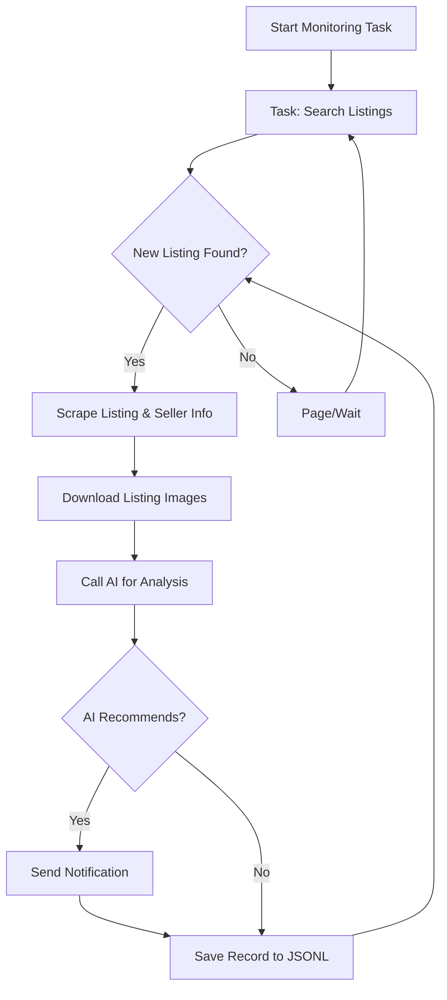

# AI-Powered Goofish (Xianyu) Monitor: Real-time Smart Monitoring with Web UI

This project provides a powerful AI-driven tool for real-time monitoring and intelligent analysis of Xianyu (Goofish) listings, complete with a user-friendly web interface.  [View the original repository](https://github.com/dingyufei615/ai-goofish-monitor).

## Key Features

*   ✅ **Web UI for Easy Management:** Manage tasks, edit AI criteria, view logs, and filter results all through an intuitive web interface, eliminating the need for command-line interaction.
*   🤖 **AI-Driven Task Creation:** Describe your desired purchase in natural language, and the system will generate a monitoring task with complex filtering logic.
*   🔄 **Concurrent Multi-Tasking:** Monitor multiple keywords simultaneously with independent tasks defined in `config.json`, ensuring no interference.
*   ⏱️ **Real-time Streaming Analysis:** Receive immediate analysis of new listings, eliminating batch processing delays.
*   🧠 **Deep AI-Powered Analysis:** Leverage multimodal large language models (e.g., GPT-4o) to analyze listing text, images, and seller profiles for precise filtering.
*   ⚙️ **Highly Customizable:** Configure each monitoring task with unique keywords, price ranges, filtering conditions, and AI analysis prompts.
*   🔔 **Instant Notifications:** Receive alerts for matching items via [ntfy.sh](https://ntfy.sh/), Enterprise WeChat group bots, [Bark](https://bark.day.app/), and webhooks.
*   📅 **Scheduled Task Execution:** Utilize Cron expressions to schedule tasks for automated execution.
*   🐳 **Docker for Easy Deployment:** Deploy quickly and consistently with pre-configured `docker-compose` support.
*   🛡️ **Robust Anti-Scraping:** Benefit from built-in anti-scraping measures, including random delays and user behavior simulation, for increased stability.

## Screenshots

**Task Management Dashboard:**


**Monitoring Results:**


**Notification Example:**


## Getting Started (Web UI Recommended)

The web UI offers the best user experience.

### Step 1: Environment Setup

> ⚠️ **Python Version Requirement:** Use Python 3.10 or higher for local development and debugging.  Lower versions may cause dependency installation issues (e.g., `ModuleNotFoundError: No module named 'PIL'`).

1.  Clone the repository:

    ```bash
    git clone https://github.com/dingyufei615/ai-goofish-monitor
    cd ai-goofish-monitor
    ```

2.  Install dependencies:

    ```bash
    pip install -r requirements.txt
    ```

### Step 2: Configuration

1.  **Configure Environment Variables**: Copy `.env.example` to `.env` and update the values.

    *   **Windows (Command Prompt):**
        ```cmd
        copy .env.example .env
        ```

    *   **Linux/MacOS (Terminal):**
        ```bash
        cp .env.example .env
        ```

    **Available environment variables:**

    | Variable             | Description                                        | Required? | Notes                                                                                                                                                 |
    | :------------------- | :------------------------------------------------- | :-------- | :---------------------------------------------------------------------------------------------------------------------------------------------------- |
    | `OPENAI_API_KEY`     | Your AI model provider API Key.                   | Yes       | May be optional for certain local or proxy services.                                                                                                 |
    | `OPENAI_BASE_URL`    | AI model API endpoint (OpenAI format).             | Yes       | Provide the base URL, e.g., `https://ark.cn-beijing.volces.com/api/v3/`.                                                                              |
    | `OPENAI_MODEL_NAME`  | The specific model to use.                        | Yes       | **Required:** Choose a multimodal model supporting image analysis, e.g., `doubao-seed-1-6-250615`, `gemini-2.5-pro`.                                 |
    | `PROXY_URL`          | (Optional) HTTP/S proxy for internet access.        | No        | Supports `http://` and `socks5://` formats, e.g., `http://127.0.0.1:7890`.                                                                            |
    | `NTFY_TOPIC_URL`     | (Optional) [ntfy.sh](https://ntfy.sh/) topic URL. | No        | Leave empty to disable ntfy notifications.                                                                                                           |
    | `GOTIFY_URL`         | (Optional) Gotify service address.                 | No        | e.g., `https://push.example.de`.                                                                                                                     |
    | `GOTIFY_TOKEN`       | (Optional) Gotify application token.               | No        |                                                                                                                                                       |
    | `BARK_URL`           | (Optional) [Bark](https://bark.day.app/) push URL. | No        | e.g., `https://api.day.app/your_key`. Leave empty to disable Bark notifications.                                                                       |
    | `WX_BOT_URL`         | (Optional) Enterprise WeChat bot webhook URL.       | No        | Leave empty to disable WeChat notifications. Enclose the URL in double quotes in `.env`.                                                             |
    | `WEBHOOK_URL`        | (Optional) General Webhook URL.                    | No        | Leave empty to disable.                                                                                                                               |
    | `WEBHOOK_METHOD`     | (Optional) Webhook request method.                 | No        | Supports `GET` or `POST`, defaults to `POST`.                                                                                                         |
    | `WEBHOOK_HEADERS`    | (Optional) Custom Webhook headers.                  | No        | Must be a valid JSON string, e.g., `'{"Authorization": "Bearer xxx"}'`.                                                                             |
    | `WEBHOOK_CONTENT_TYPE` | (Optional) POST request content type.           | No        | Supports `JSON` or `FORM`, defaults to `JSON`.                                                                                                        |
    | `WEBHOOK_QUERY_PARAMETERS` | (Optional) GET request query parameters.  | No        | JSON string, supports `{{title}}` and `{{content}}` placeholders.                                                                                       |
    | `WEBHOOK_BODY` | (Optional) POST request body.  | No        | JSON string, supports `{{title}}` and `{{content}}` placeholders.                                                                                       |
    | `LOGIN_IS_EDGE`      | Use Edge browser for login and scraping.           | No        | Defaults to `false` (Chrome/Chromium).                                                                                                                |
    | `PCURL_TO_MOBILE`    | Convert PC listing links to mobile links in notifications. | No        | Defaults to `true`.                                                                                                                                 |
    | `RUN_HEADLESS`       | Run the browser in headless mode.                 | No        | Defaults to `true`. Set to `false` for local debugging if captcha encountered. **Required `true` for Docker deployment.**                                 |
    | `AI_DEBUG_MODE`      | Enable AI debugging mode.                          | No        | Defaults to `false`. Prints detailed AI request/response logs to the console.                                                                            |
    | `SKIP_AI_ANALYSIS`   | Skip AI analysis and send notifications directly.  | No        | Defaults to `false`.  All listings are notified without AI processing.                                                                             |
    | `ENABLE_THINKING`   | Enable the enable_thinking parameter (for some AI models). | No        | Defaults to `false`. Some AI models require this, others don't. If you see "Invalid JSON payload received. Unknown name "enable_thinking"", try setting it to `false`. |
    | `SERVER_PORT`        | Web UI service port.                               | No        | Defaults to `8000`.                                                                                                                                   |
    | `WEB_USERNAME`       | Web UI login username.                            | No        | Defaults to `admin`.  **Change for production.**                                                                                                         |
    | `WEB_PASSWORD`       | Web UI login password.                            | No        | Defaults to `admin123`.  **Change for production (strong password).**                                                                                   |

    > 💡 **Debugging Tip:** If you encounter 404 errors when configuring the AI API, test with API from AliCloud or Volcano Engine first to ensure basic functionality before trying other providers.

    > 🔐 **Security Reminder:** The Web UI uses basic authentication. Default credentials are `admin`/`admin123`. **Change these in production.**

2.  **Get Login Status (Crucial!)**:  The scraper needs to be logged in to access Xianyu.  We recommend using the Web UI:

    **Recommended: Update via Web UI**

    1.  Skip this step and proceed to Step 3 (start the web server).
    2.  Access the Web UI, go to **"System Settings"**.
    3.  Find "Login Status File" and click **"Manual Update"**.
    4.  Follow the instructions:
        *   Install the [Xianyu Login State Extractor](https://chromewebstore.google.com/detail/xianyu-login-state-extrac/eidlpfjiodpigmfcahkmlenhppfklcoa) Chrome extension.
        *   Log in to Xianyu on the official website.
        *   Click the extension icon in your browser toolbar.
        *   Click "Extract Login State".
        *   Click "Copy to Clipboard".
        *   Paste the copied content into the Web UI and save.

    This method is convenient as it doesn't require a GUI on the server.

    **Alternative: Run Login Script (If you can run a GUI)**

    ```bash
    python login.py
    ```

    A browser window will open.  **Use the Xianyu mobile app to scan the QR code and log in.**  The script will close and generate `xianyu_state.json`.

### Step 3: Start the Web Server

```bash
python web_server.py
```

### Step 4: Start Monitoring

1.  Open `http://127.0.0.1:8000` in your browser.
2.  In **"Task Management"**, click **"Create New Task"**.
3.  Describe your needs in natural language (e.g., "I want to buy a Sony A7M4 camera, 95% new, under 13,000 yuan, shutter count below 5000"), enter the task name and keywords.
4.  Click Create.  The AI generates the analysis criteria.
5.  Go back to the main page, set up a schedule or click "Start" to begin monitoring!

## 🐳 Docker Deployment (Recommended)

Docker simplifies deployment.

### Step 1: Environment Setup (Similar to Local)

1.  **Install Docker**: Ensure [Docker Engine](https://docs.docker.com/engine/install/) is installed.

2.  **Clone and Configure:**

    ```bash
    git clone https://github.com/dingyufei615/ai-goofish-monitor
    cd ai-goofish-monitor
    ```

3.  **Create `.env`**:  Follow the **[Getting Started](#getting-started-web-ui-recommended)** instructions.

4.  **Get Login Status (Critical!)**:  Login via Web UI *after* starting the container:

    1.  (On the host machine)  Run `docker-compose up -d`.
    2.  Open `http://127.0.0.1:8000` in your browser.
    3.  Go to **"System Settings"** and click **"Manual Update"**.
    4.  Follow the instructions:
        *   Install the [Xianyu Login State Extractor](https://chromewebstore.google.com/detail/xianyu-login-state-extrac/eidlpfjiodpigmfcahkmlenhppfklcoa) Chrome extension.
        *   Log in to Xianyu on the official website.
        *   Click the extension icon in your browser toolbar.
        *   Click "Extract Login State".
        *   Click "Copy to Clipboard".
        *   Paste the copied content into the Web UI and save.

> ℹ️ **Python Version:** Docker uses Python 3.11 (specified in the Dockerfile).

### Step 2: Run the Docker Container

The project includes `docker-compose.yaml`.

Run this command in the project root:

```bash
docker-compose up --build -d
```

This starts the service in the background. `docker-compose` uses `.env` and `docker-compose.yaml` to build and launch the container.

If network problems occur within the container, troubleshoot or use a proxy.

> ⚠️ **OpenWrt Deployment Note**:  DNS resolution issues may occur on OpenWrt routers. The default Docker Compose network might not inherit OpenWrt's DNS settings.  If you get `ERR_CONNECTION_REFUSED`, check your container's network configuration; you may need to manually configure DNS.

### Step 3: Access and Manage

-   **Access Web UI**:  Open `http://127.0.0.1:8000` in your browser.
-   **View Logs**: `docker-compose logs -f`
-   **Stop Container**: `docker-compose stop`
-   **Start Stopped Container**: `docker-compose start`
-   **Stop and Remove Container**: `docker-compose down`

## 📸 Web UI Feature Overview

*   **Task Management**:
    *   **AI Task Creation**:  Create tasks with natural language descriptions.
    *   **Visual Editing**: Modify parameters (keywords, price, schedules) and manage task status in the UI.
    *   **Scheduled Execution**: Use Cron expressions to automate task runs.
*   **Result Viewing**:
    *   **Card View**:  Clearly display matching items with images and details.
    *   **Smart Filtering**:  Filter for AI-recommended items and sort by various criteria.
    *   **Deep Details**:  View complete scraped data and detailed AI analysis results.
*   **Running Logs**:
    *   **Real-time Logging**:  View detailed logs in the web UI.
    *   **Log Management**:  Automatic refresh, manual refresh, and clear logs.
*   **System Settings**:
    *   **Status Check**: Check `.env`, login status, and dependencies.
    *   **Prompt Editing**:  Edit and save the AI prompt directly in the web interface.

## 🚀 Workflow



## 🔐 Web UI Authentication

### Authentication Configuration

The Web UI uses basic authentication.

#### Configuration

Set credentials in your `.env` file:

```bash
# Web Service Authentication
WEB_USERNAME=admin
WEB_PASSWORD=admin123
```

#### Default Credentials

If not configured, the defaults are:

-   Username: `admin`
-   Password: `admin123`

**⚠️ Important: Change the default password in production.**

#### Scope

-   **Requires Authentication**: All API endpoints, the Web UI, and static resources.
-   **No Authentication Required**: Health check endpoint (`/health`).

#### Usage

1.  **Browser Access**:  A login dialog appears when accessing the Web UI.
2.  **API Calls**:  Include Basic authentication information in the request headers.
3.  **Frontend JavaScript**:  Authentication is handled automatically.

#### Security Recommendations

1.  Change the default password to a strong one.
2.  Use HTTPS in production.
3.  Regularly change authentication credentials.
4.  Restrict access by IP address using a firewall.

More details are in [AUTH_README.md](AUTH_README.md).

## Frequently Asked Questions (FAQ)

Find answers to common questions, from environment setup to AI configuration and anti-scraping strategies, in our detailed FAQ:

👉 **[View FAQ (FAQ.md)](FAQ.md)**

## Acknowledgements

This project references the following projects, and thanks for their help:

-   [superboyyy/xianyu_spider](https://github.com/superboyyy/xianyu_spider)

And also thanks for the contributions of LinuxDo related personnel

-   [@jooooody](https://linux.do/u/jooooody/summary)

And thanks to [LinuxDo](https://linux.do/) community.

And thanks to ClaudeCode/ModelScope/Gemini and other model/tools to free hands and experience the joy of Vibe Coding.

## Reflections on AI-Generated Code

This project's code is 90%+ AI-generated. The project has been a test case for AI-driven development.

The danger of Vibe Coding is the potential lack of critical review of the AI-generated code. Blindly validating functionality with test cases without considering why the AI wrote the code as it did, can turn a project into a black box.

Likewise, using AI to review AI-generated code can create a self-referential trap, making it difficult to determine the truth. AI is an excellent assistant for analysis, but the developer must still critically evaluate the work produced.

AI excels at solving 99% of coding problems. However, every solution must be verified by the developer. AI is a tool, and the content produced by AI is only a form of assistance.

## ⚠️ Important Notes

-   Adhere to Xianyu's terms of service and `robots.txt` rules.  Avoid excessive requests.
-   This project is for educational and research purposes only; avoid illegal use.
-   This project uses the [MIT License](LICENSE) and is provided "as is" without warranties.
-   The project authors and contributors are not responsible for any direct or indirect damages resulting from the use of this software.
-   See [DISCLAIMER.md](DISCLAIMER.md) for additional information.

[](https://star-history.com/#dingyufei615/ai-goofish-monitor&Date)