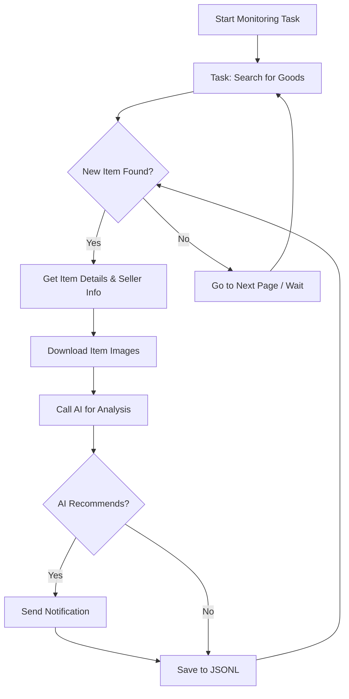

# AI-Powered Goofish (Xianyu) Monitor: Smartly Track & Analyze Used Goods (GitHub Repository)

**Tired of missing out on great deals?** This AI-powered tool allows you to monitor the Goofish (Xianyu) marketplace, using advanced AI to filter and analyze listings, with a user-friendly web interface for easy management. [View the original repository](https://github.com/dingyufei615/ai-goofish-monitor).

**Key Features:**

*   **💻 Intuitive Web UI:** Manage tasks, edit AI criteria, view logs, and browse results directly through the web interface – no command line needed.
*   **🧠 AI-Driven Task Creation:**  Describe your desired item in natural language, and the AI generates a task with complex filtering.
*   **🚀 Concurrent Monitoring:** Monitor multiple keywords simultaneously with independent task execution for comprehensive coverage.
*   **⚡ Real-Time Analysis:**  Analyze new listings instantly, eliminating batch processing delays.
*   **🤖 Deep AI Insights:** Utilize multi-modal large language models (like GPT-4o) to analyze images, descriptions, and seller profiles.
*   **⚙️ Highly Customizable:** Configure individual keywords, price ranges, filters, and AI analysis prompts for each monitoring task.
*   **🔔 Instant Notifications:** Receive alerts via [ntfy.sh](https://ntfy.sh/), WeChat group bots, or [Bark](https://bark.day.app/) when a suitable item is found.
*   **📅 Scheduled Tasks:**  Employ Cron expressions to schedule tasks for automated and continuous monitoring.
*   🐳 **Docker Deployment:**  Deploy quickly and consistently with pre-configured Docker Compose.
*   🛡️ **Robust Anti-Scraping:** Mimics human behavior with random delays and user actions to maintain stability.

**Screenshots:**

*   [**Backend Task Management**](static/img.png)
*   [**Backend Monitoring**](static/img_1.png)
*   [**Notification Example**](static/img_2.png)

## Getting Started (Web UI Recommended)

The Web UI provides the best user experience.

### Step 1: Prerequisites

*   **Python:**  Python 3.10 or higher is recommended. Lower versions may cause installation errors.
*   **Clone the Repository:**
    ```bash
    git clone https://github.com/dingyufei615/ai-goofish-monitor
    cd ai-goofish-monitor
    ```

*   **Install Dependencies:**
    ```bash
    pip install -r requirements.txt
    ```

### Step 2: Configuration

1.  **Configure Environment Variables:**
    *   Copy `.env.example` to `.env`:
        *   Windows:  `copy .env.example .env`
        *   Linux/macOS:  `cp .env.example .env`
    *   Edit `.env` with your settings:

    | Environment Variable  | Description                                    | Required | Notes                                                                                                                                                                   |
    | --------------------- | ---------------------------------------------- | -------- | ----------------------------------------------------------------------------------------------------------------------------------------------------------------------- |
    | `OPENAI_API_KEY`      | Your AI model provider's API Key.             | Yes      |  May be optional for local or proxy services.                                                                                                                                |
    | `OPENAI_BASE_URL`     | AI model API endpoint, compatible with OpenAI format.  | Yes      | e.g., `https://ark.cn-beijing.volces.com/api/v3/`.                                                                                                                                 |
    | `OPENAI_MODEL_NAME`   | The specific model name to use.                | Yes      | **Must** select a multi-modal model, such as `doubao-seed-1-6-250615` or `gemini-2.5-pro`.                                                                                    |
    | `PROXY_URL`           | (Optional) HTTP/S proxy for internet access.  | No       | Supports `http://` and `socks5://`, e.g., `http://127.0.0.1:7890`.                                                                                                          |
    | `NTFY_TOPIC_URL`      | (Optional) [ntfy.sh](https://ntfy.sh/) topic URL. | No       |  Leave blank to disable ntfy notifications.                                                                                                                             |
    | `GOTIFY_URL`          | (Optional) Gotify server address.              | No       | e.g., `https://push.example.de`.                                                                                                                                        |
    | `GOTIFY_TOKEN`        | (Optional) Gotify application token.           | No       |                                                                                                                                                                         |
    | `BARK_URL`            | (Optional) [Bark](https://bark.day.app/) push address. | No       | e.g., `https://api.day.app/your_key`.  Leave blank to disable Bark notifications.                                                                                      |
    | `WX_BOT_URL`          | (Optional) WeChat group bot webhook URL.        | No       | Leave blank to disable WeChat notifications.                                                                                                                             |
    | `WEBHOOK_URL`         | (Optional) General Webhook URL.               | No       | Leave blank to disable general webhook notifications.                                                                                                                      |
    | `WEBHOOK_METHOD`      | (Optional) Webhook request method.            | No       | Supports `GET` or `POST`, defaults to `POST`.                                                                                                                              |
    | `WEBHOOK_HEADERS`     | (Optional) Webhook custom headers.            | No       | Valid JSON string, e.g., `'{"Authorization": "Bearer xxx"}'`.                                                                                                              |
    | `WEBHOOK_CONTENT_TYPE` | (Optional) POST request content type.         | No       | Supports `JSON` or `FORM`, defaults to `JSON`.                                                                                                                            |
    | `WEBHOOK_QUERY_PARAMETERS` | (Optional) GET request query parameters.   | No       | JSON string, supports `{{title}}` and `{{content}}` placeholders.                                                                                                       |
    | `WEBHOOK_BODY`        | (Optional) POST request body.                  | No       | JSON string, supports `{{title}}` and `{{content}}` placeholders.                                                                                                       |
    | `LOGIN_IS_EDGE`       | Use Edge browser for login and scraping.       | No       | Defaults to `false` (Chrome/Chromium).                                                                                                                               |
    | `PCURL_TO_MOBILE`     | Convert PC links to mobile links in notifications.  | No       | Defaults to `true`.                                                                                                                                                |
    | `RUN_HEADLESS`        | Run browser in headless mode.                 | No       | Defaults to `true`. Set to `false` for local debugging to handle captchas. **Must be `true` for Docker deployment.**                                                         |
    | `AI_DEBUG_MODE`       | Enable AI debugging mode.                     | No       | Defaults to `false`. Prints detailed AI request/response logs to the console.                                                                                              |
    | `SKIP_AI_ANALYSIS`    | Skip AI analysis and send notifications directly. | No       | Defaults to `false`.  All scraped items will be sent directly without AI analysis.                                                                                    |
    | `SERVER_PORT`         | Web UI server port.                         | No       | Defaults to `8000`.                                                                                                                                                        |
    | `WEB_USERNAME`        | Web UI login username.                        | No       | Defaults to `admin`.  **Change in production!**                                                                                                                            |
    | `WEB_PASSWORD`        | Web UI login password.                        | No       | Defaults to `admin123`.  **Change to a strong password in production!**                                                                                                      |

    > 💡 **Debugging AI API:**  If you encounter 404 errors, test with a cloud provider (e.g., Alibaba Cloud, Volcano Engine) to ensure the basic functionality.  Some providers may have compatibility issues or require special configurations.

    > 🔐 **Security Warning:** The Web UI uses Basic Authentication.  Default credentials are `admin`/`admin123`.  **CHANGE THESE IN PRODUCTION!**

2.  **Obtain Login State (Crucial!)**:  You must provide valid login credentials for the scraper to access Xianyu.  **Recommended Method: Web UI**

    1.  Skip this step, then launch the Web server in Step 3.
    2.  Open the Web UI and go to the "System Settings" page.
    3.  Find "Login State File" and click "Manual Update".
    4.  Follow the instructions in the popup:
        *   Install the [Xianyu Login State Extractor](https://chromewebstore.google.com/detail/xianyu-login-state-extrac/eidlpfjiodpigmfcahkmlenhppfklcoa) Chrome extension.
        *   Open Xianyu's official website and log in.
        *   Click the extension icon in your browser toolbar.
        *   Click "Extract Login State".
        *   Click "Copy to Clipboard".
        *   Paste the copied content into the Web UI and save.

    **Alternative Method: Run Login Script**

    If you can run a program with a GUI, use the login script:

    ```bash
    python login.py
    ```

    A browser window will open.  **Scan the QR code with the Xianyu app** to log in.  The program will then close and generate an `xianyu_state.json` file in the project root.

### Step 3: Start the Web Server

```bash
python web_server.py
```

### Step 4: Start Monitoring

1.  Open your browser to `http://127.0.0.1:8000`.
2.  Go to the "Task Management" page and click "Create New Task."
3.  Describe your desired item in natural language (e.g., "Looking for a Sony A7M4 camera, mint condition, budget $13000, shutter count below 5000") and complete task details.
4.  Click Create, and the AI will generate complex criteria.
5.  Start/schedule the task on the main interface.

## 🐳 Docker Deployment (Recommended)

Docker provides a streamlined deployment process.

### Step 1: Environment Preparation (Similar to local deployment)

1.  **Install Docker**: Ensure [Docker Engine](https://docs.docker.com/engine/install/) is installed.

2.  **Clone and Configure**:
    ```bash
    git clone https://github.com/dingyufei615/ai-goofish-monitor
    cd ai-goofish-monitor
    ```
3.  **Create `.env`**:  Follow the instructions in **[Getting Started](#getting-started-web-ui-recommended)** to create and populate the `.env` file.

4.  **Get Login State (Essential!)**: Since Docker cannot perform QR code login natively, set login state via the Web UI *after* starting the container:
    1.  (On your host machine) Run `docker-compose up -d` to start the service.
    2.  Open your browser to `http://127.0.0.1:8000`.
    3.  Navigate to "System Settings" and click "Manual Update".
    4.  Follow the instructions in the popup:
        *   Install the [Xianyu Login State Extractor](https://chromewebstore.google.com/detail/xianyu-login-state-extrac/eidlpfjiodpigmfcahkmlenhppfklcoa) Chrome extension.
        *   Open Xianyu's official website and log in.
        *   Click the extension icon in your browser toolbar.
        *   Click "Extract Login State".
        *   Click "Copy to Clipboard".
        *   Paste the copied content into the Web UI and save.

    > ℹ️ **Python Version:** The Docker image uses Python 3.11.

### Step 2: Run the Docker Container

Use `docker-compose` for container management.

```bash
docker-compose up --build -d
```

### Step 3: Access and Manage

*   **Access Web UI**: Open `http://127.0.0.1:8000` in your browser.
*   **View Logs**: `docker-compose logs -f`
*   **Stop Container**: `docker-compose stop`
*   **Start Stopped Container**: `docker-compose start`
*   **Stop and Remove Container**: `docker-compose down`

## 📸 Web UI Feature Overview

*   **Task Management**:
    *   **AI Task Creation**: Create tasks using natural language.
    *   **Visual Editing**: Modify task parameters in a table, including keywords, prices, and schedules.
    *   **Scheduled Tasks**: Configure tasks using Cron expressions for automation.
*   **Result Viewing**:
    *   **Card View**: See items in a clear, graphical format.
    *   **Smart Filtering and Sorting**: Filter by AI-marked "Recommended" items and sort by time, price, etc.
    *   **Deep Details**: View full scraped data and AI analysis results for each item.
*   **Running Logs**:
    *   **Real-time Logging**: Monitor detailed crawler logs in real-time.
    *   **Log Management**: Supports auto-refresh, manual refresh, and log clearing.
*   **System Settings**:
    *   **Status Check**: Check essential dependencies such as the `.env` configuration and login status.
    *   **Prompt Editing**: Edit and save AI prompts directly on the page for on-the-fly adjustments.

## 🚀 Workflow



## 🔐 Web UI Authentication

### Configuration

The Web UI utilizes Basic Authentication for access control.

#### Configuration Method

Set credentials in your `.env` file:

```bash
# Web Service Authentication
WEB_USERNAME=admin
WEB_PASSWORD=admin123
```

#### Default Credentials

If credentials are not set in `.env`, the system uses:
*   Username: `admin`
*   Password: `admin123`

**⚠️ Important: Change these defaults in a production environment!**

#### Authentication Scope

*   **Protected:** All API endpoints, Web UI, and static resources.
*   **Unprotected:** Health check endpoint (`/health`).

#### Usage

1.  **Browser Access:**  A login dialog will appear.
2.  **API Calls:** Include Basic Authentication headers in your requests.
3.  **Frontend JavaScript:** Authentication is handled automatically.

#### Security Recommendations

1.  Change default passwords to strong passwords.
2.  Use HTTPS in production.
3.  Change authentication credentials periodically.
4.  Restrict access by IP address using a firewall.

Refer to [AUTH_README.md](AUTH_README.md) for detailed configuration.

## Frequently Asked Questions (FAQ)

Find answers to common questions about setup, AI settings, anti-scraping, and more.

👉 **[Read the FAQ (FAQ.md)](FAQ.md)**

## Acknowledgements

Thanks to the following projects and individuals:

*   [superboyyy/xianyu_spider](https://github.com/superboyyy/xianyu_spider)
*   [@jooooody](https://linux.do/u/jooooody/summary)
*   [LinuxDo](https://linux.do/) community
*   ClaudeCode/Aider/Gemini for code assistance

## Support & Sponsoring

If this project is helpful, please consider supporting the development with a coffee!

<table>
  <tr>
    <td></td>
    <td></td>
  </tr>
</table>

## ⚠️ Important Notes

*   Comply with Xianyu's user agreement and `robots.txt`. Avoid excessive requests.
*   This project is for learning and research only; do not use it for illegal purposes.
*   This project is released under the [MIT License](LICENSE). It is provided "as is," without warranties.
*   The author and contributors are not liable for any damages resulting from the use of this software.
*   See [DISCLAIMER.md](DISCLAIMER.md) for more details.

[](https://star-history.com/#dingyufei615/ai-goofish-monitor&Date)