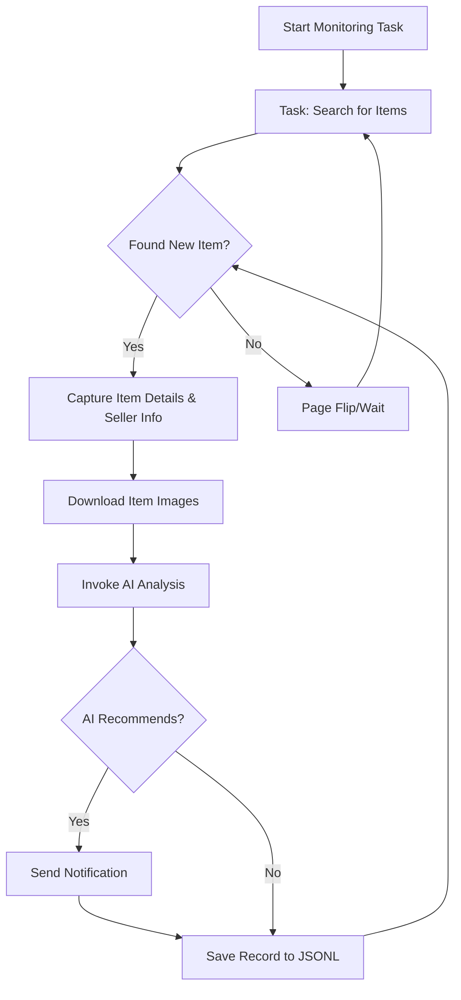

# AI-Powered Goofish (Xianyu) Monitor: Smartly Track and Analyze Secondhand Goods

**Never miss a deal!** This AI-driven tool uses Playwright and AI to monitor Xianyu (Goofish) for you, providing real-time monitoring, intelligent analysis, and a user-friendly web interface.  Get the edge in finding the perfect secondhand items!  [View the original repo on GitHub](https://github.com/dingyufei615/ai-goofish-monitor)

## Key Features:

*   **Intuitive Web Interface:**  Manage tasks, view real-time logs, and filter results directly from a comprehensive web UI – no command-line fuss!
*   **AI-Powered Task Creation:**  Describe your desired item in plain language, and let the AI create a task with complex filtering logic.
*   **Concurrent Multi-Tasking:** Monitor multiple keywords simultaneously with independent tasks that won't interfere with each other.
*   **Real-time Stream Processing:**  Instant analysis of new listings ensures you're notified as soon as they appear.
*   **Deep AI Analysis:** Integrates multi-modal LLMs (e.g., GPT-4o) to analyze images, text, and seller profiles for accurate filtering.
*   **Highly Customizable:**  Configure individual tasks with specific keywords, price ranges, filtering criteria, and AI analysis prompts.
*   **Instant Notifications:**  Receive alerts via [ntfy.sh](https://ntfy.sh/), WeChat group bots, or [Bark](https://bark.day.app/) when a promising item is found.
*   **Scheduled Task Execution:** Utilize Cron expressions to schedule tasks for automated, periodic monitoring.
*   **One-Click Docker Deployment:**  Deploy quickly and easily using the provided `docker-compose` configuration.
*   **Robust Anti-Scraping:**  Mimics human behavior with random delays and user actions to improve stability and avoid detection.

## Key Features:

*   **Intuitive Web Interface:**  Manage tasks, view real-time logs, and filter results directly from a comprehensive web UI – no command-line fuss!
*   **AI-Powered Task Creation:**  Describe your desired item in plain language, and let the AI create a task with complex filtering logic.
*   **Concurrent Multi-Tasking:** Monitor multiple keywords simultaneously with independent tasks that won't interfere with each other.
*   **Real-time Stream Processing:**  Instant analysis of new listings ensures you're notified as soon as they appear.
*   **Deep AI Analysis:** Integrates multi-modal LLMs (e.g., GPT-4o) to analyze images, text, and seller profiles for accurate filtering.
*   **Highly Customizable:**  Configure individual tasks with specific keywords, price ranges, filtering criteria, and AI analysis prompts.
*   **Instant Notifications:**  Receive alerts via [ntfy.sh](https://ntfy.sh/), WeChat group bots, or [Bark](https://bark.day.app/) when a promising item is found.
*   **Scheduled Task Execution:** Utilize Cron expressions to schedule tasks for automated, periodic monitoring.
*   **One-Click Docker Deployment:**  Deploy quickly and easily using the provided `docker-compose` configuration.
*   **Robust Anti-Scraping:**  Mimics human behavior with random delays and user actions to improve stability and avoid detection.

## Visuals:

### Web UI Screenshots:

*   **Task Management:** 
*   **Monitoring Dashboard:** 
*   **Notification Example:** 

## Getting Started (Web UI Recommended):

The Web UI is the preferred method for interacting with this project, offering the best user experience.

### Step 1: Environment Setup

> ⚠️ **Python Version Requirement:**  For local deployment, use Python 3.10 or higher.  Older versions may cause dependency installation failures or runtime errors (e.g., `ModuleNotFoundError: No module named 'PIL'`).

1.  Clone the repository:

    ```bash
    git clone https://github.com/dingyufei615/ai-goofish-monitor
    cd ai-goofish-monitor
    ```

2.  Install Python dependencies:

    ```bash
    pip install -r requirements.txt
    ```

### Step 2: Basic Configuration

1.  **Configure Environment Variables:** Copy `.env.example` to `.env` and modify its contents.

    *   **Windows:**

        ```cmd
        copy .env.example .env
        ```

    *   **Linux/MacOS:**

        ```bash
        cp .env.example .env
        ```

    Environment variables include:

    | Variable           | Description                                     | Required | Notes                                                                                                                              |
    | :----------------- | :---------------------------------------------- | :------- | :--------------------------------------------------------------------------------------------------------------------------------- |
    | `OPENAI_API_KEY`   | Your AI model provider's API Key.              | Yes      | May be optional for some local or proxy services.                                                                                  |
    | `OPENAI_BASE_URL`  | API endpoint for the AI model (compatible with OpenAI format). | Yes      |  Enter the base path of the API, e.g., `https://ark.cn-beijing.volces.com/api/v3/`.                                                                                 |
    | `OPENAI_MODEL_NAME` | The specific model name you want to use.        | Yes      |  **Must** select a multimodal model that supports image analysis, like `doubao-seed-1-6-250615`, `gemini-2.5-pro`, etc.      |
    | `PROXY_URL`        | (Optional) HTTP/S proxy for bypassing firewalls. | No       | Supports `http://` and `socks5://` formats.  E.g., `http://127.0.0.1:7890`.                                                      |
    | `NTFY_TOPIC_URL`   | (Optional) [ntfy.sh](https://ntfy.sh/) topic URL. | No       |  Leave blank to disable ntfy notifications.                                                                                        |
    | `GOTIFY_URL`       | (Optional) Gotify server address.                | No       |  E.g., `https://push.example.de`.                                                                                               |
    | `GOTIFY_TOKEN`     | (Optional) Gotify application token.             | No       |                                                                                                                                  |
    | `BARK_URL`         | (Optional) [Bark](https://bark.day.app/) push address.   | No       | E.g., `https://api.day.app/your_key`.  Leave blank to disable Bark notifications.                                            |
    | `WX_BOT_URL`       | (Optional) WeChat group bot webhook address.    | No       |  Leave blank to disable WeChat notifications.                                                                                     |
    | `WEBHOOK_URL`      | (Optional) Generic Webhook URL.                  | No       |  Leave blank to disable generic Webhook notifications.                                                                                |
    | `WEBHOOK_METHOD`   | (Optional) Webhook request method.              | No       | Supports `GET` or `POST`, defaults to `POST`.                                                                                    |
    | `WEBHOOK_HEADERS`  | (Optional) Custom Webhook request headers.      | No       | Must be a valid JSON string, e.g., `'{"Authorization": "Bearer xxx"}'`.                                                          |
    | `WEBHOOK_CONTENT_TYPE` | (Optional) Content type for POST requests.    | No       |  Supports `JSON` or `FORM`, defaults to `JSON`.                                                                                      |
    | `WEBHOOK_QUERY_PARAMETERS` | (Optional) Query parameters for GET requests.   | No       |  JSON string, supports `{{title}}` and `{{content}}` placeholders.                                                              |
    | `WEBHOOK_BODY`     | (Optional) Request body for POST requests.       | No       |  JSON string, supports `{{title}}` and `{{content}}` placeholders.                                                                   |
    | `LOGIN_IS_EDGE`    | Use Edge browser for login and scraping.       | No       | Defaults to `false` (Chrome/Chromium).                                                                                          |
    | `PCURL_TO_MOBILE`  | Convert PC listing links to mobile links in notifications.     | No       |  Defaults to `true`.                                                                                              |
    | `RUN_HEADLESS`     | Run the crawler browser in headless mode.       | No       |  Defaults to `true`. Set to `false` for local debugging when facing captchas.  **Must be `true` for Docker deployment.**         |
    | `AI_DEBUG_MODE`    | Enable AI debug mode.                            | No       |  Defaults to `false`.  Prints detailed AI request and response logs to the console.                                                |
    | `SKIP_AI_ANALYSIS` | Skip AI analysis and send notifications directly.  | No       |  Defaults to `false`.  Setting to `true` sends all scraped items directly to notifications without AI analysis.                 |
    | `SERVER_PORT`      | Web UI service port.                             | No       | Defaults to `8000`.                                                                                                               |
    | `WEB_USERNAME`     | Web interface login username.                   | No       | Defaults to `admin`.  **Important: Change in production.**                                                                        |
    | `WEB_PASSWORD`     | Web interface login password.                   | No       | Defaults to `admin123`.  **Important: Change to a strong password in production!**                                                  |

    > 💡 **Debugging Tip:** If you encounter 404 errors when configuring your AI API, try debugging with APIs provided by Alibaba Cloud or Volcano Engine first to ensure basic functionality before attempting other API providers. Some API providers may have compatibility issues or require special configurations.

    > 🔐 **Security Reminder:** The Web interface uses Basic authentication.  The default username and password are `admin` / `admin123`.  **Change these to strong credentials in a production environment!**

2.  **Obtain Login Status (Critical!)**:  Provide valid login credentials to allow the crawler to access Xianyu in a logged-in state.  We recommend using the Web UI:

    **Recommended Method: Update via Web UI**

    1.  Skip this step and proceed to Step 3 to start the Web server.
    2.  Open the Web UI and navigate to the "System Settings" page.
    3.  Find "Login Status File" and click the "Manual Update" button.
    4.  Follow the instructions in the popup:
        *   Install the [Xianyu login state extraction extension](https://chromewebstore.google.com/detail/xianyu-login-state-extrac/eidlpfjiodpigmfcahkmlenhppfklcoa) in your Chrome browser on your personal computer.
        *   Open and log in to the Xianyu official website.
        *   Once logged in successfully, click the extension icon in your browser toolbar.
        *   Click the "Extract Login Status" button to get your login information.
        *   Click the "Copy to Clipboard" button.
        *   Paste the copied content into the Web UI and save.

    This method is the most convenient, as it doesn't require running a program with a graphical interface on the server.

    **Alternative: Run the Login Script**

    If you can run programs locally or on a server with a desktop environment, you can use the traditional script method:

    ```bash
    python login.py
    ```

    A browser window will open.  **Use the Xianyu mobile app to scan the QR code** to complete the login.  The program will close automatically upon success, and a `xianyu_state.json` file will be created in the project root directory.

### Step 3: Start the Web Server

Once configured, launch the Web UI server:

```bash
python web_server.py
```

### Step 4: Get Started!

Open your browser to `http://127.0.0.1:8000` to access the management interface.

1.  In the **"Task Management"** page, click **"Create New Task"**.
2.  In the popup, describe your desired item using natural language (e.g., "I want to buy a used Sony A7M4 camera, 95% new or better, budget under 13,000 RMB, shutter count below 5000"), then fill in the task name, keywords, etc.
3.  Click "Create," and the AI will automatically generate a complex set of analysis criteria.
4.  Return to the main interface and add a schedule or click "Start" to begin automated monitoring!

## Docker Deployment (Recommended):

Docker allows you to package your application and its dependencies into a standardized unit for fast, reliable, and consistent deployment.

### Step 1: Environment Setup (Similar to Local Deployment)

1.  **Install Docker:** Ensure you have [Docker Engine](https://docs.docker.com/engine/install/) installed on your system.

2.  **Clone and Configure the Project:**

    ```bash
    git clone https://github.com/dingyufei615/ai-goofish-monitor
    cd ai-goofish-monitor
    ```

3.  **Create the `.env` File:**  Follow the instructions in the **[Getting Started](#getting-started-web-ui-recommended)** section to create and populate the `.env` file in the project's root directory.

4.  **Obtain Login Status (Essential!)**:  Since you cannot scan a QR code inside the Docker container, get the login state after the container is running by accessing the Web UI:
    1.  (On your host machine) Run `docker-compose up -d` to start the service.
    2.  Open your browser to `http://127.0.0.1:8000` to access the Web UI.
    3.  Navigate to the "System Settings" page and click the "Manual Update" button.
    4.  Follow the instructions in the popup:
        *   Install the [Xianyu login state extraction extension](https://chromewebstore.google.com/detail/xianyu-login-state-extrac/eidlpfjiodpigmfcahkmlenhppfklcoa) in your Chrome browser.
        *   Open and log in to the Xianyu official website.
        *   Once logged in successfully, click the extension icon in your browser toolbar.
        *   Click the "Extract Login Status" button to get your login information.
        *   Click the "Copy to Clipboard" button.
        *   Paste the copied content into the Web UI and save.

> ℹ️ **About Python Version:**  When deploying with Docker, the project uses Python 3.11, specified in the Dockerfile.  You don't need to worry about local Python version compatibility.

### Step 2: Run the Docker Container

The project includes a `docker-compose.yaml` file.  We recommend using `docker-compose` to manage the container.

In the project root directory, run:

```bash
docker-compose up --build -d
```

This will start the service in detached mode.  `docker-compose` automatically reads your `.env` file and `docker-compose.yaml` to create and start the container.

If you encounter network issues inside the container, troubleshoot your setup or use a proxy.

> ⚠️ **OpenWrt Deployment Notes:** If you deploy this application on an OpenWrt router, you might experience DNS resolution issues. This is because the default network created by Docker Compose may not correctly inherit OpenWrt's DNS settings. If you encounter `ERR_CONNECTION_REFUSED` errors, check your container's network configuration.  You may need to manually configure DNS or adjust the network mode to ensure the container can access the external network.

### Step 3: Access and Manage

*   **Access Web UI:** Open your browser to `http://127.0.0.1:8000`.
*   **View Real-time Logs:** `docker-compose logs -f`
*   **Stop the Container:** `docker-compose stop`
*   **Start a Stopped Container:** `docker-compose start`
*   **Stop and Remove the Container:** `docker-compose down`

## Web UI Feature Overview:

*   **Task Management:**
    *   **AI Task Creation:** Generate monitoring tasks and AI analysis criteria by describing your needs in natural language.
    *   **Visual Editing and Control:** Modify task parameters directly in the table (e.g., keywords, price, scheduling rules) and independently start/stop and delete tasks.
    *   **Scheduled Execution:** Configure Cron expressions for tasks to run automatically at set intervals.
*   **Result Viewing:**
    *   **Card View Browsing:**  Clearly display eligible items in a card-based format with images and text.
    *   **Smart Filtering and Sorting:**  Quickly filter for items marked as "Recommended" by the AI and sort by crawl time, publication time, price, and more.
    *   **Deep Details:** Click to view the complete data captured for each item and the detailed JSON results of the AI analysis.
*   **Run Logs:**
    *   **Real-time Log Stream:**  View detailed logs of the crawler's operations in real-time on the web page, making it easy to track progress and troubleshoot issues.
    *   **Log Management:** Supports automatic refresh, manual refresh, and one-click log clearing.
*   **System Settings:**
    *   **Status Check:**  Check critical dependencies, such as the `.env` configuration and login status, to ensure they are functioning correctly.
    *   **Prompt Online Editing:** Edit and save the `prompt` file used for AI analysis directly on the web page, allowing you to adjust the AI's logic in real-time.

## Workflow:

The diagram describes the core logic of a single monitoring task, from initiation to completion. `web_server.py` acts as the main service, launching one or more of these task processes based on user actions or scheduled runs.



## Web Interface Authentication

### Authentication Configuration

The Web interface uses Basic authentication to protect access to the management interface and APIs, ensuring only authorized users can log in.

#### Configuration

Set your credentials in the `.env` file:

```bash
# Web service authentication configuration
WEB_USERNAME=admin
WEB_PASSWORD=admin123
```

#### Default Credentials

If authentication credentials are not set in the `.env` file, the system will use the following defaults:

*   Username: `admin`
*   Password: `admin123`

**⚠️ Important: Change the default password in production!**

#### Authentication Scope

*   **Requires Authentication:** All API endpoints, Web interface, and static resources.
*   **No Authentication Required:** Health check endpoint (`/health`).

#### Usage

1.  **Browser Access:**  The authentication dialog will pop up when accessing the Web interface.
2.  **API Calls:**  Include Basic authentication information in the request headers.
3.  **Frontend JavaScript:**  Authentication is handled automatically; no code modifications are required.

#### Security Recommendations

1.  Change the default password to a strong one.
2.  Use HTTPS in production.
3.  Regularly rotate authentication credentials.
4.  Restrict access by IP address using a firewall.

For detailed configuration information, see [AUTH_README.md](AUTH_README.md).

## Frequently Asked Questions (FAQ)

We've compiled a comprehensive FAQ document that covers common questions, from environment configuration and AI settings to anti-scraping strategies.

👉 **[Click here to view the Frequently Asked Questions (FAQ.md)](FAQ.md)**

## Acknowledgements

This project references the following excellent projects:

*   [superboyyy/xianyu_spider](https://github.com/superboyyy/xianyu_spider)

and thanks to the LinuxDo community and [@jooooody](https://linux.do/u/jooooody/summary) for the script contribution.

Also thanks to ClaudeCode/Aider/Gemini tools.

## Support & Sponsoring

If this project has been helpful, consider supporting it:

<table>
  <tr>
    <td></td>
    <td></td>
  </tr>
</table>

## ⚠️ Important Notes:

*   Please adhere to Xianyu's user agreement and robots.txt rules.  Avoid excessive requests to prevent burdening the server or account restrictions.
*   This project is for learning and technical research only and should not be used for illegal purposes.
*   This project is released under the [MIT License](LICENSE) and is provided "as is" without any warranty.
*   The project author and contributors are not liable for any direct, indirect, incidental, or special damages or losses resulting from the use of this software.
*   For more detailed information, see the [DISCLAIMER.md](DISCLAIMER.md) file.

[](https://star-history.com/#dingyufei615/ai-goofish-monitor&Date)