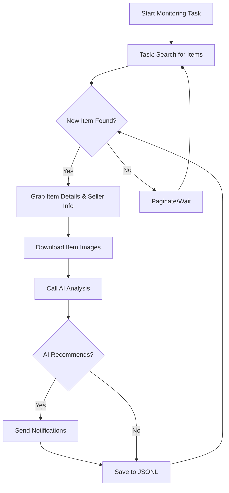

# AI-Powered Goofish (Xianyu) Monitor: Effortlessly Track & Analyze Secondhand Goods 🔍

**Tired of missing out on great deals?** This AI-powered tool uses Playwright and large language models to monitor Xianyu (Goofish) for you, providing real-time analysis and intelligent filtering with a user-friendly web interface.  [View the original repo](https://github.com/dingyufei615/ai-goofish-monitor).

## Key Features:

*   ✅ **Intuitive Web UI:** Manage tasks, edit AI criteria, view logs, and browse results all from a complete web interface – no command-line fuss!
*   ✍️ **AI-Driven Task Creation:** Describe your desired item in natural language, and the AI will generate a complex monitoring task with advanced filtering.
*   ⚙️ **Concurrent Multi-Tasking:** Monitor multiple keywords simultaneously with independent tasks, ensuring comprehensive coverage.
*   ⏱️ **Real-time Processing:** Instantly analyzes new listings as they appear, eliminating lag.
*   🧠 **Deep AI Analysis:** Leverages multimodal large language models (like GPT-4o) to analyze listings, images, and seller profiles for precise filtering.
*   🛠️ **Highly Customizable:** Configure each task with unique keywords, price ranges, filtering conditions, and custom AI prompts.
*   🔔 **Instant Notifications:** Get alerts via ntfy.sh, WeChat group bots, and Bark, ensuring you never miss a deal.
*   📅 **Scheduled Task Execution:** Set up automated monitoring with flexible Cron expressions for each task.
*   🐳 **Docker Deployment:**  Deploy quickly and consistently with a pre-configured `docker-compose` setup.
*   🛡️ **Robust Anti-Scraping:** Mimics human behavior, incorporating random delays and user interactions for stable operation.

## Core Components

*   **Playwright:** Handles browser automation, simulating user interactions.
*   **Large Language Models (LLMs):**  Performs advanced analysis of listings, including image recognition, text understanding, and seller assessment.
*   **Web UI:** Provides a user-friendly interface for task management, result viewing, and system configuration.
*   **Notification System:**  Delivers alerts through various channels (ntfy.sh, WeChat, Bark).

## Quick Start (Web UI Recommended)

The Web UI offers the best user experience.

### 1. Prerequisites:

*   **Python:** Python 3.10+ is recommended for local development to avoid dependency issues.

*   **Clone the Repository:**
    ```bash
    git clone https://github.com/dingyufei615/ai-goofish-monitor
    cd ai-goofish-monitor
    ```

*   **Install Dependencies:**
    ```bash
    pip install -r requirements.txt
    ```

### 2. Configuration:

1.  **Configure Environment Variables:**  Copy `.env.example` to `.env` and adjust the settings:

    ```bash
    # Windows
    copy .env.example .env
    # Linux/macOS
    cp .env.example .env
    ```

    Key Variables:

    | Environment Variable   | Description                                                                     | Required | Notes                                                                                                       |
    | :--------------------- | :------------------------------------------------------------------------------ | :------- | :---------------------------------------------------------------------------------------------------------- |
    | `OPENAI_API_KEY`       | Your AI model provider's API key.                                               | Yes      |                                                                                                             |
    | `OPENAI_BASE_URL`      | AI model API endpoint (OpenAI compatible).                                      | Yes      | For example, `https://ark.cn-beijing.volces.com/api/v3/`.                                                      |
    | `OPENAI_MODEL_NAME`    | The specific model to use (must support image analysis).                        | Yes      | Models like `doubao-seed-1-6-250615` and `gemini-2.5-pro` are supported.                                      |
    | `PROXY_URL`            | (Optional) HTTP/S proxy for bypassing geo-restrictions.                         | No       |  `http://` and `socks5://` formats are supported, e.g., `http://127.0.0.1:7890`.                             |
    | ... (Other notification and UI settings) | ... | ... | ... |

    *   **Debugging Tip:** If you encounter 404 errors with your AI API, test with an API from Alibaba Cloud or Volces to verify basic functionality before switching to other providers.

2.  **Get Login Credentials (Crucial!)**: Obtain valid login credentials to allow the crawler to access Xianyu in a logged-in state.  The Web UI is the easiest way to accomplish this:

    *   **Recommended: Web UI Update**
        1.  Start the Web server (Step 3).
        2.  Open the Web UI and navigate to "System Settings".
        3.  Click the "Manual Update" button next to "Login State File".
        4.  Follow the instructions in the pop-up to:
            *   Install the Xianyu login state extraction extension in Chrome.
            *   Log in to the Xianyu website.
            *   Use the extension to extract and copy your login state.
            *   Paste the login state into the Web UI and save it.

    *   **Alternative:  Login Script (If you can run programs locally):**
        ```bash
        python login.py
        ```
        Scan the QR code that appears with the Xianyu app to log in. This will generate `xianyu_state.json`.

### 3. Start the Web Server:

```bash
python web_server.py
```

### 4. Start Monitoring:

1.  In your browser, go to `http://127.0.0.1:8000`.
2.  Go to "Task Management" -> "Create New Task".
3.  Use natural language to describe your item (e.g., "Buy a Sony A7M4 camera, 95% new, under $1300, under 5000 shutter count").
4.  Fill in other information like name and keywords.  The AI will generate your task.
5.  Enable scheduled execution or start your new task.

## Docker Deployment (Recommended)

Docker provides a simplified and efficient way to deploy.

### 1. Prerequisites (Similar to Local Setup):

1.  **Install Docker:** Ensure Docker Engine is installed ([Docker Engine](https://docs.docker.com/engine/install/)).

2.  **Clone and Configure:**

    ```bash
    git clone https://github.com/dingyufei615/ai-goofish-monitor
    cd ai-goofish-monitor
    ```

3.  **Create `.env`:** Follow the instructions in the Quick Start section to create and populate the `.env` file.

4.  **Get Login State (Critical!)**: You **must** set the login state using the Web UI after starting the Docker container:
    1.  Run `docker-compose up -d` to start the service (in host machine).
    2.  Open the Web UI in your browser, and navigate to http://127.0.0.1:8000.
    3.  Follow the instructions in **"Get Login Credentials"** (Method: Web UI update) in section 2, after you login in web UI.

>   ℹ️  The Docker image uses Python 3.11.

### 2. Run the Docker Container:

Use `docker-compose` to manage the container (recommended):

```bash
docker-compose up --build -d
```

### 3. Access and Manage:

*   **Web UI:** Access the web interface at `http://127.0.0.1:8000`.
*   **Real-time Logs:** View logs with `docker-compose logs -f`.
*   **Stop Container:** `docker-compose stop`
*   **Start Container:** `docker-compose start`
*   **Stop and Remove Container:** `docker-compose down`

## Key Web UI Features

*   **Task Management:** Create, edit, schedule, and manage monitoring tasks.
*   **Results Viewing:** Browse results with a visual display, filtering and sorting capabilities.
*   **Real-time Logs:**  View logs to track progress and troubleshoot issues.
*   **System Settings:** Configure the system, including prompt editing and authentication settings.

##  Working Process Diagram



## Web UI Authentication

This project utilizes Basic authentication to protect the web interface and API endpoints.

*   **Configuration:** Set the credentials in the `.env` file:

    ```bash
    WEB_USERNAME=admin
    WEB_PASSWORD=admin123
    ```

*   **Default Credentials:**  If credentials are not set in the .env file, the default username and password are `admin` and `admin123`.

    **⚠️ Important:**  Change these defaults in production!

## FAQ & Support

Access the [Frequently Asked Questions (FAQ.md)](FAQ.md) to troubleshoot any issues.

## Acknowledgements

We are deeply grateful to the projects listed in the original README, and to the community and contributors mentioned there.

## Disclaimer

*   Please abide by Xianyu's terms of service and robots.txt rules.
*   This project is for educational and research purposes only.
*   We provide no warranties.
*   We are not liable for any damages resulting from the use of this software.
*   See [DISCLAIMER.md](DISCLAIMER.md) for more details.

[](https://star-history.com/#dingyufei615/ai-goofish-monitor&Date)