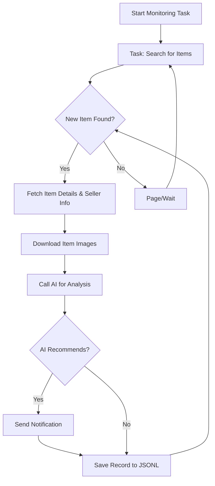

# 🤖 AI-Powered Goofish (闲鱼) Smart Monitor: Real-time Item Tracking with AI Analysis

**Tired of missing out on the perfect deal?** This project is a smart, AI-driven monitoring tool for the Goofish (闲鱼) marketplace, featuring a comprehensive Web UI for easy management and real-time analysis of listings.  It leverages AI to filter and analyze items, delivering instant notifications for the best finds.

[View the original repo on GitHub](https://github.com/dingyufei615/ai-goofish-monitor)

## 🔑 Key Features:

*   **Intuitive Web UI:** Manage tasks, edit AI standards, view logs, and browse results - all without command-line hassles.
*   **AI-Powered Task Creation:** Simply describe your desired item in natural language, and the AI will generate a complex filtering task.
*   **Concurrent Multi-Tasking:** Monitor multiple keywords simultaneously with independent task execution and no interference.
*   **Real-time Processing:** Analyze new listings instantly, avoiding delays.
*   **Deep AI Analysis:** Integrates multimodal LLMs (like GPT-4o) to analyze item descriptions, images, and seller profiles for precise filtering.
*   **Highly Customizable:** Configure unique keywords, price ranges, filters, and AI analysis prompts for each task.
*   **Instant Notifications:** Receive alerts via [ntfy.sh](https://ntfy.sh/), enterprise WeChat group bots, and [Bark](https://bark.day.app/) as soon as a matching item is found.
*   **Scheduled Task Execution:** Utilize Cron expressions to schedule tasks for automated monitoring.
*   **Docker-Friendly Deployment:** Deploy quickly and easily with provided `docker-compose` configurations.
*   **Robust Anti-Scraping:** Employs realistic user behavior, including random delays, for stable operation.

## 🖼️ Web UI Screenshots:

**Task Management Dashboard:**


**Monitoring Feed:**


**Notification Example (ntfy):**


## 🚀 Getting Started (Web UI Recommended)

The Web UI provides the best user experience for managing and interacting with the monitor.

### Step 1: Environment Setup

> ⚠️ **Python Version:**  Requires Python 3.10 or later for local deployment and debugging.  Earlier versions may cause dependency installation issues or runtime errors.

1.  Clone the repository:

    ```bash
    git clone https://github.com/dingyufei615/ai-goofish-monitor
    cd ai-goofish-monitor
    ```

2.  Install dependencies:

    ```bash
    pip install -r requirements.txt
    ```

### Step 2: Configuration

1.  **Configure Environment Variables:** Copy `.env.example` to `.env` and customize the settings.

    **Command Prompt (Windows):**

    ```cmd
    copy .env.example .env
    ```

    **Shell (Linux/macOS):**

    ```shell
    cp .env.example .env
    ```

    Available environment variables:

    | Variable           | Description                                                  | Required | Notes                                                                                                     |
    | :----------------- | :----------------------------------------------------------- | :------- | :-------------------------------------------------------------------------------------------------------- |
    | `OPENAI_API_KEY`   | Your AI model provider's API key.                            | Yes      | For some local or proxy services, this may be optional.                                                  |
    | `OPENAI_BASE_URL`  | Base URL for the AI model API (compatible with OpenAI format). | Yes      | Example: `https://ark.cn-beijing.volces.com/api/v3/`.                                                  |
    | `OPENAI_MODEL_NAME` | The name of the specific model you want to use.              | Yes      | **Must** select a multimodal model that supports image analysis, e.g., `doubao-seed-1-6-250615`, `gemini-2.5-pro`. |
    | `PROXY_URL`        | (Optional) HTTP/S proxy if you need to bypass a firewall.     | No       | Supports `http://` and `socks5://`. Example: `http://127.0.0.1:7890`.                                     |
    | `NTFY_TOPIC_URL`   | (Optional) [ntfy.sh](https://ntfy.sh/) topic URL for notifications.   | No       | Notifications will be skipped if empty.                                                                 |
    | `GOTIFY_URL`       | (Optional) Gotify service address.                            | No       | Example: `https://push.example.de`.                                                                      |
    | `GOTIFY_TOKEN`     | (Optional) Gotify application token.                           | No       |                                                                                                           |
    | `BARK_URL`         | (Optional) [Bark](https://bark.day.app/) push address.          | No       | Example: `https://api.day.app/your_key`.  Notifications will be skipped if empty.                         |
    | `WX_BOT_URL`       | (Optional) Enterprise WeChat group bot webhook URL.          | No       | Notifications will be skipped if empty.                                                                 |
    | `WEBHOOK_URL`      | (Optional) Generic Webhook URL.                             | No       | Notifications will be skipped if empty.                                                                 |
    | `WEBHOOK_METHOD`   | (Optional) Webhook request method.                           | No       | Supports `GET` or `POST`, defaults to `POST`.                                                            |
    | `WEBHOOK_HEADERS`  | (Optional) Custom headers for the Webhook.                   | No       | Must be a valid JSON string, e.g., `'{"Authorization": "Bearer xxx"}'`.                                     |
    | `WEBHOOK_CONTENT_TYPE` | (Optional) POST request content type. | No | Supports `JSON` or `FORM`, defaults to `JSON`. |
    | `WEBHOOK_QUERY_PARAMETERS` | (Optional) GET request query parameters. | No | JSON string, supports `{{title}}` and `{{content}}` placeholders. |
    | `WEBHOOK_BODY` | (Optional) POST request body. | No | JSON string, supports `{{title}}` and `{{content}}` placeholders. |
    | `LOGIN_IS_EDGE`    | Whether to use the Edge browser for login and scraping.      | No       | Defaults to `false` (Chrome/Chromium).                                                                  |
    | `PCURL_TO_MOBILE` | Whether to convert PC item links to mobile links in notifications. | No       | Defaults to `true`.                                                                                   |
    | `RUN_HEADLESS`     | Run the browser in headless mode.                            | No       | Defaults to `true`. Set to `false` for manual captcha handling during local debugging.  **Required `true` for Docker deployments.** |
    | `AI_DEBUG_MODE`    | Enable AI debugging mode.                                   | No       | Defaults to `false`.  Enables detailed AI request/response logging to the console.                         |
    | `SKIP_AI_ANALYSIS` | Skip AI analysis and send notifications directly.            | No       | Defaults to `false`. If `true`, all scraped items will be notified without AI analysis.                     |
    | `SERVER_PORT`      | Web UI server port.                                          | No       | Defaults to `8000`.                                                                                     |
    | `WEB_USERNAME`     | Web UI login username.                                       | No       | Defaults to `admin`.  **Change this in production!**                                                         |
    | `WEB_PASSWORD`     | Web UI login password.                                       | No       | Defaults to `admin123`.  **Use a strong password in production!**                                            |

    > 💡 **Debugging Tip:** If you encounter 404 errors when configuring the AI API, start by testing with the APIs provided by Alibaba Cloud or Volcano Engine to ensure the basic functionality is working before using other providers. Some API providers may have compatibility issues or require specific configurations.

    > 🔐 **Security Alert:** The Web UI uses Basic Authentication. The default username/password is `admin`/`admin123`.  **Change these credentials in a production environment!**

2.  **Get Login Status (Important!)**: The scraper needs valid login credentials to access Goofish.  We recommend using the Web UI for this:

    **Recommended: Using the Web UI**
    1.  Skip this step and proceed directly to Step 3 to start the Web server.
    2.  Once the Web UI is open, go to the **"System Settings"** page.
    3.  Locate "Login Status File" and click the **"Manual Update"** button.
    4.  Follow the detailed instructions in the pop-up window:
        - Install the [Goofish Login Status Extraction Extension](https://chromewebstore.google.com/detail/xianyu-login-state-extrac/eidlpfjiodpigmfcahkmlenhppfklcoa) in your Chrome browser on your personal computer.
        - Open and log in to the official Goofish website.
        - After a successful login, click the extension icon in your browser toolbar.
        - Click the "Extract Login Status" button to retrieve login information.
        - Click the "Copy to Clipboard" button.
        - Paste the copied content into the Web UI and save it.

    This method is the most convenient as it doesn't require running a program with a graphical interface on the server.

    **Alternative: Run the Login Script (if you have a local desktop)**
    If you can run programs locally or on a server with a desktop environment, you can use the traditional script method:

    ```bash
    python login.py
    ```

    This will open a browser window.  **Use the Goofish app on your phone to scan the QR code** to complete the login.  Upon successful login, the program will close automatically and generate an `xianyu_state.json` file in the project root directory.

### Step 3: Start the Web Server

Start the Web UI server after setting up the dependencies and configurations:

```bash
python web_server.py
```

### Step 4: Start Monitoring!

Open your browser and go to `http://127.0.0.1:8000`.

1.  Go to the **"Task Management"** page and click **"Create New Task"**.
2.  In the window, describe your desired item in natural language (e.g., "I want to buy a used Sony A7M4 camera, 95% new or better, budget under 13,000 yuan, shutter count less than 5000"), and fill in the task name and keywords.
3.  Click "Create", and the AI will automatically generate a sophisticated set of filtering criteria.
4.  Return to the main interface, schedule the task, or start it immediately to begin automated monitoring!

## 🐳 Docker Deployment (Recommended)

Docker simplifies deployment by packaging the application and its dependencies into a standardized unit.

### Step 1: Environment Preparation (Similar to Local Setup)

1.  **Install Docker:** Ensure you have [Docker Engine](https://docs.docker.com/engine/install/) installed.

2.  **Clone the project and configure:**

    ```bash
    git clone https://github.com/dingyufei615/ai-goofish-monitor
    cd ai-goofish-monitor
    ```

3.  **Create the `.env` file:**  Follow the instructions in the **[Getting Started](#-getting-started-web-ui-recommended)** section to create and populate the `.env` file in the project root.

4.  **Get Login Status (Critical!):**  You cannot scan the QR code to log in within the Docker container.  You *must* configure the login status *after* starting the container, using the Web UI:
    1.  (On your host machine) Run `docker-compose up -d` to start the services.
    2.  Open your browser and go to `http://127.0.0.1:8000`.
    3.  Navigate to the **"System Settings"** page and click the **"Manual Update"** button.
    4.  Follow the instructions in the popup window:
       - Install the [Goofish Login Status Extraction Extension](https://chromewebstore.google.com/detail/xianyu-login-state-extrac/eidlpfjiodpigmfcahkmlenhppfklcoa) in your Chrome browser on your personal computer.
       - Open and log in to the official Goofish website.
       - After a successful login, click the extension icon in your browser toolbar.
       - Click the "Extract Login Status" button to retrieve login information.
       - Click the "Copy to Clipboard" button.
       - Paste the copied content into the Web UI and save it.

> ℹ️ **About Python Version:** Docker deployments use the Python 3.11 version specified in the Dockerfile. You don't need to worry about local Python version compatibility.

### Step 2: Run the Docker Container

The project includes a `docker-compose.yaml` file.  Use `docker-compose` for easy container management.

In the project root, run:

```bash
docker-compose up --build -d
```

This will start the service in the background. `docker-compose` reads the `.env` file and `docker-compose.yaml` to build and launch the container.

If you encounter network issues inside the container, troubleshoot them or use a proxy.

> ⚠️ **OpenWrt Deployment Notes:**  You may encounter DNS resolution issues if deploying on an OpenWrt router. This is because the default network created by Docker Compose may not inherit OpenWrt's DNS settings correctly. If you see `ERR_CONNECTION_REFUSED`, check your container network configuration and potentially manually configure DNS or adjust the network mode to ensure the container can access the external network.

### Step 3: Access and Manage

-   **Access Web UI:** Open `http://127.0.0.1:8000` in your browser.
-   **View Real-time Logs:** `docker-compose logs -f`
-   **Stop the Container:** `docker-compose stop`
-   **Start a Stopped Container:** `docker-compose start`
-   **Stop and Remove Containers:** `docker-compose down`

## 📸 Web UI Feature Overview:

*   **Task Management:**
    *   **AI Task Creation:** Create monitoring tasks and related AI analysis criteria with natural language descriptions.
    *   **Visual Editing & Control:** Directly modify task parameters (keywords, price, scheduling) in a table and start/stop/delete individual tasks.
    *   **Scheduled Execution:** Use Cron expressions for automated, periodic task runs.
*   **Result Viewing:**
    *   **Card View Browsing:** Display eligible items clearly in a card format with images and information.
    *   **Smart Filtering & Sorting:** Filter all items tagged as "recommended" by AI and sort them based on various criteria like crawling time, publication time, and price.
    *   **Detailed Information:** Click to view comprehensive item data and detailed AI analysis results in JSON format.
*   **Running Logs:**
    *   **Real-time Log Stream:** View detailed crawler logs in real-time on the web to track progress and troubleshoot issues.
    *   **Log Management:** Support auto-refresh, manual refresh, and one-click clearing of logs.
*   **System Settings:**
    *   **Status Check:** Verify the proper functioning of critical dependencies like the `.env` configuration and login status.
    *   **Prompt Editing:** Edit and save the `prompt` file used for AI analysis directly in the web UI to refine the AI's reasoning in real-time.

## 🚀 Workflow:

The diagram below illustrates the core process for a single monitoring task, from initiation to completion. In practice, `web_server.py` acts as the main service, starting one or more task processes based on user interactions or schedule.



## 🔐 Web UI Authentication

### Authentication Configuration

The Web UI employs Basic Authentication to protect access to the management interface and APIs, ensuring that only authorized users can access them.

#### Configuration Method

Set authentication credentials in the `.env` file:

```bash
# Web Service Authentication Configuration
WEB_USERNAME=admin
WEB_PASSWORD=admin123
```

#### Default Credentials

If authentication credentials are not configured in the `.env` file, the system will use these defaults:

-   Username: `admin`
-   Password: `admin123`

**⚠️ Important: Change the default password in a production environment!**

#### Authentication Scope

-   **Requires Authentication**: All API endpoints, Web interface, and static resources.
-   **No Authentication Required**: Health check endpoint (`/health`).

#### Usage

1.  **Browser Access**:  The authentication dialog will appear when you access the Web interface.
2.  **API Calls**:  Include Basic Authentication information in the request headers when making API calls.
3.  **Frontend JavaScript**:  Authentication is handled automatically; no changes are needed.

#### Security Recommendations

1.  Change the default password to a strong password.
2.  Use the HTTPS protocol in a production environment.
3.  Regularly rotate your authentication credentials.
4.  Limit access IP ranges through a firewall.

See [AUTH_README.md](AUTH_README.md) for detailed configuration instructions.

## ❓ Frequently Asked Questions (FAQ)

Find answers to common questions, covering everything from environment setup and AI configuration to anti-scraping strategies, in our comprehensive FAQ document.

👉 **[Click here to view the Frequently Asked Questions (FAQ.md)](FAQ.md)**

## 🙏 Acknowledgements

This project draws inspiration from and is built upon the following excellent projects:

-   [superboyyy/xianyu_spider](https://github.com/superboyyy/xianyu_spider)

And thanks to the script contributions from:

-   [@jooooody](https://linux.do/u/jooooody/summary)

And thanks to the [LinuxDo](https://linux.do/) community.

And thanks to ClaudeCode/Aider/Gemini tools.

## Support & Sponsoring

If this project is helpful, please consider supporting me with buy a coffee! Your support is greatly appreciated.

<table>
  <tr>
    <td></td>
    <td></td>
  </tr>
</table>

## ⚠️ Important Notes

-   Please adhere to Goofish's user agreements and `robots.txt` rules. Avoid excessive requests to prevent server overload or account restrictions.
-   This project is for educational and technical research purposes only. Do not use it for illegal activities.
-   This project is released under the [MIT License](LICENSE) and is provided "as is" without any warranty.
-   The project author and contributors are not responsible for any direct, indirect, incidental, or special damages or losses resulting from the use of this software.
-   For more details, please review the [DISCLAIMER.md](DISCLAIMER.md) file.

[](https://star-history.com/#dingyufei615/ai-goofish-monitor&Date)