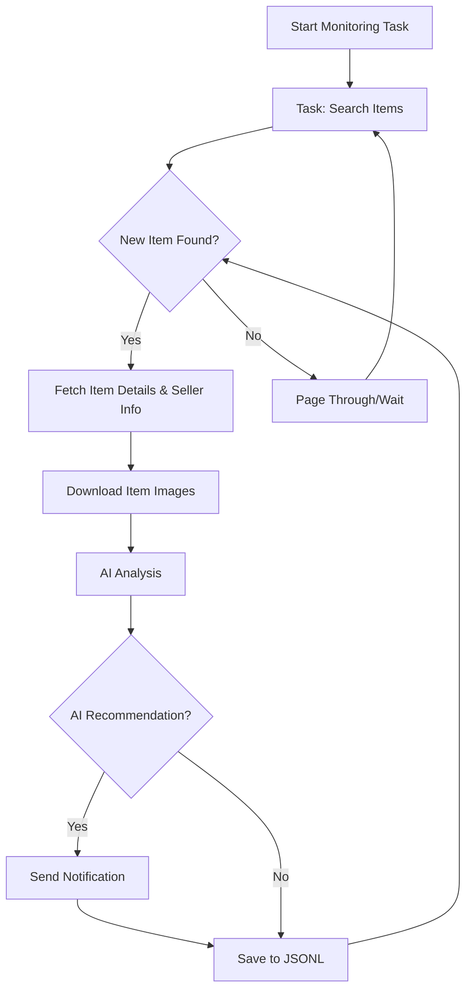

# AI-Powered Goofish (Xianyu) Monitor: Intelligent Item Tracking with Web UI

**Tired of missing out on the best deals?**  This project uses AI and Playwright to monitor Xianyu (Goofish) for you, providing real-time alerts and intelligent item analysis via a user-friendly Web UI.  [View the original repository](https://github.com/dingyufei615/ai-goofish-monitor).

## Key Features:

*   ✅ **Intuitive Web UI:** Manage tasks, edit AI criteria, view logs, and filter results all through a comprehensive web interface.
*   🤖 **AI-Driven Task Creation:**  Describe your desired item in natural language, and the system will generate a monitoring task with complex filtering logic.
*   ⚙️ **Concurrent Multi-Tasking:** Monitor multiple keywords simultaneously, each running independently without interference, defined by `config.json`.
*   ⚡ **Real-Time Processing:** Analyze new listings instantly, eliminating batch processing delays.
*   🧠 **Deep AI Analysis:** Leverages multimodal large language models (e.g., GPT-4o) to analyze item descriptions, images, and seller profiles for superior filtering.
*   🎯 **Highly Customizable:** Configure individual keywords, price ranges, filtering conditions, and AI analysis prompts for each monitoring task.
*   🔔 **Instant Notifications:** Receive immediate alerts via [ntfy.sh](https://ntfy.sh/), WeChat group bots, and [Bark](https://bark.day.app/) to your phone or desktop.
*   🗓️ **Scheduled Task Execution:** Utilize Cron expressions to schedule each task independently for automated monitoring.
*   🐳 **Dockerized Deployment:** Deploy quickly and consistently using the provided `docker-compose` configuration.
*   🛡️ **Robust Anti-Scraping:** Employs human-like interactions, including random delays and user behavior simulation, for increased stability.

## Core Functionality - A Glimpse

The image below illustrates the workflow, from the start of a monitoring task to its completion.



## Getting Started: Web UI (Recommended)

The Web UI offers the best user experience for managing the project.

### Step 1: Environment Setup

> ⚠️ **Python Version:**  Python 3.10+ is recommended for local deployment and debugging. Earlier versions may cause dependency installation failures or runtime errors (e.g., `ModuleNotFoundError: No module named 'PIL'`).

1.  Clone the repository:

    ```bash
    git clone https://github.com/dingyufei615/ai-goofish-monitor
    cd ai-goofish-monitor
    ```

2.  Install dependencies:

    ```bash
    pip install -r requirements.txt
    ```

### Step 2: Configuration

1.  **Configure Environment Variables:**  Copy `.env.example` to `.env` and edit it.

    Windows:

    ```cmd
    copy .env.example .env
    ```

    Linux/macOS:

    ```shell
    cp .env.example .env
    ```

    Here are the available configuration variables:

    | Environment Variable   | Description                                                                                                                               | Required? | Notes                                                                                                                                                |
    | :--------------------- | :------------------------------------------------------------------------------------------------------------------------------------------ | :-------- | :--------------------------------------------------------------------------------------------------------------------------------------------------- |
    | `OPENAI_API_KEY`       | Your AI model provider's API key.                                                                                                           | Yes       | May be optional for local or specific proxy services.                                                                                                   |
    | `OPENAI_BASE_URL`      | The API endpoint for your AI model, compatible with OpenAI format.                                                                         | Yes       |  Provide the base URL for your API, like `https://ark.cn-beijing.volces.com/api/v3/`.                                                                  |
    | `OPENAI_MODEL_NAME`    | The specific model you wish to use.                                                                                                       | Yes       | **Must** select a multimodal model that supports image analysis, such as `doubao-seed-1-6-250615` or `gemini-2.5-pro`.                                   |
    | `PROXY_URL`            | (Optional) HTTP/S proxy configuration if you need to bypass network restrictions.                                                        | No        | Supports `http://` and `socks5://` formats.  Example: `http://127.0.0.1:7890`.                                                                      |
    | `NTFY_TOPIC_URL`       | (Optional) [ntfy.sh](https://ntfy.sh/) topic URL for notifications.                                                                         | No        | If empty, no ntfy notifications will be sent.                                                                                                           |
    | `GOTIFY_URL`           | (Optional) Gotify service address.                                                                                                        | No        | Example: `https://push.example.de`.                                                                                                                  |
    | `GOTIFY_TOKEN`         | (Optional) Gotify app token.                                                                                                             | No        |                                                                                                                                                      |
    | `BARK_URL`             | (Optional) [Bark](https://bark.day.app/) push address.                                                                                     | No        | Example: `https://api.day.app/your_key`.  No Bark notifications if empty.                                                                           |
    | `WX_BOT_URL`           | (Optional) WeChat group bot Webhook address.                                                                                              | No        | No WeChat notifications if empty.                                                                                                                   |
    | `WEBHOOK_URL`          | (Optional) Generic Webhook URL.                                                                                                           | No        | No generic Webhook notifications if empty.                                                                                                          |
    | `WEBHOOK_METHOD`       | (Optional) Webhook request method (GET or POST, defaults to POST).                                                                      | No        |                                                                                                                                                      |
    | `WEBHOOK_HEADERS`      | (Optional) Custom headers for the Webhook (must be a valid JSON string).                                                                   | No        |  Example: `'{"Authorization": "Bearer xxx"}'`.                                                                                                    |
    | `WEBHOOK_CONTENT_TYPE` | (Optional) Content type for POST requests (JSON or FORM, defaults to JSON).                                                            | No        |                                                                                                                                                      |
    | `WEBHOOK_QUERY_PARAMETERS` | (Optional) Query parameters for GET requests (JSON string with `{{title}}` and `{{content}}` placeholders).                                         | No        |                                                                                                                                                      |
    | `WEBHOOK_BODY`         | (Optional) Request body for POST requests (JSON string with `{{title}}` and `{{content}}` placeholders).                                           | No        |                                                                                                                                                      |
    | `LOGIN_IS_EDGE`        | Whether to use Edge browser for login and crawling.                                                                                       | No        | Defaults to `false` (Chrome/Chromium).                                                                                                                 |
    | `PCURL_TO_MOBILE`      | Whether to convert the PC link of items into mobile links in the notifications.                                                             | No        | Defaults to `true`.                                                                                                                                    |
    | `RUN_HEADLESS`         | Whether to run the crawler browser in headless mode.                                                                                        | No        | Defaults to `true`.  Set to `false` for local debugging when encountering captchas.  **Must be `true` for Docker deployments.**                     |
    | `AI_DEBUG_MODE`        | Whether to enable AI debugging mode.                                                                                                       | No        | Defaults to `false`. Enables detailed AI request and response logs in the console.                                                                      |
    | `SERVER_PORT`          | Web UI server port.                                                                                                                        | No        | Defaults to `8000`.                                                                                                                                      |
    | `WEB_USERNAME`         | Web UI login username.                                                                                                                      | No        | Defaults to `admin`.  **Change this in production.**                                                                                                     |
    | `WEB_PASSWORD`         | Web UI login password.                                                                                                                      | No        | Defaults to `admin123`.  **Change this to a strong password in production.**                                                                           |

    > 💡 **Debugging Tip:** If you encounter 404 errors when configuring your AI API, try testing with APIs from Alibaba Cloud or Volcano Engine first to confirm basic functionality before switching providers, as some APIs might have compatibility issues or require special configurations.

    > 🔐 **Security Warning:** The Web UI uses Basic Authentication. The default username and password are `admin` / `admin123`.  **Change these to strong credentials in production!**

2.  **Obtain Login State (Critical!)**: The crawler needs a valid login credential to access Xianyu. The recommended approach is via the Web UI.

    **Recommended:  Web UI Method**

    1.  Start the Web server (Step 3) and access the UI.
    2.  Go to "System Settings".
    3.  Click "Manual Update" under "Login State File".
    4.  Follow the instructions:
        -   Install the [Xianyu Login State Extractor Chrome extension](https://chromewebstore.google.com/detail/xianyu-login-state-extrac/eidlpfjiodpigmfcahkmlenhppfklcoa).
        -   Open and log in to Xianyu on the official website.
        -   Click the extension icon, and then click "Extract Login State."
        -   Copy the extracted login information to the clipboard.
        -   Paste the clipboard content into the Web UI and save it.

    **Alternative:  Login Script (if you can run a program with a GUI)**

    ```bash
    python login.py
    ```

    This will open a browser window.  Use the Xianyu app on your phone to scan the QR code and log in.  The script will close automatically and create an `xianyu_state.json` file in the project root.

### Step 3: Start the Web Server

```bash
python web_server.py
```

### Step 4: Start Monitoring

1.  Open your browser and go to `http://127.0.0.1:8000`.
2.  In **“Task Management”**, click **“Create New Task”**.
3.  Describe your desired item in natural language (e.g., "I want to buy a Sony A7M4 camera, 95% new or better, budget under 13,000, shutter count below 5000"), and fill in the task name and keywords.
4.  Click create, and the AI will generate the complex analysis conditions.
5.  Back on the main page, you can add a schedule or just start the task.
6.  View your results in the main interface.

## Deploying with Docker (Recommended)

Docker simplifies deployment by packaging the application and its dependencies into a standardized unit.

### Step 1:  Environment Preparation (Similar to Local Deployment)

1.  **Install Docker:**  Make sure [Docker Engine](https://docs.docker.com/engine/install/) is installed on your system.
2.  **Clone & Configure the Project:**

    ```bash
    git clone https://github.com/dingyufei615/ai-goofish-monitor
    cd ai-goofish-monitor
    ```

3.  **Create the `.env` File:** Follow the instructions in the **[Getting Started](#getting-started-web-ui-recommended)** section to create and populate the `.env` file in the project root.
4.  **Obtain Login State (Essential!)**:  Since you can't scan a QR code within a Docker container, set the login state *after* starting the container via the Web UI.
    1.  (On the host machine) Run `docker-compose up -d` to start the service.
    2.  Open `http://127.0.0.1:8000` in your browser.
    3.  Go to "System Settings".
    4.  Click "Manual Update" under "Login State File".
    5.  Follow the instructions in the Web UI to retrieve the login information with the extension, and save it.

    > ℹ️ **Regarding Python Version:** Docker deployments use the Python 3.11 version specified in the Dockerfile, so you don't need to worry about local Python compatibility issues.

### Step 2:  Run the Docker Container

The project includes a `docker-compose.yaml` file.

In the project root directory, run:

```bash
docker-compose up --build -d
```

This will start the service in detached mode.  `docker-compose` automatically uses the configurations in `.env` and `docker-compose.yaml`.

If you encounter network problems inside the container, troubleshoot the network configuration or use a proxy.

> ⚠️ **OpenWrt Deployment Note:**  If you deploy on an OpenWrt router, DNS resolution issues can occur due to the default Docker Compose network's inability to inherit the OpenWrt DNS settings. If you see `ERR_CONNECTION_REFUSED`, check your container network configuration and configure DNS settings manually or adjust the network mode to ensure external network access.

### Step 3: Access & Management

*   **Access Web UI:** Open `http://127.0.0.1:8000` in your browser.
*   **View Real-Time Logs:** `docker-compose logs -f`
*   **Stop Container:** `docker-compose stop`
*   **Start Stopped Container:** `docker-compose start`
*   **Stop and Remove Container:** `docker-compose down`

## Web UI Features at a Glance:

*   **Task Management:**
    *   **AI-Powered Task Creation:** Generate monitoring tasks with natural language descriptions.
    *   **Visual Editing & Control:** Edit task parameters (keywords, price, scheduling) and individually start/stop/delete tasks via a table.
    *   **Scheduled Execution:** Utilize Cron expressions for automated periodic runs.
*   **Results Viewing:**
    *   **Card-Based Browsing:** Clearly display each item meeting your criteria in a card format.
    *   **Intelligent Filtering & Sorting:** Filter for AI-recommended items and sort by crawl time, posting time, price, and other options.
    *   **Deep Dive Details:** View complete data captures and detailed AI analysis results for each item.
*   **Runtime Logging:**
    *   **Real-time Log Stream:** View detailed logs of the crawler's operations in real-time, making it easy to track progress and troubleshoot issues.
    *   **Log Management:** Automatic refresh, manual refresh, and one-click log clearing.
*   **System Settings:**
    *   **Status Check:** One-click check of the `.env` configuration and login status of key dependencies.
    *   **Prompt Editing:** Edit and save the prompt files used for AI analysis directly on the web page, allowing you to adjust the AI's reasoning logic.

## Authentication for the Web Interface

### Authentication Configuration

The Web Interface uses Basic Authentication to protect the management interface and APIs, ensuring that only authorized users have access.

#### Configuration

Set your authentication credentials in the `.env` file:

```bash
# Web Service Authentication Configuration
WEB_USERNAME=admin
WEB_PASSWORD=admin123
```

#### Default Credentials

If authentication credentials are not set in the `.env` file, the following defaults are used:
- Username: `admin`
- Password: `admin123`

**⚠️ Important: Change the default password in production!**

#### Authentication Scope

- **Requires Authentication:** All API endpoints, the Web Interface, and static resources.
- **Does Not Require Authentication:** The health check endpoint (`/health`).

#### Usage

1. **Browser Access**: The authentication dialog will pop up when you access the Web Interface.
2. **API Calls**: Include the Basic Authentication information in the request header when calling the API.
3. **Frontend JavaScript**: Authentication is handled automatically; no modification is needed.

#### Security Recommendations

1. Change the default password to a strong password.
2. Use HTTPS in production.
3. Change authentication credentials regularly.
4. Limit the access IP range via a firewall.

More detailed configuration information can be found in the [AUTH_README.md](AUTH_README.md) file.

## Frequently Asked Questions (FAQ)

Comprehensive FAQs are available to assist you.

👉 **[Click here to view the Frequently Asked Questions (FAQ.md)](FAQ.md)**

## Acknowledgements

This project is based on the following open-source projects. Thank you!

-   [superboyyy/xianyu_spider](https://github.com/superboyyy/xianyu_spider)
-   [@jooooody](https://linux.do/u/jooooody/summary)
-   [LinuxDo](https://linux.do/)
-  And, thanks to ClaudeCode/Aider/Gemini tools which make development faster.

## Support & Sponsoring

If you find this project helpful, consider supporting it:

<table>
  <tr>
    <td></td>
    <td></td>
  </tr>
</table>

## ⚠️ Disclaimer

-   Please abide by Xianyu's user agreement and robots.txt rules. Do not send requests too frequently to avoid server load or account restrictions.
-   This project is for learning and technical research purposes only. Do not use it for illegal activities.
-   This project is released under the [MIT License](LICENSE) and is provided "as is" without any warranty.
-   The project author and contributors are not liable for any direct, indirect, incidental, or special damages or losses resulting from the use of this software.
-   For more information, please review the [Disclaimer](DISCLAIMER.md) file.

[](https://star-history.com/#dingyufei615/ai-goofish-monitor&Date)