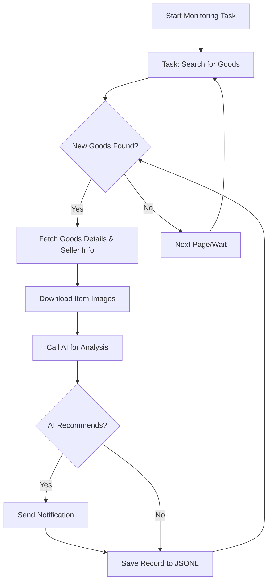

# AI-Powered Goofish (Xianyu) Monitor: Real-time Monitoring with Smart Analysis

**Tired of missing out on deals?**  This project provides an AI-driven, web-based solution for real-time monitoring and intelligent analysis of Goofish (Xianyu) listings, helping you find the perfect items quickly and efficiently.  [Explore the original repo](https://github.com/dingyufei615/ai-goofish-monitor) for the latest updates and contributions.

## Key Features:

*   ✅ **Intuitive Web UI:** Manage tasks, edit AI criteria, view logs, and filter results with an easy-to-use web interface.
*   🤖 **AI-Driven Task Creation:** Describe your desired item in natural language, and the AI will generate a comprehensive monitoring task.
*   ⚙️ **Multi-Task Concurrency:** Monitor multiple keywords simultaneously, each running independently.
*   ⚡️ **Real-time Processing:** Analyze new listings immediately for timely notifications.
*   🧠 **Deep AI Analysis:** Leverage multimodal large language models (like GPT-4o) to analyze images, text, and seller profiles for precise filtering.
*   🛠️ **Highly Customizable:** Configure keywords, price ranges, filters, and AI prompts for each monitoring task.
*   🔔 **Instant Notifications:** Receive alerts via [ntfy.sh](https://ntfy.sh/), WeChat Group Robot, and [Bark](https://bark.day.app/).
*   📅 **Scheduled Tasks:** Utilize Cron expressions for automated task scheduling.
*   🐳 **Docker Deployment:**  Easy deployment with provided `docker-compose` configuration.
*   🛡️ **Robust Anti-Scraping:** Employs realistic user behavior and delays to improve stability.

##  Screenshots

*   **Task Management:**  
*   **Monitoring:**  
*   **Notification Example:**  

## Getting Started:  Web UI (Recommended)

The Web UI provides the best user experience.

### Step 1:  Prerequisites

>   ⚠️ **Python Version:**  Python 3.10 or higher is recommended for local deployment. Lower versions may cause dependency installation issues.

1.  Clone the repository:

    ```bash
    git clone https://github.com/dingyufei615/ai-goofish-monitor
    cd ai-goofish-monitor
    ```

2.  Install dependencies:

    ```bash
    pip install -r requirements.txt
    ```

### Step 2: Configuration

1.  **Environment Variables:** Copy `.env.example` to `.env` and configure the settings.

    *   **Windows:**
        ```cmd
        copy .env.example .env
        ```
    *   **Linux/macOS:**
        ```bash
        cp .env.example .env
        ```

    Configuration options in `.env`:

    | Variable          | Description                                    | Required | Notes                                                                                                                               |
    | :---------------- | :--------------------------------------------- | :------- | :---------------------------------------------------------------------------------------------------------------------------------- |
    | `OPENAI_API_KEY`  | Your AI model provider's API key.              | Yes      |                                                                                                                                   |
    | `OPENAI_BASE_URL` | AI model API endpoint (OpenAI compatible).    | Yes      | For example: `https://ark.cn-beijing.volces.com/api/v3/`.                                                                        |
    | `OPENAI_MODEL_NAME` | Specific model name.                          | Yes      |  Must choose a multimodal model like `doubao-seed-1-6-250615`, `gemini-2.5-pro`, etc.                                             |
    | `PROXY_URL`       | (Optional) HTTP/S proxy for bypassing firewalls. | No       | Supports `http://` and `socks5://` formats.                                                                                           |
    | `NTFY_TOPIC_URL`  | (Optional) [ntfy.sh](https://ntfy.sh/) topic URL.  | No       |                                                                                                                                   |
    | `GOTIFY_URL`      | (Optional) Gotify server address.              | No       |                                                                                                                                   |
    | `GOTIFY_TOKEN`    | (Optional) Gotify application token.           | No       |                                                                                                                                   |
    | `BARK_URL`        | (Optional) [Bark](https://bark.day.app/) push address.  | No       |                                                                                                                                   |
    | `WX_BOT_URL`      | (Optional) WeChat Group Robot Webhook URL.     | No       |                                                                                                                                   |
    | `WEBHOOK_URL`     | (Optional) Generic Webhook URL.                | No       |                                                                                                                                   |
    | `WEBHOOK_METHOD`  | (Optional) Webhook request method (`GET` or `POST`). | No       | Defaults to `POST`.                                                                                                             |
    | `WEBHOOK_HEADERS` | (Optional) Custom headers for Webhook requests. | No       | Must be a valid JSON string, e.g., `'{"Authorization": "Bearer xxx"}'`.                                                            |
    | `WEBHOOK_CONTENT_TYPE` | (Optional)  Content type for POST requests. | No       | Supports `JSON` or `FORM`, defaults to `JSON`.                                                                                   |
    | `WEBHOOK_QUERY_PARAMETERS` | (Optional)  GET request query parameters. | No       |  JSON string.                                                                                                                |
    | `WEBHOOK_BODY`    | (Optional) POST request body.                | No       |  JSON string.                                                                                                                |
    | `LOGIN_IS_EDGE`    | Use Edge browser for login and crawling.  | No       |  Defaults to `false` (Chrome/Chromium).                                                                                         |
    | `PCURL_TO_MOBILE`    | Convert PC links to mobile links in notifications.  | No       |  Defaults to `true`.                                                                                         |
    | `RUN_HEADLESS`    | Run the browser in headless mode.              | No       | Defaults to `true`.  Set to `false` for local debugging if facing CAPTCHA issues.  **Must be `true` for Docker deployment.** |
    | `AI_DEBUG_MODE`   | Enable AI debugging mode.                    | No       | Defaults to `false`.                                                                                                                |
    | `SKIP_AI_ANALYSIS`  | Skip AI analysis.                              | No       | Defaults to `false`.                                                                                                                |
    | `SERVER_PORT`     | Web UI port.                                  | No       | Defaults to `8000`.                                                                                                                |
    | `WEB_USERNAME`    | Web UI login username.                        | No       | Defaults to `admin`.  **Change in production!**                                                                                  |
    | `WEB_PASSWORD`    | Web UI login password.                        | No       | Defaults to `admin123`.  **Change in production!**                                                                               |

    >   💡 **Debugging Tip:** If you encounter a 404 error when configuring the AI API, try using an API from Alibaba Cloud or Volcano Engine for debugging first to ensure basic functionality.

    >   🔐 **Security Reminder:** The Web UI uses Basic Authentication.  Change the default username/password (`admin` / `admin123`) in production!

2.  **Get Login State (Important!)**:  You need valid login credentials to access Xianyu.  We recommend using the Web UI:

    *   **Recommended:  Web UI Method**
        1.  Start the Web service (Step 3).
        2.  Open the Web UI and go to "System Settings."
        3.  Find "Login State File" and click "Manual Update."
        4.  Follow the instructions in the pop-up:
            *   Install the [Xianyu login state extraction extension](https://chromewebstore.google.com/detail/xianyu-login-state-extrac/eidlpfjiodpigmfcahkmlenhppfklcoa) in Chrome.
            *   Log in to the Xianyu website.
            *   Click the extension icon, then "Extract Login State."
            *   Click "Copy to Clipboard."
            *   Paste the content into the Web UI and save.

    *   **Alternative:  Run Login Script** (If you can run a graphical program locally or on a server with a desktop environment.)

        ```bash
        python login.py
        ```

        A browser window will open.  **Use the Xianyu App to scan the QR code to log in.**  The script will then close, and a `xianyu_state.json` file will be created in the project root.

### Step 3: Start Web Server

Start the Web UI server after configuration.

```bash
python web_server.py
```

### Step 4:  Start Monitoring

1.  Open `http://127.0.0.1:8000` in your browser.
2.  Go to "Task Management" and click "Create New Task."
3.  Describe your purchase needs in natural language (e.g., "Looking for a used Sony A7M4 camera, 95% new or better, budget under $1000, shutter count below 5000"). Fill in the task name and keywords.
4.  Click "Create."  The AI will generate the analysis criteria.
5.  Start or schedule the task to begin automated monitoring!

## Docker Deployment (Recommended)

Docker simplifies deployment by packaging the application and its dependencies.

### Step 1: Environment Preparation (Similar to Local)

1.  **Install Docker:**  Ensure Docker Engine is installed on your system ([Docker Engine Installation](https://docs.docker.com/engine/install/)).

2.  **Clone and Configure:**

    ```bash
    git clone https://github.com/dingyufei615/ai-goofish-monitor
    cd ai-goofish-monitor
    ```

3.  **Create `.env` File:** Create and populate the `.env` file as described in the [Getting Started](#getting-started-web-ui-recommended) section.

4.  **Get Login State (Critical!)**: You'll set the login state *after* the container starts, using the Web UI:
    1.  Run `docker-compose up -d` (in your host OS) to start the service.
    2.  Open `http://127.0.0.1:8000` in your browser.
    3.  Go to "System Settings" and click "Manual Update."
    4.  Follow the instructions in the pop-up:
            *   Install the [Xianyu login state extraction extension](https://chromewebstore.google.com/detail/xianyu-login-state-extrac/eidlpfjiodpigmfcahkmlenhppfklcoa) in Chrome.
            *   Log in to the Xianyu website.
            *   Click the extension icon, then "Extract Login State."
            *   Click "Copy to Clipboard."
            *   Paste the content into the Web UI and save.

>   ℹ️ **Python Version:** Docker uses Python 3.11 specified in the Dockerfile; no need to worry about local Python version compatibility.

### Step 2: Run Docker Container

The project includes `docker-compose.yaml`.  Use `docker-compose` for convenient container management.

Run in the project root:

```bash
docker-compose up --build -d
```

This will start the service in the background.  `docker-compose` reads the `.env` file and `docker-compose.yaml` to build and start the container.

If you encounter network issues within the container, troubleshoot or use a proxy.

>   ⚠️ **OpenWrt Deployment:** If deploying on an OpenWrt router, you may encounter DNS resolution problems due to how Docker Compose creates the network. If you see `ERR_CONNECTION_REFUSED`, check your container's network configuration.

### Step 3: Access and Management

*   **Access Web UI:** Open `http://127.0.0.1:8000` in your browser.
*   **View Real-time Logs:** `docker-compose logs -f`
*   **Stop Container:** `docker-compose stop`
*   **Start Stopped Container:** `docker-compose start`
*   **Stop and Remove Container:** `docker-compose down`

## Web UI Features Overview

*   **Task Management:**
    *   AI-Powered Task Creation: Create monitoring tasks with natural language descriptions.
    *   Visual Editing and Control: Modify task parameters (keywords, prices, schedules) directly in a table, and start/stop/delete tasks.
    *   Scheduled Tasks: Configure Cron expressions for automated, periodic runs.
*   **Result Viewing:**
    *   Card View: View compliant goods, with clear images.
    *   Smart Filtering and Sorting: Sort by time, price, and find AI-recommended items.
    *   Deep Detail: Access the full fetched data and AI analysis results.
*   **Running Logs:**
    *   Real-time Log Stream: View detailed crawler logs on the webpage, helpful for monitoring progress and debugging.
    *   Log Management: Support automatic refresh, manual refresh, and one-click clearing of logs.
*   **System Settings:**
    *   Status Check: Check `.env` configuration, login state, and other critical dependencies.
    *   Prompt Online Editing: Edit and save prompt files for AI analysis directly in the web UI.

## Workflow Diagram



## Web UI Authentication

### Authentication Configuration

The Web UI utilizes Basic Authentication to ensure access to the management interface and APIs is restricted to authorized users only.

#### Configuration Method

Set authentication credentials in the `.env` file:

```bash
# Web service authentication configuration
WEB_USERNAME=admin
WEB_PASSWORD=admin123
```

#### Default Credentials

If authentication credentials are not set in the `.env` file, the system will use the following defaults:

*   Username: `admin`
*   Password: `admin123`

**⚠️ Important: Change the default password in production!**

#### Authentication Scope

*   **Requires Authentication**: All API endpoints, web interface, and static resources.
*   **Does Not Require Authentication**: Health check endpoint (`/health`).

#### Usage

1.  **Browser Access**: The authentication dialog will pop up when accessing the Web UI.
2.  **API Calls**: Include Basic Authentication information in the request headers.
3.  **Frontend JavaScript**: The authentication will be handled automatically; no modifications are needed.

#### Security Recommendations

1.  Change the default password to a strong password.
2.  Use HTTPS protocol in production environments.
3.  Regularly change authentication credentials.
4.  Restrict the IP range for access via firewall.

For detailed configuration instructions, please refer to [AUTH_README.md](AUTH_README.md).

## Frequently Asked Questions (FAQ)

A comprehensive FAQ document covers environment setup, AI settings, and anti-scraping strategies.

👉 **[Click here to view the Frequently Asked Questions (FAQ.md)](FAQ.md)**

## Acknowledgments

This project was inspired by and references the following projects and resources:

-   [superboyyy/xianyu_spider](https://github.com/superboyyy/xianyu_spider)

And thanks to the contributions from LinuxDo community:

-   [@jooooody](https://linux.do/u/jooooody/summary)

And thanks to [LinuxDo](https://linux.do/) community.

And thanks to ClaudeCode/ModelScope/Gemini and other model/tools, enjoy the joy of Vibe Coding.

## Experience
90%+ of the project code is generated by AI.

## ⚠️ Important Notes

*   Respect Xianyu's user agreements and robots.txt rules.  Avoid excessively frequent requests to prevent account restrictions.
*   This project is for learning and technical research only; do not use it for illegal purposes.
*   The project is released under the [MIT License](LICENSE).
*   The project author and contributors are not responsible for any direct, indirect, incidental, or special damages or losses resulting from the use of this software.
*   See the [DISCLAIMER.md](DISCLAIMER.md) file for more details.

[](https://star-history.com/#dingyufei615/ai-goofish-monitor&Date)