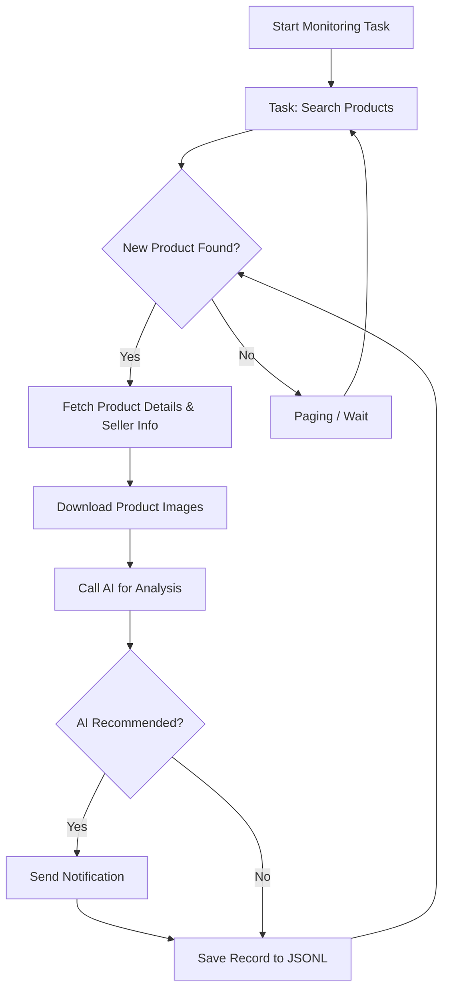

# AI-Powered Goofish (闲鱼) Monitor: Real-time Product Alerts and Intelligent Analysis

**Effortlessly monitor Goofish (闲鱼) for desired items with AI-driven analysis, real-time notifications, and a user-friendly web interface.  [View the original repository](https://github.com/dingyufei615/ai-goofish-monitor)**

## Key Features

*   **Web UI for easy management**: Manage tasks, edit AI rules, view logs, and filter results through a complete web interface.
*   **AI-driven task creation**:  Create monitoring tasks with natural language descriptions; the AI interprets your needs.
*   **Concurrent multi-task monitoring**: Monitor multiple keywords simultaneously with independent task execution.
*   **Real-time streaming analysis**: Analyze new listings immediately without batch processing delays.
*   **Deep AI analysis**:  Leverages multimodal LLMs (e.g., GPT-4o) for in-depth analysis based on product details and seller profiles.
*   **Highly customizable**: Configure individual keywords, price ranges, filtering criteria, and AI analysis prompts for each task.
*   **Instant notifications**: Receive alerts via ntfy.sh, WeChat Work group bots, and Bark for timely updates.
*   **Scheduled task execution**: Utilize Cron expressions for automated task scheduling.
*   **Docker for one-click deployment**: Deploy quickly and consistently using the provided `docker-compose` configuration.
*   **Robust anti-scraping measures**:  Mimics human behavior with random delays and user actions to enhance stability.

## Screenshots

**Task Management (Web UI)**


**Monitoring Dashboard (Web UI)**


**Notification Example (ntfy)**


## Getting Started

### Prerequisites

*   **Python 3.10+ is recommended**:  Older Python versions might cause dependency installation issues or runtime errors (e.g., `ModuleNotFoundError: No module named 'PIL'`).

### Installation

1.  **Clone the repository:**

    ```bash
    git clone https://github.com/dingyufei615/ai-goofish-monitor
    cd ai-goofish-monitor
    ```

2.  **Install dependencies:**

    ```bash
    pip install -r requirements.txt
    ```

### Configuration

1.  **Configure environment variables**: Copy `.env.example` to `.env` and fill in your settings.

    *   **Windows:**
        ```cmd
        copy .env.example .env
        ```

    *   **Linux/MacOS:**
        ```shell
        cp .env.example .env
        ```

    **`.env` File Variables:**

    | Environment Variable | Description                                        | Required | Notes                                                                                                                                                                                 |
    | :------------------- | :------------------------------------------------- | :------- | :------------------------------------------------------------------------------------------------------------------------------------------------------------------------------------ |
    | `OPENAI_API_KEY`     | Your AI model service provider's API key.            | Yes      | May be optional for some local or specific proxy services.                                                                                                                         |
    | `OPENAI_BASE_URL`    | AI model API endpoint, compatible with OpenAI format. | Yes      | Enter the base URL of the API, e.g., `https://ark.cn-beijing.volces.com/api/v3/`.                                                                                                  |
    | `OPENAI_MODEL_NAME`  | The specific model name you want to use.           | Yes      | **Required** Choose a multimodal model that supports image analysis, such as `doubao-seed-1-6-250615` or `gemini-2.5-pro`.                                                            |
    | `PROXY_URL`          | (Optional) HTTP/S proxy settings for bypassing the firewall.  | No       | Supports `http://` and `socks5://` formats, e.g., `http://127.0.0.1:7890`.                                                                                                   |
    | ...                  | ...                                                | ...      |  See the original README for a complete list of environment variables related to notifications, login, browser settings, and AI debugging.                                                      |

    > 💡 **Debugging Tip**: If you encounter 404 errors when configuring the AI API, try using the API provided by AliCloud or VolcEngine for debugging. Some API providers may have compatibility issues or require special configurations.

    > 🔐 **Security Reminder**: Basic authentication is enabled for the Web UI.  The default username and password are `admin` / `admin123`.  **Change these in production!**

2.  **Get Login State (Important!)**: The crawler needs valid login credentials.  Use the Web UI for the easiest setup.

    **Recommended Method: Web UI Update**

    1.  Skip this step and go directly to step 3 to start the Web server.
    2.  After opening the Web UI, navigate to the **"System Settings"** page.
    3.  Find "Login Status File" and click the **"Manual Update"** button.
    4.  Follow the instructions in the popup:
        *   Install the [Xianyu Login State Extractor](https://chromewebstore.google.com/detail/xianyu-login-state-extrac/eidlpfjiodpigmfcahkmlenhppfklcoa) extension in Chrome.
        *   Open and log in to the Xianyu website.
        *   After successful login, click the extension icon in your browser toolbar.
        *   Click the "Extract Login Status" button to obtain login information.
        *   Click the "Copy to Clipboard" button.
        *   Paste the content into the Web UI and save.

    This method is the easiest as it avoids running programs with a GUI on the server.

    **Alternative Method: Run Login Script (If a GUI environment is available)**

    ```bash
    python login.py
    ```

    This will open a browser window; use the **Xianyu App to scan the QR code** to log in.  Upon success, the program closes and creates `xianyu_state.json` in the project root.

3.  **Start the Web Server:**

    ```bash
    python web_server.py
    ```

4.  **Start Monitoring:**

    1.  Access the Web UI at `http://127.0.0.1:8000`.
    2.  In **"Task Management"**, click **"Create New Task"**.
    3.  Describe your desired item in natural language (e.g., "I want to buy a Sony A7M4 camera, used, 95% new or better, budget under 13,000 yuan, shutter count below 5000"), and enter a task name and keywords.
    4.  Click create; the AI will generate analysis criteria.
    5.  Go back to the main page and add a schedule or start the task immediately.

## 🐳 Docker Deployment (Recommended)

Docker offers a streamlined deployment process.

### Pre-deployment Setup

1.  **Install Docker:** Ensure Docker Engine is installed.  (See the official Docker documentation.)

2.  **Clone and Configure**:

    ```bash
    git clone https://github.com/dingyufei615/ai-goofish-monitor
    cd ai-goofish-monitor
    ```

3.  **Create `.env`**:  Follow the instructions in the **[Getting Started](#getting-started)** section to create your `.env` file.

4.  **Obtain Login State (Crucial for Docker!)**: You *must* set the login state via the Web UI after the container starts:
    1.  (On the host) Run `docker-compose up -d`.
    2.  Open the Web UI at `http://127.0.0.1:8000`.
    3.  Go to **"System Settings"**, click the **"Manual Update"** button, and follow the extension-based instructions.

    > ℹ️ **Regarding Python Version:** Docker uses Python 3.11 as specified in the Dockerfile, so local Python version compatibility is not an issue.

### Run Docker Container

Use `docker-compose` for easy management:

```bash
docker-compose up --build -d
```

### Access and Management

-   **Access Web UI**: `http://127.0.0.1:8000`
-   **View Logs**: `docker-compose logs -f`
-   **Stop Container**: `docker-compose stop`
-   **Start Stopped Container**: `docker-compose start`
-   **Stop and Remove Container**: `docker-compose down`

## Web UI Feature Overview

*   **Task Management:**
    *   **AI-Powered Task Creation**: Generate monitoring tasks by using natural language to define the requirements.
    *   **Visual Editing and Control**: Modify task parameters (keywords, price, scheduling) directly in a table, and start/stop/delete tasks individually.
    *   **Scheduled Execution**: Configure Cron expressions for automated task execution.
*   **Result Viewing:**
    *   **Card-Based Browsing**: Browse qualifying items in an organized, visual format.
    *   **Smart Filtering and Sorting**: Filter for "Recommended" items via AI, and sort by crawl time, publication time, and price.
    *   **Deep Details**: View complete data and detailed AI analysis in JSON format.
*   **Running Logs:**
    *   **Real-time Log Stream**: View detailed crawler logs as they run.
    *   **Log Management**: Supports auto-refresh, manual refresh, and log clearing.
*   **System Settings:**
    *   **Status Checks**: Verify environment variables, login status, and key dependencies.
    *   **Prompt Editing**: Edit and save the `prompt` file used for AI analysis in the Web UI to fine-tune the AI's reasoning.

## Working Process



## Authentication

*   See the original README for details about configuring web UI authentication, security best practices, and the `AUTH_README.md` file.

## FAQ

*   Browse the detailed FAQ at [FAQ.md](FAQ.md).

## Acknowledgements

*   [superboyyy/xianyu_spider](https://github.com/superboyyy/xianyu_spider)
*   LinuxDo community members.
*   ClaudeCode/ModelScope/Gemini and other models/tools.

## Important Notes

*   Adhere to Xianyu's terms of service and robots.txt to prevent account restrictions.
*   This project is for educational and research purposes only; do not use it for illegal activities.
*   Released under the [MIT License](LICENSE).
*   The project author is not liable for any damages.
*   See [DISCLAIMER.md](DISCLAIMER.md) for further details.