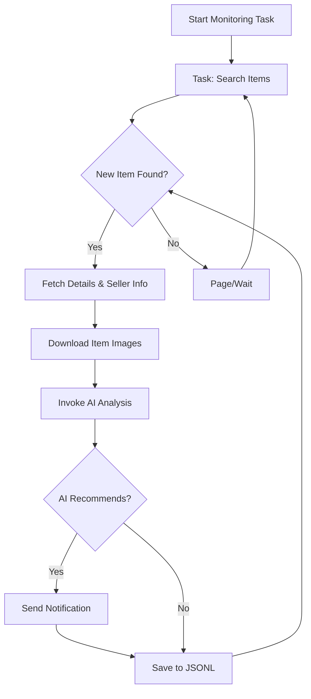

# AI-Powered Goofish (Xianyu) Monitor: Real-time Item Tracking & Smart Analysis

**Tired of missing out on the best deals?** This AI-driven tool uses Playwright and AI to monitor Xianyu (Goofish) listings in real-time, offering intelligent filtering and instant notifications via a user-friendly web interface.  [Explore the original repo on GitHub](https://github.com/dingyufei615/ai-goofish-monitor).

**Key Features:**

*   **Intuitive Web UI:** Manage tasks, edit AI criteria, view logs, and browse results without command-line fuss.
*   **AI-Driven Task Creation:** Describe your desired item with natural language and let the AI generate a complex monitoring task.
*   **Concurrent Monitoring:** Monitor multiple keywords simultaneously with independent, non-interfering tasks via `config.json`.
*   **Real-time Processing:** Analyze new listings instantly, eliminating batch processing delays.
*   **Deep AI Analysis:** Integrates multi-modal large language models (e.g., GPT-4o) for in-depth analysis of images, text, and seller profiles to provide precise filtering.
*   **Highly Customizable:** Configure individual keywords, price ranges, filters, and AI analysis prompts for each task.
*   **Instant Notifications:** Receive alerts via [ntfy.sh](https://ntfy.sh/), Enterprise WeChat bot, or [Bark](https://bark.day.app/) for recommended items.
*   **Scheduled Task Execution:** Utilize Cron expressions for automated, timed task runs.
*   **Dockerized Deployment:** Quick and standardized deployment with provided `docker-compose` configurations.
*   **Robust Anti-Scraping:** Mimics human behavior with random delays and user actions for enhanced stability.

## Key Benefits:

*   **Never Miss a Deal:** Get notified immediately of relevant listings that match your criteria.
*   **Save Time & Effort:** Automate your search and filtering process with AI-powered analysis.
*   **Easy to Use:** Web UI makes setup and management simple.
*   **Highly Customizable:** Fine-tune your monitoring with extensive configuration options.

## Getting Started:

**1. Environment Setup:**

*   **Python Version:** Python 3.10 or higher is recommended for local development.
*   Clone the repository:

    ```bash
    git clone https://github.com/dingyufei615/ai-goofish-monitor
    cd ai-goofish-monitor
    ```

*   Install dependencies:

    ```bash
    pip install -r requirements.txt
    ```

**2. Configuration:**

1.  **Set Environment Variables:**

    *   Copy `.env.example` to `.env` and fill in your settings.
    *   Key variables include: `OPENAI_API_KEY`, `OPENAI_BASE_URL`, `OPENAI_MODEL_NAME`.
    *   For detailed settings and options:
        *   `OPENAI_API_KEY`: Your AI model provider's API key. *Required*.
        *   `OPENAI_BASE_URL`: Your AI model's API endpoint (compatible with OpenAI format). *Required*.
        *   `OPENAI_MODEL_NAME`: The specific model name to use (must support image analysis, such as `doubao-seed-1-6-250615`, `gemini-2.5-pro`, etc.). *Required*.
        *   Additional options for proxy, notification services, and more are available.

2.  **Login State (Important!):**
    *   **Recommended:** Use the Web UI to update your login status.
        *   Start the Web UI (step 3).
        *   Go to "System Settings" in the Web UI.
        *   Click "Manual Update" for the "Login Status File."
        *   Follow the instructions in the popup to install the Xianyu Login State Extractor browser extension, log in to Xianyu, extract the login state, copy it, and paste it into the UI.
    *   **Alternative (for local/desktop):** Run `python login.py` to log in via QR code. This is not needed if using web UI method.

**3. Launch the Web Server:**

```bash
python web_server.py
```

**4. Start Monitoring:**

*   Access the web interface: `http://127.0.0.1:8000`
*   Create a new task in the "Task Management" section.
*   Describe your desired item in natural language.
*   The AI generates a complex analysis standard.
*   Start the task to begin automated monitoring.

## Docker Deployment:

1.  **Install Docker** & Clone the project.
2.  **Configure** `.env` (as described in "Getting Started").
3.  **Set up Login State** (as described in "Getting Started"). This is crucial.  Start service, log in via web ui.
4.  **Run Docker Compose:**

    ```bash
    docker-compose up --build -d
    ```

5.  **Access & Manage:**

    *   Web UI: `http://127.0.0.1:8000`
    *   Real-time Logs: `docker-compose logs -f`
    *   Stop Container: `docker-compose stop`
    *   Start Stopped: `docker-compose start`
    *   Remove Container: `docker-compose down`

## Web UI Overview:

*   **Task Management:** AI-powered task creation, editing, and scheduling.
*   **Results Viewing:** Card-based display, smart filtering, and detailed item information.
*   **Real-time Logs:** Monitor activity and troubleshoot issues.
*   **System Settings:** Configuration and status checks.

## Workflow Diagram



## Authentication
Basic authentication is implemented in the Web UI.  Change the username and password in the `.env` file:
```bash
WEB_USERNAME=admin
WEB_PASSWORD=admin123
```

## FAQ & Troubleshooting:

Refer to the comprehensive [FAQ.md](FAQ.md) for solutions to common issues.

## Acknowledgements:

Special thanks to the projects and communities referenced in the original README.

## Support & Sponsoring:

Consider supporting the project via Alipay or WeChat Pay (links in original README).

## Important Notes:

*   Respect Xianyu's terms and conditions.
*   Use this project for educational purposes only.
*   Refer to [DISCLAIMER.md](DISCLAIMER.md) for the license and liability information.

[](https://star-history.com/#dingyufei615/ai-goofish-monitor&Date)