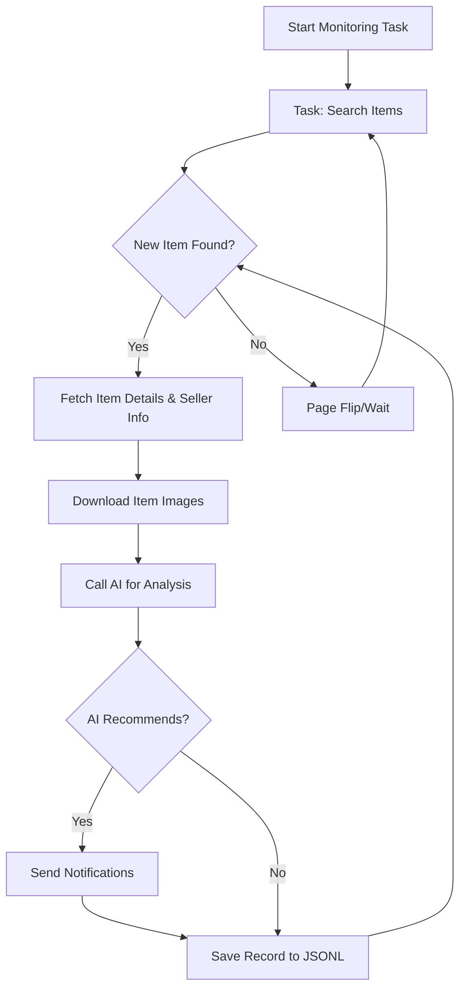

# AI-Powered Goofish (Xianyu) Monitor: Your Smart Assistant for Finding Deals

Tired of missing out on great deals on Xianyu (Goofish)? This project provides an intelligent, AI-driven monitoring solution with a user-friendly web interface, helping you find exactly what you're looking for on Xianyu.  [See the original repository](https://github.com/dingyufei615/ai-goofish-monitor).

## Key Features:

*   **Intuitive Web UI:** Manage tasks, view real-time logs, and browse filtered results with a complete web-based interface, eliminating the need for command-line operations.
*   **AI-Driven Task Creation:** Describe your desired item in natural language, and the system will create a monitoring task with complex filtering logic using AI.
*   **Concurrent Multi-Tasking:** Monitor multiple keywords simultaneously through `config.json`, with each task running independently without interference.
*   **Real-Time Processing:** Immediately analyze new listings, eliminating the delays associated with batch processing.
*   **Deep AI Analysis:** Utilize multimodal large language models (e.g., GPT-4o) to analyze item descriptions, images, and seller profiles for precise filtering.
*   **Highly Customizable:** Configure each monitoring task with individual keywords, price ranges, filtering criteria, and AI analysis prompts.
*   **Instant Notifications:** Receive immediate alerts via [ntfy.sh](https://ntfy.sh/), enterprise WeChat group bots, or [Bark](https://bark.day.app/) when a suitable item is found.
*   **Scheduled Task Execution:** Employ Cron expressions to schedule each task's execution at custom intervals.
*   **One-Click Docker Deployment:** Streamline deployment with the provided `docker-compose` configuration for fast, standardized containerization.
*   **Robust Anti-Scraping Strategies:** Mimic real-user behavior with various random delays and user actions to enhance stability.

## Core Functionality

*   **Real-time search:**  The core function.
*   **AI-driven filter:** Helps users find the items they want more accurately.
*   **Notification:**  Notify users.

## Getting Started

### Step 1: Environment Setup

*   **Python Version Requirement:**  For local deployment and debugging, Python 3.10 or higher is recommended. Lower Python versions may cause installation failures or runtime errors (e.g., `ModuleNotFoundError: No module named 'PIL'`).

Clone the project:

```bash
git clone https://github.com/dingyufei615/ai-goofish-monitor
cd ai-goofish-monitor
```

Install Dependencies:

```bash
pip install -r requirements.txt
```

### Step 2: Configuration

1.  **Configure Environment Variables:** Copy the `.env.example` file to `.env` and modify the content.

    *   **Windows:**

        ```cmd
        copy .env.example .env
        ```

    *   **Linux/MacOS:**

        ```shell
        cp .env.example .env
        ```

    The available environment variables are:

    | Environment Variable | Description                                     | Required | Notes                                                                                                                     |
    | :------------------- | :---------------------------------------------- | :------- | :------------------------------------------------------------------------------------------------------------------------ |
    | `OPENAI_API_KEY`     | Your AI model provider's API Key.             | Yes      | This may be optional for some local or specific proxy services.                                                            |
    | `OPENAI_BASE_URL`    | The API endpoint address for your AI model.   | Yes      | Must be compatible with OpenAI format.  e.g., `https://ark.cn-beijing.volces.com/api/v3/`.                             |
    | `OPENAI_MODEL_NAME`  | The specific model name you want to use.        | Yes      | **Must** select a multimodal model supporting image analysis, e.g., `doubao-seed-1-6-250615`, `gemini-2.5-pro`, etc. |
    | `PROXY_URL`          | (Optional) HTTP/S proxy configuration.          | No       | Supports `http://` and `socks5://` formats. For example, `http://127.0.0.1:7890`.                                         |
    | `NTFY_TOPIC_URL`     | (Optional) [ntfy.sh](https://ntfy.sh/) topic URL. | No       | If left empty, ntfy notifications will not be sent.                                                                     |
    | ...                  | ...                                             | ...      | ...                                                                                                                       |

    >   💡 **Debugging Tip:** If you encounter a 404 error when configuring your AI API, try using the API provided by Alibaba Cloud or Volcano Engine for debugging purposes.

    >   🔐 **Security Warning:** The web interface uses Basic authentication. Default username and password are `admin` / `admin123`. **Change these in production!**

2.  **Get Login Status (Important!)** To enable the crawler to access Xianyu in a logged-in state, a valid login credential must be provided.  We recommend using the Web UI to do this.

    **Recommended Method:  Using Web UI**

    1.  Skip this step for now and directly run step 3 to start the web server.
    2.  After opening the Web UI, navigate to the "System Settings" page.
    3.  Locate "Login State File" and click the "Manual Update" button.
    4.  Follow the instructions in the popup:
        *   Install the [Xianyu Login State Extraction Extension](https://chromewebstore.google.com/detail/xianyu-login-state-extrac/eidlpfjiodpigmfcahkmlenhppfklcoa) in Chrome.
        *   Open and log in to the Xianyu official website.
        *   After logging in successfully, click the extension icon in your browser's toolbar.
        *   Click the "Extract Login State" button.
        *   Click the "Copy to Clipboard" button
        *   Paste the content into the Web UI and save it.

    **Alternative: Run Login Script**

    If you can run programs locally or on a server with a desktop environment, you can also use the traditional script method:

    ```bash
    python login.py
    ```

    This will open a browser window. Scan the QR code with your Xianyu App to log in.  Upon success, the program closes and generates an `xianyu_state.json` file.

### Step 3: Start Web Server

Once configured, start the web management backend server:

```bash
python web_server.py
```

### Step 4: Start Using

Open `http://127.0.0.1:8000` in your browser.

1.  In the "Task Management" page, click "Create New Task."
2.  Describe your desired item in natural language (e.g., "I want to buy a Sony A7M4 camera that is 95% new, a budget of 13,000 yuan, and a shutter count below 5000"), and fill in the task name and keywords.
3.  Click "Create," and AI will automatically generate complex analysis criteria.
4.  Go back to the main interface, add a schedule or click start immediately, and start automated monitoring!

## Docker Deployment (Recommended)

Use Docker for rapid, reliable, and consistent deployment by packaging the application and its dependencies into a standardized unit.

### Step 1: Environment Preparation (similar to local deployment)

1.  **Install Docker:** Ensure [Docker Engine](https://docs.docker.com/engine/install/) is installed on your system.

2.  **Clone Project and Configure:**

    ```bash
    git clone https://github.com/dingyufei615/ai-goofish-monitor
    cd ai-goofish-monitor
    ```

3.  **Create `.env` File:** Create a `.env` file in the project root and fill it out as described in the **[Getting Started](#getting-started)** section.

4.  **Get Login Status (Critical!)**: QR code login is not supported inside the Docker container.  **After starting the container**, use the Web UI to set your login state:

    1.  (On the host machine) Run `docker-compose up -d` to start the service.
    2.  Open `http://127.0.0.1:8000` in your browser to access the Web UI.
    3.  Go to the "System Settings" page and click the "Manual Update" button.
    4.  Follow the instructions in the popup:
        *   Install the [Xianyu Login State Extraction Extension](https://chromewebstore.google.com/detail/xianyu-login-state-extrac/eidlpfjiodpigmfcahkmlenhppfklcoa) in Chrome.
        *   Open and log in to the Xianyu official website.
        *   After logging in successfully, click the extension icon in your browser's toolbar.
        *   Click the "Extract Login State" button.
        *   Click the "Copy to Clipboard" button
        *   Paste the content into the Web UI and save it.

    >   ℹ️ **About Python Version:**  The Docker deployment uses Python 3.11 specified in the Dockerfile.  No need to worry about local Python version compatibility.

### Step 2: Run Docker Container

This project includes a `docker-compose.yaml` file. We recommend using `docker-compose` to manage containers.

Run this command from the project root:

```bash
docker-compose up --build -d
```

This starts the service in the background.  `docker-compose` uses the `.env` file and `docker-compose.yaml` to build and start the container.

If you encounter network issues within the container, troubleshoot or use a proxy.

>   ⚠️ **OpenWrt Deployment Notes:** If deploying on an OpenWrt router, you may experience DNS resolution problems. This is because the default network created by Docker Compose may not inherit OpenWrt's DNS settings correctly. If you encounter `ERR_CONNECTION_REFUSED`, check your container network configuration. You may need to manually configure DNS or adjust the network mode.

### Step 3: Access and Manage

*   **Access Web UI:** Open `http://127.0.0.1:8000` in your browser.
*   **View Real-Time Logs:** `docker-compose logs -f`
*   **Stop Container:** `docker-compose stop`
*   **Start Stopped Container:** `docker-compose start`
*   **Stop and Remove Container:** `docker-compose down`

## Web UI Features

*   **Task Management:**
    *   **AI Task Creation:** Generate monitoring tasks and AI analysis criteria with natural language descriptions.
    *   **Visual Editing & Control:** Directly modify task parameters (keywords, price, scheduling, etc.) in the table, and independently start/stop/delete each task.
    *   **Scheduled Execution:** Configure Cron expressions for automated, periodic task runs.
*   **Results Viewing:**
    *   **Card View:** Clearly display matching items in a card format.
    *   **Smart Filtering & Sorting:** Filter for AI-recommended items with a single click and sort by time crawled, publication time, price, and more.
    *   **Deep Details:** Click to view complete data and detailed AI analysis results for each item in JSON format.
*   **Runtime Logs:**
    *   **Real-time Log Stream:** View detailed logs in real-time in the web UI to track progress and troubleshoot issues.
    *   **Log Management:** Supports automatic refresh, manual refresh, and one-click log clearing.
*   **System Settings:**
    *   **Status Check:** Check if `.env` configurations, login status, and other critical dependencies are functioning correctly with one click.
    *   **Prompt Editing:** Directly edit and save the `prompt` file used for AI analysis in the web UI, adjusting AI reasoning logic in real-time.

## Working Process

The following diagram describes the core logic of a single monitoring task, from startup to completion.  `web_server.py` will serve as the main service, launching one or more of these task processes based on user actions or scheduled runs.



## Web UI Authentication

### Authentication Configuration

The Web UI uses Basic authentication to protect the management interface and APIs, ensuring access is limited to authorized users.

#### Configuration Method

Set authentication credentials in the `.env` file:

```bash
# Web Service Authentication Configuration
WEB_USERNAME=admin
WEB_PASSWORD=admin123
```

#### Default Credentials

If authentication credentials are not set in the `.env` file, the system will use the following defaults:

*   Username: `admin`
*   Password: `admin123`

**⚠️ IMPORTANT: Change the default password in production!**

#### Authentication Scope

*   **Requires Authentication:** All API endpoints, the Web UI, and static resources.
*   **No Authentication Required:** Health check endpoint (`/health`).

#### Usage

1.  **Browser Access:** An authentication dialog will appear when you access the Web UI.
2.  **API Calls:** Include Basic authentication information in the request headers.
3.  **Frontend JavaScript:** Authentication is automatically handled; no modification is needed.

#### Security Recommendations

1.  Change the default password to a strong password.
2.  Use HTTPS in a production environment.
3.  Regularly change your authentication credentials.
4.  Restrict access IP range through the firewall.

Detailed configuration instructions can be found in [AUTH_README.md](AUTH_README.md).

## Frequently Asked Questions (FAQ)

We've compiled a detailed FAQ document addressing various topics, from environment configuration and AI settings to anti-scraping strategies.

👉 **[View the FAQ (FAQ.md)](FAQ.md)**

## Acknowledgements

This project draws inspiration from the following excellent projects; we appreciate their contributions:

*   [superboyyy/xianyu_spider](https://github.com/superboyyy/xianyu_spider)
*   [@jooooody](https://linux.do/u/jooooody/summary)

Also, thanks to the LinuxDo community for their script contributions.

Thanks to the ClaudeCode/Aider/Gemini tools for liberating my hands, I feel like I am flying when writing code～

## Support & Sponsoring

If this project has been helpful to you, please consider supporting it. Thank you for your support!

<table>
  <tr>
    <td></td>
    <td></td>
  </tr>
</table>

## Important Notes

*   Please abide by Xianyu's terms of service and robots.txt rules. Avoid excessively frequent requests to prevent server load or account restrictions.
*   This project is intended for learning and technical research only. Do not use it for illegal purposes.
*   This project is released under the [MIT License](LICENSE) and is provided "as is" without any warranty.
*   The project author and contributors are not responsible for any direct, indirect, incidental, or special damages or losses resulting from the use of this software.
*   See the [DISCLAIMER.md](DISCLAIMER.md) file for more detailed information.

[](https://star-history.com/#dingyufei615/ai-goofish-monitor&Date)