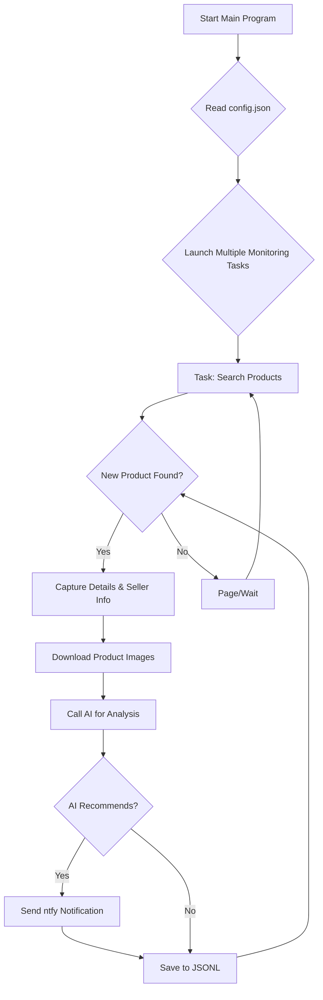

# AI-Powered Xianyu (Goofish) Monitor: Intelligent Product Tracking with Web UI

Tired of missing out on the best deals? This AI-powered tool utilizes Playwright and AI to intelligently monitor Xianyu (Goofish), providing real-time tracking and smart analysis, all accessible via a user-friendly web interface.  [View the original repository](https://github.com/dingyufei615/ai-goofish-monitor).

**Key Features:**

*   ✅ **AI-Driven Task Creation:** Describe your ideal product in natural language, and the system generates complex monitoring tasks.
*   ✅ **Visual Web Interface:** Manage tasks, view real-time logs, and filter results without command-line interaction.
*   ✅ **Multi-Task Concurrency:** Monitor multiple keywords simultaneously, with each task running independently.
*   ✅ **Real-time Processing:** Analyze new listings immediately, eliminating delayed notifications.
*   ✅ **Deep AI Analysis:** Integrates multimodal large language models (e.g., GPT-4o) for in-depth analysis of product descriptions, images, and seller profiles.
*   ✅ **Highly Customizable:** Configure each task with specific keywords, price ranges, filtering criteria, and AI analysis prompts.
*   ✅ **Instant Notifications:** Receive alerts via [ntfy.sh](https://ntfy.sh/) for items that match your AI recommendations.
*   ✅ **Robust Anti-Scraping:** Employs human-like interactions and random delays to enhance stability.

## Getting Started

Follow these steps to get your Xianyu monitor up and running:

1.  **Clone the Repository:**
    ```bash
    git clone https://github.com/dingyufei615/ai-goofish-monitor
    cd ai-goofish-monitor
    ```

2.  **Install Dependencies:**
    ```bash
    pip install -r requirements.txt
    ```

3.  **Configure Environment Variables:**
    *   Create a `.env` file in the project root and populate it with the following:
        ```env
        # --- AI Model Configuration ---
        OPENAI_API_KEY="sk-..."           # Your OpenAI/API Key
        OPENAI_BASE_URL="https://generativelanguage.googleapis.com/v1beta/openai/"  # API endpoint (check your provider)
        OPENAI_MODEL_NAME="gemini-2.5-pro"  # Model name (must support image upload)

        # ntfy Notification Service (Optional)
        NTFY_TOPIC_URL="https://ntfy.sh/your-topic-name" # Replace with your ntfy topic URL

        # Enterprise WeChat Bot Notification (Optional)
        WX_BOT_URL="https://qyapi.weixin.qq.com/cgi-bin/webhook/send?key=xxxxx"

        # Browser Configuration
        LOGIN_IS_EDGE=false                # Use Chrome browser if false
        PCURL_TO_MOBILE=true               # Convert PC URLs to mobile versions

        # Run Mode
        RUN_HEADLESS=true                   # Run browser in headless mode (true/false)
        SERVER_PORT=8000                    # Custom server port (default: 8000)
        ```

4.  **Acquire Login Status (Critical):**  Run the `login.py` script to generate the `xianyu_state.json` file. You'll need to scan a QR code with your Xianyu app to log in.
    ```bash
    python login.py
    ```

5.  **Start the Web Server:**
    ```bash
    python web_server.py
    ```

6.  **Access the Web UI:** Open your browser and navigate to `http://127.0.0.1:8000`.

7.  **Begin Monitoring:**
    1.  Go to **"Task Management"** and click **"Create New Task"**.
    2.  Describe your product requirements in natural language.
    3.  The AI will generate an analysis standard automatically.
    4.  Click **"🚀 Start All"** to begin monitoring.

## 🐳 Docker Deployment (Recommended)

Deploying with Docker simplifies setup and ensures consistency.

1.  **Docker Setup:** Ensure Docker Engine is installed.

2.  **Clone and Configure:**
    ```bash
    git clone https://github.com/dingyufei615/ai-goofish-monitor
    cd ai-goofish-monitor
    ```
    Create and fill the `.env` file as described above.

3.  **Get Login Status:** **On your host machine**, run `login.py` to create `xianyu_state.json`.
    ```bash
    pip install -r requirements.txt
    python login.py
    ```

4.  **Run Docker Compose:**
    ```bash
    docker-compose up -d
    ```
    This starts the service in the background.

5.  **Access and Manage:**

    *   **Web UI:** `http://127.0.0.1:8000`
    *   **Real-time Logs:** `docker-compose logs -f`
    *   **Stop Container:** `docker-compose stop`
    *   **Start Container:** `docker-compose start`
    *   **Remove Container:** `docker-compose down`

## 📸 Web UI Features

*   **Task Management:**
    *   AI-powered task creation using natural language.
    *   Task parameter editing within a table.
    *   Start/stop individual tasks or all tasks with a single click.
*   **Result Viewing:**
    *   Product display in a card view.
    *   Filtering to view only AI-recommended items.
    *   Full details and AI analysis results for each item.
*   **Running Logs:**
    *   Real-time log stream to track progress and troubleshoot issues.
*   **System Configuration:**
    *   Check `.env` configurations, login status, and other key dependencies.
    *   Edit and save AI analysis prompts directly within the web interface.

## ⚙️ Command-Line Usage

For command-line enthusiasts:

*   **Start Monitoring:**  Run the main script.
    ```bash
    python spider_v2.py
    ```
    **Debug Mode:**
    ```bash
    python spider_v2.py --debug-limit 2
    ```

*   **Create New Tasks via Script:**
    ```bash
    python prompt_generator.py \
      --description "I want to buy a Sony A7M4 camera, 95% new or better, budget under 13000, shutter count under 5000. Must be China version, with complete accessories. Preferred personal sellers, no resellers." \
      --output prompts/sony_a7m4_criteria.txt \
      --task-name "Sony A7M4" \
      --keyword "a7m4" \
      --min-price "10000" \
      --max-price "13000"
    ```

## 🚀 Workflow Diagram



## 🛠️ Tech Stack

*   **Core Framework:** Playwright (asynchronous) + asyncio
*   **Web Service:** FastAPI
*   **AI Model:** OpenAI API (supports GPT-4o and other multi-modal models)
*   **Notification Service:** ntfy
*   **Configuration:** JSON
*   **Dependency Management:** pip

## 📂 Project Structure

```
.
├── .env                # Environment variables
├── .gitignore          # Git ignore configurations
├── config.json         # Core configuration for all tasks
├── login.py            # For initial login and cookie persistence
├── spider_v2.py        # Main spider program
├── prompt_generator.py # Script to create tasks
├── web_server.py       # Web server program
├── requirements.txt    # Python dependencies
├── README.md           # This file
├── prompts/            # AI prompt files
│   ├── base_prompt.txt
│   └── ..._criteria.txt
├── static/             # Web frontend static files
│   ├── css/style.css
│   └── js/main.js
├── templates/          # Web frontend templates
│   └── index.html
├── images/             # Downloaded product images (auto-created)
├── logs/               # Running logs (auto-created)
└── jsonl/              # Results storage (auto-created)
```

## Frequently Asked Questions (FAQ)

1.  **Q:  Encountering `'gbk' codec can't encode character` errors when running scripts?**
    *   **A:** This is a common Windows encoding issue. The project uses UTF-8 encoding.
    *   **Solution:** Set the `PYTHONUTF8` environment variable or use `chcp 65001` before running the script.

2.  **Q:  `playwright install` required when running `login.py`?**
    *   **A:** Playwright's browser components are missing.
    *   **Solution:** Ensure dependencies are installed via `pip install -r requirements.txt`.  If the problem persists, try `playwright install chromium`.

3.  **Q:  "Request timed out" or "Connection error" during task creation or execution?**
    *   **A:**  Network-related. Verify your server's network connectivity and the correctness of the `OPENAI_BASE_URL` setting. If accessing foreign AI services from mainland China, consider using a network proxy.

4.  **Q:  My AI model doesn't support image analysis?**
    *   **A:** This project relies on image analysis.  Ensure your chosen AI model in `.env` ( `OPENAI_MODEL_NAME`) supports image input (Vision / Multi-modal), such as `gpt-4o`, `gemini-1.5-pro`, `deepseek-v2`, or `qwen-vl-plus`.

5.  **Q:  Can I deploy on Synology NAS using Docker?**
    *   **A:** Yes.  Complete `login.py` **on your computer**. Then, upload the project folder (including `.env` and `xianyu_state.json`) to your Synology. Use `docker-compose up -d` in Container Manager, ensuring correct volume mapping to your project folder.

6.  **Q:  How to configure Gemini / Qwen / Grok, or other non-OpenAI LLMs?**
    *   **A:** The project supports OpenAI-compatible APIs. Configure your `.env` file:
        *   `OPENAI_API_KEY`: Your provider's API key.
        *   `OPENAI_BASE_URL`: The API-Compatible Endpoint (e.g., `https://api.your-provider.com/v1`).  **Consult your model provider's documentation.**
        *   `OPENAI_MODEL_NAME`: Your specific model name (must support image recognition), e.g., `gemini-2.5-flash`.
    *   **Example:** If your provider's completion endpoint is `https://xx.xx.com/v1/chat/completions`, set `OPENAI_BASE_URL` to `https://xx.xx.com/v1`.

7.  **Q:  Getting detected by Xianyu ("abnormal traffic" / captcha)?**
    *   **A:**  Xianyu's anti-scraping measures are triggered.
        *   Set `RUN_HEADLESS=false` to run the browser with a GUI; you can then manually solve captchas.
        *   Reduce the number of monitoring tasks running simultaneously.
        *   Use a clean network environment.

## Acknowledgements

Special thanks to the following projects for inspiration and contribution:
- [superboyyy/xianyu_spider](https://github.com/superboyyy/xianyu_spider)

And thank you to LinuxDo community members and Aider & Gemini for assistance during development!

## ⚠️ Important Notes

*   Adhere to Xianyu's user agreement and robots.txt rules to avoid overloading servers or account restrictions.
*   This project is for educational purposes and technical research only.  Do not use it for illegal activities.

[](https://star-history.com/#dingyufei615/ai-goofish-monitor&Date)