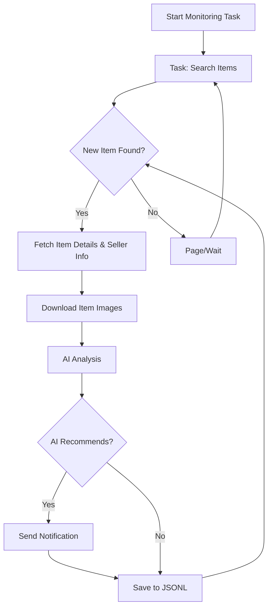

# AI-Powered Xianyu (Goofish) Monitor: Effortlessly Track & Analyze Secondhand Deals

This project empowers you to automatically monitor and intelligently analyze listings on Xianyu (Goofish), utilizing Playwright, AI-powered filtering, and a user-friendly web interface. [View the original repository](https://github.com/dingyufei615/ai-goofish-monitor).

## Key Features

*   ✅ **Web UI for Easy Management:** A complete web interface for task management, AI prompt editing, real-time log viewing, and result filtering, eliminating the need for command-line interaction.
*   🧠 **AI-Driven Task Creation:** Simply describe your desired purchase in natural language, and the system will generate a monitoring task with sophisticated filtering logic.
*   ⚙️ **Multi-Task Concurrency:** Monitor multiple keywords concurrently using `config.json`, with each task running independently.
*   ⚡ **Real-time Processing:** Immediately analyze new listings upon discovery, eliminating batch processing delays.
*   💡 **Deep AI Analysis:** Integrates multimodal large language models (like GPT-4o) to analyze listings, combining text, images, and seller profiles for precise filtering.
*   🛠️ **Highly Customizable:** Configure individual keywords, price ranges, filtering criteria, and AI analysis prompts (Prompts) for each monitoring task.
*   🔔 **Instant Notifications:** Receive alerts via [ntfy.sh](https://ntfy.sh/), enterprise WeChat group robots, and [Bark](https://bark.day.app/) to stay updated on recommended items.
*   🗓️ **Scheduled Task Execution:** Support Cron expressions to set up automated task scheduling.
*   🐳 **Docker Deployment:** Simplified deployment with `docker-compose` for quick and standardized containerization.
*   🛡️ **Robust Anti-Scraping:** Employs human-like behavior, including random delays and user actions, to enhance stability.

## Screenshots

**Task Management:**


**Monitoring Dashboard:**


**Notification Example:**


## Getting Started

**Prerequisites**

*   **Python:** Python 3.10 or later is recommended for local development and debugging.
*   **Docker:** (Recommended for deployment) Ensure you have Docker and Docker Compose installed.

### 1. Clone the Project

```bash
git clone https://github.com/dingyufei615/ai-goofish-monitor
cd ai-goofish-monitor
```

### 2. Environment Setup

*   **Install Dependencies:**

    ```bash
    pip install -r requirements.txt
    ```
*   **Configure `.env` File:**
    Create and modify a `.env` file from `.env.example` to store your configuration:

    ```bash
    # For Windows
    copy .env.example .env

    # For Linux/MacOS
    cp .env.example .env
    ```

    | Variable           | Description                                                | Required | Notes                                                                                     |
    | :----------------- | :--------------------------------------------------------- | :------- | :---------------------------------------------------------------------------------------- |
    | `OPENAI_API_KEY`   | Your AI model provider's API key.                         | Yes      |                                                                                           |
    | `OPENAI_BASE_URL`  | API endpoint for your AI model, compatible with OpenAI format. | Yes      | e.g., `https://ark.cn-beijing.volces.com/api/v3/`                                        |
    | `OPENAI_MODEL_NAME` | The specific multimodal model you'll use.               | Yes      | Select a model that supports image analysis, e.g., `doubao-seed-1-6-250615`, `gemini-2.5-pro` |
    | `PROXY_URL`        | (Optional) HTTP/S proxy URL for bypassing region blocks.     | No       | Supports `http://` and `socks5://` formats (e.g., `http://127.0.0.1:7890`).            |
    | ...                | (Other notification and optional settings)                  | No       | Refer to original README                                                                |

    > 💡 **Debugging Tip:** If encountering 404 errors with your AI API, test with services like Alibaba Cloud or Volces to verify functionality.

    > 🔐 **Security Note:** The Web UI is protected with Basic Authentication. Change the default username/password (`admin`/`admin123`) in production!
*   **Acquire Login State (Crucial!)**:

    **Recommended: Update via Web UI**

    1.  Start the web service (Step 3).
    2.  Access the web UI and go to "System Settings."
    3.  Click "Manual Update" next to "Login State File."
    4.  Follow the instructions to extract login information using the [Xianyu Login State Extractor extension](https://chromewebstore.google.com/detail/xianyu-login-state-extrac/eidlpfjiodpigmfcahkmlenhppfklcoa) in Chrome.

    **Alternative: Run the Login Script**

    ```bash
    python login.py
    ```

    Then scan the QR code on the console with your Xianyu App to log in. This creates `xianyu_state.json`.

### 3. Start the Web Server

```bash
python web_server.py
```

### 4. Start Monitoring

1.  Open the web UI at `http://127.0.0.1:8000`.
2.  Go to "Task Management" and click "Create New Task."
3.  Describe your purchase requirements using natural language. (e.g., "I want to buy a used Sony A7M4 camera in excellent condition, less than 5000 shutter actuations, and under $1000.")
4.  Configure the task details and click "Create."
5.  Start the task to begin automated monitoring.

## 🐳 Docker Deployment (Recommended)

Docker provides an easy and consistent deployment method.

### 1. Prepare Your Environment (similar to local)

*   Install Docker and Docker Compose.
*   Clone the repository.
*   Create and configure your `.env` file as detailed above.
*   Get the login status using the web UI method after the container is running.

    1.  Run `docker-compose up -d` to start the service.
    2.  Open the web UI and go to "System Settings."
    3.  Click "Manual Update" next to "Login State File."
    4.  Follow the instructions to extract login information using the [Xianyu Login State Extractor extension](https://chromewebstore.google.com/detail/xianyu-login-state-extrac/eidlpfjiodpigmfcahkmlenhppfklcoa) in Chrome.

> ℹ️ **Python Version:** The Dockerfile uses Python 3.11, so there's no local version conflict.

### 2. Run Docker Container

```bash
docker-compose up --build -d
```

### 3. Access and Manage

*   **Web UI:** `http://127.0.0.1:8000`
*   **View Logs:** `docker-compose logs -f`
*   **Stop/Start/Remove:**  `docker-compose stop`, `docker-compose start`, `docker-compose down`

## Features at a Glance (Web UI)

*   **Task Management:** Natural language task creation, intuitive editing, scheduling, and task control.
*   **Results Viewing:** Card-based display, AI-driven filtering, sorting, and detailed item information.
*   **Real-time Logging:**  View the detailed activity of the crawler, filter, and reset logs.
*   **System Settings:** Quick dependency/environment checks, prompt customization.

## Workflow



## Authentication

Secures the Web UI and API access using Basic Authentication.  Refer to the original README for more information.

## FAQs

Detailed answers to common issues are available in the [FAQ.md](FAQ.md).

## Acknowledgements

Thank you to [superboyyy/xianyu_spider](https://github.com/superboyyy/xianyu_spider), [@jooooody](https://linux.do/u/jooooody/summary) and the LinuxDo community, and ClaudeCode/ModelScope/Gemini, and the AI community.

## Disclaimer

*   Adhere to Xianyu's terms and robots.txt.
*   Use responsibly and legally.
*   This software is provided "as is" without warranty.
*   Read the [DISCLAIMER.md](DISCLAIMER.md) file for more details.

[](https://star-history.com/#dingyufei615/ai-goofish-monitor&Date)