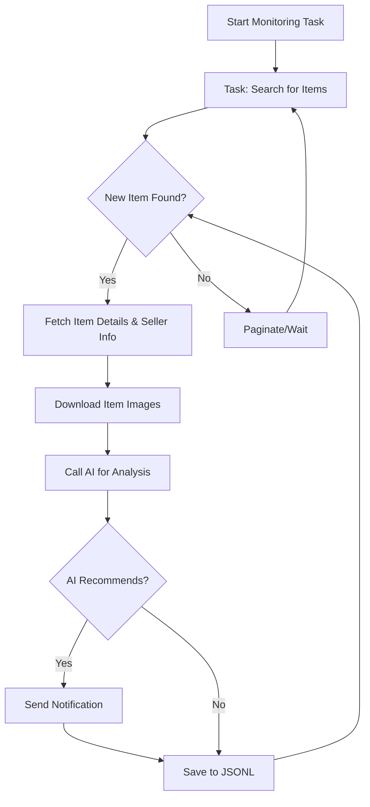

# AI-Powered Goofish (Xianyu) Monitor: Effortlessly Track & Analyze Listings ( [Original Repo](https://github.com/dingyufei615/ai-goofish-monitor) )

**Never miss a deal!** This AI-driven tool intelligently monitors Xianyu (Goofish) for your desired items, providing real-time analysis and instant notifications.

## Key Features:

*   ✅ **Intuitive Web UI:** Manage tasks, edit AI criteria, view logs, and browse results with a user-friendly web interface.
*   🤖 **AI-Powered Task Creation:** Simply describe your purchase needs in natural language, and let the AI generate complex monitoring tasks.
*   🚀 **Multi-Task Concurrency:** Monitor multiple keywords simultaneously with independent, non-interfering tasks via `config.json`.
*   ⚡️ **Real-Time Processing:** Analyze new listings instantly, eliminating batch processing delays.
*   🧠 **Deep AI Analysis:** Integrates multimodal large language models (e.g., GPT-4o) to deeply analyze listing text, images, and seller profiles for precise filtering.
*   ⚙️ **Highly Customizable:** Each task can be configured with unique keywords, price ranges, filtering conditions, and AI analysis prompts.
*   🔔 **Instant Notifications:** Receive immediate alerts for AI-recommended items via [ntfy.sh](https://ntfy.sh/), WeChat group bots, or [Bark](https://bark.day.app/).
*   📅 **Scheduled Task Execution:** Supports Cron expressions for automated, timed task runs.
*   🐳 **Docker Deployment:** One-click deployment with `docker-compose` for fast, standardized containerization.
*   🛡️ **Robust Anti-Scraping:** Employs human-like interactions, including random delays and user behavior, to enhance stability.

## Screenshots:

*   **Task Management:** 
*   **Monitoring View:** 
*   **Notification Example:** 

## Getting Started:

**Web UI (Recommended):** The web interface offers the best user experience.

### Step 1: Environment Setup

*   **Python:** Python 3.10 or higher is recommended for local deployment.
*   **Clone Repository:**
    ```bash
    git clone https://github.com/dingyufei615/ai-goofish-monitor
    cd ai-goofish-monitor
    ```
*   **Install Dependencies:**
    ```bash
    pip install -r requirements.txt
    ```

### Step 2: Configuration

1.  **Environment Variables:** Create a `.env` file from `.env.example` and configure:

    ```bash
    # For Windows:
    copy .env.example .env
    # For Linux/MacOS:
    cp .env.example .env
    ```

    Key variables:

    | Variable          | Description                                   | Required | Notes                                                                                                                              |
    | ----------------- | --------------------------------------------- | -------- | ---------------------------------------------------------------------------------------------------------------------------------- |
    | `OPENAI_API_KEY`  | Your AI model provider's API Key.             | Yes      |                                                                                                                                    |
    | `OPENAI_BASE_URL` | AI model API endpoint (OpenAI compatible). | Yes      | e.g., `https://ark.cn-beijing.volces.com/api/v3/`                                                                                |
    | `OPENAI_MODEL_NAME`| Specific model name.                         | Yes      | **Must** choose a multimodal model supporting image analysis, e.g., `doubao-seed-1-6-250615`, `gemini-2.5-pro`, etc. |
    | `PROXY_URL`       | HTTP/S proxy (optional).                    | No       | `http://` or `socks5://` format.                                                                                                   |
    | ... (See original README for full .env options) | ... | ... | ... |

    > 💡 **Debugging:** If you encounter 404 errors with the AI API, test with Alibaba or Volcano APIs first to ensure basic functionality before trying other providers.

    > 🔐 **Security:** Web UI uses Basic Authentication.  Default username/password: `admin`/`admin123`.  **Change in production!**

2.  **Get Login Status (Crucial!):**  You *must* provide valid Xianyu login credentials.

    *   **Recommended: Web UI Update:**
        1.  Start the Web UI (Step 3).
        2.  Go to "System Settings".
        3.  Click "Manual Update" for the "Login Status File".
        4.  Follow the instructions:
            *   Install the [Xianyu Login State Extractor](https://chromewebstore.google.com/detail/xianyu-login-state-extrac/eidlpfjiodpigmfcahkmlenhppfklcoa) Chrome extension.
            *   Log in to the Xianyu website.
            *   Use the extension to extract your login information and copy/paste it into the Web UI.

    *   **Alternative: Login Script:** (if you can run programs locally)
        ```bash
        python login.py
        ```
        Use your phone to scan the QR code.  This generates a `xianyu_state.json` file.

### Step 3: Start Web Server

```bash
python web_server.py
```

### Step 4: Start Monitoring

1.  Go to `http://127.0.0.1:8000` in your browser.
2.  Click "Create New Task" in the "Task Management" page.
3.  Describe your needs in natural language. (e.g., "Buy a Sony A7M4, 95% new or better, under 13,000 yuan, less than 5000 shutter actuations.")
4.  The AI generates the filters.
5.  Start or schedule the task.

## Docker Deployment (Recommended):

Docker simplifies deployment.

### Step 1: Prerequisites

1.  **Install Docker:** Ensure Docker Engine is installed ([Docker Engine Install](https://docs.docker.com/engine/install/)).
2.  **Clone & Configure:**
    ```bash
    git clone https://github.com/dingyufei615/ai-goofish-monitor
    cd ai-goofish-monitor
    ```
3.  **.env File:** Create and populate the `.env` file (see Step 2 in "Getting Started").
4.  **Get Login Status (Key!):** You **must** use the Web UI *after* starting the container:
    1.  Run `docker-compose up -d` (on the host).
    2.  Access the Web UI at `http://127.0.0.1:8000`.
    3.  Go to "System Settings" and click "Manual Update" to follow the browser extension instructions.

    > ℹ️ **Python Version:** Docker uses Python 3.11 from the Dockerfile; no local Python version conflict.

### Step 2: Run Docker Container

Run from the project root:

```bash
docker-compose up --build -d
```

### Step 3: Access and Manage

*   **Web UI:**  `http://127.0.0.1:8000`
*   **Logs:**  `docker-compose logs -f`
*   **Stop:**  `docker-compose stop`
*   **Start:**  `docker-compose start`
*   **Down (Remove):** `docker-compose down`

## Web UI Features:

*   **Task Management:**
    *   AI-generated tasks from natural language descriptions.
    *   Visual editing and control (keywords, price, scheduling).
    *   Scheduling via Cron expressions.
*   **Result Viewing:**
    *   Card-based display of matching items.
    *   Smart filtering and sorting (AI recommended, time, price, etc.).
    *   Detailed view of each listing with full data and AI analysis.
*   **Real-time Logs:**
    *   Live log streaming for monitoring progress and troubleshooting.
    *   Log management (auto-refresh, manual refresh, clear).
*   **System Settings:**
    *   Status checks for dependencies (`.env`, login).
    *   Prompt editing and saving.

## Workflow Diagram



## Authentication:

The Web UI utilizes Basic Authentication for secure access.

*   **Configuration:** Set `WEB_USERNAME` and `WEB_PASSWORD` in `.env`.  **Important: Change the defaults in production!**
*   **Default Credentials:** `admin` / `admin123` (change these immediately!).
*   **Scope:** Protects all API endpoints, the Web UI, and static resources.

## FAQs:

Comprehensive FAQs are available:  👉 **[FAQ.md](FAQ.md)**

## Acknowledgements:

Special thanks to:

*   [superboyyy/xianyu_spider](https://github.com/superboyyy/xianyu_spider)
*   [@jooooody](https://linux.do/u/jooooody/summary)
*   [LinuxDo](https://linux.do/) community.
*   ClaudeCode/Aider/Gemini

## Support

If this project helps, you can buy a coffee.  (Alipay & WeChat Pay Images)

## Important Notes:

*   Respect Xianyu's terms and robots.txt. Avoid excessive requests.
*   For learning and research only; not for illegal use.
*   Released under the [MIT License](LICENSE).  No warranties are provided.
*   See [DISCLAIMER.md](DISCLAIMER.md) for more details.

[](https://star-history.com/#dingyufei615/ai-goofish-monitor&Date)