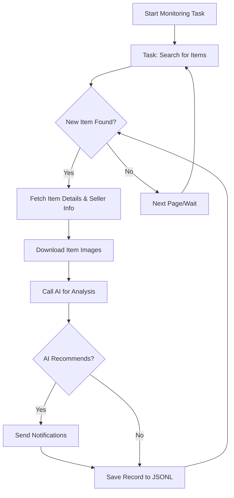

# 🤖 AI-Powered Goofish (Xianyu) Monitor: Smartly Track & Analyze Second-Hand Deals

**Never miss a great deal!** This intelligent AI-driven monitor utilizes Playwright and advanced AI to track and analyze items on the Goofish (Xianyu) platform, providing real-time monitoring, smart filtering, and instant notifications with a user-friendly web interface.  [View the original repository](https://github.com/dingyufei615/ai-goofish-monitor).

## ✨ Key Features

*   ✅ **Intuitive Web UI:** Manage tasks, edit AI analysis criteria, view real-time logs, and filter results—all without command-line fuss.
*   🗣️ **AI-Driven Task Creation:** Describe your desired item in natural language, and the AI will create a task with complex filtering logic.
*   ⚙️ **Multi-Task Concurrency:** Monitor multiple keywords simultaneously with independent, non-interfering tasks via `config.json`.
*   ⚡ **Real-Time Processing:** Analyze new listings immediately after detection, eliminating batch-processing delays.
*   🧠 **Deep AI Analysis:** Integrates multimodal LLMs (like GPT-4o) to analyze listings, including images, text, and seller profiles for precise filtering.
*   🛠️ **Highly Customizable:** Tailor each monitoring task with independent keywords, price ranges, filters, and AI analysis prompts.
*   🔔 **Instant Notifications:** Receive alerts via [ntfy.sh](https://ntfy.sh/), WeChat group bots, and [Bark](https://bark.day.app/) on your phone or desktop.
*   📅 **Scheduled Task Execution:** Utilize Cron expressions for automated, timed task execution.
*   🐳 **Docker Ready:** Deploy quickly and reliably with pre-configured `docker-compose` for containerization.
*   🛡️ **Robust Anti-Scraping:** Employs human-like behavior with randomized delays and interactions for enhanced stability.

## 📸 Web UI Screenshots

*   **Task Management:**  Displays your created tasks, allowing you to edit, start, stop, and delete them.
    
*   **Real-time Monitoring:** Shows listings as they are found, and AI analysis results.
    
*   **Notification Example:** Sample of a push notification sent to your device.
    

## 🚀 Getting Started

### 1. Prerequisites

*   **Python 3.10+ Recommended:** Install Python 3.10 or higher for optimal compatibility.
*   **Clone the Repository:**
    ```bash
    git clone https://github.com/dingyufei615/ai-goofish-monitor
    cd ai-goofish-monitor
    ```
*   **Install Dependencies:**
    ```bash
    pip install -r requirements.txt
    ```

### 2. Configuration

1.  **Configure Environment Variables:**
    *   Copy `.env.example` to `.env`:

        ```bash
        # Windows
        copy .env.example .env
        # Linux/MacOS
        cp .env.example .env
        ```

    *   Edit the `.env` file with your specific settings:

        | Environment Variable   | Description                                          | Required | Notes                                                                                                    |
        | :--------------------- | :--------------------------------------------------- | :------- | :------------------------------------------------------------------------------------------------------- |
        | `OPENAI_API_KEY`        | Your AI model provider's API key.                     | Yes      |                                                                                                          |
        | `OPENAI_BASE_URL`       | AI Model API endpoint (compatible with OpenAI format). | Yes      | Example: `https://ark.cn-beijing.volces.com/api/v3/`                                                     |
        | `OPENAI_MODEL_NAME`     | The specific model you want to use.                | Yes      | **Must** be a multimodal model (e.g., `doubao-seed-1-6-250615`, `gemini-2.5-pro`).                        |
        | `PROXY_URL`             | (Optional) HTTP/S proxy for bypassing geoblocks.      | No       | Supports `http://` and `socks5://` (e.g., `http://127.0.0.1:7890`).                                     |
        | `NTFY_TOPIC_URL`        | (Optional) [ntfy.sh](https://ntfy.sh/) topic URL.    | No       | Leave blank to disable ntfy notifications.                                                              |
        | `GOTIFY_URL`            | (Optional) Gotify service address.                   | No       | Example: `https://push.example.de`                                                                      |
        | `GOTIFY_TOKEN`          | (Optional) Gotify application token.                   | No       |                                                                                                          |
        | `BARK_URL`              | (Optional) [Bark](https://bark.day.app/) push URL.      | No       | Example: `https://api.day.app/your_key`.  Leave blank to disable Bark notifications.                  |
        | `WX_BOT_URL`            | (Optional) WeChat group bot Webhook URL.            | No       | Leave blank to disable WeChat notifications.                                                              |
        | `WEBHOOK_URL`           | (Optional) General Webhook URL.                   | No       | Leave blank to disable Webhook notifications.                                                           |
        | `WEBHOOK_METHOD`        | (Optional) Webhook request method.          | No       | GET or POST, POST by default                                                         |
        | `WEBHOOK_HEADERS`        | (Optional) Webhook custom headers.          | No       | Must be a valid JSON string.  For example `'{"Authorization": "Bearer xxx"}'`.                                                              |
        | `WEBHOOK_CONTENT_TYPE`        | (Optional) Webhook POST content type.          | No       | JSON or FORM, JSON by default.                                                          |
        | `WEBHOOK_QUERY_PARAMETERS`        | (Optional) Webhook GET query parameters.          | No       | JSON string. Supports `{{title}}` and `{{content}}` placeholders.                           |
        | `WEBHOOK_BODY`        | (Optional) Webhook POST request body.          | No       | JSON string. Supports `{{title}}` and `{{content}}` placeholders.                           |
        | `LOGIN_IS_EDGE`         | Use Edge browser for login and crawling.          | No       | Defaults to `false` (Chrome/Chromium).                                                                   |
        | `PCURL_TO_MOBILE`        | Convert desktop links in notifications to mobile.   | No       | Defaults to `true`.                                                                                    |
        | `RUN_HEADLESS`          | Run the browser in headless mode.                | No       | Defaults to `true`. Set to `false` for local debugging, set to `true` when using Docker.  |
        | `AI_DEBUG_MODE`         | Enable AI debugging mode.                      | No       | Defaults to `false`.  Prints detailed AI request/response logs to the console.                             |
        | `SKIP_AI_ANALYSIS`      | Skip AI analysis and send notifications directly.   | No       | Defaults to `false`.  All scraped items are sent without AI analysis.                                     |
        | `SERVER_PORT`           | Web UI service port.                            | No       | Defaults to `8000`.                                                                                       |
        | `WEB_USERNAME`          | Web UI login username.                          | No       | Defaults to `admin`.  **Important:** Change in production!                                                 |
        | `WEB_PASSWORD`          | Web UI login password.                          | No       | Defaults to `admin123`.  **Important:**  Change in production!  |

    *   **Debugging Tip:** If you encounter 404 errors with the AI API, try debugging using API providers such as Alibaba Cloud or Volcengine to confirm the basic configuration is correct before trying other API providers.

    *   **Security Reminder:** The Web UI has Basic Authentication enabled.  The default username/password is `admin`/`admin123`.  **Change these in production!**

2.  **Get Login State (Crucial!)**:  Provide valid login credentials to access Goofish as a logged-in user. **The Web UI is the recommended way to do this:**

    *   **Recommended: Update via Web UI**
        1.  Skip this step and run step 3 to start the web server.
        2.  Open the Web UI and go to the **"System Settings"** page.
        3.  Find "Login State File" and click the **"Manual Update"** button.
        4.  Follow the instructions in the popup:
            -   Install the [Xianyu login state extraction extension](https://chromewebstore.google.com/detail/xianyu-login-state-extrac/eidlpfjiodpigmfcahkmlenhppfklcoa) in your Chrome browser.
            -   Open and log in to the Goofish website.
            -   Click the extension icon in your browser toolbar after successful login.
            -   Click the "Extract Login State" button to get login information.
            -   Click the "Copy to Clipboard" button.
            -   Paste the copied content into the Web UI and save.

        This method is the most convenient because it doesn't require a graphical environment on the server.

    *   **Alternative: Run Login Script (If you can run a GUI)**
        If you can run the program locally or on a server with a desktop environment, you can use the traditional script method:
        ```bash
        python login.py
        ```
        A browser window will open.  Use your **mobile Goofish App to scan the QR code** to log in.  Upon successful login, the program will close and generate a `xianyu_state.json` file in the project's root directory.

### 3. Start the Web Server

Once configured, start the Web UI server:

```bash
python web_server.py
```

### 4. Start Monitoring

1.  Open your web browser to `http://127.0.0.1:8000`.
2.  On the **"Task Management"** page, click **"Create New Task."**
3.  Describe your desired item in natural language (e.g., "Looking for a used Sony A7M4 camera in excellent condition, budget under $1500, under 5000 shutter count"), and fill in the task name and keywords.
4.  Click "Create." The AI will generate a complex analysis standard.
5.  Go back to the main interface, schedule or start your task, and begin automated monitoring!

## 🐳 Docker Deployment (Recommended)

Docker simplifies deployment.

### 1. Docker Prerequisites

1.  **Install Docker:** Make sure you have [Docker Engine](https://docs.docker.com/engine/install/) installed.
2.  **Clone and Configure:**

    ```bash
    git clone https://github.com/dingyufei615/ai-goofish-monitor
    cd ai-goofish-monitor
    ```

3.  **Create `.env`:** Refer to the **[Getting Started](#-getting-started)** section for details and create and configure the `.env` file in the project root.
4.  **Get Login State (Critical!)**:
    After starting the Docker container, set up the login state via the Web UI:
    1.  (On the host machine) Run `docker-compose up -d` to start the service.
    2.  Open your web browser to `http://127.0.0.1:8000` to access the Web UI.
    3.  Go to the **"System Settings"** page, and click the **"Manual Update"** button.
    4.  Follow the instructions in the popup:
        -   Install the [Xianyu login state extraction extension](https://chromewebstore.google.com/detail/xianyu-login-state-extrac/eidlpfjiodpigmfcahkmlenhppfklcoa) in your Chrome browser.
        -   Open and log in to the Goofish website.
        -   Click the extension icon in your browser toolbar after successful login.
        -   Click the "Extract Login State" button to get login information.
        -   Click the "Copy to Clipboard" button.
        -   Paste the copied content into the Web UI and save.

    >   ℹ️ **Python Version:** Docker deploys with Python 3.11 as defined in the Dockerfile; you don't need to worry about local Python version compatibility.

### 2. Run the Docker Container

Use `docker-compose` for streamlined container management:

```bash
docker-compose up --build -d
```

This will start the service in the background. `docker-compose` will use the `.env` and `docker-compose.yaml` configurations to create and launch the container.

If there are network issues inside the container, diagnose it and configure a proxy as necessary.

>   ⚠️ **OpenWrt Deployment Note:** Deployment on OpenWrt routers may cause DNS resolution issues. The default network created by Docker Compose may not inherit OpenWrt's DNS settings properly. If you see an `ERR_CONNECTION_REFUSED` error, check your container network configuration and consider manually configuring DNS or adjusting the network mode.

### 3. Access and Manage

*   **Access Web UI:** Open `http://127.0.0.1:8000` in your browser.
*   **View Real-time Logs:** `docker-compose logs -f`
*   **Stop Container:** `docker-compose stop`
*   **Start Stopped Container:** `docker-compose start`
*   **Stop and Remove Container:** `docker-compose down`

## 📸 Web UI Feature Overview

*   **Task Management:**
    *   **AI Task Creation:**  Create monitoring tasks and the associated AI analysis criteria by describing your needs in natural language.
    *   **Visual Editing and Control:** Directly modify task parameters (keywords, price, scheduling, etc.) and enable/disable or delete tasks individually.
    *   **Scheduled Execution:** Configure Cron expressions for automated and periodic task runs.
*   **Results Viewing:**
    *   **Card-Based Browsing:**  Display each item in a clear, visual card format.
    *   **Smart Filtering and Sorting:** Filter for items tagged as "Recommended" by the AI and sort by various criteria (crawl time, publish time, price, etc.).
    *   **Deep Details:** Click to view the full scraped data and detailed AI analysis JSON results for each item.
*   **Run Logs:**
    *   **Real-Time Log Streaming:** View detailed crawler logs in real-time within the web interface to monitor progress and troubleshoot issues.
    *   **Log Management:** Support automatic and manual refresh, and one-click clearing of logs.
*   **System Settings:**
    *   **Status Check:** Check the status of key dependencies like the `.env` configuration and login status.
    *   **Prompt Editing:** Edit and save `prompt` files used for AI analysis directly in the web interface, to adjust the AI's reasoning logic in real time.

## 🚀 Workflow



## 🔐 Web UI Authentication

### Authentication Configuration

The Web UI employs Basic Authentication to protect access to the management interface and API.

#### Configuration

Set authentication credentials in the `.env` file:

```bash
# Web Service Authentication Configuration
WEB_USERNAME=admin
WEB_PASSWORD=admin123
```

#### Default Credentials

If authentication credentials are not configured in the `.env` file, the system will use these defaults:
- Username: `admin`
- Password: `admin123`

**⚠️ Important: Change the default password in production!**

#### Authentication Scope

- **Requires Authentication:** All API endpoints, Web interface, and static resources.
- **No Authentication Required:** Health check endpoint (`/health`).

#### Usage

1.  **Browser Access:** You'll be prompted for credentials when accessing the Web UI.
2.  **API Calls:**  Include Basic Authentication information in your request headers when making API calls.
3.  **Frontend JavaScript:** Handles authentication automatically.  No modifications needed.

#### Security Recommendations

1.  Change the default password to a strong password.
2.  Use HTTPS in production.
3.  Change authentication credentials regularly.
4.  Restrict access IP ranges via a firewall.

See [AUTH_README.md](AUTH_README.md) for detailed configuration instructions.

## ❓ Frequently Asked Questions (FAQ)

Comprehensive documentation is provided, addressing topics from environment setup and AI configuration to anti-scraping strategies.

👉 **[Click here to see the Frequently Asked Questions (FAQ.md)](FAQ.md)**

## Acknowledgements

This project draws inspiration from the following projects:

-   [superboyyy/xianyu_spider](https://github.com/superboyyy/xianyu_spider)

And also thanks to the contributions of the LinuxDo community.
-   [@jooooody](https://linux.do/u/jooooody/summary)

And also thanks to the LinuxDo community and code generation tools.
-   LinuxDo
-   ClaudeCode/Aider/Gemini tools

## Support & Sponsoring

If you find this project helpful, consider supporting me!

<table>
  <tr>
    <td></td>
    <td></td>
  </tr>
</table>

## ⚠️ Important Notes

*   Please adhere to Goofish's user agreement and robots.txt rules to prevent overloading the server or account restrictions.
*   This project is for learning and technical research only; it should not be used for illegal purposes.
*   Released under the [MIT License](LICENSE), provided "as is" with no warranty.
*   The project author and contributors are not responsible for any direct, indirect, incidental, or special damages resulting from the use of this software.
*   For more detailed information, please see the [DISCLAIMER.md](DISCLAIMER.md) file.

[](https://star-history.com/#dingyufei615/ai-goofish-monitor&Date)