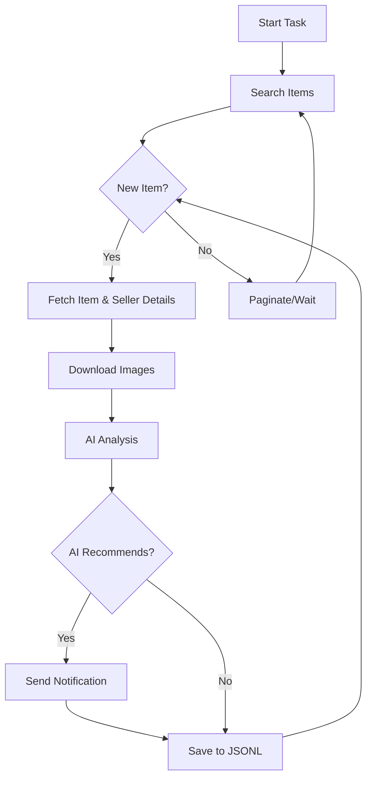

# AI-Powered Goofish (Xianyu) Monitor: Smartly Track & Analyze Secondhand Goods

**Tired of missing out on great deals?** This AI-powered tool uses Playwright and AI to intelligently monitor and analyze items on Goofish (闲鱼), featuring a user-friendly web interface for effortless management and real-time alerts. [Visit the original repo](https://github.com/dingyufei615/ai-goofish-monitor) to get started!

## Key Features

*   ✨ **Intuitive Web UI:** Manage tasks, edit AI criteria, view real-time logs, and filter results without command-line complexities.
*   🤖 **AI-Driven Task Creation:** Simply describe what you want, and the AI creates a task with complex filtering logic.
*   🔄 **Concurrent Multi-Tasking:** Monitor multiple keywords simultaneously via `config.json`, each running independently.
*   ⚡ **Real-time Stream Processing:** Analyze new listings instantly, eliminating delays.
*   🧠 **Advanced AI Analysis:** Leverage multimodal large language models (like GPT-4o) to analyze item descriptions, images, and seller profiles for accurate filtering.
*   ⚙️ **Highly Customizable:** Tailor each task with unique keywords, price ranges, filter conditions, and AI prompts.
*   🔔 **Instant Notifications:** Receive immediate alerts via ntfy.sh, Enterprise WeChat Group Bot, or Bark when desirable items are found.
*   📅 **Scheduled Task Execution:** Utilize Cron expressions for automated, time-based task scheduling.
*   🐳 **Docker Ready:** Deploy quickly with provided `docker-compose` configuration.
*   🛡️ **Robust Anti-Scraping:** Mimics human behavior with random delays and actions for increased stability.

## Core Functionality at a Glance

*   **Task Creation:** Describe your desired item in plain language, and the system will create and configure a monitoring task for you.
*   **Real-time Monitoring:** Continuously searches Goofish for new listings that match your criteria.
*   **Advanced AI Analysis:** Analyzes each listing using a large language model (LLM), evaluating the item's details, images, and seller information to determine if it meets your needs.
*   **Notifications:** Sends instant alerts to your preferred channels (ntfy.sh, WeChat Bot, etc.) when a matching item is found.

## Quick Start Guide

### 1. Environment Setup

*   **Python:** Python 3.10 or higher is recommended.
*   Clone the repository:

    ```bash
    git clone https://github.com/dingyufei615/ai-goofish-monitor
    cd ai-goofish-monitor
    ```

*   Install dependencies:

    ```bash
    pip install -r requirements.txt
    ```

### 2. Configuration

1.  **Environment Variables:** Create a `.env` file from the example and configure it:

    ```bash
    cp .env.example .env
    ```

    Key environment variables:

    | Variable           | Description                                         | Required? | Notes                                                                          |
    | ------------------ | --------------------------------------------------- | --------- | ------------------------------------------------------------------------------ |
    | `OPENAI_API_KEY`   | Your AI model provider API key.                     | Yes       |                                                                                |
    | `OPENAI_BASE_URL`  | AI model API endpoint (compatible with OpenAI format). | Yes       |  Specify base URL, e.g., `https://ark.cn-beijing.volces.com/api/v3/`       |
    | `OPENAI_MODEL_NAME` | The AI model to use.                                 | Yes       | Must be a multimodal model like `doubao-seed-1-6-250615` or `gemini-2.5-pro`. |
    | `PROXY_URL`        | (Optional) HTTP/S proxy (e.g., `http://127.0.0.1:7890`).| No        |                                                                                |

2.  **Login Status (Critical!)** Obtain login credentials.  The Web UI is the easiest way:

    *   Start the web service in Step 3.
    *   Go to **"System Settings"** in the Web UI.
    *   Click **"Manual Update"** for the "Login Status File."
    *   Follow the instructions to use the Xianyu Login State Extractor browser extension.  Copy the data to the Web UI.

    **Alternative: Run login.py:**

    ```bash
    python login.py
    ```

    Scan the QR code that appears in the browser with your Xianyu app. This creates an `xianyu_state.json` file in the project root.

### 3. Start the Web Service

```bash
python web_server.py
```

### 4. Get Started!

1.  Open the Web UI at `http://127.0.0.1:8000`.
2.  In "Task Management," create a new task, and describe what you are looking for.
3.  The AI generates the analysis criteria. Start the task to begin monitoring.

## 🐳 Docker Deployment (Recommended)

### 1. Preparation

*   **Docker:** Install [Docker Engine](https://docs.docker.com/engine/install/).
*   Clone the repository and configure the `.env` file (as described above).
*   **Login Status (Crucial):** Run the following to set up the login through the Web UI after starting the container:

    ```bash
    docker-compose up -d
    ```

    Then, access the Web UI, go to "System Settings," click "Manual Update," and use the Xianyu Login State Extractor extension.

### 2. Run the Container

```bash
docker-compose up --build -d
```

### 3. Access and Manage

*   **Web UI:** `http://127.0.0.1:8000`
*   **Real-time Logs:** `docker-compose logs -f`
*   **Stop:** `docker-compose stop`
*   **Start:** `docker-compose start`
*   **Remove:** `docker-compose down`

## Web UI Feature Overview

*   **Task Management:** AI-powered task creation, visualization, scheduling (Cron), editing, and control.
*   **Result Viewing:** Card-based display, intelligent filtering, and detailed views of each item's data.
*   **Run Logs:** Real-time logging with auto/manual refresh options.
*   **System Settings:** Status checks and prompt editing.

## Workflow Diagram



## Authentication

Basic authentication protects the Web UI.

*   Configure credentials in the `.env` file.
*   Default credentials are `admin` / `admin123`. *Change these in production!*
*   All API endpoints, the Web UI, and static resources require authentication.

## FAQ

Find answers to common questions in [FAQ.md](FAQ.md).

## Acknowledgements

Thanks to the projects and communities that helped make this possible:

*   [superboyyy/xianyu_spider](https://github.com/superboyyy/xianyu_spider)
*   [@jooooody](https://linux.do/u/jooooody/summary)
*   [LinuxDo](https://linux.do/)
*   ClaudeCode/Aider/Gemini

## Support & Sponsoring

If you find this project helpful, please consider supporting it!

<table>
  <tr>
    <td></td>
    <td></td>
  </tr>
</table>

## Important Notes

*   Respect Xianyu's terms of service and robots.txt. Avoid excessive requests.
*   Use responsibly and for legal purposes only.
*   This project is licensed under the [MIT License](LICENSE).
*   No warranty is provided. The author is not responsible for any damages.
*   See [DISCLAIMER.md](DISCLAIMER.md) for more information.

[](https://star-history.com/#dingyufei615/ai-goofish-monitor&Date)