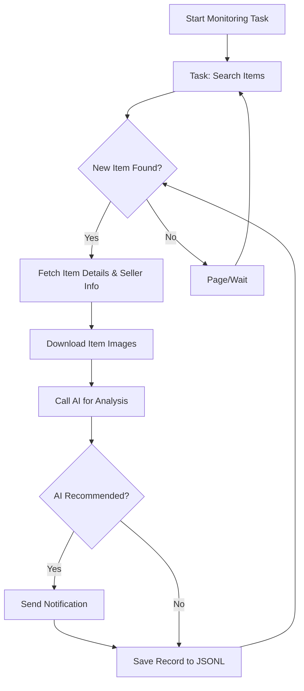

# AI-Powered Goofish (Xianyu) Monitor: Effortlessly Track & Analyze Second-Hand Goods

This project is an intelligent monitoring tool for the Chinese second-hand goods platform, Goofish (Xianyu), leveraging Playwright, AI analysis, and a user-friendly Web interface to track, analyze, and notify you of desired items. [View the original repository](https://github.com/dingyufei615/ai-goofish-monitor).

## ✨ Key Features

*   **Intuitive Web UI:** Manage tasks, edit AI criteria, view real-time logs, and filter results without command-line complexities.
*   **AI-Driven Task Creation:** Describe your ideal item in natural language, and the system will generate a sophisticated monitoring task.
*   **Concurrent Multi-Tasking:** Monitor multiple keywords simultaneously, each operating independently without interference.
*   **Real-time Streaming:** Analyze new listings immediately, eliminating batch processing delays.
*   **Deep AI Analysis:** Integrate multimodal large language models (like GPT-4o) to analyze item descriptions, images, and seller profiles for precise filtering.
*   **Highly Customizable:** Configure individual keywords, price ranges, filtering conditions, and AI analysis prompts for each task.
*   **Instant Notifications:** Receive immediate alerts via ntfy.sh, Enterprise WeChat group bots, and Bark when matching items are found.
*   **Scheduled Task Execution:** Utilize cron expressions to schedule tasks at desired intervals.
*   **Dockerized Deployment:** Utilize `docker-compose` for fast, standardized containerized deployment.
*   **Robust Anti-Scraping Measures:** Employ realistic user behavior and random delays to enhance stability and prevent detection.

## 🚀 Getting Started

### Step 1: Environment Setup

> ⚠️ **Python Version Requirement:**  Requires Python 3.10 or higher.  Lower versions may cause dependency installation failures or runtime errors (e.g., `ModuleNotFoundError: No module named 'PIL'`).

Clone the project:

```bash
git clone https://github.com/dingyufei615/ai-goofish-monitor
cd ai-goofish-monitor
```

Install dependencies:

```bash
pip install -r requirements.txt
```

### Step 2: Configuration (.env)

1.  **Create `.env` File:** Copy `.env.example` to `.env` and customize the values.

    *   Windows: `copy .env.example .env`
    *   Linux/macOS: `cp .env.example .env`

    Key variables within the `.env` file:

    | Variable             | Description                                          | Required? | Notes                                                                                                                                                  |
    | :------------------- | :--------------------------------------------------- | :-------- | :----------------------------------------------------------------------------------------------------------------------------------------------------- |
    | `OPENAI_API_KEY`     | Your AI model service provider's API Key.            | Yes       | May be optional for some local or specific proxy services.                                                                                          |
    | `OPENAI_BASE_URL`    | API endpoint for the AI model, compatible with OpenAI. | Yes       | Provide the base path, e.g., `https://ark.cn-beijing.volces.com/api/v3/`.                                                                           |
    | `OPENAI_MODEL_NAME`  | The specific model name you want to use.             | Yes       |  **Must** be a multimodal model that supports image analysis, such as `doubao-seed-1-6-250615`, `gemini-2.5-pro`, etc.                                    |
    | `PROXY_URL`          | (Optional) HTTP/S proxy configuration for accessing the internet. | No        | Supports `http://` and `socks5://` formats. For example, `http://127.0.0.1:7890`.                                                                    |
    | `NTFY_TOPIC_URL`     | (Optional) [ntfy.sh](https://ntfy.sh/) topic URL for notifications. | No        | Notifications will be disabled if left blank.                                                                                                    |
    | `GOTIFY_URL`         | (Optional) Gotify service address.                   | No        | Example: `https://push.example.de`.                                                                                                                   |
    | `GOTIFY_TOKEN`       | (Optional) Gotify application token.                | No        |                                                                                                                                                       |
    | `BARK_URL`           | (Optional) [Bark](https://bark.day.app/) push address.           | No        | Example: `https://api.day.app/your_key`. Notifications will be disabled if left blank.                                                            |
    | `WX_BOT_URL`         | (Optional) Enterprise WeChat group bot webhook URL.  | No        | Notifications will be disabled if left blank. Ensure the URL is enclosed in double quotes in the `.env` file to prevent configuration issues.         |
    | `WEBHOOK_URL`        | (Optional) General Webhook URL.                     | No        | Notifications will be disabled if left blank.                                                                                                    |
    | `WEBHOOK_METHOD`     | (Optional) Webhook request method.                  | No        | Supports `GET` or `POST`, defaults to `POST`.                                                                                                    |
    | `WEBHOOK_HEADERS`    | (Optional) Custom request headers for Webhook.      | No        | Must be a valid JSON string, for example: `'{"Authorization": "Bearer xxx"}'`.                                                                 |
    | `WEBHOOK_CONTENT_TYPE` | (Optional) POST request content type.              | No        | Supports `JSON` or `FORM`, defaults to `JSON`.                                                                                                     |
    | `WEBHOOK_QUERY_PARAMETERS` | (Optional) Query parameters for GET requests.           | No        | JSON string, supports `{{title}}` and `{{content}}` placeholders.                                                                        |
    | `WEBHOOK_BODY` | (Optional) Request body for POST requests.              | No        | JSON string, supports `{{title}}` and `{{content}}` placeholders.                                                                        |
    | `LOGIN_IS_EDGE`      | Use Edge browser for login and scraping.             | No        | Defaults to `false`, using Chrome/Chromium.                                                                                                   |
    | `PCURL_TO_MOBILE`    | Convert PC item links to mobile links in notifications. | No        | Defaults to `true`.                                                                                                                               |
    | `RUN_HEADLESS`       | Run the browser in headless mode.                   | No        | Defaults to `true`. Set to `false` to manually handle captchas during local debugging. **Must be `true` for Docker deployments.**                       |
    | `AI_DEBUG_MODE`      | Enable AI debugging mode.                           | No        | Defaults to `false`. Enable to print detailed AI request/response logs in the console.                                                                 |
    | `SKIP_AI_ANALYSIS`   | Skip AI analysis and send notifications directly.   | No        | Defaults to `false`. Setting to `true` will notify all crawled items immediately without going through AI analysis.                              |
    | `ENABLE_THINKING` | Enable the `enable_thinking` parameter.                 | No        | Defaults to `false`. Some AI models require this parameter, while others do not support it. If you encounter the "Invalid JSON payload received..." error, try setting it to `false`. |
    | `SERVER_PORT`        | Port for the Web UI service.                        | No        | Defaults to `8000`.                                                                                                                               |
    | `WEB_USERNAME`       | Web UI login username.                              | No        | Defaults to `admin`.  **Change this in production.**                                                                                              |
    | `WEB_PASSWORD`       | Web UI login password.                              | No        | Defaults to `admin123`. **Use a strong password in production!**                                                                                   |

    > 💡 **Debugging Tip:** If you encounter 404 errors when configuring AI APIs, try testing with an API from Alibaba Cloud or Volcano Engine first to ensure basic functionality before trying other providers.

    > 🔐 **Security Reminder:** Web UI uses Basic Authentication.  Default credentials are `admin` / `admin123`.  **Change these in production!**

2.  **Get Login Credentials (Important!)**:  The scraper requires valid login credentials to access Xianyu.

    **Recommended Method: Through Web UI**

    1.  Skip this step and start the Web service in Step 3.
    2.  Open the Web UI and go to the "System Settings" page.
    3.  Find "Login State File" and click the "Manual Update" button.
    4.  Follow the instructions in the popup:
        -   Install the [Xianyu Login State Extraction Extension](https://chromewebstore.google.com/detail/xianyu-login-state-extrac/eidlpfjiodpigmfcahkmlenhppfklcoa) in your Chrome browser.
        -   Open the Xianyu website and log in.
        -   After successful login, click the extension icon in the browser toolbar.
        -   Click the "Extract Login State" button to get the login information.
        -   Click the "Copy to Clipboard" button.
        -   Paste the content into the Web UI and save.

    **Alternative: Run the login.py Script (if you have a GUI)**

    If you can run the program on a local machine or a server with a desktop environment, you can use the login script:

    ```bash
    python login.py
    ```

    This will open a browser window.  Use the **Xianyu App to scan the QR code** to log in. Upon success, the program will close, and a `xianyu_state.json` file will be created in the project root.

### Step 3: Start the Web Server

```bash
python web_server.py
```

### Step 4: Start Monitoring

1.  Open your browser and go to `http://127.0.0.1:8000`.
2.  Go to "Task Management" and click "Create New Task".
3.  Describe your desired item in natural language (e.g., "I want to buy a Sony A7M4 camera, 95% new or better, budget under 13,000 yuan, less than 5000 shutter clicks"), and fill in task details.
4.  Click "Create". The AI will generate analysis criteria.
5.  Go back to the main interface, set up a schedule, or click "Start" to begin automatic monitoring!

## 🐳 Docker Deployment (Recommended)

### Step 1: Environment Setup (Similar to Local Setup)

1.  **Install Docker:** Ensure [Docker Engine](https://docs.docker.com/engine/install/) is installed on your system.
2.  **Clone and Configure:**

    ```bash
    git clone https://github.com/dingyufei615/ai-goofish-monitor
    cd ai-goofish-monitor
    ```
3.  **Create `.env` File:** Create and populate the `.env` file in the project root, referencing the setup instructions above.
4.  **Get Login Credentials (Critical!):**  Docker containers *cannot* use the QR code login.  **After starting the container**, use the Web UI to set the login state.

    1.  (On your host machine) Run `docker-compose up -d` to start the service.
    2.  Open your browser to `http://127.0.0.1:8000` and access the Web UI.
    3.  Go to the "System Settings" page and click the "Manual Update" button.
    4.  Follow the steps in the popup (as detailed in the Web UI setup section, above).

> ℹ️ **Python Version:**  Docker uses the Python 3.11 version specified in the Dockerfile; you do not need to worry about local Python compatibility.

### Step 2: Run the Docker Container

The project includes a `docker-compose.yaml` file, which is recommended for managing containers.

Run the following command in the project root:

```bash
docker-compose up --build -d
```

This runs the service in the background. Docker Compose uses your `.env` and `docker-compose.yaml` configurations to build and launch the container.

If you encounter network issues inside the container, troubleshoot or configure a proxy.

> ⚠️ **OpenWrt Deployment Notes:** If deploying on an OpenWrt router, you might encounter DNS resolution problems due to Docker Compose's default network not inheriting OpenWrt's DNS settings. If you get `ERR_CONNECTION_REFUSED`, check your container's network settings, and consider configuring DNS manually or adjusting network mode to enable the container to access the external network.

### Step 3: Access and Management

-   **Access Web UI:** Open `http://127.0.0.1:8000` in your browser.
-   **View Real-time Logs:** `docker-compose logs -f`
-   **Stop Container:** `docker-compose stop`
-   **Start Stopped Container:** `docker-compose start`
-   **Stop and Remove Container:** `docker-compose down`

## 📸 Web UI Features

*   **Task Management:**
    *   **AI-Powered Task Creation:** Generate monitoring tasks using natural language descriptions.
    *   **Visual Editing & Control:** Modify task parameters (keywords, prices, schedules) directly in a table and start/stop/delete tasks independently.
    *   **Scheduled Execution:** Use cron expressions for automated, periodic task runs.
*   **Result Viewing:**
    *   **Card-Based Browsing:** Display matching items with clear visual cards.
    *   **Smart Filtering & Sorting:** Filter for AI-recommended items and sort by crawl time, publication date, price, etc.
    *   **Detailed Information:** View complete data and in-depth AI analysis results for each item.
*   **Running Log:**
    *   **Real-time Log Stream:** View detailed logs of the scraper's operations.
    *   **Log Management:** Automatic and manual refresh, and clear log functionality.
*   **System Settings:**
    *   **Status Check:** Verify the `.env` configuration, login status, and other essential dependencies.
    *   **Prompt Editing:** Edit and save the prompt files used for AI analysis directly in the web interface.

## 🚀 Workflow



## 🔐 Web UI Authentication

### Authentication Configuration

The Web interface is protected with Basic Authentication to ensure that only authorized users can access the management interface and APIs.

#### Configuration Method

Set your credentials in the `.env` file:

```bash
# Web Service Authentication Configuration
WEB_USERNAME=admin
WEB_PASSWORD=admin123
```

#### Default Credentials

If credentials are *not* specified in `.env`, the system uses these defaults:

-   Username: `admin`
-   Password: `admin123`

**⚠️ Important: Change the default password in production!**

#### Authentication Scope

-   **Protected:** All API endpoints, Web interface, and static resources
-   **Unprotected:** Health check endpoint (`/health`)

#### Usage

1.  **Browser Access:** The authentication dialog appears when accessing the Web interface.
2.  **API Calls:** Include Basic Authentication credentials in the request headers.
3.  **Frontend JavaScript:** Handles authentication automatically; no modifications are needed.

#### Security Recommendations

1.  Change the default password to a strong one.
2.  Use HTTPS in production.
3.  Regularly rotate authentication credentials.
4.  Restrict access by IP address through a firewall.

For more configuration details, refer to [AUTH_README.md](AUTH_README.md).

## Frequently Asked Questions (FAQ)

Find detailed answers to common questions, covering setup, AI configuration, and anti-scraping strategies in:

👉 **[View the FAQ (FAQ.md)](FAQ.md)**

## Acknowledgements

This project references and is built upon the following projects:

-   [superboyyy/xianyu_spider](https://github.com/superboyyy/xianyu_spider)

And contributions from LinuxDo community members.

-   [@jooooody](https://linux.do/u/jooooody/summary)

Plus thanks to  [LinuxDo](https://linux.do/) community.

And thanks to ClaudeCode/ModelScope/Gemini and other model/tools, liberate hands and experience the joy of Vibe Coding.

## ⚠️ Important Notes

-   Please adhere to Xianyu's user agreement and robots.txt rules to avoid overloading the server or account restrictions.
-   This project is for learning and technical research only; do not use it for illegal purposes.
-   This project is released under the [MIT License](LICENSE) "as is" with no warranties.
-   The project's author and contributors are not liable for any damages or losses resulting from its use.
-   See the [DISCLAIMER.md](DISCLAIMER.md) file for more details.

[](https://star-history.com/#dingyufei615/ai-goofish-monitor&Date)