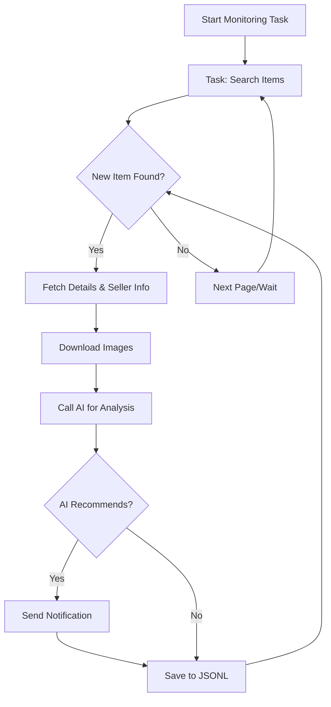

# AI-Powered Goofish (Xianyu) Monitor: Real-Time Item Tracking with Smart Analysis

Tired of missing out on the perfect deal?  **This AI-driven tool empowers you to monitor Xianyu (Goofish) in real-time, leveraging the power of AI for smart filtering and instant notifications, all through a user-friendly web interface.**  [Check out the original repo](https://github.com/dingyufei615/ai-goofish-monitor) for the full details and source code.

## Key Features:

*   ✅ **Intuitive Web UI:** Manage tasks, edit AI criteria, view real-time logs, and browse results effortlessly without command-line fuss.
*   🤖 **AI-Powered Task Creation:** Describe your desired item in plain language, and the AI will generate complex filtering logic automatically.
*   ⚙️ **Multi-Task Concurrency:** Monitor multiple keywords simultaneously with independent tasks.
*   ⚡ **Real-Time Processing:** Analyze new listings instantly to avoid missing limited-time offers.
*   🧠 **Deep AI Analysis:** Integrate multi-modal language models (like GPT-4o) to analyze item descriptions, images, and seller profiles for precise filtering.
*   🎯 **Highly Customizable:** Tailor each task with specific keywords, price ranges, filters, and AI analysis prompts.
*   🔔 **Instant Notifications:** Receive alerts via [ntfy.sh](https://ntfy.sh/), WeChat group bots, and [Bark](https://bark.day.app/) to your phone or desktop.
*   🗓️ **Scheduled Tasks:** Utilize cron expressions for automated, scheduled monitoring.
*   🐳 **Docker Deployment:** Simplify setup with ready-to-use `docker-compose` configurations.
*   🛡️ **Robust Anti-Scraping:** Mimics human behavior to enhance stability.

## Main Web UI Screenshots

*   **Task Management:**
    
*   **Monitoring Dashboard:**
    
*   **Notification Example:**
    

## Quick Start (Recommended: Web UI)

The Web UI provides the best user experience.

### Step 1: Environment Setup

> ⚠️ **Python Version Requirement**: Use Python 3.10+ for local development.

1.  Clone the repository:

    ```bash
    git clone https://github.com/dingyufei615/ai-goofish-monitor
    cd ai-goofish-monitor
    ```

2.  Install dependencies:

    ```bash
    pip install -r requirements.txt
    ```

### Step 2: Configuration

1.  **Configure Environment Variables:**  Copy `.env.example` to `.env` and fill in the required settings:

    ```bash
    # Windows:
    copy .env.example .env
    # Linux/MacOS:
    cp .env.example .env
    ```

    Key variables:

    | Variable             | Description                                   | Required | Notes                                                                                                                                  |
    | :------------------- | :-------------------------------------------- | :------- | :------------------------------------------------------------------------------------------------------------------------------------- |
    | `OPENAI_API_KEY`     | Your AI model provider's API key.             | Yes      |                                                                                                                                        |
    | `OPENAI_BASE_URL`    | AI model API endpoint, OpenAI compatible.     | Yes      | Example: `https://ark.cn-beijing.volces.com/api/v3/`                                                                                 |
    | `OPENAI_MODEL_NAME`  | The specific multimodal model to use.        | Yes      | **Must** support image analysis, e.g., `doubao-seed-1-6-250615`, `gemini-2.5-pro`.                                                      |
    | `PROXY_URL`          | (Optional) HTTP/S proxy for bypassing firewalls. | No      | Supports `http://` and `socks5://`.                                                                                                 |
    | `NTFY_TOPIC_URL`     | (Optional)  [ntfy.sh](https://ntfy.sh/) topic URL for notifications. | No      |  |
    | ... (Other variables) | Refer to the original README for the full table. |          |  |

    > 💡 **Debugging Tip:** If you encounter 404 errors, test with an API from Alibaba Cloud or Volcano Engine first to ensure basic functionality.

    > 🔐 **Security Reminder:** Web UI uses Basic Auth. Default username/password is `admin`/`admin123`. **Change these in production!**

2.  **Obtain Login State (Crucial!):** The crawler needs a valid login. The Web UI is the recommended method:

    **Recommended: Web UI Update**
    1.  Proceed to Step 3 (start the web server).
    2.  Open the Web UI and navigate to "System Settings".
    3.  Click "Manually Update" for the "Login State File".
    4.  Follow the prompts:
        -   Install the [Xianyu Login State Extractor](https://chromewebstore.google.com/detail/xianyu-login-state-extrac/eidlpfjiodpigmfcahkmlenhppfklcoa) in Chrome.
        -   Log in to Xianyu on the web.
        -   Click the extension icon, then "Extract Login State" and "Copy to Clipboard".
        -   Paste the copied information into the Web UI and save.

    **Alternative: Login Script (if you have a local display environment)**

    ```bash
    python login.py
    ```

    This opens a browser window. Use your mobile Xianyu app to scan the QR code. It will generate `xianyu_state.json`.

### Step 3: Start the Web Server

```bash
python web_server.py
```

### Step 4: Start Monitoring

1.  Open `http://127.0.0.1:8000` in your browser.
2.  Go to "Task Management" and click "Create New Task".
3.  Describe your item (e.g., "Sony A7M4, 95% new, budget under 13k, shutter count < 5000").
4.  Click create and let the AI generate the filters.
5.  Start or schedule your task.

## Docker Deployment (Recommended)

Docker simplifies deployment.

### Step 1: Environment Prep

1.  **Install Docker:** Ensure [Docker Engine](https://docs.docker.com/engine/install/) is installed.
2.  **Clone and Configure:**

    ```bash
    git clone https://github.com/dingyufei615/ai-goofish-monitor
    cd ai-goofish-monitor
    ```

3.  **Create `.env`:** Create and populate your `.env` file (see above for details).
4.  **Obtain Login State (Key Step!):** Set the login state *after* starting the container via the Web UI:
    1.  (On the host) `docker-compose up -d`.
    2.  Open the Web UI at `http://127.0.0.1:8000`.
    3.  Go to "System Settings" and click "Manually Update."
    4.  Follow the prompts, as described above for the Web UI login.

    > ℹ️  **Python Version:** Docker uses Python 3.11, specified in the Dockerfile.

### Step 2: Run Docker

```bash
docker-compose up --build -d
```

### Step 3: Access & Manage

*   **Web UI:** `http://127.0.0.1:8000`
*   **View Logs:** `docker-compose logs -f`
*   **Stop:** `docker-compose stop`
*   **Start:** `docker-compose start`
*   **Remove:** `docker-compose down`

## Web UI Features at a Glance

*   **Task Management:** AI-powered task creation, visual editing, scheduling, and control.
*   **Results Viewing:** Card-based display, smart filtering, and deep-dive details with AI analysis results.
*   **Real-time Logging:** Detailed logs and management tools.
*   **System Settings:** Configuration and prompt editing.

## Workflow Diagram



## Web UI Authentication

*   **Configuration:** Set `WEB_USERNAME` and `WEB_PASSWORD` in `.env`.
*   **Defaults:** `admin`/`admin123` (CHANGE THESE IN PRODUCTION!)
*   **Scope:** All API endpoints, Web UI, and static resources *except* the health check (`/health`).
*   **Usage:** Access the Web UI with Basic Authentication. APIs need authentication headers.
*   **Security:** Change defaults, use HTTPS, and use a firewall.

See [AUTH_README.md](AUTH_README.md) for more information.

## FAQ

👉 **[Click here to view the Frequently Asked Questions (FAQ.md)](FAQ.md)**

## Acknowledgements

[superboyyy/xianyu_spider](https://github.com/superboyyy/xianyu_spider) and the LinuxDo community. Also thanks to ClaudeCode/Aider/Gemini tools.

## Support

If this project helps you, please consider buying the author a coffee. (Alipay and WeChat Pay QR codes provided).

## Important Notes

*   Adhere to Xianyu's terms and `robots.txt` to avoid overloading servers or account restrictions.
*   This is for educational and research purposes only.  Do not use it for illegal activities.
*   Released under the [MIT License](LICENSE).
*   The author is not responsible for any damages caused by using the software.
*   See [DISCLAIMER.md](DISCLAIMER.md) for more details.

[](https://star-history.com/#dingyufei615/ai-goofish-monitor&Date)