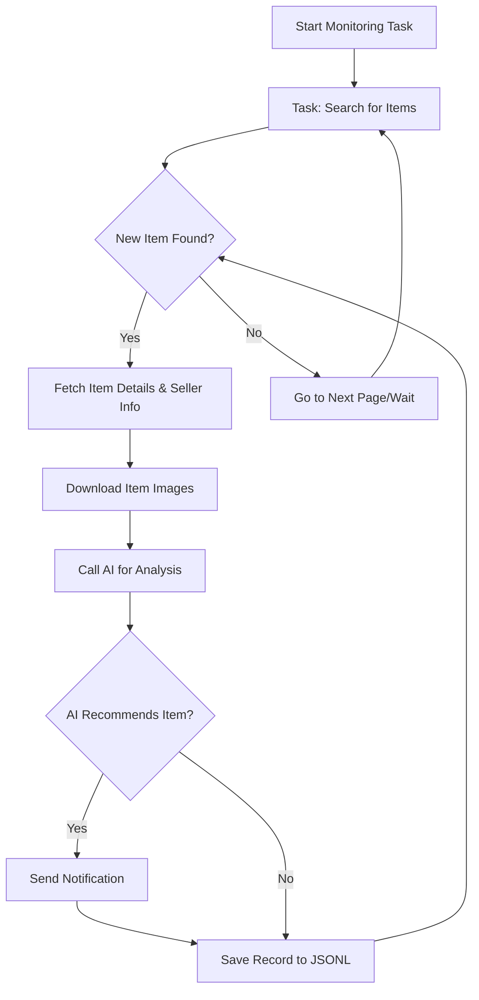

# AI 闲鱼监控机器人: 智能监控你的闲鱼宝贝

Tired of missing out on the best deals? **AI 闲鱼监控机器人** is a powerful tool that uses AI and Playwright to intelligently monitor and analyze Xianyu (闲鱼) listings, helping you find your next purchase effortlessly.

[View the original repository on GitHub](https://github.com/dingyufei615/ai-goofish-monitor)

## Key Features

*   ✅ **Intuitive Web UI:** Manage tasks, edit AI criteria, view real-time logs, and browse results with a user-friendly web interface – no command line needed!
*   💬 **AI-Powered Task Creation:** Simply describe your desired item in natural language, and the AI creates a sophisticated monitoring task for you.
*   ⚙️ **Multi-Task Concurrency:** Monitor multiple keywords simultaneously with independent tasks, ensuring you don't miss any opportunities.
*   ⚡️ **Real-time Processing:** Get instant analysis of new listings, eliminating batch processing delays.
*   🧠 **Deep AI Analysis:** Leverages multi-modal large language models (e.g., GPT-4o) to analyze listing images, descriptions, and seller profiles for precise filtering.
*   🛠️ **Highly Customizable:** Configure unique keywords, price ranges, filters, and AI prompts for each monitoring task.
*   🔔 **Instant Notifications:** Receive immediate alerts via [ntfy.sh](https://ntfy.sh/), WeChat Enterprise Robot, and [Bark](https://bark.day.app/) when a matching item is found.
*   📅 **Scheduled Tasks:** Utilize Cron expressions for automated, scheduled task execution.
*   🐳 **Docker Deployment:** Deploy quickly and easily with pre-configured `docker-compose` settings.
*   🛡️ **Robust Anti-Scraping Measures:** Mimics human behavior with randomized delays and user interactions to improve stability and avoid detection.

## Screenshots

**Web UI - Task Management**


**Web UI - Monitoring Dashboard**


**Notification Example (ntfy.sh)**


## Getting Started (Recommended: Web UI)

The Web UI provides the best user experience.

### Step 1: Environment Setup

1.  **Clone the Repository:**

    ```bash
    git clone https://github.com/dingyufei615/ai-goofish-monitor
    cd ai-goofish-monitor
    ```

2.  **Install Dependencies:**

    ```bash
    pip install -r requirements.txt
    ```

### Step 2: Configuration

1.  **Configure Environment Variables:** Rename `.env.example` to `.env` and customize the values.

    *   **Windows:**

        ```cmd
        copy .env.example .env
        ```

    *   **Linux/macOS:**

        ```bash
        cp .env.example .env
        ```

    Environment Variables:

    | Variable | Description | Required? | Notes |
    | :--- | :--- | :--- | :--- |
    | `OPENAI_API_KEY` | Your AI model provider's API Key. | Yes | May be optional for some local or proxy services. |
    | `OPENAI_BASE_URL` | The API endpoint for your AI model, must be compatible with OpenAI format. | Yes |  Enter the base URL, e.g., `https://api.example.com/v1`. |
    | `OPENAI_MODEL_NAME` | The specific model name you want to use. | Yes |  **MUST** choose a multi-modal model that supports image analysis, like `gpt-4o`, `gemini-1.5-pro`. |
    | `PROXY_URL` | (Optional) HTTP/S proxy configuration for AI requests. | No | Supports `http://` and `socks5://` formats, e.g., `http://127.0.0.1:7890`. |
    | `NTFY_TOPIC_URL` | (Optional) [ntfy.sh](https://ntfy.sh/) topic URL for notifications. | No |  Leave blank to disable ntfy notifications. |
    | `GOTIFY_URL` | (Optional) Gotify service address. | No |  Example: `https://push.example.de`. |
    | `GOTIFY_TOKEN` | (Optional) Gotify application token. | No |  |
    | `BARK_URL` | (Optional) [Bark](https://bark.day.app/) push address. | No | Example: `https://api.day.app/your_key`. Leave blank to disable Bark notifications. |
    | `WX_BOT_URL` | (Optional) WeChat Enterprise Robot Webhook URL. | No |  Leave blank to disable WeChat notifications. |
    | `WEBHOOK_URL` | (Optional) General Webhook URL. | No | Leave blank to disable general Webhook notifications. |
    | `WEBHOOK_METHOD` | (Optional) Webhook request method. | No | Supports `GET` or `POST`, defaults to `POST`. |
    | `WEBHOOK_HEADERS` | (Optional) Webhook custom request headers. | No | Must be a valid JSON string, e.g., `'{"Authorization": "Bearer xxx"}'`. |
    | `WEBHOOK_CONTENT_TYPE` | (Optional) POST request content type. | No | Supports `JSON` or `FORM`, defaults to `JSON`. |
    | `WEBHOOK_QUERY_PARAMETERS` | (Optional) GET request query parameters. | No | JSON string, supports `${title}` and `${content}` placeholders. |
    | `WEBHOOK_BODY` | (Optional) POST request body. | No | JSON string, supports `${title}` and `${content}` placeholders. |
    | `LOGIN_IS_EDGE` | Whether to use Edge browser for login and crawling. | No | Defaults to `false`, using Chrome/Chromium. |
    | `PCURL_TO_MOBILE` | Whether to convert PC product links to mobile links in notifications. | No | Defaults to `true`. |
    | `RUN_HEADLESS` | Whether to run the crawler browser in headless mode. | No | Defaults to `true`. Set to `false` for manual captcha handling during local debugging. **Must be `true` for Docker deployment.** |
    | `AI_DEBUG_MODE` | Whether to enable AI debug mode. | No | Defaults to `false`. When enabled, prints detailed AI request and response logs to the console. |
    | `SERVER_PORT` | The port for the Web UI service. | No | Defaults to `8000`. |

2.  **Get Login Credentials (Important!)**: You need valid login credentials for the crawler to access Xianyu.

    **Recommended: Update via Web UI**

    1.  Skip this step and proceed to Step 3 to start the web server.
    2.  Open the Web UI and go to the "System Settings" page.
    3.  Find "Login Status File" and click the "Manual Update" button.
    4.  Follow the instructions in the pop-up window to log in to Xianyu on your own computer and copy the necessary login information into the Web UI.

    This method is the easiest, as it doesn't require running a graphical program on the server.

    **Alternative: Run Login Script**

    If you can run programs locally or on a server with a desktop environment, you can use the traditional script method:

    ```bash
    python login.py
    ```

    A browser window will open. Use the **Xianyu App on your phone to scan the QR code** and log in. After successful login, the program will close automatically and generate an `xianyu_state.json` file in the project root directory.

### Step 3: Start the Web Server

With everything set up, start the web management server:

```bash
python web_server.py
```

### Step 4: Start Monitoring!

Open your browser and navigate to `http://127.0.0.1:8000`.

1.  Go to the **"Task Management"** page and click **"Create New Task"**.
2.  Describe your desired purchase in natural language (e.g., "I want to buy a Sony A7M4 camera, 95% new or better, under 13,000 yuan, shutter count under 5000"), and fill in the task name and keywords.
3.  Click "Create", and the AI will automatically generate complex analysis criteria.
4.  Return to the main interface, add a schedule or click "Start" to begin automated monitoring!

## 🐳 Docker Deployment (Recommended)

Docker allows you to package the application and all its dependencies into a standardized unit for fast, reliable, and consistent deployment.

### Step 1: Environment Setup (Similar to Local Deployment)

1.  **Install Docker:** Ensure you have [Docker Engine](https://docs.docker.com/engine/install/) installed.

2.  **Clone the Project and Configure:**

    ```bash
    git clone https://github.com/dingyufei615/ai-goofish-monitor
    cd ai-goofish-monitor
    ```

3.  **Create `.env` File:** Create and populate the `.env` file in the project root, following the instructions in the **[Getting Started](#getting-started-recommended-web-ui)** section.

4.  **Get Login Credentials (Critical!)**:  You can't perform QR code login inside the Docker container.  Get your login credentials *after* starting the container by accessing the Web UI:

    1.  (On your host machine) Run `docker-compose up -d` to start the service.
    2.  Open the Web UI in your browser: `http://127.0.0.1:8000`.
    3.  Go to "System Settings" and click the "Manual Update" button.
    4.  Follow the instructions in the pop-up, and copy your login information from your **local computer's browser** into the Web UI. The `xianyu_state.json` file will be automatically created in the correct shared volume location within the Docker container.

### Step 2: Run the Docker Container

The project includes a `docker-compose.yaml` file. Use `docker-compose` for easier container management.

In the project root directory, run:

```bash
docker-compose up --build -d
```

This starts the service in detached mode. `docker-compose` will read the `.env` and `docker-compose.yaml` files and build and start the container accordingly.

If you encounter network issues inside the container, troubleshoot or use a proxy.

### Step 3: Access and Manage

*   **Access Web UI:** Open `http://127.0.0.1:8000` in your browser.
*   **View Real-time Logs:** `docker-compose logs -f`
*   **Stop Container:** `docker-compose stop`
*   **Start Stopped Container:** `docker-compose start`
*   **Stop and Remove Container:** `docker-compose down`

## 📸 Web UI Features Overview

*   **Task Management:**
    *   **AI Task Creation:** Generate monitoring tasks and AI analysis criteria with natural language descriptions.
    *   **Visual Editing and Control:** Modify task parameters (keywords, price, schedule, etc.) directly in a table, and individually start/stop/delete tasks.
    *   **Scheduled Tasks:** Configure Cron expressions for automated periodic execution of tasks.
*   **Result Viewing:**
    *   **Card View:** Display matching items clearly in image-based cards.
    *   **Smart Filtering and Sorting:** Filter for items marked "Recommended" by the AI and sort by crawl time, posting time, price, etc.
    *   **Detailed Information:** Click to see complete data and detailed AI analysis results for each item in JSON format.
*   **Running Logs:**
    *   **Real-time Log Stream:** View detailed real-time logs of the crawler's operation on the webpage for progress tracking and troubleshooting.
    *   **Log Management:** Supports automatic refresh, manual refresh, and one-click log clearing.
*   **System Settings:**
    *   **Status Check:** One-click check of `.env` configurations, login status, and other critical dependencies.
    *   **Prompt Online Editing:** Edit and save `prompt` files used for AI analysis directly on the webpage and adjust the AI's logic in real time.

## 🚀 Workflow

The diagram below describes the core processing logic for a single monitoring task, from start to finish. In practice, `web_server.py` acts as the main service, starting one or more task processes based on user actions or scheduled triggers.



## Frequently Asked Questions (FAQ)

Here are answers to common questions from the community (Issues).

1.  **Q:  `'gbk' codec can't encode character` errors when running `login.py` or `spider_v2.py`?**
    *   **A:** This is a common encoding issue on Windows. The project code and logs default to UTF-8 encoding.
    *   **Solution:**  Set the `PYTHONUTF8=1` environment variable *before* running the Python script:

        ```bash
        set PYTHONUTF8=1
        python spider_v2.py
        ```

        Or, use `chcp 65001` to switch the active code page to UTF-8.

2.  **Q:  `playwright install` needed when running `login.py`?**
    *   **A:** This error means the browser files required by Playwright are missing. The best solution is to ensure all dependencies are correctly installed via `requirements.txt`:

        ```bash
        pip install -r requirements.txt
        ```

        If the issue persists, try manually installing the Chromium browser:

        ```bash
        playwright install chromium
        ```

3.  **Q:  "Request timed out" or "Connection error" when creating or running tasks?**
    *   **A:**  This is usually a network issue, meaning your server can't connect to the `OPENAI_BASE_URL` configured in the `.env` file. Check:
        *   Your server's network connectivity.
        *   If you're in mainland China, you might need a network proxy to access foreign AI services (like OpenAI, Gemini). Configure this via the `PROXY_URL` variable in `.env`.
        *   Verify that the `OPENAI_BASE_URL` address is correct and that the service is running.

4.  **Q:  What if the AI model I chose doesn't support image analysis?**
    *   **A:**  A key advantage of this project is multi-modal analysis using images.  **You MUST** select an AI model that supports image recognition (Vision / Multi-modal). If your configured model doesn't support images, the AI analysis will fail or be significantly less effective. Change `OPENAI_MODEL_NAME` in `.env` to a model that supports image input, such as `gpt-4o`, `gemini-1.5-pro`, `deepseek-v2`, or `qwen-vl-plus`.

5.  **Q:  Can I deploy on a Synology NAS via Docker?**
    *   **A:** Yes. Deployment steps are generally the same as standard Docker deployment:
        1.  Complete the `login.py` step on your computer (not the Synology NAS) to generate the `xianyu_state.json` file.
        2.  Upload the entire project folder (including `.env` and `xianyu_state.json`) to a directory on your Synology NAS.
        3.  In the Synology Container Manager (or older Docker), run `docker-compose up -d` (via SSH or Task Scheduler) to start the project. Ensure that the volume mapping paths in `docker-compose.yaml` correctly point to your project folder on the NAS.

6.  **Q:  How to configure Gemini / Qwen / Grok or other non-OpenAI LLMs?**
    *   **A:** This project supports any model that provides an OpenAI-compatible API. The key is to correctly configure the three variables in your `.env` file:
        *   `OPENAI_API_KEY`:  Your model provider's API key.
        *   `OPENAI_BASE_URL`:  The API-compatible endpoint address provided by your model service.  **Carefully review the official documentation for the model you're using.**  The format is usually `https://api.your-provider.com/v1` (Note:  You **do not** need `/chat/completions` at the end).
        *   `OPENAI_MODEL_NAME`: The specific model name that you want to use. Requires image recognition support, e.g., `gemini-2.5-flash`.
    *   **Example:**  If your service's documentation says the Completions endpoint is `https://xx.xx.com/v1/chat/completions`, then set `OPENAI_BASE_URL` to `https://xx.xx.com/v1`.

7.  **Q: Getting detected by Xianyu, showing "abnormal traffic" or requiring verification?**
    *   **A:** This is Xianyu's anti-scraping mechanism. To reduce detection risk:
        *   **Disable Headless Mode:**  Set `RUN_HEADLESS=false` in `.env`. The browser will run with a visible window, allowing you to manually complete the verification process.
        *   **Reduce Monitoring Frequency:** Avoid running a large number of monitoring tasks simultaneously.
        *   **Use a Clean Network Environment:** Frequent crawling can lead to IP address marking.

8.  **Q: How do I fix pyzbar installation failing on Windows?**
    *   **A:** `pyzbar` needs additional zbar dynamic link library support on Windows.
    *   **Solution (Windows):**
        *   **Method 1 (Recommended):** Install with Chocolatey:

            ```cmd
            choco install zbar
            ```

        *   **Method 2:** Manually download and add to PATH:
            1.  Download the correct version of `libzbar-64.dll` from [zbar releases](https://github.com/NaturalHistoryMuseum/pyzbar/releases).
            2.  Place the file in your Python installation directory or add it to your system PATH.
        *   **Method 3:** Install with conda:

            ```cmd
            conda install -c conda-forge zbar
            ```

    *   **Linux Users:** Install the system package directly:

        ```bash
        # Ubuntu/Debian
        sudo apt-get install libzbar0

        # CentOS/RHEL
        sudo yum install zbar

        # Arch Linux
        sudo pacman -S zbar
        ```

## Acknowledgements

This project was developed by referencing these excellent projects, and I would like to express my gratitude:

-   [superboyyy/xianyu_spider](https://github.com/superboyyy/xianyu_spider)

And thanks to the contributions of LinuxDo friends

-   [@jooooody](https://linux.do/u/jooooody/summary)

And thank Aider and Gemini free my hands, It's such an amazing experience writing codes

## Support & Sponsoring

If this project is helpful to you, please consider buying me a coffee, thank you for your support!

<table>
  <tr>
    <td></td>
    <td></td>
  </tr>
</table>

## ⚠️ Important Notes

*   Please abide by Xianyu's user agreement and robots.txt rules. Avoid making excessive requests to avoid server overload or account restrictions.
*   This project is for learning and technical research only; please do not use it for illegal purposes.

[](https://star-history.com/#dingyufei615/ai-goofish-monitor&Date)