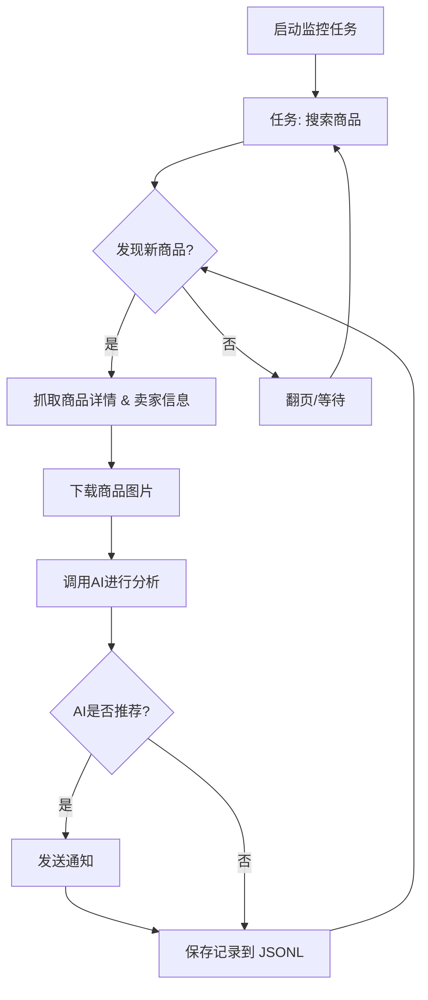

# AI 闲鱼智能监控机器人: 实时监控、智能分析，不错过每一个好物!

🤖 告别手动刷闲鱼，这款 AI 驱动的监控机器人基于 Playwright 和 AI 技术，实时追踪闲鱼商品，并通过智能分析快速筛选出符合您需求的商品，同时提供功能完善的 Web 管理界面。 [查看项目原仓库](https://github.com/dingyufei615/ai-goofish-monitor)

## ✨ 核心功能

*   ✅ **智能任务创建:** 使用自然语言描述您的需求，一键生成复杂筛选规则的监控任务。
*   🌐 **可视化 Web UI:** 友好的 Web 界面，用于任务管理、AI 标准编辑、日志查看和结果筛选。
*   🚀 **多任务并发:** 同时监控多个关键词，互不干扰，高效追踪。
*   ⏱️ **实时流式处理:** 发现新商品后即时分析，告别延迟。
*   🧠 **深度 AI 分析:** 结合多模态大语言模型 (如 GPT-4o)，分析商品图文和卖家信息，精准筛选。
*   ⚙️ **高度可定制:** 为每个任务配置独立的关键词、价格范围、AI 分析指令 (Prompt) 等。
*   🔔 **即时通知:** 支持通过 ntfy.sh, 企业微信机器人和 Bark 推送。
*   🗓️ **定时任务调度:** 支持 Cron 表达式，实现自动化周期性运行。
*   🐳 **Docker 一键部署:** 快速、标准化的容器化部署。
*   🛡️ **健壮的反爬策略:** 模拟真人操作，提高稳定性。

## 📸 快速上手

### 1. 环境准备

1.  **克隆项目:**

    ```bash
    git clone https://github.com/dingyufei615/ai-goofish-monitor
    cd ai-goofish-monitor
    ```

2.  **安装依赖:**

    ```bash
    pip install -r requirements.txt
    ```

### 2. 基础配置

1.  **配置 .env 文件:**

    *   复制 `.env.example` 文件并重命名为 `.env`。
        *   **Windows:** `copy .env.example .env`
        *   **Linux/macOS:** `cp .env.example .env`
    *   编辑 `.env` 文件，配置以下关键变量:

    | 环境变量          | 说明                                                              | 是否必填 | 注意事项                                                                                                                                  |
    | :---------------- | :---------------------------------------------------------------- | :------- | :---------------------------------------------------------------------------------------------------------------------------------------- |
    | `OPENAI_API_KEY`  | 你的 AI 模型服务商的 API Key。                                          | 是       |                                                                                                                                         |
    | `OPENAI_BASE_URL` | AI 模型的 API 接口地址，必须兼容 OpenAI 格式。                               | 是       | 填写 API 的基础路径，例如 `https://api.example.com/v1`。                                                                               |
    | `OPENAI_MODEL_NAME` | 你要使用的具体模型名称。                                                               | 是       | **必须**选择支持图片分析的多模态模型，如 `gpt-4o`, `gemini-1.5-pro` 等。                                                              |
    | `PROXY_URL`       | (可选) 为 AI 请求配置的 HTTP/S 代理。                                     | 否       | 支持 `http://` 和 `socks5://` 格式。                                                                                                  |
    | (其他变量)      | ... (查看原 README 获取完整的环境变量说明)                                      |          |                                                                                                                                         |

2.  **获取登录状态 (重要!)**
    *   **推荐：通过 Web UI 更新**
        1.  启动 Web 服务 (见第 3 步)。
        2.  在 Web UI 的 "系统设置" 页面中，点击 "手动更新" 按钮。
        3.  按照弹窗中的指引，登录闲鱼，复制登录信息并粘贴到 Web UI。
    *   **备用: 运行登录脚本 (如果可以在本地运行)**
        ```bash
        python login.py
        ```
        使用手机闲鱼App扫描二维码完成登录，程序会生成 `xianyu_state.json` 文件。

### 3. 启动 Web 服务

```bash
python web_server.py
```

### 4. 开始使用

在浏览器中打开 `http://127.0.0.1:8000`。

1.  在 "任务管理" 页面，点击 "创建新任务"。
2.  用自然语言描述您的购买需求 (例如：“我想买一台95新以上的索尼A7M4相机，预算1万3以内，快门数低于5000”)。
3.  点击创建，AI 将自动生成分析标准。
4.  启动任务，开始监控！

## 🐳 Docker 部署 (推荐)

1.  **环境准备:** (同本地部署，但 Docker 内登录需要通过 Web UI)
    *   安装 Docker。
    *   克隆项目。
    *   配置 `.env` 文件。
    *   **重要: 在 Docker 启动后，通过 Web UI 设置登录状态.**
        *   `docker-compose up -d` 启动 Docker。
        *   在浏览器中访问 `http://127.0.0.1:8000`。
        *   在 Web UI 的 "系统设置" 页面中，点击 "手动更新" 按钮。
        *   按照指引在**本地浏览器**中获取登录信息，并粘贴到 Web UI.

2.  **运行 Docker 容器:**

    ```bash
    docker-compose up --build -d
    ```

3.  **访问和管理:**

    *   访问 Web UI: `http://127.0.0.1:8000`
    *   查看实时日志: `docker-compose logs -f`
    *   停止容器: `docker-compose stop`
    *   启动已停止的容器: `docker-compose start`
    *   停止并移除容器: `docker-compose down`

## 📸 Web UI 功能

*   **任务管理:** AI 创建任务、可视化编辑、定时调度。
*   **结果查看:** 卡片式浏览、智能筛选、深度详情。
*   **运行日志:** 实时日志流、日志管理。
*   **系统设置:** 状态检查、Prompt 在线编辑。

## 🚀 工作流程



## 常见问题 (FAQ)

*   **Q: 编码错误 `'gbk' codec can't encode character`?**
    *   **A:**  Windows 环境编码问题。 解决方法：设置 `PYTHONUTF8=1` 或者使用 `chcp 65001`。
*   **Q: 提示需要 `playwright install`?**
    *   **A:**  确保已通过 `pip install -r requirements.txt` 安装依赖。 如果问题依旧，尝试 `playwright install chromium`。
*   **Q: "Request timed out" 或 "Connection error"?**
    *   **A:** 检查网络连接和 `OPENAI_BASE_URL` 设置，可能需要配置代理（通过 `PROXY_URL`）。
*   **Q:  AI 模型不支持图片分析？**
    *   **A:**  `OPENAI_MODEL_NAME` 必须选择支持图片识别的多模态模型 (例如： `gpt-4o`, `gemini-1.5-pro`).
*   **Q:  群晖 NAS 上部署？**
    *   **A:**  类似标准 Docker 部署，登录状态在**群晖启动后**通过 Web UI 设置。
*   **Q: 如何配置 Gemini / Qwen / Grok 或其他非 OpenAI 的大语言模型？**
    *   **A:**  正确配置 `.env` 中的 `OPENAI_API_KEY`, `OPENAI_BASE_URL` (API-Compatible Endpoint 地址), 和 `OPENAI_MODEL_NAME` (支持图片识别).
    *   **示例:** Completions 接口是 `https://xx.xx.com/v1/chat/completions`，那么 `OPENAI_BASE_URL` 就应该填 `https://xx.xx.com/v1`。
*   **Q: 被闲鱼检测到？**
    *   **A:**  设置 `RUN_HEADLESS=false`, 降低监控频率, 使用干净的网络环境。

## 致谢

感谢 [superboyyy/xianyu_spider](https://github.com/superboyyy/xianyu_spider), LinuxDo 社区贡献,以及Aider和Gemini的支持。

## Support & Sponsoring

如果您觉得这个项目对您有帮助，请考虑赞助我一杯咖啡！

<table>
  <tr>
    <td></td>
    <td></td>
  </tr>
</table>

## ⚠️ 注意事项

*   请遵守闲鱼的用户协议和 robots.txt 规则。
*   本项目仅供学习和研究，请勿用于非法用途。

[](https://star-history.com/#dingyufei615/ai-goofish-monitor&Date)