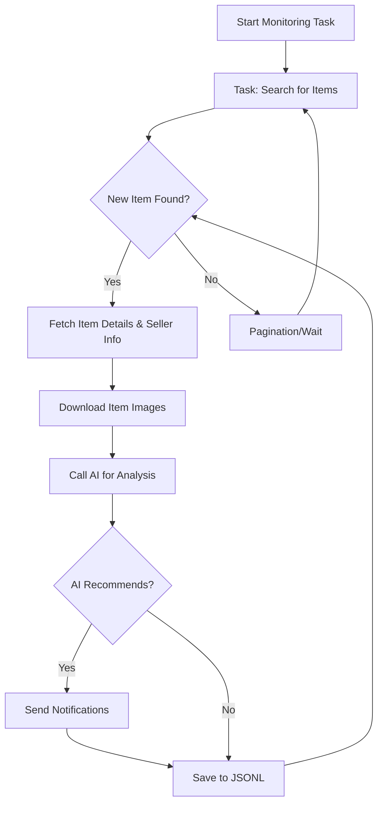

# AI-Powered Goofish (Xianyu) Monitor: Smartly Track and Analyze Secondhand Goods 🤖

**Tired of missing out on great deals?** This AI-powered tool leverages Playwright and advanced AI to provide real-time monitoring, intelligent analysis, and a user-friendly web interface for the Goofish (Xianyu) platform, ensuring you never miss your desired secondhand finds. [View the original repository](https://github.com/dingyufei615/ai-goofish-monitor).

## Key Features:

*   ✅ **Intuitive Web UI:** Manage tasks, edit AI criteria, view real-time logs, and filter results through a complete web interface – no command-line or config file fiddling needed.
*   🗣️ **AI-Driven Task Creation:** Simply describe your desired purchase in natural language, and the AI will generate a comprehensive monitoring task with complex filtering logic.
*   🚀 **Concurrent Multi-Tasking:** Monitor multiple keywords simultaneously with independent tasks, managed via `config.json`.
*   ⚡ **Real-Time Stream Processing:** Analyze new listings immediately upon discovery, eliminating delays.
*   🧠 **Deep AI Analysis:** Integrates multimodal LLMs (like GPT-4o) to analyze product images, descriptions, and seller profiles for precise filtering.
*   ⚙️ **Highly Customizable:** Configure keywords, price ranges, filters, and AI analysis prompts for each monitoring task.
*   🔔 **Instant Notifications:** Receive immediate alerts via [ntfy.sh](https://ntfy.sh/), WeChat group bots, and [Bark](https://bark.day.app/) to your devices.
*   📅 **Scheduled Task Execution:** Utilize Cron expressions for automated, scheduled monitoring.
*   🐳 **Docker-Ready Deployment:** Deploy quickly and consistently with provided `docker-compose` configuration.
*   🛡️ **Robust Anti-Scraping:** Employs human-like behavior, including random delays, to enhance stability.

## Getting Started:

### 1. Environment Setup:

*   **Python Version:** Requires Python 3.10 or higher.
*   Clone the repository:
    ```bash
    git clone https://github.com/dingyufei615/ai-goofish-monitor
    cd ai-goofish-monitor
    ```
*   Install dependencies:
    ```bash
    pip install -r requirements.txt
    ```

### 2. Configuration:

1.  **Environment Variables:** Copy `.env.example` to `.env` and configure:

    ```bash
    # Windows
    copy .env.example .env
    # Linux/MacOS
    cp .env.example .env
    ```

    Key variables:

    | Variable            | Description                                           | Required | Notes                                                                                                                                                                                              |
    | ------------------- | ----------------------------------------------------- | -------- | -------------------------------------------------------------------------------------------------------------------------------------------------------------------------------------------------- |
    | `OPENAI_API_KEY`    | Your AI model provider's API key.                     | Yes      |                                                                                                                                                                                                    |
    | `OPENAI_BASE_URL`   | API endpoint for your AI model (OpenAI-compatible).  | Yes      | E.g., `https://ark.cn-beijing.volces.com/api/v3/`.                                                                                                                                                  |
    | `OPENAI_MODEL_NAME` | The specific multimodal model to use (e.g., `doubao-seed-1-6-250615`, `gemini-2.5-pro`). | Yes      | **Must** choose a multimodal model that supports image analysis.                                                                                                                                                                  |
    | `PROXY_URL`         | (Optional) HTTP/S proxy for bypassing geo-restrictions | No       | Supports `http://` and `socks5://`.  E.g., `http://127.0.0.1:7890`.                                                                                                                                      |
    | ...                 | ...                                                   | ...      | (See original README for more variables)                                                                                                                                                           |

    > **Debugging Tip:** If encountering 404 errors with your AI API, start by testing with a provider like Alibaba Cloud or Volcano Engine to ensure basic functionality.

    > **Security Note:** The web interface uses Basic Auth. The default username/password are `admin`/`admin123`.  **Change these in production!**

2.  **Login State (Crucial!):**  The scraper needs a valid login. We recommend using the Web UI:

    **Recommended Method: Via Web UI**
    1.  Run the web server (Step 3).
    2.  Go to "System Settings" in the Web UI.
    3.  Click "Manual Update" for the "Login State File."
    4.  Follow the instructions:
        *   Install the Xianyu Login State Extractor browser extension.
        *   Log in to Xianyu on your computer.
        *   Use the extension to extract the login state and copy it to the Web UI.
   
    **Alternative: Login Script** (if you can run a program with a GUI)
    ```bash
    python login.py
    ```
    This will open a browser; scan the QR code with the Xianyu app. A `xianyu_state.json` file is created.

### 3. Start the Web Server:

```bash
python web_server.py
```

### 4. Start Monitoring:

1.  Open `http://127.0.0.1:8000` in your browser.
2.  Go to "Task Management" and click "Create New Task."
3.  Describe your needs (e.g., "Buy a used Sony A7M4, 95% new, under 13k, shutter count under 5000").
4.  The AI will create a monitoring task.
5.  Start or schedule your task!

## 🐳 Docker Deployment (Recommended)

1.  **Docker Installation:**  Ensure Docker Engine is installed.
2.  **Clone & Configure:** Same as steps 1 & 2 from "Getting Started", but for Docker, it is a bit different.
    ```bash
    git clone https://github.com/dingyufei615/ai-goofish-monitor
    cd ai-goofish-monitor
    ```
    and configure `.env` - follow the environment variables section in "Getting Started"
3.  **Login State (Essential for Docker!):**
    1. Run `docker-compose up -d` to launch the service.
    2. Access the Web UI at `http://127.0.0.1:8000`.
    3.  Go to "System Settings," and click "Manual Update" for the "Login State File."
        *   Follow the Xianyu Login State Extractor setup as described in the manual deployment instructions.
4.  **Run Docker Container:**
    ```bash
    docker-compose up --build -d
    ```

    To stop: `docker-compose stop`.  To remove: `docker-compose down`.

### 5. Key Web UI Features:

*   **Task Management:** AI-powered task creation, visual editing, scheduling.
*   **Result Viewing:** Card-based listing display, filtering by AI recommendations and sorting.
*   **Real-time Logs:** Monitor crawler activity, with options for refresh and clear logs.
*   **System Settings:** Login state checking, Prompt (for AI) editing.

### 6. Workflow:



## 🔐 Web Interface Authentication:

Protected by Basic Auth.  Configure in `.env`:

```bash
WEB_USERNAME=admin
WEB_PASSWORD=admin123
```

**Change the default credentials in production!**

## Frequently Asked Questions:

Get answers to common questions in [FAQ.md](FAQ.md).

## Acknowledgements:

Thanks to: [superboyyy/xianyu_spider](https://github.com/superboyyy/xianyu_spider), LinuxDo community members.

## Support and Sponsoring:

Consider supporting this project:

<table>
  <tr>
    <td></td>
    <td></td>
  </tr>
</table>

## ⚠️ Important Notes:

*   Adhere to Xianyu's terms of service and `robots.txt`.
*   For research/educational purposes only; no illegal usage.
*   MIT License; no warranty.
*   See [DISCLAIMER.md](DISCLAIMER.md) for liability information.

[](https://star-history.com/#dingyufei615/ai-goofish-monitor&Date)