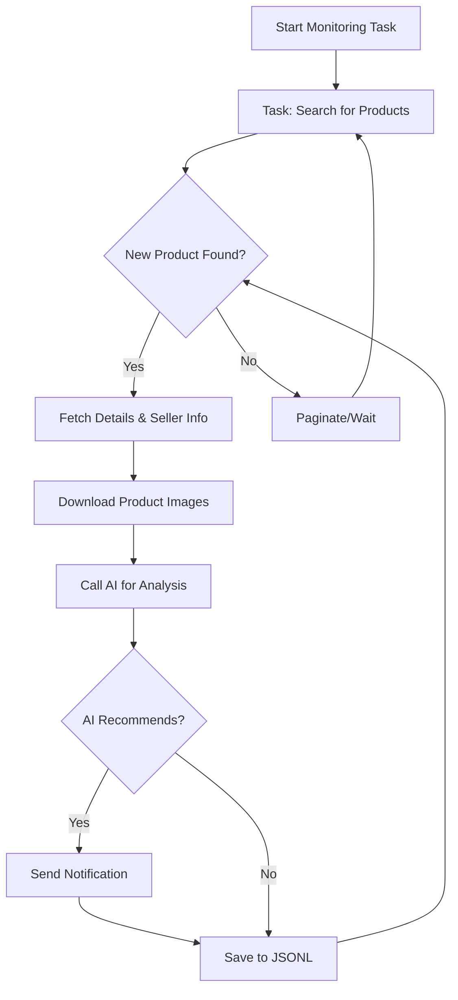

# AI-Powered Goofish (Xianyu) Monitor: Find Your Deals with Intelligent Automation

**Tired of missing out on great deals on Goofish (Xianyu)?** This AI-powered monitoring tool automates your search, analyzes listings with cutting-edge AI, and sends instant notifications, ensuring you never miss a bargain again! [View the original repository](https://github.com/dingyufei615/ai-goofish-monitor).

## Key Features:

*   ✅ **Intuitive Web UI:**  Manage tasks, edit AI criteria, view real-time logs, and filter results – all without touching the command line.
*   💬 **AI-Driven Task Creation:** Describe what you want to buy in plain language, and the AI will generate a complex monitoring task with intelligent filtering.
*   🔄 **Concurrent Multi-Tasking:**  Monitor multiple keywords simultaneously, each with independent settings, defined in `config.json`.
*   ⚡️ **Real-time Processing:** Analyze new listings as they appear, eliminating batch processing delays.
*   🧠 **Deep AI Analysis:** Integrates multimodal large language models (e.g., GPT-4o) to analyze item descriptions, images, and seller profiles for precise results.
*   ⚙️ **Highly Customizable:** Configure keywords, price ranges, filtering conditions, and AI analysis prompts for each monitoring task.
*   🔔 **Instant Notifications:**  Get alerted via ntfy.sh, WeChat group bots, or Bark when a promising item is found.
*   📅 **Scheduled Task Execution:**  Utilize Cron expressions to schedule tasks for automated runs.
*   🐳 **Docker-Ready Deployment:**  Easy one-click deployment with `docker-compose` for streamlined setup.
*   🛡️ **Robust Anti-Scraping Measures:** Simulates human behavior with random delays and user interactions for stable operation.

## Key Features:

*   ✅ **Intuitive Web UI:**  Manage tasks, edit AI criteria, view real-time logs, and filter results – all without touching the command line.
*   💬 **AI-Driven Task Creation:** Describe what you want to buy in plain language, and the AI will generate a complex monitoring task with intelligent filtering.
*   🔄 **Concurrent Multi-Tasking:**  Monitor multiple keywords simultaneously, each with independent settings, defined in `config.json`.
*   ⚡️ **Real-time Processing:** Analyze new listings as they appear, eliminating batch processing delays.
*   🧠 **Deep AI Analysis:** Integrates multimodal large language models (e.g., GPT-4o) to analyze item descriptions, images, and seller profiles for precise results.
*   ⚙️ **Highly Customizable:** Configure keywords, price ranges, filtering conditions, and AI analysis prompts for each monitoring task.
*   🔔 **Instant Notifications:**  Get alerted via ntfy.sh, WeChat group bots, or Bark when a promising item is found.
*   📅 **Scheduled Task Execution:**  Utilize Cron expressions to schedule tasks for automated runs.
*   🐳 **Docker-Ready Deployment:**  Easy one-click deployment with `docker-compose` for streamlined setup.
*   🛡️ **Robust Anti-Scraping Measures:** Simulates human behavior with random delays and user interactions for stable operation.

## Getting Started (Web UI Recommended)

The Web UI provides the best user experience.

### Step 1: Prerequisites

> ⚠️ **Python Version:** Python 3.10 or higher is recommended for local development and debugging.

Clone the repository:

```bash
git clone https://github.com/dingyufei615/ai-goofish-monitor
cd ai-goofish-monitor
```

Install dependencies:

```bash
pip install -r requirements.txt
```

### Step 2: Configuration

1.  **Configure Environment Variables:**  Copy `.env.example` to `.env` and fill in your values.

    ```bash
    # Windows
    copy .env.example .env
    # Linux/macOS
    cp .env.example .env
    ```

    Environment variables:

    | Variable              | Description                                        | Required | Notes                                                                                                                         |
    | :-------------------- | :------------------------------------------------- | :------- | :---------------------------------------------------------------------------------------------------------------------------- |
    | `OPENAI_API_KEY`      | Your AI model provider's API key.                 | Yes      |                                                                                                                               |
    | `OPENAI_BASE_URL`     | AI model API endpoint (OpenAI-compatible).       | Yes      |                                                                                                                               |
    | `OPENAI_MODEL_NAME`   | The specific model name.                           | Yes      | Must be a multimodal model supporting image analysis (e.g., `doubao-seed-1-6-250615`, `gemini-2.5-pro`).                     |
    | `PROXY_URL`           | (Optional) HTTP/S proxy (e.g., `http://...` or `socks5://...`). | No       |                                                                                                                               |
    | `NTFY_TOPIC_URL`      | (Optional) ntfy.sh topic URL.                      | No       |  If left blank, ntfy notifications are disabled.                                                                              |
    | ...                   | ...                                                | ...      | Refer to the original README for a full list of environment variables.                                                        |

    > 💡 **Debugging Tip:** If you encounter 404 errors, try debugging using the API from Alibaba Cloud or Volcano Engine first, and make sure the basic functions work before using other API providers.

    > 🔐 **Security Reminder:** The Web UI uses Basic authentication.  Change the default username (`admin`) and password (`admin123`) in production!

2.  **Obtain Login State (Critical!)**:  You *must* provide valid login credentials for the scraper to access Goofish.  We recommend using the Web UI for this:

    **Recommended Method: Update via Web UI**

    1.  Skip this step for now and start the web server in Step 3.
    2.  Go to **"System Settings"** in the Web UI.
    3.  Find the "Login State File" and click the **"Manual Update"** button.
    4.  Follow the on-screen instructions:
        *   Install the [Xianyu Login State Extractor Chrome extension](https://chromewebstore.google.com/detail/xianyu-login-state-extrac/eidlpfjiodpigmfcahkmlenhppfklcoa).
        *   Open and log in to the Goofish website.
        *   Click the extension icon in your browser toolbar.
        *   Click "Extract Login State".
        *   Click "Copy to Clipboard".
        *   Paste the content into the Web UI and save.

    **Alternative: Run Login Script** (If you can run a GUI-enabled environment)

    ```bash
    python login.py
    ```

    A browser window will open; log in using the Goofish app's QR code scanner. The script will close automatically, generating `xianyu_state.json`.

### Step 3: Start the Web Server

```bash
python web_server.py
```

### Step 4: Start Monitoring

1.  Go to the **"Task Management"** page and click **"Create New Task"**.
2.  Describe your desired purchase in natural language (e.g., "I want a used Sony A7M4, 95% new, budget under 13,000, shutter count below 5000").
3.  Click "Create." The AI will generate analysis criteria.
4.  Start or schedule your tasks from the main interface.

## Docker Deployment (Recommended)

### Step 1:  Environment Preparation

1.  **Install Docker**: Ensure you have [Docker Engine](https://docs.docker.com/engine/install/) installed.
2.  **Clone and Configure**:

    ```bash
    git clone https://github.com/dingyufei615/ai-goofish-monitor
    cd ai-goofish-monitor
    ```

3.  **Create `.env`**:  Follow the instructions in **[Getting Started](#getting-started-web-ui-recommended)** to create and populate `.env`.
4.  **Obtain Login State (Crucial!)**:  Since you can't scan a QR code inside a Docker container, obtain the login state *after* the container is running by:
    1.  (On the host machine) Run `docker-compose up -d`.
    2.  Open the Web UI in your browser: `http://127.0.0.1:8000`.
    3.  Go to **"System Settings"** and click the **"Manual Update"** button.
    4.  Follow the instructions to get the login state from the Chrome extension.

> ℹ️ **Python Version:** Docker uses the Python 3.11 specified in the Dockerfile; no local Python compatibility concerns.

### Step 2: Run Docker Container

Use `docker-compose` for easier management.

```bash
docker-compose up --build -d
```

### Step 3: Access and Manage

*   **Web UI**: `http://127.0.0.1:8000`
*   **Real-time logs**: `docker-compose logs -f`
*   **Stop**: `docker-compose stop`
*   **Start**: `docker-compose start`
*   **Stop & Remove**: `docker-compose down`

## Web UI Features Overview

*   **Task Management**:
    *   **AI-Powered Task Creation**: Generate tasks using natural language descriptions.
    *   **Visual Editing**: Modify parameters, start/stop, and delete tasks in the UI.
    *   **Scheduling**: Cron expression-based scheduling for automated runs.
*   **Result Viewing**:
    *   **Card View**: Clear display of matching items.
    *   **Filtering & Sorting**: Filter and sort by AI recommendations, time, price, etc.
    *   **Deep Details**: View detailed item data and AI analysis results.
*   **Run Logs**:
    *   **Real-time Log Stream**: Monitor detailed logs in the browser.
    *   **Log Management**: Auto-refresh, manual refresh, and clear logs.
*   **System Settings**:
    *   **Status Check**: Verify `.env` configuration, login state, and dependencies.
    *   **Prompt Editing**: Edit and save AI prompts directly within the web interface.

## Workflow



## Web UI Authentication

(See the original README)

## Frequently Asked Questions (FAQ)

Comprehensive FAQs are available to address common issues.

👉 **[View the FAQ (FAQ.md)](FAQ.md)**

## Acknowledgements

(See the original README)

## Support & Sponsoring

(See the original README)

## Important Notes

(See the original README)