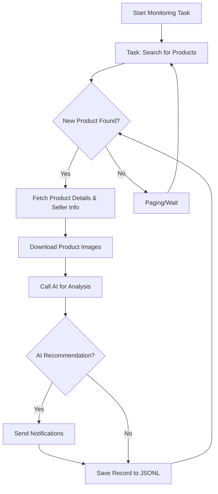

# AI-Powered Goofish Monitor: Your Smart Shopping Assistant

**Never miss a deal on Xianyu (Goofish) again!** This AI-driven tool uses Playwright and large language models to monitor Goofish for you, providing real-time analysis and intelligent filtering through an intuitive web interface. [View the original repo](https://github.com/dingyufei615/ai-goofish-monitor).

## Key Features:

*   ✅ **Intelligent AI Analysis:** Leverages multimodal LLMs (e.g., GPT-4o) to analyze product descriptions, images, and seller profiles for accurate filtering.
*   ✅ **Web-Based Management:** Complete web UI for easy task management, AI prompt editing, real-time log viewing, and result filtering.
*   ✅ **Natural Language Task Creation:** Create monitoring tasks with complex filtering logic simply by describing your needs in plain language.
*   ✅ **Concurrent Multi-Tasking:** Monitor multiple keywords simultaneously with independent tasks, managed through a configurable `config.json`.
*   ✅ **Real-Time Streaming:** Analyze new product listings immediately, eliminating batch processing delays.
*   ✅ **Highly Customizable:** Configure each task with specific keywords, price ranges, filtering criteria, and custom AI prompts.
*   ✅ **Instant Notifications:** Receive alerts via [ntfy.sh](https://ntfy.sh/), WeChat group bots, and [Bark](https://bark.day.app/) for AI-recommended items.
*   ✅ **Scheduled Task Execution:** Utilize cron expressions for automated, scheduled task runs.
*   ✅ **Docker-Ready Deployment:** Easy deployment with provided `docker-compose` configuration for containerization.
*   ✅ **Robust Anti-Scraping:** Employs realistic user behavior, including randomized delays, to enhance stability and bypass anti-bot measures.

## Screenshots:

*   **Task Management:**

    

*   **Monitoring Interface:**

    

*   **Notification Example:**

    

## Getting Started:

The **Web UI is highly recommended** for the best user experience.

### Step 1: Environment Setup

*   **Python:** Python 3.10+ is recommended.  Lower versions may cause dependency installation errors.

    ```bash
    git clone https://github.com/dingyufei615/ai-goofish-monitor
    cd ai-goofish-monitor
    pip install -r requirements.txt
    ```

### Step 2: Configuration

1.  **Environment Variables:**  Create and populate a `.env` file based on the provided `.env.example` template:

    *   **Windows:**

        ```cmd
        copy .env.example .env
        ```

    *   **Linux/macOS:**

        ```bash
        cp .env.example .env
        ```

    *   **Key Variables:**

    | Variable             | Description                                        | Required | Notes                                                                                                |
    | :------------------- | :------------------------------------------------- | :------- | :--------------------------------------------------------------------------------------------------- |
    | `OPENAI_API_KEY`     | Your AI model provider's API key.                  | Yes      |                                                                                                      |
    | `OPENAI_BASE_URL`    | AI model API endpoint (OpenAI format compatible). | Yes      |  Use the base path of the API, e.g. `https://ark.cn-beijing.volces.com/api/v3/`.                         |
    | `OPENAI_MODEL_NAME`  | The specific model name to use.                     | Yes      | **Must** be a multimodal model like `doubao-seed-1-6-250615` or `gemini-2.5-pro`.                   |
    | `PROXY_URL`          | (Optional) HTTP/S proxy for bypassing geo-restrictions.     | No       | Supports `http://` and `socks5://` formats.                                                         |
    | `NTFY_TOPIC_URL`     | (Optional) [ntfy.sh](https://ntfy.sh/) topic URL.  | No       | Leave blank to disable ntfy notifications.                                                         |
    | ... (other notification services) | ... (Gotify, Bark, WeChat Webhook)                   | No       | Configure these based on your preferred notification methods.                                      |
    | `WEB_USERNAME`    | Web UI login username.                  | No      | Defaults to `admin`.  **Change this in production.**                                                                 |
    | `WEB_PASSWORD`     | Web UI login password.                 | No      | Defaults to `admin123`.  **Use a strong password in production.**                                                      |
    | ... (other config) | ... (headless mode, debug mode, etc.)                   | No       | Refer to original README                                                                                       |

    *   **Debugging Tip:**  If you encounter a 404 error with AI APIs, test with Alibaba Cloud or Volcano Engine's APIs first to ensure basic functionality before trying other providers.

    *   **Security Note:**  The Web UI uses Basic Authentication.  **Change the default username and password (`admin`/`admin123`) in production!**

2.  **Login Credentials:**  **This is crucial!**  You need to provide valid login credentials for the scraper to work. The best way is through the Web UI:

    *   **Recommended Method (Web UI):**
        1.  Start the web server (Step 3).
        2.  Go to "System Settings" in the Web UI.
        3.  Click the "Manual Update" button next to "Login State File".
        4.  Follow the instructions in the pop-up:
            *   Install the [Xianyu Login State Extractor](https://chromewebstore.google.com/detail/xianyu-login-state-extrac/eidlpfjiodpigmfcahkmlenhppfklcoa) Chrome extension.
            *   Log in to Xianyu in Chrome.
            *   Click the extension icon, and then "Extract Login State".
            *   Click "Copy to Clipboard".
            *   Paste the content into the Web UI and save.

    *   **Alternative Method (Login Script):**  If you have a local desktop environment:

        ```bash
        python login.py
        ```

        This will open a browser window. Use your Xianyu mobile app to scan the QR code and log in.  The script will then generate a `xianyu_state.json` file in your project root.

### Step 3: Start the Web Server

```bash
python web_server.py
```

### Step 4: Using the Web UI

1.  Open your browser to `http://127.0.0.1:8000`.
2.  In the "Task Management" page, click "Create New Task."
3.  Describe your desired product in natural language (e.g., "Looking for a used Sony A7M4 camera, 95% new, under 13,000 RMB, shutter count below 5000").
4.  The AI will generate filtering criteria.
5.  Start or schedule the task.

## Docker Deployment:

Docker is the recommended deployment method for reliability and ease of use.

### Step 1: Environment Setup (similar to local)

1.  **Docker Installation:** Ensure Docker Engine is installed ([Docker Engine](https://docs.docker.com/engine/install/)).
2.  **Clone and Configure:**

    ```bash
    git clone https://github.com/dingyufei615/ai-goofish-monitor
    cd ai-goofish-monitor
    ```

3.  **Create `.env`:**  Follow the configuration instructions in **[Getting Started](#getting-started)**.
4.  **Login Credentials (Crucial for Docker):** You *must* set the login state *after* the container is running, via the Web UI:
    1.  Run `docker-compose up -d` to start the service.
    2.  Open `http://127.0.0.1:8000` in your browser.
    3.  Go to "System Settings" and click "Manual Update."
    4.  Follow the Web UI instructions to extract and upload the login state.

>  **Python Version:**  The Docker deployment uses Python 3.11 specified in the `Dockerfile`, so you don't need to worry about local Python compatibility.

### Step 2: Run the Docker Container

```bash
docker-compose up --build -d
```

### Step 3: Access and Manage

*   **Web UI:** `http://127.0.0.1:8000`
*   **View Logs:** `docker-compose logs -f`
*   **Stop Container:** `docker-compose stop`
*   **Start Stopped Container:** `docker-compose start`
*   **Stop and Remove Container:** `docker-compose down`

## Web UI Features:

*   **Task Management:**
    *   AI-powered task creation using natural language.
    *   In-UI task editing and control (start/stop, delete).
    *   Cron-based scheduling.
*   **Results Viewing:**
    *   Card-based product display.
    *   Smart filtering and sorting by AI recommendation, time, price, etc.
    *   Detailed product information and AI analysis JSON data.
*   **Real-Time Logging:**
    *   Live log streaming for monitoring.
    *   Log management (auto/manual refresh, clear).
*   **System Settings:**
    *   Configuration checks for dependencies.
    *   In-UI Prompt editing for modifying AI logic.

## Workflow:



## Authentication

The web interface is protected by Basic Authentication.

#### Configuration

Set credentials in the `.env` file:

```bash
WEB_USERNAME=admin
WEB_PASSWORD=admin123
```

#### Default Credentials

If credentials are not set in `.env`, the default values are used:
- Username: `admin`
- Password: `admin123`

**⚠️ IMPORTANT: CHANGE THE DEFAULT PASSWORD IN PRODUCTION!**

#### Access Scope

- **Protected:** All API endpoints, web interface, and static resources.
- **Unprotected:** Health check endpoint (`/health`).

#### Usage

1.  **Browser Access:** A login dialog will appear.
2.  **API Calls:** Include Basic Authentication in the request headers.
3.  **Front-end JavaScript:** Authentication is handled automatically.

#### Security Recommendations

1.  Change the default password to a strong one.
2.  Use HTTPS in production.
3.  Regularly rotate credentials.
4.  Restrict access by IP address via firewall.

For further details, see [AUTH_README.md](AUTH_README.md).

## Frequently Asked Questions (FAQ)

Find answers to common questions in [FAQ.md](FAQ.md).

👉 **[Click here to view the FAQ (FAQ.md)](FAQ.md)**

## Acknowledgements

Special thanks to the following projects and contributors:

*   [superboyyy/xianyu_spider](https://github.com/superboyyy/xianyu_spider)
*   [@jooooody](https://linux.do/u/jooooody/summary)
*   [LinuxDo](https://linux.do/) community.
*   ClaudeCode/Aider/Gemini tools for code generation

## Support & Sponsoring

If this project is helpful to you, consider supporting it!

<table>
  <tr>
    <td></td>
    <td></td>
  </tr>
</table>

## ⚠️ Important Notes:

*   Adhere to Xianyu's Terms of Service and robots.txt. Avoid excessive requests to prevent account restrictions.
*   This project is for learning and research only. Do not use it for illegal purposes.
*   Licensed under the [MIT License](LICENSE).  Use at your own risk.
*   The author and contributors are not liable for any damages arising from the use of this software.
*   See [DISCLAIMER.md](DISCLAIMER.md) for more details.

[](https://star-history.com/#dingyufei615/ai-goofish-monitor&Date)