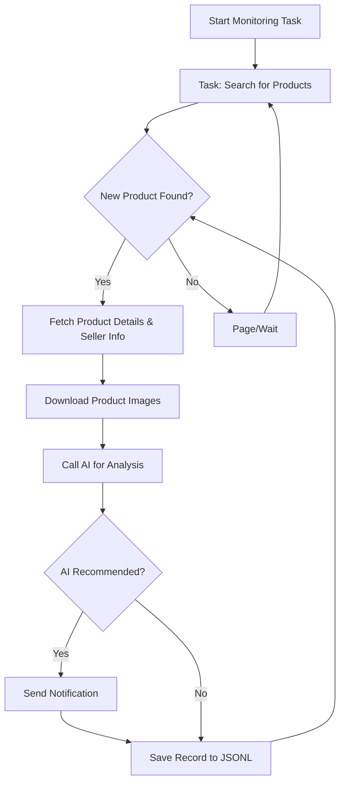

# AI-Powered Goofish (Xianyu) Monitor

**Tired of missing out on great deals?** This intelligent tool leverages AI and Playwright to provide real-time monitoring and smart analysis of Xianyu (Goofish) listings, complete with a user-friendly web interface. ([View on GitHub](https://github.com/dingyufei615/ai-goofish-monitor))

## Key Features

*   ✅ **Web UI for Easy Management:** Manage tasks, edit AI criteria, view logs, and filter results through an intuitive web interface.
*   🤖 **AI-Driven Task Creation:** Describe your ideal purchase in natural language to generate complex filtering and monitoring rules.
*   ⚙️ **Concurrent Multi-Tasking:** Monitor multiple keywords simultaneously using configurations in `config.json`, without interference.
*   ⚡️ **Real-time Processing:** Immediate analysis of new listings, eliminating batch processing delays.
*   🧠 **Advanced AI Analysis:** Integrates multimodal LLMs (e.g., GPT-4o) to deeply analyze listing images, text, and seller profiles.
*   🛠️ **Highly Customizable:** Configure unique keywords, price ranges, filters, and AI prompts for each monitoring task.
*   🔔 **Instant Notifications:** Receive alerts via [ntfy.sh](https://ntfy.sh/), WeChat Robot, and [Bark](https://bark.day.app/) to your devices.
*   📅 **Scheduled Task Execution:** Utilize Cron expressions to set up automated, recurring monitoring schedules for each task.
*   🐳 **Docker for Easy Deployment:** Deploy quickly and consistently with pre-configured `docker-compose` settings.
*   🛡️ **Robust Anti-Ban Strategies:** Simulates human behavior, including random delays and user actions, for enhanced stability.

## Screenshots

**Task Management (Backend)**


**Monitoring Results (Backend)**


**Notification Example (ntfy)**


## Quickstart (Web UI Recommended)

The web UI offers the best user experience for interacting with the project.

### Step 1: Environment Setup

> ⚠️ **Python Version Requirement:**  Use Python 3.10 or higher for local debugging and deployment.  Older versions might cause installation errors or runtime issues (e.g., `ModuleNotFoundError: No module named 'PIL'`).

1.  Clone the project to your local machine:

    ```bash
    git clone https://github.com/dingyufei615/ai-goofish-monitor
    cd ai-goofish-monitor
    ```

2.  Install the required Python dependencies:

    ```bash
    pip install -r requirements.txt
    ```

### Step 2: Basic Configuration

1.  **Configure Environment Variables:** Copy `.env.example` to `.env` and modify the content.

    Windows:

    ```cmd
    copy .env.example .env
    ```

    Linux/MacOS:

    ```shell
    cp .env.example .env
    ```

    Available configuration options in the `.env` file:

    | Environment Variable | Description                                                                             | Required | Notes                                                                                                                                                                                                                                                                                          |
    | :------------------- | :-------------------------------------------------------------------------------------- | :------- | :--------------------------------------------------------------------------------------------------------------------------------------------------------------------------------------------------------------------------------------------------------------------------------------------- |
    | `OPENAI_API_KEY`     | Your AI model provider's API key.                                                       | Yes      | May be optional for local or specific proxy services.                                                                                                                                                                                                                                              |
    | `OPENAI_BASE_URL`    | The base URL for the AI model's API endpoint, compatible with the OpenAI format.         | Yes      | Fill in the base path of the API, e.g., `https://ark.cn-beijing.volces.com/api/v3/`.                                                                                                                                                                                                            |
    | `OPENAI_MODEL_NAME`  | The specific model name you want to use.                                                 | Yes      | **Crucially**, select a multimodal model capable of image analysis, such as `doubao-seed-1-6-250615`, `gemini-2.5-pro`, etc.                                                                                                                                                              |
    | `PROXY_URL`          | (Optional) HTTP/S proxy configuration for bypassing network restrictions.                  | No       | Supports `http://` and `socks5://` formats, e.g., `http://127.0.0.1:7890`.                                                                                                                                                                                                                      |
    | `NTFY_TOPIC_URL`     | (Optional) The topic URL for [ntfy.sh](https://ntfy.sh/) notifications.                  | No       | If left blank, ntfy notifications will be disabled.                                                                                                                                                                                                                                         |
    | `GOTIFY_URL`         | (Optional) Gotify server address.                                                        | No       | For example, `https://push.example.de`.                                                                                                                                                                                                                                                   |
    | `GOTIFY_TOKEN`       | (Optional) Gotify application token.                                                     | No       |                                                                                                                                                                                                                                                                                                |
    | `BARK_URL`           | (Optional) [Bark](https://bark.day.app/) push address.                                      | No       | For example, `https://api.day.app/your_key`. If left blank, Bark notifications will be disabled.                                                                                                                                                                                          |
    | `WX_BOT_URL`         | (Optional) WeChat Enterprise Robot Webhook address.                                     | No       | If left blank, WeChat notifications will be disabled.                                                                                                                                                                                                                                         |
    | `WEBHOOK_URL`        | (Optional) Universal Webhook URL.                                                         | No       | If left blank, general Webhook notifications will be disabled.                                                                                                                                                                                                                                |
    | `WEBHOOK_METHOD`     | (Optional) Webhook request method.                                                        | No       | Supports `GET` or `POST`, defaults to `POST`.                                                                                                                                                                                                                                                |
    | `WEBHOOK_HEADERS`    | (Optional) Custom request headers for Webhook.                                             | No       | Must be a valid JSON string, e.g., `'{"Authorization": "Bearer xxx"}'`.                                                                                                                                                                                                                            |
    | `WEBHOOK_CONTENT_TYPE` | (Optional) POST request content type.                                                    | No       | Supports `JSON` or `FORM`, defaults to `JSON`.                                                                                                                                                                                                                                              |
    | `WEBHOOK_QUERY_PARAMETERS` | (Optional) GET request query parameters.                                                  | No       | JSON string, supports `{{title}}` and `{{content}}` placeholders.                                                                                                                                                                                                                          |
    | `WEBHOOK_BODY`       | (Optional) POST request body.                                                             | No       | JSON string, supports `{{title}}` and `{{content}}` placeholders.                                                                                                                                                                                                                          |
    | `LOGIN_IS_EDGE`      | Whether to use the Edge browser for login and crawling.                                   | No       | Defaults to `false`, which uses Chrome/Chromium.                                                                                                                                                                                                                                                 |
    | `PCURL_TO_MOBILE`    | Whether to convert PC links to mobile links in notifications.                             | No       | Defaults to `true`.                                                                                                                                                                                                                                                                               |
    | `RUN_HEADLESS`       | Whether to run the crawler browser in headless mode.                                     | No       | Defaults to `true`.  Set to `false` for manual captcha resolution during local debugging.  **Must be `true` for Docker deployments.**                                                                                                                                                 |
    | `AI_DEBUG_MODE`      | Enable AI debug mode.                                                                    | No       | Defaults to `false`. When enabled, prints detailed AI request and response logs to the console.                                                                                                                                                                                           |
    | `SERVER_PORT`        | The port on which the Web UI service runs.                                              | No       | Defaults to `8000`.                                                                                                                                                                                                                                                                          |

    > 💡 **Debugging Tip:** If you encounter 404 errors when configuring the AI API, test the connection by using a service like those from Alibaba Cloud or Volcano Engine to verify that the fundamental functionality is working correctly before you attempt to use other API providers. Some API providers may have compatibility issues or require specific settings.

2.  **Obtain Login Status (Important!)**: To enable the crawler to access Xianyu in a logged-in state, you'll need valid login credentials.  We recommend using the Web UI.

    **Recommended Method: Via Web UI Update**
    1.  Skip this step and proceed to Step 3 to start the web server.
    2.  Open the Web UI and navigate to the "System Settings" page.
    3.  Locate "Login Status File" and click the "Manual Update" button.
    4.  Follow the instructions in the pop-up window:
        *   Install the [Xianyu Login State Extraction Extension](https://chromewebstore.google.com/detail/xianyu-login-state-extrac/eidlpfjiodpigmfcahkmlenhppfklcoa) in your Chrome browser on your personal computer.
        *   Open and log into the Xianyu official website.
        *   After a successful login, click the extension icon in your browser's toolbar.
        *   Click the "Extract Login Status" button to obtain the login information.
        *   Click the "Copy to Clipboard" button.
        *   Paste the copied content into the Web UI to save it.

    This method eliminates the need to run a program with a graphical interface on the server and is the most convenient way to do so.

    **Alternative Method: Run Login Script**
    If you can run programs on a local or server with a desktop environment, you can use the traditional script method:

    ```bash
    python login.py
    ```

    This will open a browser window. Please use the **Xianyu App on your phone to scan the QR code** to complete the login. Once successful, the program will close automatically, and a `xianyu_state.json` file will be generated in the project's root directory.

### Step 3: Start the Web Server

Once everything is set up, start the web management backend server.

```bash
python web_server.py
```

### Step 4: Begin Using the Monitor

Open `http://127.0.0.1:8000` in your browser to access the management backend.

1.  On the **"Task Management"** page, click **"Create New Task"**.
2.  In the pop-up window, describe your buying requirements in natural language (e.g., "I want to buy a Sony A7M4 camera, 95% new or better, budget under 13,000, shutter count below 5000"), and enter the task name and keywords.
3.  Click Create, and the AI will automatically generate a set of complex analysis criteria.
4.  Go back to the main interface, add a schedule to the task or click start immediately to begin automated monitoring!

## Docker Deployment (Recommended)

Docker packages the application and its dependencies into a standardized unit, enabling fast, reliable, and consistent deployments.

### Step 1: Environment Setup (Similar to Local Deployment)

1.  **Install Docker**: Make sure [Docker Engine](https://docs.docker.com/engine/install/) is installed on your system.

2.  **Clone the Project and Configure:**

    ```bash
    git clone https://github.com/dingyufei615/ai-goofish-monitor
    cd ai-goofish-monitor
    ```

3.  **Create `.env` File**: Follow the instructions in the **[Quickstart](#-quickstart-web-ui-recommended)** section to create and populate the `.env` file in the project's root directory.

4.  **Obtain Login Status (Critical!)**:  You cannot scan the QR code for login inside the Docker container. After starting the container, set the login state by accessing the Web UI:
    1.  (On the host machine) Execute `docker-compose up -d` to start the service.
    2.  Open `http://127.0.0.1:8000` in your browser to access the Web UI.
    3.  Go to the **"System Settings"** page and click the **"Manual Update"** button.
    4.  Follow the instructions in the pop-up window:
        *   Install the [Xianyu Login State Extraction Extension](https://chromewebstore.google.com/detail/xianyu-login-state-extrac/eidlpfjiodpigmfcahkmlenhppfklcoa) in your Chrome browser on your personal computer.
        *   Open and log into the Xianyu official website.
        *   After a successful login, click the extension icon in your browser's toolbar.
        *   Click the "Extract Login Status" button to obtain the login information.
        *   Click the "Copy to Clipboard" button.
        *   Paste the copied content into the Web UI to save it.

> ℹ️ **Regarding Python Versions**: When deploying with Docker, the project utilizes the Python 3.11 version specified in the Dockerfile, eliminating the need to worry about local Python version compatibility issues.

### Step 2: Run the Docker Container

The project includes a `docker-compose.yaml` file. We recommend using `docker-compose` to manage the containers, which simplifies the process over `docker run`.

In the project's root directory, run the following command to start the container:

```bash
docker-compose up --build -d
```

This starts the service in the background. `docker-compose` will automatically read the `.env` file and `docker-compose.yaml` configuration, using it to create and start the container.

If you encounter network issues within the container, troubleshoot the connection or use a proxy.

> ⚠️ **OpenWrt Deployment Notes**: If you deploy this application on an OpenWrt router, you might encounter DNS resolution issues. This can happen because the default network created by Docker Compose may not inherit OpenWrt's DNS settings correctly. If you receive an `ERR_CONNECTION_REFUSED` error, check your container network settings. You may need to manually configure DNS or adjust the network mode to ensure the container can access the external network.

### Step 3: Access and Manage

-   **Access the Web UI**: Open `http://127.0.0.1:8000` in your browser.
-   **View Real-time Logs**: `docker-compose logs -f`
-   **Stop the Container**: `docker-compose stop`
-   **Start a Stopped Container**: `docker-compose start`
-   **Stop and Remove the Container**: `docker-compose down`

## Web UI Feature Overview

*   **Task Management:**
    *   **AI Task Creation:** Describe your needs in natural language to instantly generate monitoring tasks and AI analysis criteria.
    *   **Visual Editing and Control:** Directly modify task parameters (keywords, prices, scheduling, etc.) in the table, and independently start/stop and delete each task.
    *   **Scheduled Execution:** Configure Cron expressions for automated, periodic task runs.
*   **Result Viewing:**
    *   **Card View:** Clearly displays eligible items in a card-based format with images and text.
    *   **Smart Filtering and Sorting:** Easily filter for "recommended" items by AI and sort by crawl time, publish time, price, and more.
    *   **Deep Details:** Click to see the complete data captured for each item and the detailed JSON results of the AI analysis.
*   **Running Logs:**
    *   **Real-time Log Streaming:** View the detailed logs of the crawler in real-time on the web page to track progress and troubleshoot issues.
    *   **Log Management:** Supports automatic refresh, manual refresh, and one-click clearing of logs.
*   **System Settings:**
    *   **Status Checks:** Quickly verify the status of key dependencies, such as `.env` configuration and login status.
    *   **Prompt Editing Online:** Edit and save the `prompt` files used for AI analysis directly on the web, and dynamically adjust the AI's logic.

## Workflow

The diagram illustrates the core process of a single monitoring task, from initiation to completion.  In practice, `web_server.py` acts as the main service, starting one or more of these task processes based on user actions or scheduled runs.



## Frequently Asked Questions (FAQ)

Answers to common questions raised in the Issues section.

1.  **Q: I get `'gbk' codec can't encode character` errors when running `login.py` or `spider_v2.py`?**
    *   **A:** This is a typical encoding issue on Windows, where the code and logs default to UTF-8.
    *   **Solution:** Force UTF-8 by setting an environment variable before running the script. Execute in PowerShell or CMD:

        ```bash
        set PYTHONUTF8=1
        python spider_v2.py
        ```

        Or use `chcp 65001` to set the active code page to UTF-8.

2.  **Q: Why does `login.py` require `playwright install`?**
    *   **A:**  This error means the browser files needed by Playwright are missing. Make sure all dependencies are installed correctly using `requirements.txt`. Run in the command line:

        ```bash
        pip install -r requirements.txt
        ```

        If the issue persists, manually install the chromium browser:

        ```bash
        playwright install chromium
        ```

3.  **Q: Why do I see "Request timed out" or "Connection error" when creating or running a task?**
    *   **A:** Usually, this points to a network issue, meaning your server cannot connect to the `OPENAI_BASE_URL` configured in your `.env` file. Check:
        *   Your server's network connectivity.
        *   If you are in mainland China, a network proxy might be required for accessing foreign AI services (e.g., OpenAI, Gemini). Configure the `PROXY_URL` variable in your `.env` file.
        *   Confirm the `OPENAI_BASE_URL` address is correct, and the service is running.

4.  **Q: What if my AI model doesn't support image analysis?**
    *   **A:** Multimodal analysis with images is a core feature. Therefore, you **must** choose an AI model supporting image recognition (Vision / Multi-modal). If your model doesn't support images, the AI analysis will fail or perform poorly. In the `.env` file, change `OPENAI_MODEL_NAME` to a model that supports image input, e.g., `gpt-4o`, `gemini-1.5-pro`, `deepseek-v2`, `qwen-vl-plus`, etc.

5.  **Q: Can I deploy on a Synology NAS via Docker?**
    *   **A:** Yes. The deployment steps are similar to standard Docker deployment:
        1.  Complete the `login.py` step on your computer (not the Synology) to generate the `xianyu_state.json` file.
        2.  Upload the entire project folder (including `.env` and `xianyu_state.json`) to a directory on your Synology.
        3.  In the Synology's Container Manager (or legacy Docker), use the `docker-compose up -d` command (via SSH or Task Scheduler) to start the project. Ensure the volume mapping paths in `docker-compose.yaml` correctly point to your project folder on the Synology.

6.  **Q: How do I configure Gemini / Qwen / Grok, or other non-OpenAI LLMs?**
    *   **A:** The project theoretically supports any model with an OpenAI-compatible API.  The key is to configure the `.env` file correctly with three variables:
        *   `OPENAI_API_KEY`: Your model provider's API Key.
        *   `OPENAI_BASE_URL`: The API-compatible Endpoint Address provided by your model service.  Check the official documentation for your chosen model; the format is generally `https://api.your-provider.com/v1` (note, no `/chat/completions` at the end).
        *   `OPENAI_MODEL_NAME`: The specific model name you want to use, which needs to support image recognition, such as `gemini-2.5-flash`.
    *   **Example:** If the documentation for your service says the Completions API is `https://xx.xx.com/v1/chat/completions`, then `OPENAI_BASE_URL` should be `https://xx.xx.com/v1`.

7.  **Q:  Why am I being detected as "abnormal traffic" by Xianyu after running for a while, or why am I prompted for a CAPTCHA?**
    *   **A:** This is Xianyu's anti-scraping mechanism. To reduce detection risks:
        *   **Disable Headless Mode:** Set `RUN_HEADLESS=false` in your `.env` file. The browser will run with a visible interface, allowing you to manually solve CAPTCHAs, and the program will continue.
        *   **Reduce Monitoring Frequency:** Avoid running too many monitoring tasks simultaneously.
        *   **Use a Clean Network Environment:** Frequent crawling may lead to your IP being temporarily flagged.

8.  **Q:  How do I fix pyzbar installation failures on Windows?**
    *   **A:**  pyzbar requires the zbar dynamic library on Windows.
    *   **Solution (Windows):**
        *   **Method 1 (Recommended):** Use Chocolatey to install:

            ```cmd
            choco install zbar
            ```

        *   **Method 2:** Manual download and add to PATH:
            1.  Download the correct version of `libzbar-64.dll` from [zbar releases](https://github.com/NaturalHistoryMuseum/pyzbar/releases)
            2.  Put the file in your Python installation directory or add it to your system PATH.
        *   **Method 3:**  Use conda to install:

            ```cmd
            conda install -c conda-forge zbar
            ```

    *   **Linux Users:** Install the system package directly:

        ```bash
        # Ubuntu/Debian
        sudo apt-get install libzbar0

        # CentOS/RHEL
        sudo yum install zbar

        # Arch Linux
        sudo pacman -S zbar
        ```

9.  **Q:  What causes `ModuleNotFoundError: No module named 'PIL'` when running `login.py`?**
    *   **A:** Usually, this means the Python version is too old, or the dependencies were not installed correctly. We recommend using Python 3.10 or higher.
    *   **Solution:**
        *   Ensure you are using Python 3.10+ to run the project.
        *   Reinstall the dependencies:

            ```bash
            pip install -r requirements.txt
            ```

        *   If the issue persists, try installing the Pillow package directly:

            ```bash
            pip install Pillow
            ```

10. **Q:  How do I handle 404 errors when configuring the AI API?**
    *   **A:** If you encounter 404 errors when configuring the AI API, it's best to first use an API provided by a provider like Alibaba Cloud to ensure the basic functions are operational before attempting to use other API providers. Some API providers may have compatibility issues or specific configurations. Please check:
        *   Ensure the `OPENAI_BASE_URL` address is correct and the service is running properly.
        *   Verify your network connection is working.
        *   Confirm the API Key is correct and has access permissions.
        *   Some API providers may require specific request headers or parameter configurations; check their official documentation.

## Acknowledgements

This project references and is inspired by the following excellent projects, and we extend our gratitude:

*   [superboyyy/xianyu_spider](https://github.com/superboyyy/xianyu_spider)

And thanks to the LinuxDo community for their script contributions.

*   [@jooooody](https://linux.do/u/jooooody/summary)

And thanks to Aider and Gemini for freeing up hands, and coding feels like flying～

## Support & Sponsoring

If this project has been helpful, please consider buying me a coffee, thank you very much for your support!

<table>
  <tr>
    <td></td>
    <td></td>
  </tr>
</table>

## ⚠️ Important Notes

-   Please abide by Xianyu's user agreement and robots.txt rules. Avoid excessive requests to prevent server strain or account restrictions.
-   This project is for learning and technical research purposes only. Do not use it for illegal activities.

[](https://star-history.com/#dingyufei615/ai-goofish-monitor&Date)