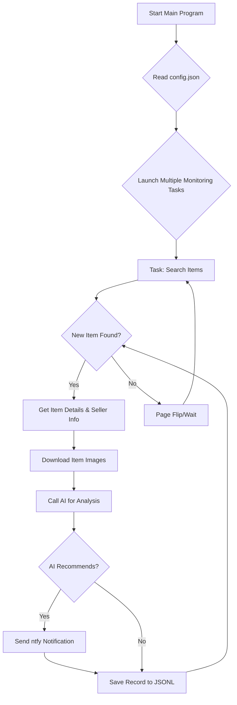

# AI 闲鱼智能监控机器人: 实时监控与智能分析

Tired of manually searching for deals on Xianyu (闲鱼)? This project offers an AI-powered solution to monitor Xianyu listings in real-time, filter results based on your criteria, and notify you instantly.  **[Check out the original repo](https://github.com/dingyufei615/ai-goofish-monitor)**.

## Key Features

*   **Intuitive Web UI:** Manage tasks, edit AI standards, view logs, and filter results via a user-friendly web interface.
*   **AI-Driven Task Creation:** Describe your desired item in natural language, and the system creates a comprehensive monitoring task.
*   **Concurrent Multi-Tasking:** Monitor multiple keywords simultaneously without interference, thanks to the `config.json` configuration.
*   **Real-time Streaming:** Analyze new listings immediately, eliminating the delays of batch processing.
*   **Deep AI Analysis:** Integrate multimodal Large Language Models (LLMs) like GPT-4o to analyze listing text, images, and seller profiles for accurate filtering.
*   **Highly Customizable:** Configure each task with unique keywords, price ranges, filters, and AI analysis prompts.
*   **Instant Notifications:** Receive timely alerts via [ntfy.sh](https://ntfy.sh/) on your phone or desktop for items that meet your criteria.
*   **Robust Anti-Scraping:** Employ human-like actions and various delays to improve stability and avoid detection.

## Key Benefits:
*   **Saves Time:** Automates the process of finding deals on Xianyu.
*   **Improves Efficiency:** Monitors multiple items concurrently.
*   **Enhances Accuracy:** Leverages AI to filter and identify relevant listings.
*   **Provides Real-time Alerts:** Notifies users of new listings as soon as they become available.

## Getting Started

Follow these steps to begin using the AI Xianyu monitor:

### 1. Prerequisites

*   **Install Docker** (Optional, but highly recommended for easy deployment - see Docker instructions below)
*   **Python 3.7+**

### 2. Cloning & Installation

1.  **Clone the repository:**
    ```bash
    git clone https://github.com/dingyufei615/ai-goofish-monitor
    cd ai-goofish-monitor
    ```

2.  **Install dependencies:**
    ```bash
    pip install -r requirements.txt
    ```

### 3. Configuration

1.  **Create a `.env` file** in the project's root directory with the following settings:

    ```env
    # --- AI Model Configuration ---
    OPENAI_API_KEY="sk-..." # Your API key for the chosen AI model
    OPENAI_BASE_URL="https://generativelanguage.googleapis.com/v1beta/openai/" # API endpoint (check your provider's API doc)
    OPENAI_MODEL_NAME="gemini-2.5-pro" # Model name (must support image analysis)

    # Notification Settings
    NTFY_TOPIC_URL="https://ntfy.sh/your-topic-name" # Your ntfy topic URL

    # Optional: Enterprise WeChat Bot
    WX_BOT_URL="https://qyapi.weixin.qq.com/cgi-bin/webhook/send?key=xxxxx"

    # Browser settings
    LOGIN_IS_EDGE=false # Set to true to use Edge browser
    PCURL_TO_MOBILE=true # Convert PC URLs to mobile URLs

    # Headless Mode
    RUN_HEADLESS=true # Set to false for manual login on local

    # Web Server Port
    SERVER_PORT=8000 # Set to your desired port or leave it to default (8000)
    ```

2.  **Get Login Status (Important!):** Run the `login.py` script once to generate the `xianyu_state.json` file (required for logged-in access to Xianyu).  Follow the prompts to scan the QR code with your Xianyu app.
    ```bash
    python login.py
    ```

### 4. Run the Web UI

1.  **Start the web server:**
    ```bash
    python web_server.py
    ```

2.  **Access the Web UI:** Open your web browser and go to `http://127.0.0.1:8000`.

3.  **Create a Monitoring Task:**
    *   Go to **“Task Management”**.
    *   Click **“Create New Task”**.
    *   Describe your requirements in natural language (e.g., "I want to buy a used Sony A7M4 camera, 95% new or better, budget under 13000 yuan, shutter count below 5000").
    *   The AI will generate the analysis criteria.
    *   Click Create and start using it!

### Docker Deployment (Recommended)

Docker simplifies deployment and management.

#### Steps

1.  **Prepare Environment:**  (Same as Local Deployment but run Login step on host machine, not within the container.)
    *   Ensure Docker is installed on your system.
    *   Clone the project.
    *   Create and configure your `.env` file.
    *   **Run `login.py` on the host machine** to generate `xianyu_state.json`.

2.  **Run the Container:**
    ```bash
    docker-compose up -d
    ```

3.  **Manage the Container:**
    *   **Access Web UI:** `http://127.0.0.1:8000`
    *   **View Logs:** `docker-compose logs -f`
    *   **Stop Container:** `docker-compose stop`
    *   **Start Container:** `docker-compose start`
    *   **Remove Container:** `docker-compose down`

## Web UI Functionality

*   **Task Management:**  AI-powered task creation, in-browser task modification, and control.
*   **Results Viewing:**  Clear card-based display of matched items, smart filters.
*   **Run Logs:** Real-time logs in the browser.
*   **System Settings:** Checks for key configurations and supports prompt editing.

## Advanced Command-Line Usage

For more technical users, there are command-line options:

### Start Monitoring
```bash
python spider_v2.py
```

### Create New Tasks

```bash
python prompt_generator.py \
  --description "Your description" \
  --output prompts/your_criteria.txt \
  --task-name "Your Task Name" \
  --keyword "Your Keyword" \
  --min-price "Your Minimum Price" \
  --max-price "Your Maximum Price"
```

## Workflow



## Technology Stack

*   **Core:** Playwright (asynchronous) + asyncio
*   **Web Server:** FastAPI
*   **AI Model:** OpenAI API (supports GPT-4o, etc.)
*   **Notifications:** ntfy
*   **Configuration:** JSON
*   **Dependencies:** pip

## File Structure

```
.
├── .env                # Environment variables (API keys)
├── .gitignore
├── config.json         # Configuration file for tasks
├── login.py            # Login script (generates cookie)
├── spider_v2.py        # Core spider program
├── prompt_generator.py # AI prompt generation script
├── web_server.py       # Web server main program
├── requirements.txt    # Python dependencies
├── README.md           # This file
├── prompts/            # AI prompts
│   ├── base_prompt.txt
│   └── ..._criteria.txt
├── static/             # Web UI static files
│   ├── css/style.css
│   └── js/main.js
├── templates/          # Web UI templates
│   └── index.html
├── images/             # Downloaded item images (auto-created)
├── logs/               # Running logs (auto-created)
└── jsonl/              # Task results (auto-created)
```

## FAQ (Frequently Asked Questions)

*   **Q: Encoding Errors (gbk codec):**
    *   **A:** Primarily a Windows issue.
    *   **Solution:**  Set `PYTHONUTF8=1` environment variable or use `chcp 65001` before running the scripts.

*   **Q:  `playwright install` error:**
    *   **A:** Missing browser files.  Ensure all dependencies are installed.  If the problem persists, manually install Chromium:  `playwright install chromium`

*   **Q:  "Request timed out" or "Connection error":**
    *   **A:** Network issue. Check network connectivity, proxy configuration (if needed).  Confirm your `OPENAI_BASE_URL` is correct and accessible.

*   **Q: Model Doesn't Support Images:**
    *   **A:** Use a multimodal (Vision/Multi-modal) AI model.  Update `OPENAI_MODEL_NAME` in `.env` (e.g., `gpt-4o`, `gemini-1.5-pro`).

*   **Q: Deployment on Synology NAS:**
    *   **A:** Standard Docker deployment: Run `login.py` on a local machine. Upload the project folder (including `.env` and `xianyu_state.json`) to your NAS. Use `docker-compose up -d`.

*   **Q: Using Gemini/Qwen/Grok (non-OpenAI models):**
    *   **A:**  Configure `.env`:  `OPENAI_API_KEY`, `OPENAI_BASE_URL` (check the API docs), `OPENAI_MODEL_NAME` (must support image recognition).

*   **Q: Being Detected/Captcha:**
    *   **A:** Prevent detection:  Set `RUN_HEADLESS=false` in `.env`, reduce monitoring frequency, use a clean network.

## Acknowledgements

Thanks to the following projects for inspiration:
- [superboyyy/xianyu_spider](https://github.com/superboyyy/xianyu_spider)

Thanks to the LinuxDo community,  Aider and Gemini

## Important Notes

*   Adhere to Xianyu's terms of service and robots.txt. Avoid excessive requests.
*   This project is for educational and research purposes only. Avoid illegal activities.

[](https://star-history.com/#dingyufei615/ai-goofish-monitor&Date)