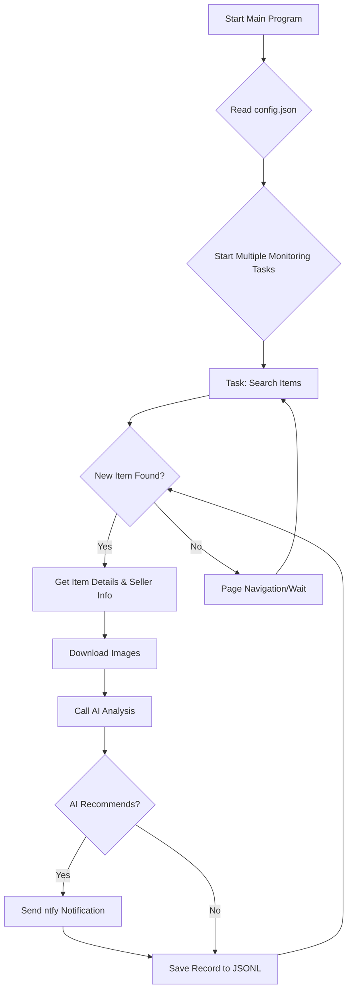

# AI-Powered Xianyu Monitor: Effortlessly Track & Analyze Secondhand Listings

**Effortlessly monitor Xianyu (闲鱼) for your desired items using AI-powered analysis and real-time notifications. [Check out the original repository](https://github.com/dingyufei615/ai-goofish-monitor) for detailed information and updates.**

## Key Features

*   **Web UI for Easy Management:** Manage tasks, view results, and monitor activity through a user-friendly web interface.
*   **AI-Driven Task Creation:** Describe your desired item in natural language, and the AI generates a comprehensive monitoring task.
*   **Concurrent Monitoring:** Track multiple keywords simultaneously without interference using `config.json`.
*   **Real-time Analysis:** Immediate analysis of new listings, minimizing delay.
*   **Advanced AI Analysis:** Leverages multimodal large language models (e.g., GPT-4o) to analyze images, descriptions, and seller profiles for precise filtering.
*   **Highly Customizable:** Configure individual tasks with specific keywords, price ranges, filtering criteria, and AI analysis prompts.
*   **Instant Notifications:** Receive real-time notifications for promising listings via [ntfy.sh](https://ntfy.sh/).
*   **Robust Anti-Detection:** Implements anti-scraping techniques with random delays and simulated user behavior.

## Key Screenshots

*   [Backend Task Management](https://github.com/dingyufei615/ai-goofish-monitor/blob/main/static/img.png)
*   [Backend Monitoring](https://github.com/dingyufei615/ai-goofish-monitor/blob/main/static/img_1.png)
*   [ntfy Notifications](https://github.com/dingyufei615/ai-goofish-monitor/blob/main/static/img_2.png)

## Getting Started

### 1. Prerequisites

*   **Clone the Repository:**
    ```bash
    git clone https://github.com/dingyufei615/ai-goofish-monitor
    cd ai-goofish-monitor
    ```
*   **Install Dependencies:**
    ```bash
    pip install -r requirements.txt
    ```

### 2. Configuration

1.  **Create .env File:**  Create a `.env` file in the project root directory and configure:

    ```env
    # --- AI Model Configuration ---
    OPENAI_API_KEY="sk-..."  # Your OpenAI API key or equivalent.
    OPENAI_BASE_URL="https://generativelanguage.googleapis.com/v1beta/openai/" # OpenAI compatible API endpoint (check your provider's documentation).
    OPENAI_MODEL_NAME="gemini-2.5-pro"  # The model to use; must support image analysis.
    PROXY_URL="" # (Optional) HTTP/S proxy (e.g., http://127.0.0.1:7890 or socks5://127.0.0.1:1080).

    # Notification Configuration
    NTFY_TOPIC_URL="https://ntfy.sh/your-topic-name" # Replace with your ntfy topic URL.
    WX_BOT_URL="https://qyapi.weixin.qq.com/cgi-bin/webhook/send?key=xxxxx" # (Optional) Enterprise WeChat bot URL.

    # Browser Settings
    LOGIN_IS_EDGE=false # Use Chrome (default) or Edge.
    PCURL_TO_MOBILE=true # Convert PC links to mobile links.
    RUN_HEADLESS=true # Run headless (true) or with a browser window (false) for manual captcha solving.

    # Debugging
    AI_DEBUG_MODE=false # Enable AI debugging logs.

    # Server Port
    SERVER_PORT=8000 # (optional) Default is 8000
    ```

2.  **Get Login Status:** **Crucial!** Run the login script to generate the necessary session file.
    ```bash
    python login.py
    ```
    Follow the instructions in the browser to log in with your Xianyu account by scanning the QR code. The program will save the session in `xianyu_state.json`.

### 3. Launch the Web Server

```bash
python web_server.py
```

### 4. Start Monitoring

1.  Open your browser: `http://127.0.0.1:8000`.
2.  Go to "Task Management" and click "Create New Task".
3.  Describe your desired item in natural language (e.g., "Looking for a used Sony A7M4 camera, excellent condition, budget under $1500").
4.  Click "Create". The AI will generate an automated analysis configuration.
5.  Return to the main interface and click "🚀 Start All" to begin monitoring!

## Docker Deployment (Recommended)

Deploying with Docker ensures easy setup and consistent operation.

### 1. Preparation

1.  **Install Docker:** Ensure you have [Docker Engine](https://docs.docker.com/engine/install/) installed.
2.  **Clone the Project & Configure:**
    ```bash
    git clone https://github.com/dingyufei615/ai-goofish-monitor
    cd ai-goofish-monitor
    ```
    Create and populate your `.env` file as described above.
3.  **Get Login Status (Important!):** On your **host machine** (outside the Docker container), generate the `xianyu_state.json` file by running:
    ```bash
    pip install -r requirements.txt
    python login.py
    ```
    Scan the QR code to log in, which creates the `xianyu_state.json` file.

### 2. Run the Docker Container

The project provides a `docker-compose.yaml` file.  Use `docker-compose` for streamlined container management:

```bash
docker-compose up -d
```

### 3. Access & Manage

*   **Web UI:** Access the web UI at `http://127.0.0.1:8000`.
*   **View Logs:** `docker-compose logs -f`
*   **Stop Container:** `docker-compose stop`
*   **Start Stopped Container:** `docker-compose start`
*   **Stop and Remove Container:** `docker-compose down`

## Web UI Features

*   **Task Management:**
    *   **AI-Powered Task Creation:** Generate monitoring tasks using natural language descriptions.
    *   **In-line Editing:** Modify task parameters directly in the interface.
    *   **Task Control:** Enable/disable tasks individually or all at once.
*   **Result Viewing:**
    *   **Card View:** Display results in a visual, easy-to-understand card format.
    *   **Smart Filtering:** Filter for items "Recommended" by the AI.
    *   **Detailed View:** Examine comprehensive data and AI analysis results for each item.
*   **Real-time Logs:**
    *   **Live Log Stream:** Monitor the progress of your bot and troubleshoot issues.
*   **System Settings:**
    *   **Configuration Check:** Check the .env configuration.
    *   **Prompt Editing:** Adjust your AI prompt file directly in the browser.

## Command Line Usage

For advanced users, direct script execution is also possible:

### Start Monitoring

```bash
python spider_v2.py
```

**Debugging:** Limit the number of items processed for testing.

```bash
python spider_v2.py --debug-limit 2
```

### Create Tasks via Script

```bash
python prompt_generator.py \
  --description "I want a Sony A7M4 camera, mint condition, budget under $1300, less than 5000 shutter count, must be CN version and with all accessories" \
  --output prompts/sony_a7m4_criteria.txt \
  --task-name "Sony A7M4" \
  --keyword "a7m4" \
  --min-price "10000" \
  --max-price "13000"
```

## Workflow



## Technology Stack

*   **Core:** Playwright (Asynchronous) + asyncio
*   **Web Server:** FastAPI
*   **AI Model:** OpenAI API (Supports GPT-4o and other multi-modal models)
*   **Notifications:** ntfy
*   **Configuration:** JSON
*   **Dependencies:** pip

## Project Structure

```
.
├── .env                # Environment variables (API keys, etc.)
├── .gitignore          # Git ignore configuration
├── config.json         # Monitoring task definitions
├── login.py            # Login script
├── spider_v2.py        # Main spider script
├── prompt_generator.py # AI prompt generation
├── web_server.py       # Web server
├── requirements.txt    # Python dependencies
├── README.md           # This file
├── prompts/            # AI prompt files
│   ├── base_prompt.txt
│   └── ..._criteria.txt
├── static/             # Web static files
│   ├── css/style.css
│   └── js/main.js
├── templates/          # Web template
│   └── index.html
├── images/             # Item images (auto-created)
├── logs/               # Runtime logs (auto-created)
└── jsonl/              # Result files (auto-created)
```

## Frequently Asked Questions (FAQ)

1.  **Q:  'gbk' codec can't encode character errors when running login.py/spider_v2.py?**
    *   **A:** This is a common encoding issue on Windows.
    *   **Solution:**  Set the `PYTHONUTF8=1` environment variable before running the script in PowerShell or CMD, or use `chcp 65001`.

2.  **Q:  "playwright install" required error when running login.py?**
    *   **A:**  The browser files are missing.  Make sure you've correctly installed the requirements. Run:
        ```bash
        pip install -r requirements.txt
        ```
        If the problem persists, try:
        ```bash
        playwright install chromium
        ```

3.  **Q: "Request timed out" or "Connection error" when creating tasks or running?**
    *   **A:**  Network issues; the server can't reach the `OPENAI_BASE_URL`.  Check:
        *   Your server's network connection.
        *   Use a network proxy (configure `PROXY_URL` in `.env`).
        *   Verify that `OPENAI_BASE_URL` is correct and the service is running.

4.  **Q:  My chosen AI model doesn't support image analysis?**
    *   **A:**  **Crucially,** you **must** select a multimodal AI model (Vision/Multi-modal) for image analysis to function properly. Set `OPENAI_MODEL_NAME` in `.env` to a suitable model (e.g., `gpt-4o`, `gemini-1.5-pro`, `deepseek-v2`, `qwen-vl-plus`).

5.  **Q: Can I deploy on a Synology NAS using Docker?**
    *   **A:** Yes. The deployment is similar to standard Docker:
        1.  Complete the `login.py` step on your computer.
        2.  Upload the entire project folder (including `.env` and `xianyu_state.json`) to your NAS.
        3.  In the Container Manager (or Docker), use `docker-compose up -d`.  Ensure volume mappings in `docker-compose.yaml` correctly point to your project folder on the NAS.

6  **Q: How to use Gemini / Qwen / Grok or other non-OpenAI LLMs?**
    *   **A:**  This project is compatible with any model that provides an OpenAI-compatible API.  Configure the following variables in `.env`:
        *   `OPENAI_API_KEY`: Your API key from the model provider.
        *   `OPENAI_BASE_URL`: The API-compatible endpoint (e.g., `https://api.your-provider.com/v1`).  Check your model's documentation; usually, this does *not* end in `/chat/completions`.
        *   `OPENAI_MODEL_NAME`:  The specific model name.
    *   **Example:** If the completions endpoint is `https://xx.xx.com/v1/chat/completions`,  set `OPENAI_BASE_URL` to `https://xx.xx.com/v1`.

7  **Q:  Getting detected by Xianyu; seeing "abnormal traffic" or captcha prompts?**
    *   **A:**  This indicates Xianyu's anti-scraping measures.  Try:
        *   **Disable Headless Mode:** Set `RUN_HEADLESS=false` in `.env` to use a visible browser and manually solve captchas.
        *   **Reduce Monitoring Frequency:** Limit the number of simultaneous tasks.
        *   **Use a Clean Network:** Frequent scraping may lead to IP bans.

## Acknowledgements

This project is built upon and inspired by these projects:
- [superboyyy/xianyu_spider](https://github.com/superboyyy/xianyu_spider)
- LinuxDo users
- Aider and Gemini, for helping to write and organize the code.

## Important Considerations

*   Adhere to Xianyu's terms of service and robots.txt.  Avoid excessive requests to prevent server load or account restrictions.
*   This project is for educational and research purposes only.  Do not use it for illegal activities.

[](https://star-history.com/#dingyufei615/ai-goofish-monitor&Date)