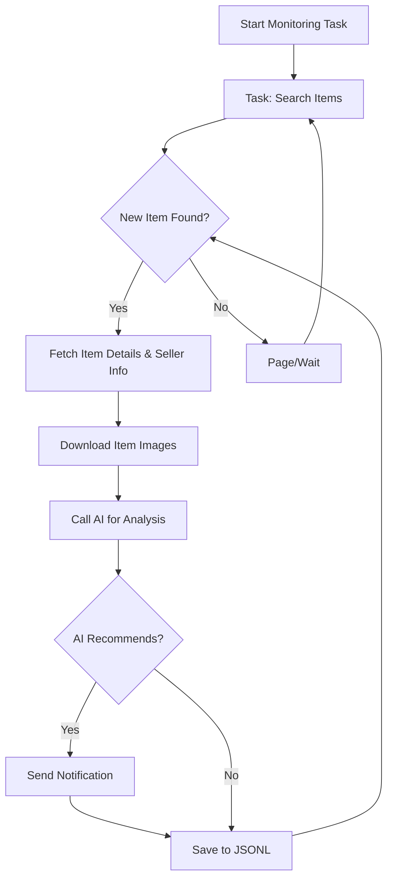

# AI-Powered Goofish Monitor: Real-time Xianyu Item Monitoring with AI Analysis

**Tired of missing out on the best deals?** This project provides a smart, AI-driven Xianyu (闲鱼) monitoring tool with a user-friendly web interface, allowing you to automatically track items, analyze listings, and get notified about the products you want. ([View on GitHub](https://github.com/dingyufei615/ai-goofish-monitor))

## Key Features

*   ✅ **Web UI for Easy Management:** Manage tasks, edit AI standards, view logs, and filter results with a complete web interface.
*   🤖 **AI-Powered Task Creation:** Describe your desired item in natural language and let AI create the monitoring task.
*   🔄 **Concurrent Multi-Tasking:** Monitor multiple keywords simultaneously without interference through `config.json`.
*   ⚡️ **Real-time Streaming:** Analyze new listings immediately, eliminating delays.
*   🧠 **Deep AI Analysis:** Uses multi-modal large language models (e.g., GPT-4o) to analyze item descriptions, images, and seller profiles for precise filtering.
*   ⚙️ **Highly Customizable:** Configure keywords, price ranges, filters, and AI analysis prompts for each task.
*   🔔 **Instant Notifications:** Receive alerts via [ntfy.sh](https://ntfy.sh/), WeChat, and [Bark](https://bark.day.app/).
*   ⏰ **Scheduled Task Execution:** Schedule tasks using Cron expressions for automated monitoring.
*   🐳 **Docker-Friendly Deployment:** Deploy quickly and consistently with Docker Compose.
*   🛡️ **Robust Anti-Scraping Strategies:** Simulates human behavior to improve stability.

## Screenshots

**Task Management Backend:**


**Monitoring Backend:**


**Notification Example:**


## Quick Start (Recommended: Web UI)

The web UI provides the best user experience.

### Step 1: Environment Setup

> ⚠️ **Python Version Requirement:** Use Python 3.10+ for local development to avoid dependency installation issues or runtime errors (e.g., `ModuleNotFoundError: No module named 'PIL'`).

1.  **Clone the repository:**

    ```bash
    git clone https://github.com/dingyufei615/ai-goofish-monitor
    cd ai-goofish-monitor
    ```

2.  **Install dependencies:**

    ```bash
    pip install -r requirements.txt
    ```

### Step 2: Configuration

1.  **Configure Environment Variables:** Copy `.env.example` to `.env` and modify the values.

    *   **Windows:**

        ```cmd
        copy .env.example .env
        ```

    *   **Linux/MacOS:**

        ```bash
        cp .env.example .env
        ```

    Available environment variables:

    | Variable               | Description                                               | Required | Notes                                                                           |
    | ---------------------- | --------------------------------------------------------- | -------- | ------------------------------------------------------------------------------- |
    | `OPENAI_API_KEY`       | Your AI model provider's API Key.                         | Yes      |                                                                                 |
    | `OPENAI_BASE_URL`      | AI model API endpoint (compatible with OpenAI format).      | Yes      | E.g., `https://api.example.com/v1/`.  **Important: no trailing slash.**       |
    | `OPENAI_MODEL_NAME`    | The specific model to use.                                | Yes      | **Must** be a multi-modal model, such as `doubao-seed-1-6-250615`, `gemini-2.5-pro`. |
    | `PROXY_URL`            | (Optional) HTTP/S proxy for bypassing geo-restrictions.   | No       | Supports `http://` and `socks5://`.                                            |
    | `NTFY_TOPIC_URL`       | (Optional) [ntfy.sh](https://ntfy.sh/) topic URL.         | No       |                                                                                 |
    | `GOTIFY_URL`           | (Optional) Gotify service address.                         | No       |                                                                                 |
    | `GOTIFY_TOKEN`         | (Optional) Gotify application token.                      | No       |                                                                                 |
    | `BARK_URL`             | (Optional) [Bark](https://bark.day.app/) push address.   | No       |                                                                                 |
    | `WX_BOT_URL`           | (Optional) WeChat Enterprise Robot webhook address.     | No       |                                                                                 |
    | `WEBHOOK_URL`          | (Optional) Generic Webhook URL.                          | No       |                                                                                 |
    | `WEBHOOK_METHOD`       | (Optional) Webhook request method (GET or POST, defaults to POST). | No       |                                                                                 |
    | `WEBHOOK_HEADERS`      | (Optional) Webhook custom headers (JSON string).        | No       |                                                                                 |
    | `WEBHOOK_CONTENT_TYPE` | (Optional) POST content type (JSON or FORM, defaults to JSON).  | No       |                                                                                 |
    | `WEBHOOK_QUERY_PARAMETERS` | (Optional) GET query parameters (JSON string).   | No       |                                                                                 |
    | `WEBHOOK_BODY`         | (Optional) POST request body (JSON string).               | No       |                                                                                 |
    | `LOGIN_IS_EDGE`        | Use Edge browser for login and scraping (defaults to Chrome/Chromium). | No       |                                                                                 |
    | `PCURL_TO_MOBILE`      | Convert PC item links to mobile links in notifications.  | No       | Defaults to `true`.                                                             |
    | `RUN_HEADLESS`         | Run the browser in headless mode (defaults to `true`).   | No       | Set to `false` for debugging captcha issues. **Must be `true` for Docker.**     |
    | `AI_DEBUG_MODE`        | Enable AI debugging mode (defaults to `false`).          | No       | Prints detailed AI request and response logs to the console.                       |
    | `SERVER_PORT`          | Web UI server port (defaults to `8000`).                 | No       |                                                                                 |

    > 💡 **Debugging Tip:** If you encounter 404 errors when configuring your AI API, test with an API from Alibaba Cloud or Volcano Engine first to ensure basic functionality before using other providers.

2.  **Get Login State (Important!)**: Provide valid login credentials for the scraper to access Xianyu.  Use the Web UI for the easiest method:

    **Recommended: Via Web UI Update**

    1.  Start the web service in Step 3 below.
    2.  Open the Web UI and go to **"System Settings"**.
    3.  Find "Login State File" and click **"Manual Update"**.
    4.  Follow the on-screen instructions:
        -   Install the [Xianyu Login State Extraction Extension](https://chromewebstore.google.com/detail/xianyu-login-state-extrac/eidlpfjiodpigmfcahkmlenhppfklcoa) in Chrome.
        -   Log in to the Xianyu website using Chrome.
        -   Click the extension icon and then "Extract Login State".
        -   Click "Copy to Clipboard".
        -   Paste the copied content into the Web UI and save.

    **Alternative: Run Login Script (if you can run a graphical browser)**

    ```bash
    python login.py
    ```

    This opens a browser window.  Use the **Xianyu mobile app to scan the QR code** to log in.  The program will then generate a `xianyu_state.json` file in the project root.

### Step 3: Start the Web Service

Once ready, launch the web management server:

```bash
python web_server.py
```

### Step 4: Start Monitoring

1.  Open the Web UI in your browser: `http://127.0.0.1:8000`
2.  Go to **"Task Management"** and click **"Create New Task"**.
3.  Describe your buying requirements in natural language (e.g., "Buy a Sony A7M4 camera, mint condition, under $1000, low shutter count"), fill in the task name, and keywords.
4.  Click Create. AI will generate analysis criteria.
5.  Return to the main interface, schedule or manually start the task!

## 🐳 Docker Deployment (Recommended)

Use Docker for fast, reliable, and consistent deployment.

### Step 1: Environment Setup (Similar to Local Setup)

1.  **Install Docker:** Ensure you have [Docker Engine](https://docs.docker.com/engine/install/) installed.

2.  **Clone and Configure:**

    ```bash
    git clone https://github.com/dingyufei615/ai-goofish-monitor
    cd ai-goofish-monitor
    ```

3.  **Create `.env` file:** Follow the instructions in the **[Quick Start](#-quick-start-web-ui-recommended)** section to create and fill in your `.env` file.

4.  **Get Login State (Essential!)**:  You *cannot* scan the QR code in a Docker container. Set up the login state using the Web UI *after* starting the container:
    1.  (On the host machine) Run `docker-compose up -d`.
    2.  Open the Web UI: `http://127.0.0.1:8000`
    3.  Go to **"System Settings"** and click **"Manual Update"**.
    4.  Follow the on-screen instructions:
        -   Install the [Xianyu Login State Extraction Extension](https://chromewebstore.google.com/detail/xianyu-login-state-extrac/eidlpfjiodpigmfcahkmlenhppfklcoa) in Chrome.
        -   Log in to the Xianyu website using Chrome.
        -   Click the extension icon and then "Extract Login State".
        -   Click "Copy to Clipboard".
        -   Paste the copied content into the Web UI and save.

> ℹ️ **Regarding Python version:** Docker uses the Python 3.11 version specified in the Dockerfile, so you don't need to worry about local Python version compatibility.

### Step 2: Run the Docker Container

The project includes a `docker-compose.yaml` file.

In the project root, run:

```bash
docker-compose up --build -d
```

This starts the service in the background. `docker-compose` handles the `.env` and `docker-compose.yaml` configuration.

If you have network issues inside the container, check your proxy settings.

> ⚠️ **OpenWrt Deployment Note:**  If deploying on an OpenWrt router, you might encounter DNS resolution issues.  If you see `ERR_CONNECTION_REFUSED`, check your container's network configuration, and you might need to manually configure DNS.

### Step 3: Access and Manage

*   **Access Web UI:** Open `http://127.0.0.1:8000` in your browser.
*   **View Real-time Logs:** `docker-compose logs -f`
*   **Stop Container:** `docker-compose stop`
*   **Start Stopped Container:** `docker-compose start`
*   **Stop and Remove Container:** `docker-compose down`

## 📸 Web UI Functionality

*   **Task Management:**
    *   **AI Task Creation:** Describe your requirements and generate monitoring tasks with AI.
    *   **Visual Editing and Control:** Edit task parameters (keywords, price, scheduling) and start/stop/delete tasks.
    *   **Scheduled Tasks:** Use Cron expressions for automatic, periodic execution.
*   **Result Viewing:**
    *   **Card View:** Clear display of matching items.
    *   **Smart Filtering and Sorting:** Filter for AI-recommended items and sort by time, price, etc.
    *   **Detailed Information:** View complete data and AI analysis results for each item.
*   **Running Logs:**
    *   **Real-time Log Stream:** View detailed crawler logs in real time.
    *   **Log Management:** Support auto-refresh, manual refresh, and clear logs.
*   **System Settings:**
    *   **Status Check:** Check `.env` configuration, login status, and other dependencies.
    *   **Prompt Editing:** Edit and save prompts for AI analysis, adjusting the AI logic.

## 🚀 Workflow



## Frequently Asked Questions (FAQ)

1.  **Q:  `'gbk' codec can't encode character` error when running `login.py` or `spider_v2.py`?**
    *   **A:**  This is a Windows encoding issue.  The project uses UTF-8.
    *   **Solution:** Set the `PYTHONUTF8` environment variable before running:

        ```bash
        set PYTHONUTF8=1
        python spider_v2.py
        ```

        Or use `chcp 65001`.

2.  **Q: `playwright install` needed when running `login.py`?**
    *   **A:**  Playwright's browser files are missing.
    *   **Solution:** Ensure dependencies are installed:

        ```bash
        pip install -r requirements.txt
        ```

        If it still fails, manually install Chromium:

        ```bash
        playwright install chromium
        ```

3.  **Q: "Request timed out" or "Connection error" when creating or running a task?**
    *   **A:**  Network issue; your server cannot connect to the `OPENAI_BASE_URL`.
    *   **Solution:**
        *   Check your server's network connection.
        *   If in mainland China, configure a `PROXY_URL` in your `.env`.
        *   Verify that `OPENAI_BASE_URL` is correct and the service is running.

4.  **Q: My AI model doesn't support image analysis?**
    *   **A:**  Image analysis is crucial. **You *must*** select a multi-modal AI model.  Change `OPENAI_MODEL_NAME` in `.env` to a suitable model (e.g., `gpt-4o`, `gemini-1.5-pro`, `deepseek-v2`, `qwen-vl-plus`).

5.  **Q: Can I deploy on a Synology NAS via Docker?**
    *   **A:**  Yes. Deploy the same way as standard Docker.
        1.  Complete `login.py` on your computer to generate `xianyu_state.json`.
        2.  Upload the project folder (including `.env` and `xianyu_state.json`) to your Synology.
        3.  In Container Manager, use `docker-compose up -d` (via SSH or Task Scheduler).  Ensure the volume mount in `docker-compose.yaml` correctly points to your Synology project folder.

6.  **Q: How do I use Gemini / Qwen / Grok or other non-OpenAI LLMs?**
    *   **A:**  Theoretically, any OpenAI-compatible API.  The key is correct `.env` settings:
        *   `OPENAI_API_KEY`: Your API Key.
        *   `OPENAI_BASE_URL`: Your provider's API-compatible endpoint.  Refer to your model's documentation, often in the format `https://api.your-provider.com/v1` (no `/chat/completions` at the end).
        *   `OPENAI_MODEL_NAME`:  Your model name (needs to support image recognition, e.g., `gemini-2.5-flash`).
    *   **Example:**  If the Completions endpoint is `https://xx.xx.com/v1/chat/completions`,  `OPENAI_BASE_URL` would be `https://xx.xx.com/v1`.

7.  **Q: Being detected by Xianyu, "abnormal traffic" or captcha after a while?**
    *   **A:**  Xianyu's anti-scraping.
        *   **Turn off headless mode:** `RUN_HEADLESS=false` in `.env`.  Manually solve captchas.
        *   **Reduce monitoring frequency:**  Avoid running many tasks simultaneously.
        *   **Use a clean network environment.**

8.  **Q: `pyzbar` installation fails on Windows?**
    *   **A:** `pyzbar` needs the zbar DLL on Windows.
    *   **Solution (Windows):**
        *   **Method 1 (Recommended):** Install with Chocolatey:

            ```cmd
            choco install zbar
            ```

        *   **Method 2:**  Manual download and PATH:
            1.  Download the correct version of `libzbar-64.dll` from [zbar releases](https://github.com/NaturalHistoryMuseum/pyzbar/releases).
            2.  Put it in your Python installation directory or add it to the system PATH.
        *   **Method 3:** Use conda

            ```cmd
            conda install -c conda-forge zbar
            ```
    *   **Linux Users:** Install system package

        ```bash
        # Ubuntu/Debian
        sudo apt-get install libzbar0

        # CentOS/RHEL
        sudo yum install zbar

        # Arch Linux
        sudo pacman -S zbar
        ```

9.  **Q: `ModuleNotFoundError: No module named 'PIL'` when running `login.py`?**
    *   **A:**  Python version too old or incomplete dependencies.  Use Python 3.10+.
    *   **Solution:**
        *   Use Python 3.10+
        *   Reinstall dependencies:

            ```bash
            pip install -r requirements.txt
            ```

        *   If still a problem, try installing Pillow directly:

            ```bash
            pip install Pillow
            ```

10. **Q: 404 errors when configuring the AI API?**
    *   **A:** Test with a public AI API first (e.g., from Alibaba Cloud) to confirm basic functionality before switching to other API providers. Check:
        *   `OPENAI_BASE_URL` is correct and the service is running.
        *   Network connection is working.
        *   API Key is correct and authorized.
        *   Some providers might need specific headers or parameters; consult the API documentation.

## Acknowledgements

This project references the following projects:

-   [superboyyy/xianyu_spider](https://github.com/superboyyy/xianyu_spider)

And thanks to the LinuxDo community for contributions

-   [@jooooody](https://linux.do/u/jooooody/summary)

Thanks to Aider and Gemini for speeding up code writing～

## Support & Sponsoring

If this project is helpful, please consider supporting it!

<table>
  <tr>
    <td></td>
    <td></td>
  </tr>
</table>

## ⚠️ Important Notes

*   Please comply with Xianyu's terms of service and robots.txt. Avoid excessive requests to prevent account restrictions.
*   This project is for educational and research purposes only. Do not use it for illegal activities.
*   This project is released under the [MIT License](LICENSE). It is provided "as is" without warranty.
*   The author and contributors are not liable for any direct, indirect, incidental, or special damages resulting from using this software.
*   For more details, see the [DISCLAIMER.md](DISCLAIMER.md) file.

[](https://star-history.com/#dingyufei615/ai-goofish-monitor&Date)