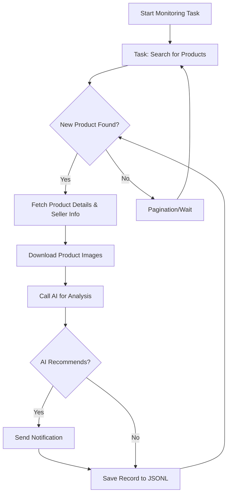

# AI-Powered Goofish (Xianyu) Monitor: Your Smart Shopping Assistant

This project leverages Playwright and AI to create a smart, automated monitoring tool for Goofish (Xianyu), providing real-time alerts and intelligent analysis with a user-friendly web interface.  [View the original repository](https://github.com/dingyufei615/ai-goofish-monitor).

## Key Features

*   **Intuitive Web UI:** Manage tasks, edit AI criteria, view logs, and browse results directly through a web interface.
*   **AI-Driven Task Creation:** Describe your desired item in natural language to automatically generate complex monitoring tasks.
*   **Concurrent Multi-Tasking:** Monitor multiple keywords simultaneously with independent, non-interfering tasks via `config.json`.
*   **Real-time Stream Processing:** Analyze new listings instantly, eliminating the delays of batch processing.
*   **Deep AI Analysis:** Utilize multimodal large language models (like GPT-4o) to analyze listings based on images, text, and seller profiles for accurate filtering.
*   **Highly Customizable:** Configure individual keywords, price ranges, filtering conditions, and AI prompts for each monitoring task.
*   **Instant Notifications:** Receive immediate alerts for matching items via [ntfy.sh](https://ntfy.sh/), Enterprise WeChat group bots, and [Bark](https://bark.day.app/).
*   **Scheduled Task Execution:** Schedule tasks with cron expressions for automated, recurring monitoring.
*   **Docker-Ready Deployment:** Deploy quickly and easily using Docker Compose.
*   **Robust Anti-Scraping:** Mimics human behavior with random delays and user actions to enhance stability.

## Key Highlights

*   **AI-Enhanced Filtering:** Leverage advanced AI models for in-depth analysis of product listings.
*   **User-Friendly Interface:** Streamline your monitoring process with a comprehensive web-based management tool.
*   **Real-time Alerts:** Stay informed with instant notifications, allowing you to act quickly on desirable listings.
*   **Automated and Scalable:** Automate your search and monitoring tasks with configurable scheduling and support for multiple tasks.

## 📸 Screenshots

**Task Management Dashboard**


**Monitoring Results**


**Notification Example**


## 🚀 Quick Start (Web UI Recommended)

The Web UI provides the best user experience and is recommended for operating this project.

### Step 1: Environment Setup

> ⚠️ **Python Version Requirement**:  Python 3.10 or higher is recommended for local deployment.  Lower versions may cause dependency installation failures or runtime errors (e.g., `ModuleNotFoundError: No module named 'PIL'`).

1.  Clone the project to your local machine:

    ```bash
    git clone https://github.com/dingyufei615/ai-goofish-monitor
    cd ai-goofish-monitor
    ```

2.  Install the required Python dependencies:

    ```bash
    pip install -r requirements.txt
    ```

### Step 2: Basic Configuration

1.  **Configure Environment Variables:** Copy `.env.example` to `.env` and modify its contents.

    Windows:

    ```cmd
    copy .env.example .env
    ```

    Linux/MacOS:

    ```shell
    cp .env.example .env
    ```

    Environment Variables:

    | Variable            | Description                                                                                | Required | Notes                                                                                                                                          |
    | ------------------- | ------------------------------------------------------------------------------------------ | -------- | ---------------------------------------------------------------------------------------------------------------------------------------------- |
    | `OPENAI_API_KEY`    | Your AI model service provider's API Key.                                                  | Yes      | May be optional for local or specific proxy services.                                                                                          |
    | `OPENAI_BASE_URL`   | AI model API endpoint address, must be compatible with OpenAI format.                       | Yes      |  Enter the base path of the API, for example `https://ark.cn-beijing.volces.com/api/v3/`.                                                       |
    | `OPENAI_MODEL_NAME` | The specific model name you want to use.                                                | Yes      | **Must** select a multimodal model that supports image analysis, such as `doubao-seed-1-6-250615` or `gemini-2.5-pro`.                          |
    | `PROXY_URL`         | (Optional) HTTP/S proxy for bypassing the firewall.                                         | No       | Supports `http://` and `socks5://` formats.  For example, `http://127.0.0.1:7890`.                                                            |
    | `NTFY_TOPIC_URL`    | (Optional) [ntfy.sh](https://ntfy.sh/) topic URL for sending notifications.                  | No       | If left blank, ntfy notifications will not be sent.                                                                                              |
    | `GOTIFY_URL`        | (Optional) Gotify service address.                                                       | No       | For example, `https://push.example.de`.                                                                                                        |
    | `GOTIFY_TOKEN`      | (Optional) Gotify application token.                                                      | No       |                                                                                                                                                |
    | `BARK_URL`          | (Optional) [Bark](https://bark.day.app/) push address.                                    | No       | For example, `https://api.day.app/your_key`.  If left blank, Bark notifications will not be sent.                                                |
    | `WX_BOT_URL`        | (Optional) Enterprise WeChat group robot webhook address.                                 | No       | If left blank, Enterprise WeChat notifications will not be sent.  Ensure the URL is enclosed in double quotes in `.env` to be effective.        |
    | `WEBHOOK_URL`       | (Optional) Generic Webhook URL address.                                                     | No       | If left blank, generic Webhook notifications will not be sent.                                                                                 |
    | `WEBHOOK_METHOD`    | (Optional) Webhook request method.                                                          | No       | Supports `GET` or `POST`, defaults to `POST`.                                                                                                   |
    | `WEBHOOK_HEADERS`   | (Optional) Custom headers for the Webhook.                                                  | No       | Must be a valid JSON string, for example `'{"Authorization": "Bearer xxx"}'`.                                                                   |
    | `WEBHOOK_CONTENT_TYPE` | (Optional) Content type for POST requests.                                                | No       | Supports `JSON` or `FORM`, defaults to `JSON`.                                                                                                   |
    | `WEBHOOK_QUERY_PARAMETERS` | (Optional) Query parameters for GET requests.                                        | No       | JSON string, supports `{{title}}` and `{{content}}` placeholders.                                                                                |
    | `WEBHOOK_BODY`      | (Optional) Body for POST requests.                                                            | No       | JSON string, supports `{{title}}` and `{{content}}` placeholders.                                                                                |
    | `LOGIN_IS_EDGE`     | Whether to use the Edge browser for login and crawling.                                 | No       | Defaults to `false`, using Chrome/Chromium.                                                                                                 |
    | `PCURL_TO_MOBILE`   | Whether to convert PC product links to mobile links in notifications.                      | No       | Defaults to `true`.                                                                                                                          |
    | `RUN_HEADLESS`      | Whether to run the crawler browser in headless mode.                                      | No       | Defaults to `true`. Set to `false` for local debugging when encountering CAPTCHAs.  **Must be `true` for Docker deployments.**               |
    | `AI_DEBUG_MODE`     | Whether to enable AI debug mode.                                                            | No       | Defaults to `false`. Enabling this prints detailed AI request and response logs to the console.                                                 |
    | `SKIP_AI_ANALYSIS`  | Whether to skip AI analysis and send notifications directly.                                | No       | Defaults to `false`. If set to `true`, all crawled products will be sent directly to notifications without AI analysis.                         |
    | `ENABLE_THINKING`   | Whether to enable the `enable_thinking` parameter.                                        | No       | Defaults to `false`. Some AI models require this parameter, while others don't support it. If you encounter the error "Invalid JSON payload received. Unknown name "enable_thinking"", try setting this to `false`. |
    | `SERVER_PORT`       | The port the Web UI service runs on.                                                     | No       | Defaults to `8000`.                                                                                                                          |
    | `WEB_USERNAME`      | Web UI login username.                                                                    | No       | Defaults to `admin`.  **Must be changed in production.**                                                                                          |
    | `WEB_PASSWORD`      | Web UI login password.                                                                    | No       | Defaults to `admin123`.  **Must be changed to a strong password in production!**                                                                  |

    > 💡 **Debugging Tip**: If you encounter 404 errors when configuring the AI API, it is recommended to first use an API from Alibaba Cloud or Volcano Engine for debugging, to ensure basic functionality is working before testing other API providers. Some API providers may have compatibility issues or require special configurations.

    > 🔐 **Security Reminder**: Basic authentication is enabled for the Web UI.  The default username and password are `admin` / `admin123`.  **Change these to strong passwords in production!**

2.  **Get Login Status (Important!)**: The crawler needs valid login credentials. We recommend using the Web UI to achieve this:

    **Recommended: Update through Web UI**

    1.  Skip this step and start the web service in Step 3.
    2.  Open the Web UI and go to the "System Settings" page.
    3.  Find "Login Status File" and click the "Manual Update" button.
    4.  Follow the instructions in the popup:
        *   Install the [Xianyu Login State Extraction Extension](https://chromewebstore.google.com/detail/xianyu-login-state-extrac/eidlpfjiodpigmfcahkmlenhppfklcoa) in Chrome on your personal computer.
        *   Open and log in to the Xianyu website.
        *   After logging in successfully, click the extension icon in your browser toolbar.
        *   Click the "Extract Login Status" button to get the login information.
        *   Click the "Copy to Clipboard" button.
        *   Paste the copied content into the Web UI and save.

    This method is the most convenient as it does not require running a program with a graphical interface on the server.

    **Alternative: Run Login Script**

    If you can run programs locally or on a server with a desktop environment, you can use the traditional script method:

    ```bash
    python login.py
    ```

    This will open a browser window.  **Use the mobile Xianyu App to scan the QR code** to complete the login.  Upon success, the program will close automatically, and a `xianyu_state.json` file will be generated in the project root directory.

### Step 3: Start the Web Service

Start the Web UI server after everything is set up.

```bash
python web_server.py
```

### Step 4: Start Using

Open your browser and go to `http://127.0.0.1:8000` to access the management dashboard.

1.  On the "Task Management" page, click "Create New Task".
2.  In the popup, describe your purchase requirements in natural language (e.g., "I want to buy a used Sony A7M4 camera, in mint condition, budget under 13,000, shutter count below 5000"), and fill in the task name, keywords, etc.
3.  Click Create, and the AI will automatically generate a set of complex analysis criteria.
4.  Return to the main interface, add a schedule to the task, or simply click "Start" to begin automated monitoring!

## 🐳 Docker Deployment (Recommended)

Docker simplifies deployment by packaging the application and its dependencies into a standardized unit.

### Step 1: Environment Preparation (Similar to Local Deployment)

1.  **Install Docker**: Make sure you have [Docker Engine](https://docs.docker.com/engine/install/) installed on your system.

2.  **Clone and Configure the Project**:

    ```bash
    git clone https://github.com/dingyufei615/ai-goofish-monitor
    cd ai-goofish-monitor
    ```

3.  **Create the `.env` File**: Follow the instructions in the **[Quick Start](#-quick-start-web-ui-recommended)** section to create and populate the `.env` file in the project root.

4.  **Get Login Status (Crucial!)**: You cannot scan the QR code from within the Docker container. Set the login status by accessing the Web UI *after* starting the container:

    1.  (On the host machine) Run `docker-compose up -d` to start the service.
    2.  Open the Web UI by going to `http://127.0.0.1:8000` in your browser.
    3.  Go to the "System Settings" page and click the "Manual Update" button.
    4.  Follow the popup's instructions:
        *   Install the [Xianyu Login State Extraction Extension](https://chromewebstore.google.com/detail/xianyu-login-state-extrac/eidlpfjiodpigmfcahkmlenhppfklcoa) in Chrome on your personal computer.
        *   Open and log in to the Xianyu website.
        *   After logging in successfully, click the extension icon in your browser toolbar.
        *   Click the "Extract Login Status" button to get the login information.
        *   Click the "Copy to Clipboard" button.
        *   Paste the copied content into the Web UI and save.

> ℹ️ **Python Version Note**: When using Docker, the project uses Python 3.11, as specified in the Dockerfile. You don't need to worry about local Python version compatibility.

### Step 2: Run the Docker Container

The project includes a `docker-compose.yaml` file. We recommend using `docker-compose` to manage the container, which is more convenient than `docker run`.

Run the following command in the project root directory to start the container:

```bash
docker-compose up --build -d
```

This starts the service in the background.  `docker-compose` will automatically read the `.env` file and `docker-compose.yaml` configuration and create and start the container based on their contents.

If you encounter network issues inside the container, troubleshoot or utilize a proxy.

> ⚠️ **OpenWrt Deployment Notes**: When deploying this application on an OpenWrt router, you might encounter DNS resolution problems. This is because the default network created by Docker Compose may not correctly inherit OpenWrt's DNS settings. If you get an `ERR_CONNECTION_REFUSED` error, check your container network configuration; you might need to manually configure DNS or adjust the network mode to ensure the container can access the external network.

### Step 3: Access and Management

-   **Access Web UI**: Open `http://127.0.0.1:8000` in your browser.
-   **View Real-time Logs**: `docker-compose logs -f`
-   **Stop the Container**: `docker-compose stop`
-   **Start a Stopped Container**: `docker-compose start`
-   **Stop and Remove the Container**: `docker-compose down`

## 📸 Web UI Features Overview

*   **Task Management**:
    *   **AI Task Creation**: Use natural language to create monitoring tasks with AI-powered analysis criteria.
    *   **Visual Editing and Control**: Modify task parameters directly in a table (keywords, price, scheduling, etc.) and independently start/stop/delete tasks.
    *   **Scheduled Tasks**: Configure cron expressions for automated, recurring execution.
*   **Result Viewing**:
    *   **Card View**: Display matching items in a clear, visual card format.
    *   **Smart Filtering and Sorting**: Filter for AI-recommended items and sort by crawl time, listing date, price, and more.
    *   **Detailed Information**: Click to view complete data and detailed AI analysis results for each item in JSON format.
*   **Running Logs**:
    *   **Real-time Log Stream**: View detailed crawler logs in real-time on the web page for progress tracking and troubleshooting.
    *   **Log Management**: Support for auto-refresh, manual refresh, and clearing all logs.
*   **System Settings**:
    *   **Status Check**: Check `.env` configuration, login status, and other key dependencies with one click.
    *   **Prompt Online Editing**: Edit and save the `prompt` file used for AI analysis directly on the web page to adjust AI's reasoning logic in real-time.

## 🚀 Workflow

The diagram below illustrates the core logic of a single monitoring task, from start to finish. In practice, `web_server.py` serves as the main service, launching one or more such task processes based on user actions or scheduled runs.



## 🔐 Web Interface Authentication

### Authentication Configuration

The Web interface uses Basic authentication to protect the management interface and API, ensuring that only authorized users can access them.

#### Configuration Method

Set your authentication credentials in the `.env` file:

```bash
# Web service authentication configuration
WEB_USERNAME=admin
WEB_PASSWORD=admin123
```

#### Default Credentials

If authentication credentials are not set in the `.env` file, the system uses the following defaults:

*   Username: `admin`
*   Password: `admin123`

**⚠️ Important: Change the default password in production!**

#### Authentication Scope

*   **Requires Authentication**: All API endpoints, Web interface, static resources
*   **No Authentication Required**: Health check endpoint (`/health`)

#### Usage

1.  **Browser Access**: The authentication dialog appears when you access the Web interface.
2.  **API Calls**: You need to include Basic authentication information in the request headers.
3.  **Frontend JavaScript**: Authentication is handled automatically, without requiring modifications.

#### Security Recommendations

1.  Change the default password to a strong password.
2.  Use HTTPS in production.
3.  Regularly change authentication credentials.
4.  Restrict access by firewall to IP ranges.

For detailed configuration instructions, please see [AUTH_README.md](AUTH_README.md).

## Frequently Asked Questions (FAQ)

We've compiled a detailed FAQ covering topics from environment setup and AI settings to anti-scraping strategies.

👉 **[Click here to view the FAQ (FAQ.md)](FAQ.md)**

## Acknowledgements

This project has benefited from the following projects, and we extend our gratitude:

*   [superboyyy/xianyu_spider](https://github.com/superboyyy/xianyu_spider)

And also thank the LinuxDo related people for their script contribution.

*   [@jooooody](https://linux.do/u/jooooody/summary)

And also thank [LinuxDo](https://linux.do/) community.

And also thanks to ClaudeCode/ModelScope/Gemini and other models/tools for freeing my hands and experiencing the joy of Vibe Coding.

## Takeaways

This project was 90%+ AI-generated code, including the PRs involved in the ISSUE.

The terrible thing about Vibe Coding is that if you don't participate much in the project construction, don't review the AI-generated code carefully, and don't think about why the AI wrote it this way, blindly passing test cases will only cause the project to become a black box.

Similarly, when using AI to review AI-generated code, it's like using AI to verify whether another AI's answer is AI, falling into a self-proving dilemma, so AI can assist in analysis, but it should not become the arbitrator of truth.

AI is omnipotent and can help developers solve 99% of coding problems, but AI is also not omnipotent, every problem solved needs to be verified and thought about by developers, AI is an assistant, and the content produced by AI can only be an assistant.

## ⚠️ Important Notes

*   Please comply with Xianyu's user agreement and robots.txt rules; avoid making overly frequent requests to avoid burdening the server or leading to account restrictions.
*   This project is for learning and technical research purposes only and should not be used for illegal purposes.
*   This project is released under the [MIT License](LICENSE), provided "as is" without any form of warranty.
*   The project author and contributors are not responsible for any direct, indirect, incidental, or special damages or losses resulting from the use of this software.
*   For more detailed information, please refer to the [DISCLAIMER.md](DISCLAIMER.md) file.

[](https://star-history.com/#dingyufei615/ai-goofish-monitor&Date)