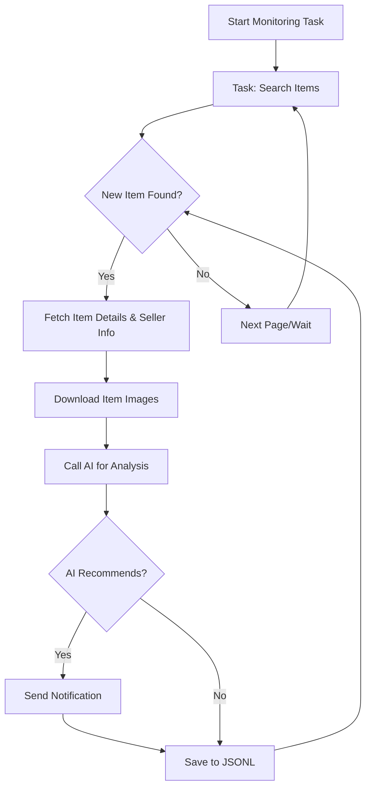

# AI-Powered Goofish Monitor: Your Smart Assistant for Secondhand Shopping

**Automatically monitor Xianyu (Goofish) for your desired items using AI, with a user-friendly web interface.**  [View the original repository on GitHub](https://github.com/dingyufei615/ai-goofish-monitor)

## Key Features

*   ✅ **Web UI for Easy Management:**  Visually manage tasks, edit AI analysis prompts, view real-time logs, and filter results – no command-line expertise required.
*   💬 **AI-Driven Task Creation:** Describe what you want in plain English, and the AI generates a monitoring task with complex filtering.
*   ⚙️ **Concurrent Multi-Tasking:** Monitor multiple keywords simultaneously via `config.json`, each running independently.
*   ⚡ **Real-time Processing:** Get instant analysis and notifications when new items appear, eliminating batch processing delays.
*   🧠 **Deep AI Analysis:** Leverage multimodal large language models (e.g., GPT-4o) to analyze item descriptions, images, and seller profiles for accurate filtering.
*   ⚙️ **Highly Customizable:** Configure keywords, price ranges, filtering criteria, and AI analysis prompts (instructions) for each task.
*   🔔 **Instant Notifications:** Receive alerts via [ntfy.sh](https://ntfy.sh/), WeChat Work group bots, and [Bark](https://bark.day.app/) directly to your phone or desktop.
*   📅 **Scheduled Task Execution:** Use cron expressions to schedule tasks for automated monitoring.
*   🐳 **Docker for Easy Deployment:**  Deploy quickly and consistently with the provided `docker-compose` configuration.
*   🛡️ **Robust Anti-Scraping Measures:** Emulates human behavior with random delays and actions for enhanced stability and reliability.

## Screenshots

**Task Management Dashboard**


**Monitoring in Progress**


**Notification Example**


## Quick Start (Web UI Recommended)

The Web UI offers the best user experience; it's highly recommended.

### Step 1: Environment Setup

> ⚠️ **Python Version:**  Python 3.10 or higher is recommended for local deployment. Lower versions may cause dependency installation issues (e.g., `ModuleNotFoundError: No module named 'PIL'`).

1.  Clone the project:

    ```bash
    git clone https://github.com/dingyufei615/ai-goofish-monitor
    cd ai-goofish-monitor
    ```

2.  Install dependencies:

    ```bash
    pip install -r requirements.txt
    ```

### Step 2: Configuration

1.  **Configure Environment Variables:** Copy `.env.example` to `.env` and modify the settings.

    *   **Windows:**

        ```cmd
        copy .env.example .env
        ```

    *   **Linux/MacOS:**

        ```bash
        cp .env.example .env
        ```

    Environment Variables:

    | Variable              | Description                                                  | Required | Notes                                                                                                                                   |
    | :-------------------- | :----------------------------------------------------------- | :------- | :-------------------------------------------------------------------------------------------------------------------------------------- |
    | `OPENAI_API_KEY`      | Your AI model provider's API key.                            | Yes      | May be optional for local or specific proxy services.                                                                                     |
    | `OPENAI_BASE_URL`     | AI model API endpoint (must be OpenAI compatible).           | Yes      |  e.g., `https://ark.cn-beijing.volces.com/api/v3/` |
    | `OPENAI_MODEL_NAME`   | The specific model to use (must support image analysis).     | Yes      |  e.g., `doubao-seed-1-6-250615`, `gemini-2.5-pro`                                                                                           |
    | `PROXY_URL`           | (Optional) HTTP/S proxy for bypassing geo-restrictions.     | No       | Supports `http://` and `socks5://` formats (e.g., `http://127.0.0.1:7890`).                                                               |
    | `NTFY_TOPIC_URL`      | (Optional) [ntfy.sh](https://ntfy.sh/) topic URL for notifications. | No      |  Leave empty to disable ntfy notifications.                                                                                        |
    | `GOTIFY_URL`          | (Optional) Gotify service address.                           | No       |  e.g., `https://push.example.de`                                                                                                       |
    | `GOTIFY_TOKEN`        | (Optional) Gotify application token.                         | No       |                                                                                                                                         |
    | `BARK_URL`            | (Optional) [Bark](https://bark.day.app/) push address.         | No       | e.g., `https://api.day.app/your_key`. Leave empty to disable Bark notifications.                                                                     |
    | `WX_BOT_URL`          | (Optional) WeChat Work group bot webhook URL.                | No       | Surround URLs with double quotes in `.env`.                                                                                     |
    | `WEBHOOK_URL`         | (Optional) General Webhook URL.                               | No       |                                                                                                                                         |
    | `WEBHOOK_METHOD`      | (Optional) Webhook request method (GET or POST, default POST). | No       |                                                                                                                                         |
    | `WEBHOOK_HEADERS`     | (Optional) Custom Webhook request headers (JSON).            | No       |                                                                                                                                         |
    | `WEBHOOK_CONTENT_TYPE`| (Optional) POST request content type (JSON or FORM, default JSON). | No       |                                                                                                                                         |
    | `WEBHOOK_QUERY_PARAMETERS`| (Optional) GET request query parameters (JSON).               | No       |                                                                                                                                         |
    | `WEBHOOK_BODY`        | (Optional) POST request body (JSON).                         | No       |                                                                                                                                         |
    | `LOGIN_IS_EDGE`       | Use Edge browser for login and scraping (default Chrome/Chromium). | No      |                                                                                                                                         |
    | `PCURL_TO_MOBILE`     | Convert desktop item links to mobile links in notifications (default true). | No      |                                                                                                                                         |
    | `RUN_HEADLESS`        | Run the browser in headless mode (default true).             | No       |  Set to `false` for local debugging with CAPTCHAs. **Must be `true` for Docker deployment.**                                            |
    | `AI_DEBUG_MODE`       | Enable AI debugging mode (default false).                    | No       | Prints detailed AI request/response logs to the console.                                                                               |
    | `SKIP_AI_ANALYSIS`    | Skip AI analysis and send notifications directly (default false).| No       |                                                                                                                                         |
    | `ENABLE_THINKING`     | Enable the `enable_thinking` parameter.                       | No       |                                                                                                                                         |
    | `SERVER_PORT`         | Web UI service port (default 8000).                            | No       |                                                                                                                                         |
    | `WEB_USERNAME`        | Web UI login username (default admin).                       | No       |  **Change in production!**                                                                                                           |
    | `WEB_PASSWORD`        | Web UI login password (default admin123).                    | No       |  **Change to a strong password in production!**                                                                                                           |

    > 💡 **Debugging Tip:**  If you encounter 404 errors when configuring the AI API, first debug using an API from Alibaba Cloud or Volcano Engine to confirm basic functionality before testing other providers.

    > 🔐 **Security Alert:** The Web UI uses Basic Authentication.  Change the default username/password (`admin` / `admin123`) to strong credentials in production!

2.  **Get Login Status (Important!)**: The scraper requires a valid login credential. Use the Web UI for this (recommended):

    **Recommended: Update via Web UI**
    1.  Skip this step and proceed to Step 3 to start the web server.
    2.  Once the Web UI is running, navigate to **"System Settings"**.
    3.  Find "Login State File" and click **"Manual Update"**.
    4.  Follow the instructions in the pop-up:
        *   Install the [Xianyu Login State Extractor](https://chromewebstore.google.com/detail/xianyu-login-state-extrac/eidlpfjiodpigmfcahkmlenhppfklcoa) Chrome extension.
        *   Open and log in to the Xianyu website.
        *   Click the extension icon and then the "Extract Login State" button.
        *   Click the "Copy to Clipboard" button.
        *   Paste the copied content into the Web UI and save it.

    This method is convenient because it doesn't require running a program with a graphical interface on the server.

    **Alternative: Run the Login Script (if you have a local or desktop-enabled server)**

    ```bash
    python login.py
    ```

    This will open a browser window.  Use your **mobile Xianyu App to scan the QR code** to log in.  Upon success, the program closes, and a `xianyu_state.json` file is created.

### Step 3: Start the Web Service

Start the Web UI:

```bash
python web_server.py
```

### Step 4: Get Started

Open `http://127.0.0.1:8000` in your browser.

1.  In the **"Task Management"** section, click **"Create New Task"**.
2.  Describe your desired item in natural language (e.g., "Looking for a Sony A7M4 camera, 95% new or better, under 13,000 yuan, shutter count below 5000"), fill in the task name and keywords.
3.  Click Create, and the AI will generate complex analysis criteria.
4.  Back on the main screen, add a schedule or start the task.

## Docker Deployment (Recommended)

Docker enables fast, reliable, and consistent deployment.

### Step 1: Environment Preparation (Similar to Local)

1.  **Install Docker:** Ensure [Docker Engine](https://docs.docker.com/engine/install/) is installed.
2.  **Clone and Configure:**

    ```bash
    git clone https://github.com/dingyufei615/ai-goofish-monitor
    cd ai-goofish-monitor
    ```

3.  **Create `.env` File:** Create and populate the `.env` file in the project root as described in the **Quick Start** section.
4.  **Get Login Status (Essential!)**:  The Docker container needs the login status. *After* starting the container:

    1.  (On the host machine) Run `docker-compose up -d`.
    2.  Open `http://127.0.0.1:8000` in your browser.
    3.  Go to **"System Settings"**, and click **"Manual Update"**.
    4.  Follow the on-screen instructions to set the login state.

    > ℹ️ **Python Version:** The Docker deployment uses Python 3.11 specified in the Dockerfile, which eliminates local Python version compatibility concerns.

### Step 2: Run the Docker Container

The project includes `docker-compose.yaml`. Use `docker-compose` for easier management.

Run this in the project root:

```bash
docker-compose up --build -d
```

This starts the service in the background.  `docker-compose` uses the `.env` and `docker-compose.yaml` settings.

If you encounter network issues, troubleshoot or use a proxy.

> ⚠️ **OpenWrt Deployment Notes:**  If deploying on an OpenWrt router, you may have DNS resolution issues. This can happen because the default network created by Docker Compose might not inherit OpenWrt's DNS settings correctly. If you get `ERR_CONNECTION_REFUSED`, check your container network configuration and manually configure DNS or adjust network mode to ensure the container can access external networks.

### Step 3: Access and Manage

*   **Access Web UI:** Open `http://127.0.0.1:8000` in your browser.
*   **View Real-time Logs:** `docker-compose logs -f`
*   **Stop Container:** `docker-compose stop`
*   **Start Stopped Container:** `docker-compose start`
*   **Stop and Remove Container:** `docker-compose down`

## Web UI Feature Overview

*   **Task Management:**
    *   **AI Task Creation:** Use natural language to create monitoring tasks with AI analysis criteria.
    *   **Visual Editing and Control:** Modify task parameters directly in a table (keywords, price, schedules), and start/stop/delete individual tasks.
    *   **Scheduled Tasks:** Configure Cron expressions for automated, periodic runs.
*   **Result Viewing:**
    *   **Card View:** Clearly display items with images and key details.
    *   **Smart Filtering & Sorting:** Filter for AI-recommended items, sort by crawl time, posting time, and price.
    *   **Detailed Views:** Click to see full item details and AI analysis results in JSON format.
*   **Run Logs:**
    *   **Real-time Log Stream:** View detailed crawler logs in real-time for progress tracking and troubleshooting.
    *   **Log Management:** Supports auto-refresh, manual refresh, and clearing logs.
*   **System Settings:**
    *   **Status Checks:** Check crucial dependencies (.env, login status).
    *   **Prompt Editing:** Edit and save the AI analysis `prompt` files directly in the web interface to adjust AI logic.

## Workflow Diagram



## Web Interface Authentication

### Authentication Configuration

The Web interface uses Basic Authentication to ensure that only authorized users can access it and its APIs.

#### Configuration Method

Set authentication credentials in your `.env` file:

```bash
# Web Service Authentication Configuration
WEB_USERNAME=admin
WEB_PASSWORD=admin123
```

#### Default Credentials

If no credentials are set in your `.env` file, the system uses these defaults:

*   Username: `admin`
*   Password: `admin123`

**⚠️ Important: Change default passwords in production!**

#### Authentication Scope

*   **Requires Authentication:** All API endpoints, Web interface, and static resources
*   **Does not require authentication:** Health check endpoint (`/health`)

#### Usage

1.  **Browser Access:** The authentication dialog will appear when accessing the Web interface
2.  **API Calls:** Include Basic Authentication information in request headers
3.  **Frontend JavaScript:** Authentication is handled automatically; no modification required

#### Security Recommendations

1.  Change the default password to a strong password.
2.  Use HTTPS in production.
3.  Regularly change authentication credentials.
4.  Restrict IP address access through a firewall.

Refer to [AUTH_README.md](AUTH_README.md) for detailed configuration instructions.

## Frequently Asked Questions (FAQ)

Find answers to common questions about environment setup, AI configuration, anti-scraping, and more in our comprehensive FAQ:

👉 **[View the FAQ (FAQ.md)](FAQ.md)**

## Acknowledgements

This project builds upon the work of these valuable resources:

*   [superboyyy/xianyu_spider](https://github.com/superboyyy/xianyu_spider)
*   And the LinuxDo community, especially [@jooooody](https://linux.do/u/jooooody/summary)
*   Also ClaudeCode/ModelScope/Gemini and other models/tools

## Insights

The project's code is 90%+ AI-generated, even the pull requests in the issue list.

The danger of Vibe Coding is that if you do not engage heavily in project construction, you do not thoroughly review the AI-generated code, and you don't think about why the AI has written the code in a certain way, and you blindly pass test cases to verify that the functionality is available, this will only lead to the project becoming a black box.

Similarly, when using AI to code review AI-generated code, it is like using AI to verify whether another AI's answer is AI. The developers are now in a dilemma of self-proving. Therefore, AI can help in the analysis but should not be the arbiter of truth.

AI is versatile; it can help developers solve 99% of coding problems, and AI is also not versatile; every problem solved requires the developer to verify and think it over, and AI is an aid, and the content AI produces can only be an aid.

## ⚠️ Important Considerations

*   Please adhere to Xianyu's user agreements and robots.txt rules. Avoid excessive requests to prevent server strain or account restrictions.
*   This project is for learning and research purposes only. Do not use it for illegal activities.
*   This project is released under the [MIT License](LICENSE) and provided "as is," without warranty.
*   The project authors and contributors are not liable for any direct, indirect, incidental, or special damages arising from the use of this software.
*   See [DISCLAIMER.md](DISCLAIMER.md) for more details.

[](https://star-history.com/#dingyufei615/ai-goofish-monitor&Date)