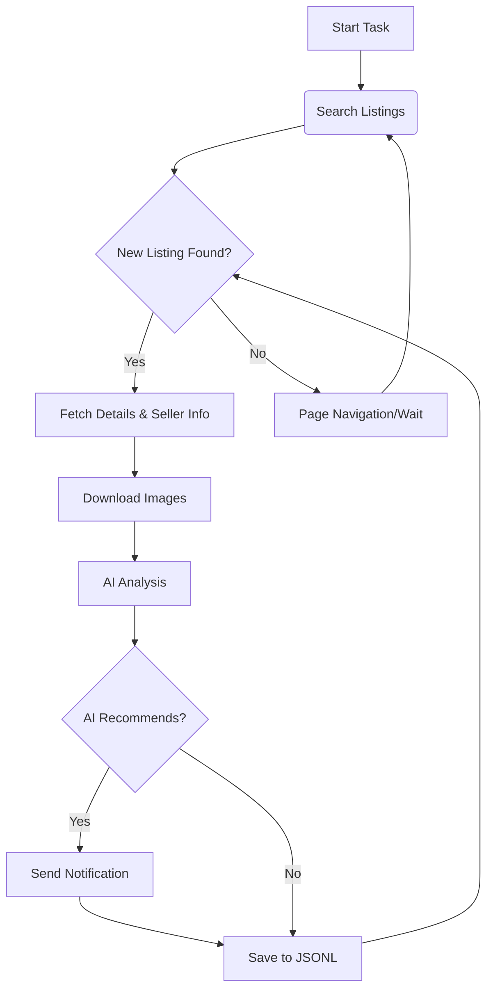

# AI-Powered Goofish Monitor: Effortlessly Track and Analyze Xianyu (闲鱼) Listings

Tired of missing out on great deals? This project is your personal Xianyu assistant, using AI to monitor, analyze, and notify you of the perfect items, all with a user-friendly web interface.  [Check out the original repo](https://github.com/dingyufei615/ai-goofish-monitor).

## Key Features:

*   ✅ **Intuitive Web UI:** Manage tasks, view real-time logs, and filter results with a comprehensive web interface - no command-line fuss.
*   🧠 **AI-Driven Task Creation:**  Describe your desired item in plain language, and let the AI generate complex filtering criteria.
*   🚀 **Concurrent Monitoring:**  Monitor multiple keywords simultaneously with independent tasks, defined via `config.json`.
*   ⚡️ **Real-time Processing:**  Receive immediate analysis and notifications upon new listing discoveries, eliminating delays.
*   🤖 **Deep AI Analysis:**  Utilizes multimodal LLMs (e.g., GPT-4o) to analyze text, images, and seller profiles for precise filtering.
*   ⚙️ **Highly Customizable:**  Configure individual keywords, price ranges, filtering rules, and AI analysis prompts for each task.
*   🔔 **Instant Notifications:**  Get notified via [ntfy.sh](https://ntfy.sh/), WeChat Work group bots, and [Bark](https://bark.day.app/).
*   📅 **Scheduled Tasks:**  Leverage cron expressions for automated, timed task execution.
*   🐳 **Docker Deployment:**  Simplified deployment with `docker-compose` for consistent and fast setup.
*   🛡️ **Robust Anti-Scraping:**  Employs realistic user behavior to bypass anti-bot measures and ensure stable operation.

## Visuals


## Getting Started:

### 1. Prerequisites:

*   **Python:** Python 3.10 or higher is recommended. Lower versions may cause installation issues.
*   **Install Dependencies:**
    ```bash
    git clone https://github.com/dingyufei615/ai-goofish-monitor
    cd ai-goofish-monitor
    pip install -r requirements.txt
    ```

### 2. Configuration:

1.  **Environment Variables:** Create a `.env` file (copy `.env.example` and rename it).  Key settings:

    | Variable             | Description                                            | Required | Notes                                                                                                                               |
    | :------------------- | :----------------------------------------------------- | :------- | :---------------------------------------------------------------------------------------------------------------------------------- |
    | `OPENAI_API_KEY`     | Your AI model API key.                                 | Yes      |                                                                                                                                     |
    | `OPENAI_BASE_URL`    | API endpoint (compatible with OpenAI).                | Yes      |                                                                                                                                     |
    | `OPENAI_MODEL_NAME`  | The specific multimodal model to use (e.g., `doubao-seed-1-6-250615`, `gemini-2.5-pro`). | Yes      | Choose a model that supports image analysis.                                                                                    |
    | `PROXY_URL`          | (Optional) HTTP/S proxy.                             | No       |  `http://` and `socks5://` formats.                                                                                                      |
    | ...                  | ...                                                    |          |                                                                                                                                     |

    > **Important:**  Make sure to configure the correct `OPENAI_MODEL_NAME`.  Test API connection with a service like AliCloud or Volcano Engine first for easier troubleshooting.
    >
    > **Security:**  Web UI uses Basic Auth. Default username/password: `admin` / `admin123`.  **Change these in production.**

2.  **Get Login State (Critical!):**  You need a valid Xianyu login session. The easiest method is through the Web UI:

    *   **Recommended: Web UI Method:**
        1.  Start the Web server (Step 3).
        2.  Go to the "System Settings" page in the UI.
        3.  Click "Manual Update" under "Login State File".
        4.  Follow the instructions in the popup:
            *   Install the Xianyu login state extraction extension in Chrome.
            *   Log in to Xianyu in Chrome.
            *   Use the extension to extract the login state.
            *   Paste into the Web UI and save.

    *   **Alternative: Login Script (if you have a desktop environment):**
        ```bash
        python login.py
        ```
        This will open a browser window. Scan the QR code with your Xianyu app. A `xianyu_state.json` file will be created.

### 3. Start the Web Server:

```bash
python web_server.py
```

### 4. Access the Web UI:

Open `http://127.0.0.1:8000` in your browser.  Follow the in-app prompts to create and manage monitoring tasks.

## 🐳 Docker Deployment (Recommended):

1.  **Prerequisites:** Docker Engine installed.
2.  **Clone and Configure:**

    ```bash
    git clone https://github.com/dingyufei615/ai-goofish-monitor
    cd ai-goofish-monitor
    ```
    *   Create and populate the `.env` file.
3.  **Get Login State (Crucial for Docker!):**  After starting the Docker container, use the Web UI method to set up login state. Run:

    1.  `docker-compose up -d`
    2.  Access `http://127.0.0.1:8000` in your browser.
    3.  Follow the Web UI instructions to add the login state, as described in step 2.

4.  **Run the Container:**

    ```bash
    docker-compose up --build -d
    ```

    *   Access the Web UI at `http://127.0.0.1:8000`.
    *   View logs: `docker-compose logs -f`.
    *   Stop: `docker-compose stop`.
    *   Start: `docker-compose start`.
    *   Stop and remove: `docker-compose down`.

## Web UI Feature Highlights:

*   **Task Management:** AI-powered task creation, visual editing, and scheduling.
*   **Results Viewing:**  Card-based display, smart filtering, and detailed AI analysis reports.
*   **Real-time Logging:** Monitor progress and troubleshoot issues.
*   **System Settings:** Configuration of environment variables, login status verification, and prompt editing.

## Workflow:



## Authentication:

Uses Basic Authentication for the Web UI.

*   Configure in `.env`:  `WEB_USERNAME=admin`,  `WEB_PASSWORD=admin123` (change these!).
*   Access the Web UI/API calls via authentication prompts/headers.
*   For security: Use strong passwords, HTTPS, and consider limiting access by IP address.

## FAQ:

Read a comprehensive FAQ at [FAQ.md](FAQ.md).

## Acknowledgements:

*   [superboyyy/xianyu_spider](https://github.com/superboyyy/xianyu_spider)
*   @jooooody (LinuxDo)
*   [LinuxDo](https://linux.do/) community
*   ClaudeCode/ModelScope/Gemini and other models/tools

## Important Notes & Disclaimer:

*   Adhere to Xianyu's terms of service and `robots.txt`.
*   For educational and technical research purposes only. Do not use for illegal activities.
*   Released under the [MIT License](LICENSE).
*   The author is not liable for any damages resulting from the use of this software.
*   See [DISCLAIMER.md](DISCLAIMER.md) for more details.

[](https://star-history.com/#dingyufei615/ai-goofish-monitor&Date)