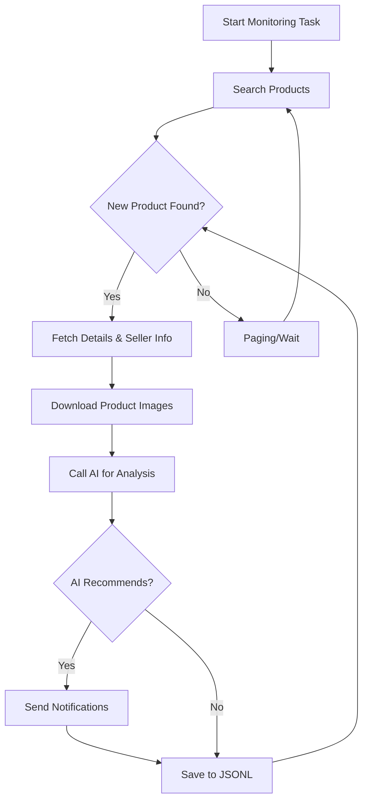

# AI-Powered Goofish (Xianyu) Monitor: Smartly Track and Analyze Second-Hand Goods

This project provides a powerful and intelligent monitoring tool for the Chinese second-hand goods platform Goofish (Xianyu), leveraging AI for advanced filtering and analysis, all accessible through a user-friendly web interface. ([Original Repo](https://github.com/dingyufei615/ai-goofish-monitor))

## Key Features

*   **Intuitive Web UI:** Manage tasks, edit AI criteria, view real-time logs, and filter results through a complete web interface.
*   **AI-Driven Task Creation:** Generate complex monitoring tasks effortlessly by describing your desired purchase using natural language.
*   **Concurrent Multi-Tasking:** Monitor multiple keywords simultaneously with independent tasks, preventing interference.
*   **Real-time Streaming Analysis:** Analyze new listings instantly, eliminating the delays of batch processing.
*   **Deep AI Analysis:** Integrate multimodal large language models (like GPT-4o) to deeply analyze product images, descriptions, and seller profiles for superior filtering.
*   **Highly Customizable:** Configure unique keywords, price ranges, filters, and AI analysis prompts (Prompts) for each monitoring task.
*   **Instant Notifications:** Receive immediate alerts on your phone or desktop via [ntfy.sh](https://ntfy.sh/), WeChat Work Group Bot, and [Bark](https://bark.day.app/).
*   **Scheduled Task Execution:** Schedule tasks using Cron expressions for automated, periodic monitoring.
*   **Dockerized Deployment:** Easily deploy and run the application with Docker Compose for fast, standardized containerization.
*   **Robust Anti-Scraping:** Mimics human behavior with random delays and user interactions for enhanced stability.

## Getting Started

### 1. Prerequisites

*   **Python:** Python 3.10 or higher is recommended.
*   **Install Dependencies:**

    ```bash
    git clone https://github.com/dingyufei615/ai-goofish-monitor
    cd ai-goofish-monitor
    pip install -r requirements.txt
    ```

### 2. Configuration

*   **`.env` File:** Create a `.env` file from `.env.example` and configure the following variables:

    | Variable            | Description                                    | Required | Notes                                                                                                                                                                                                                                                        |
    | ------------------- | ---------------------------------------------- | -------- | -------------------------------------------------------------------------------------------------------------------------------------------------------------------------------------------------------------------------------------------------------------- |
    | `OPENAI_API_KEY`    | Your AI model provider's API key.             | Yes      |                                                                                                                                                                                                                                                              |
    | `OPENAI_BASE_URL`   | AI Model API endpoint (OpenAI compatible).    | Yes      |                                                                                                                                                                                                                                                              |
    | `OPENAI_MODEL_NAME` | The specific model you want to use.            | Yes      | **Must** select a multimodal model that supports image analysis (e.g., `doubao-seed-1-6-250615`, `gemini-2.5-pro`).                                                                                                                                   |
    | `PROXY_URL`         | (Optional) HTTP/S proxy for bypassing censorship. | No       | Supports `http://` and `socks5://` formats.                                                                                                                                                                                                               |
    | `NTFY_TOPIC_URL`    | (Optional) ntfy.sh topic URL for notifications. | No       |                                                                                                                                                                                                                                                              |
    | ...                 | Other notification and configuration settings |          | See original README for full details.                                                                                                                                                                                                                            |

*   **Login Status:**  The crawler needs valid login credentials.  **The Web UI is the recommended method**:

    1.  Run web_server.py (step 3).
    2.  Navigate to "System Settings" in the UI.
    3.  Click "Manually Update" for login state.
    4.  Follow the instructions to install the browser extension.
    5.  Login to Xianyu, extract the login state using the extension, and paste it in the Web UI.
    6.  Save to start monitoring

    *Alternative method (for local debugging):*
    ```bash
    python login.py
    ```
    Use your mobile app to scan the QR code, and a `xianyu_state.json` file will be created.

### 3. Launch the Web Server

```bash
python web_server.py
```

### 4. Start Monitoring

1.  Open your browser at `http://127.0.0.1:8000`.
2.  Go to "Task Management" and click "Create New Task."
3.  Describe your desired product in natural language.
4.  The AI will generate an analysis criteria.
5.  Configure timers and enable your task.

## 🐳 Docker Deployment (Recommended)

Simplify deployment with Docker Compose:

### 1. Prerequisites

*   Install [Docker Engine](https://docs.docker.com/engine/install/).
*   Clone the project and configure `.env`.  *The Web UI is still recommended for setting login status.*
*   Start the service and then setup login details via the Web UI (as above).

### 2. Run Docker Containers

```bash
docker-compose up --build -d
```

### 3. Access and Manage

*   **Web UI:**  `http://127.0.0.1:8000`
*   **Logs:** `docker-compose logs -f`
*   **Stop:** `docker-compose stop`
*   **Start:** `docker-compose start`
*   **Remove:** `docker-compose down`

## Core Workflow



## 🔑 Web Interface Authentication

The Web UI uses Basic Authentication:  Set the username and password in the `.env` file. (Default: `admin`/`admin123`; **Change in production!**)

## Troubleshooting

*   See [FAQ.md](FAQ.md) for detailed answers to common issues.

## Acknowledgements

*   [superboyyy/xianyu_spider](https://github.com/superboyyy/xianyu_spider)
*   LinuxDo community members
*   AI models and tools (ClaudeCode, ModelScope, Gemini, etc.)

## Important Notes

*   Comply with Xianyu's user agreement and `robots.txt`.
*   Use this project for learning and research purposes only.
*   Released under the [MIT License](LICENSE).
*   See [DISCLAIMER.md](DISCLAIMER.md) for liability disclaimers.

[](https://star-history.com/#dingyufei615/ai-goofish-monitor&Date)