# AI-Powered Xianyu (Goofish) Monitor: Real-time, Intelligent, and Automated 

**Tired of missing out on great deals? This project uses AI to automatically monitor Xianyu (Goofish), analyze listings, and notify you of the perfect finds.** [View the original repository](https://github.com/dingyufei615/ai-goofish-monitor)

## Key Features:

*   ✅ **User-Friendly Web UI:** Manage tasks, edit AI criteria, view logs, and filter results with an intuitive web interface.
*   🤖 **AI-Driven Task Creation:** Describe your ideal purchase in natural language, and let AI create the monitoring task.
*   🔄 **Concurrent Multi-Tasking:** Monitor multiple keywords simultaneously, each running independently.
*   ⏱️ **Real-time Processing:** Analyze new listings instantly, eliminating delays.
*   🧠 **Deep AI Analysis:** Leverage multimodal large language models (like GPT-4o) to analyze images, text, and seller profiles for accurate filtering.
*   ⚙️ **Highly Customizable:** Tailor each task with specific keywords, price ranges, filters, and AI analysis prompts.
*   🔔 **Instant Notifications:** Receive alerts via [ntfy.sh](https://ntfy.sh/), WeChat group bots, and [Bark](https://bark.day.app/) for immediate updates.
*   📅 **Scheduled Tasks:** Utilize Cron expressions for automated, recurring monitoring.
*   🐳 **Docker Deployment:** Simplify setup and ensure consistent execution with a pre-configured `docker-compose` setup.
*   🛡️ **Robust Anti-Scraping:** Mimics human behavior with random delays and user actions to enhance stability and bypass anti-bot measures.

## Key Screenshots

### Task Management


### Monitoring


### Notifications


## 🚀 Quick Start (Web UI Recommended)

The Web UI provides the best experience for managing and using this project.

### Step 1: Environment Setup

> ⚠️ **Python Version Requirement:** Python 3.10 or higher is recommended for local deployment and debugging. Lower versions might cause dependency installation failures or runtime errors (e.g., `ModuleNotFoundError: No module named 'PIL'`).

1.  Clone the project:

    ```bash
    git clone https://github.com/dingyufei615/ai-goofish-monitor
    cd ai-goofish-monitor
    ```

2.  Install dependencies:

    ```bash
    pip install -r requirements.txt
    ```

### Step 2: Configuration

1.  **Configure Environment Variables:** Copy `.env.example` to `.env` and modify the values.

    For Windows:

    ```cmd
    copy .env.example .env
    ```

    For Linux/MacOS:

    ```shell
    cp .env.example .env
    ```

    Here's a table of available environment variables:

    | Variable           | Description                                      | Required | Notes                                                                                                                                                  |
    | :----------------- | :----------------------------------------------- | :------- | :----------------------------------------------------------------------------------------------------------------------------------------------------- |
    | `OPENAI_API_KEY`   | Your AI model provider's API Key.               | Yes      | This might be optional for some local or proxy services.                                                                                               |
    | `OPENAI_BASE_URL`  | API endpoint for your AI model, OpenAI-compatible. | Yes      | Enter the base URL for the API, for example `https://ark.cn-beijing.volces.com/api/v3/`.                                                            |
    | `OPENAI_MODEL_NAME`| The specific model name you want to use.        | Yes      | **Required** Choose a multimodal model that supports image analysis, such as `doubao-seed-1-6-250615`, `gemini-2.5-pro`, etc.                         |
    | `PROXY_URL`        | (Optional) HTTP/S proxy for bypassing censorship.         | No       | Supports `http://` and `socks5://` formats.  For example `http://127.0.0.1:7890`.                                                                      |
    | `NTFY_TOPIC_URL`   | (Optional) [ntfy.sh](https://ntfy.sh/) topic URL.     | No       | If left blank, ntfy notifications will be disabled.                                                                                                 |
    | `GOTIFY_URL`       | (Optional) Gotify service address.               | No       | For example, `https://push.example.de`.                                                                                                            |
    | `GOTIFY_TOKEN`     | (Optional) Gotify application token.            | No       |                                                                                                                                                        |
    | `BARK_URL`         | (Optional) [Bark](https://bark.day.app/) push address.             | No       | For example, `https://api.day.app/your_key`. If left blank, Bark notifications will not be sent.                                                     |
    | `WX_BOT_URL`       | (Optional) WeChat Group Bot Webhook.            | No       | If left blank, WeChat notifications will be disabled.  Note: When configuring this in the `.env` file, enclose the URL in double quotes to ensure it works correctly. |
    | `WEBHOOK_URL`      | (Optional) Generic Webhook URL.                 | No       | If left blank, generic Webhook notifications will be disabled.                                                                                            |
    | `WEBHOOK_METHOD`   | (Optional) Webhook request method.              | No       | Supports `GET` or `POST`, defaults to `POST`.                                                                                                        |
    | `WEBHOOK_HEADERS`  | (Optional) Custom headers for Webhook.          | No       | Must be a valid JSON string, for example `'{"Authorization": "Bearer xxx"}'`.                                                                    |
    | `WEBHOOK_CONTENT_TYPE` | (Optional) Content type for POST requests.  | No       | Supports `JSON` or `FORM`, defaults to `JSON`.                                                                                                      |
    | `WEBHOOK_QUERY_PARAMETERS` | (Optional) Query parameters for GET requests. | No | JSON string, supports `{{title}}` and `{{content}}` placeholders. |
    | `WEBHOOK_BODY` | (Optional) Request body for POST requests. | No | JSON string, supports `{{title}}` and `{{content}}` placeholders. |
    | `LOGIN_IS_EDGE`    | Use Edge browser for login and scraping.        | No       | Defaults to `false`, uses Chrome/Chromium.                                                                                                          |
    | `PCURL_TO_MOBILE`  | Convert PC product links to mobile version in notifications.     | No       | Defaults to `true`.                                                                                                                              |
    | `RUN_HEADLESS`     | Run the browser in headless mode.               | No       | Defaults to `true`. Set to `false` for manual CAPTCHA handling during local debugging. **Must be `true` for Docker deployment.**                      |
    | `AI_DEBUG_MODE`    | Enable AI debug mode.                             | No       | Defaults to `false`.  Prints detailed AI request and response logs to the console.                                                                     |
    | `SKIP_AI_ANALYSIS` | Skip AI analysis and send notifications directly. | No       | Defaults to `false`.  When set to `true`, all scraped products will be notified without AI analysis.                                                 |
    | `ENABLE_THINKING`  | Whether to enable the `enable_thinking` parameter. | No       | Defaults to `false`. Some AI models require this parameter, while others do not.  If you encounter an "Invalid JSON payload received. Unknown name "enable_thinking"" error, try setting it to `false`. |
    | `SERVER_PORT`      | Web UI server port.                             | No       | Defaults to `8000`.                                                                                                                                     |
    | `WEB_USERNAME`     | Web UI login username.                          | No       | Defaults to `admin`.  **Important: Change this in production.**                                                                                         |
    | `WEB_PASSWORD`     | Web UI login password.                          | No       | Defaults to `admin123`.  **Important: Change this to a strong password in production.**                                                                     |

    > 💡 **Debugging Tip:** If you encounter 404 errors when configuring your AI API, it is recommended to first test with an API provided by Alibaba Cloud or Volcano Engine. Some API providers might have compatibility issues or require special configurations.

    > 🔐 **Security Reminder:** The Web UI uses Basic authentication. The default username and password are `admin` / `admin123`. **Change these to strong credentials in production!**

2.  **Get Login Status (Important!)**: The scraper needs a valid login credential to access Xianyu.  We recommend using the Web UI to get this:

    **Recommended: Update Login State via Web UI**
    1.  Skip this step and start the web server in Step 3.
    2.  Open the Web UI and go to the **"System Settings"** page.
    3.  Find "Login Status File" and click the **"Manual Update"** button.
    4.  Follow the instructions in the pop-up window:
        - Install the [Xianyu login state extraction extension](https://chromewebstore.google.com/detail/xianyu-login-state-extrac/eidlpfjiodpigmfcahkmlenhppfklcoa) in Chrome.
        - Open the Xianyu website and log in.
        - After successful login, click the extension icon in the browser toolbar.
        - Click the "Extract Login State" button to get the login information.
        - Click the "Copy to Clipboard" button.
        - Paste the copied content into the Web UI and save.

    This method is the most convenient as it doesn't require running a graphical program on the server.

    **Alternative: Run Login Script**
    If you can run a program locally or on a server with a desktop environment, you can also use the traditional script:

    ```bash
    python login.py
    ```

    This will open a browser window. **Use the Xianyu App on your phone to scan the QR code and complete the login.** The program will close automatically, and a `xianyu_state.json` file will be generated in the project root directory.

### Step 3: Start the Web Server

Once everything is set up, start the Web UI server:

```bash
python web_server.py
```

### Step 4: Start Monitoring

1.  Open your browser and go to `http://127.0.0.1:8000`.
2.  In the **"Task Management"** page, click **"Create New Task"**.
3.  In the pop-up window, describe your purchase requirements in natural language (e.g., "I want to buy a used Sony A7M4 camera, mint condition, budget under $1500, shutter count below 5000"), and fill in task details, including the keyword.
4.  Click "Create".  The AI will generate the task and analysis criteria.
5.  Return to the main interface and start or schedule the task to begin automated monitoring!

## 🐳 Docker Deployment (Recommended)

Docker simplifies deployment.

### Step 1: Environment Setup (Similar to Local Deployment)

1.  **Install Docker:** Ensure you have [Docker Engine](https://docs.docker.com/engine/install/) installed.

2.  **Clone the project and configure:**

    ```bash
    git clone https://github.com/dingyufei615/ai-goofish-monitor
    cd ai-goofish-monitor
    ```

3.  **Create the `.env` file:**  Follow the instructions in the **[Quick Start](#-快速开始-web-ui-推荐)** section and create and configure the `.env` file in the project root.

4.  **Get Login Status (Key Step!)**: You can't scan the QR code for login inside the Docker container. You **MUST** set the login status via the Web UI **AFTER** starting the container:
    1.  (On the host machine) Run `docker-compose up -d` to start the service.
    2.  Open the Web UI in your browser `http://127.0.0.1:8000`.
    3.  Go to the **"System Settings"** page and click the **"Manual Update"** button.
    4.  Follow the instructions in the pop-up window:
        - Install the [Xianyu login state extraction extension](https://chromewebstore.google.com/detail/xianyu-login-state-extrac/eidlpfjiodpigmfcahkmlenhppfklcoa) in Chrome.
        - Open the Xianyu website and log in.
        - After successful login, click the extension icon in the browser toolbar.
        - Click the "Extract Login State" button to get the login information.
        - Click the "Copy to Clipboard" button.
        - Paste the copied content into the Web UI and save.

> ℹ️ **About Python Version:** Docker uses Python 3.11, as specified in the Dockerfile, so you don't need to worry about local Python compatibility issues.

### Step 2: Run the Docker Container

The project includes `docker-compose.yaml`. We recommend using `docker-compose` to manage the container.

Run this command in the project root to start the container:

```bash
docker-compose up --build -d
```

This starts the service in the background.  `docker-compose` will read the `.env` file and `docker-compose.yaml` to create and start the container.

If the container has network issues, troubleshoot your network or use a proxy.

> ⚠️ **OpenWrt Deployment Notes:** When deploying on OpenWrt routers, you might encounter DNS resolution problems because the default network created by Docker Compose might not correctly inherit OpenWrt's DNS settings. If you encounter an `ERR_CONNECTION_REFUSED` error, check your container network configuration, and consider manually configuring DNS or adjusting network modes to ensure the container can access the external network.

### Step 3: Access and Manage

-   **Access the Web UI:** Open `http://127.0.0.1:8000` in your browser.
-   **View Real-time Logs:** `docker-compose logs -f`
-   **Stop the Container:** `docker-compose stop`
-   **Start a Stopped Container:** `docker-compose start`
-   **Stop and Remove Container:** `docker-compose down`

## 📸 Web UI Features Overview

-   **Task Management:**
    -   **AI-Powered Task Creation:** Generate monitoring tasks and AI analysis criteria by describing your needs in natural language.
    -   **Visual Editing & Control:** Directly modify task parameters (keywords, prices, scheduling, etc.) in a table, and start/stop/delete tasks individually.
    -   **Scheduled Tasks:** Configure Cron expressions for automated, periodic task execution.
-   **Results Viewing:**
    -   **Card View Browsing:** Displays each qualifying product clearly in a card-style format, with images and details.
    -   **Smart Filtering & Sorting:** Quickly filter for AI-recommended products and sort by crawl time, publication time, price, and more.
    -   **Deep Details:** Click to view the full scraped data and detailed AI analysis results in JSON format for each product.
-   **Running Logs:**
    -   **Real-Time Log Stream:** View detailed crawler logs in real-time on the webpage to track progress and troubleshoot issues.
    -   **Log Management:** Supports auto-refresh, manual refresh, and one-click log clearing.
-   **System Settings:**
    -   **Status Check:** Check key dependencies like the `.env` configuration and login status at a glance.
    -   **Prompt Editing:** Edit and save the `prompt` file used for AI analysis directly on the webpage, and adjust the AI's logic in real-time.

## 🚀 Workflow

The diagram below shows the core process of a single monitoring task.  `web_server.py` is the main service, starting these tasks based on user actions or schedules.

```mermaid
graph TD
    A[启动监控任务] --> B[任务: 搜索商品];
    B --> C{发现新商品?};
    C -- 是 --> D[抓取商品详情 & 卖家信息];
    D --> E[下载商品图片];
    E --> F[调用AI进行分析];
    F --> G{AI是否推荐?};
    G -- 是 --> H[发送通知];
    H --> I[保存记录到 JSONL];
    G -- 否 --> I;
    C -- 否 --> J[翻页/等待];
    J --> B;
    I --> C;
```



## 🔐 Web UI Authentication

### Authentication Configuration

The Web UI uses Basic authentication to restrict access.

#### Configuration Method

Set your credentials in the `.env` file:

```bash
# Web service authentication configuration
WEB_USERNAME=admin
WEB_PASSWORD=admin123
```

#### Default Credentials

If you don't set credentials in `.env`, these defaults are used:

-   Username: `admin`
-   Password: `admin123`

**⚠️ IMPORTANT: Change the default password in production!**

#### Authentication Scope

-   **Requires Authentication:** All API endpoints, the Web UI, and static resources.
-   **No Authentication Required:** Health check endpoint (`/health`).

#### Usage

1.  **Browser Access:** The browser will prompt for authentication when accessing the Web UI.
2.  **API Calls:** Include Basic authentication headers in your requests.
3.  **Frontend JavaScript:** Automatically handles authentication, no modifications needed.

#### Security Recommendations

1.  Change the default password to a strong password.
2.  Use HTTPS in production.
3.  Change authentication credentials periodically.
4.  Restrict access to the IP range via firewall.

For detailed configuration instructions, see [AUTH_README.md](AUTH_README.md).

## Frequently Asked Questions (FAQ)

We've compiled a detailed FAQ, covering environment setup, AI configuration, and anti-scraping strategies.

👉 **[Click here to view the FAQ (FAQ.md)](FAQ.md)**

## Acknowledgements

This project was inspired by these projects:

-   [superboyyy/xianyu_spider](https://github.com/superboyyy/xianyu_spider)

And thanks to contributions from the LinuxDo community:

-   [@jooooody](https://linux.do/u/jooooody/summary)

And also, thanks to ClaudeCode/ModelScope/Gemini and other models/tools, freeing hands and experiencing the joy of Vibe Coding.

## Experience

90%+ of the code for this project was generated by AI, including PRs mentioned in the ISSUES.

The scary part of Vibe Coding is that if you don't participate much in the project's construction, do not review the AI generated code carefully, and don't think about why AI writes like that, blindly running test cases to verify functionality will only cause the project to become a black box.

Similarly, when using AI to conduct a code review on the AI-generated code, it's like using AI to verify whether the answer from another AI is AI, falling into a self-proving dilemma, so AI can assist in analysis, but it should not become the arbitrator of the truth.

AI is all-powerful, and can help developers solve 99% of the coding problems, AI is also not omnipotent, every problem solved needs developers to verify and think about, AI is an assistant, and the content produced by AI can only be an assistant.

## ⚠️ Important Notes

-   Please adhere to Xianyu's user agreement and `robots.txt` rules, and avoid excessive requests to prevent server strain or account restrictions.
-   This project is for educational and technical research purposes only. Do not use it for illegal purposes.
-   This project is released under the [MIT License](LICENSE) and is provided "as is" without any warranties.
-   The project author and contributors are not responsible for any direct, indirect, incidental, or special damages or losses resulting from the use of this software.
-   For more information, please refer to the [DISCLAIMER.md](DISCLAIMER.md) file.

[](https://star-history.com/#dingyufei615/ai-goofish-monitor&Date)