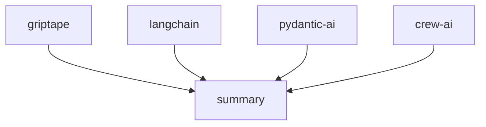

[](https://pypi.python.org/pypi/griptape)
[](https://github.com/griptape-ai/griptape/actions/workflows/unit-tests.yml)
[](https://griptape.readthedocs.io/)
[](https://microsoft.github.io/pyright/)
[](https://github.com/astral-sh/ruff)
[](https://codecov.io/github/griptape-ai/griptape)
[](https://discord.gg/griptape)

# Griptape: Build Powerful GenAI Applications with Ease

**Griptape is a Python framework that empowers developers to build robust and scalable generative AI applications with ease.**

## Key Features

*   **Modular Architecture:** Build applications using core components like Agents, Pipelines, and Workflows.
*   **Versatile Drivers:** Integrate with various LLMs, web services, databases, and more through a comprehensive suite of drivers.
*   **Intelligent Memory:** Leverage Conversation Memory, Task Memory, and Meta Memory for context-aware interactions.
*   **Extensible Tools:** Utilize built-in tools and easily create custom tools to connect with data and services.
*   **RAG Engine:** Implement Retrieval Augmented Generation (RAG) pipelines for enhanced accuracy and relevance.
*   **Additional Components:** Utilize Rulesets, Loaders, Artifacts, Chunkers, and Tokenizers.

## Core Components

### Structures

*   **Agents:** Single-task structures designed for agent-specific behavior.
*   **Pipelines:** Organize tasks sequentially for data flow.
*   **Workflows:** Execute tasks in parallel.

### Tasks

The fundamental building blocks for interacting with Engines, Tools, and other Griptape components.

### Memory

*   **Conversation Memory:** Retains and retrieves information across interactions.
*   **Task Memory:** Stores large outputs off the prompt.
*   **Meta Memory:** Passes additional metadata to the LLM.

### Drivers

Facilitate interaction with external resources and services:

*   **LLM & Orchestration:** Prompt Drivers, Assistant Drivers, Ruleset Drivers, Conversation Memory Drivers, Event Listener Drivers, Structure Run Drivers.
*   **Retrieval & Storage:** Embedding Drivers, Rerank Drivers, Vector Store Drivers, File Manager Drivers, SQL Drivers.
*   **Multimodal:** Image Generation Drivers, Text to Speech Drivers, Audio Transcription Drivers.
*   **Web:** Web Search Drivers, Web Scraper Drivers.
*   **Observability:** Observability Drivers.

### Tools

Provide capabilities for LLMs to interact with data and services. Explore [built-in Tools](https://docs.griptape.ai/stable/griptape-framework/tools/official-tools/) and learn to create [custom Tools](https://docs.griptape.ai/stable/griptape-framework/tools/custom-tools/).

### Engines

Engines wrap Drivers for use-case-specific functionality:

*   **RAG Engine:** For implementing Retrieval Augmented Generation (RAG) pipelines.
*   **Extraction Engine:** Extracts JSON or CSV data.
*   **Summary Engine:** Generates summaries.
*   **Eval Engine:** Evaluates generated text.

### Additional Components

*   **Rulesets:** Steer LLM behavior.
*   **Loaders:** Load data from various sources.
*   **Artifacts:** Pass data between components.
*   **Chunkers:** Segment texts.
*   **Tokenizers:** Count tokens.

## Examples

### Hello World

```python
from griptape.drivers.prompt.openai import OpenAiChatPromptDriver
from griptape.rules import Rule
from griptape.tasks import PromptTask

task = PromptTask(
    prompt_driver=OpenAiChatPromptDriver(model="gpt-4.1"),
    rules=[Rule("Keep your answer to a few sentences.")],
)

result = task.run("How do I do a kickflip?")

print(result.value)
```

### Task and Workflow Example

```python
from griptape.drivers.prompt.openai_chat_prompt_driver import OpenAiChatPromptDriver
from griptape.drivers.web_search.duck_duck_go import DuckDuckGoWebSearchDriver
from griptape.rules import Rule, Ruleset
from griptape.structures import Workflow
from griptape.tasks import PromptTask, TextSummaryTask
from griptape.tools import WebScraperTool, WebSearchTool
from griptape.utils import StructureVisualizer
from pydantic import BaseModel


class Feature(BaseModel):
    name: str
    description: str
    emoji: str


class Output(BaseModel):
    answer: str
    key_features: list[Feature]


projects = ["griptape", "langchain", "crew-ai", "pydantic-ai"]

prompt_driver = OpenAiChatPromptDriver(model="gpt-4.1")
workflow = Workflow(
    tasks=[
        [
            PromptTask(
                id=f"project-{project}",
                input="Tell me about the open source project: {{ project }}.",
                prompt_driver=prompt_driver,
                context={"project": projects},
                output_schema=Output,
                tools=[
                    WebSearchTool(
                        web_search_driver=DuckDuckGoWebSearchDriver(),
                    ),
                    WebScraperTool(),
                ],
                child_ids=["summary"],
            )
            for project in projects
        ],
        TextSummaryTask(
            input="{{ parents_output_text }}",
            id="summary",
            rulesets=[
                Ruleset(
                    name="Format", rules=[Rule("Be detailed."), Rule("Include emojis.")]
                )
            ],
        ),
    ]
)

workflow.run()

print(StructureVisualizer(workflow).to_url())
```



## Documentation

Detailed documentation, including installation and usage instructions, can be found at the [Griptape Docs](https://docs.griptape.ai/).

Explore [Griptape Trade School](https://learn.griptape.ai/) for free online courses.

## Versioning

Griptape uses [Semantic Versioning](https://semver.org/).

## Contributing

We welcome contributions! Please review our [Contributing Guidelines](https://github.com/griptape-ai/griptape/blob/main/CONTRIBUTING.md) before contributing.

## License

Griptape is licensed under the Apache 2.0 License.

[View the original repository on GitHub](https://github.com/griptape-ai/griptape)