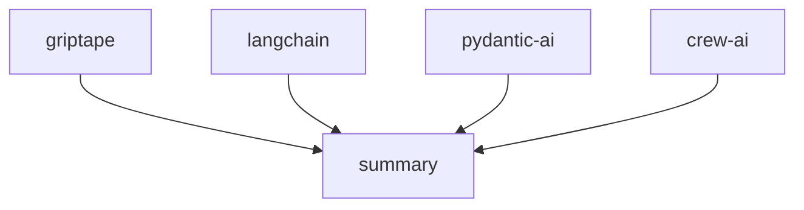

[](https://pypi.python.org/pypi/griptape)
[](https://github.com/griptape-ai/griptape/actions/workflows/unit-tests.yml)
[](https://griptape.readthedocs.io/)
[](https://microsoft.github.io/pyright/)
[](https://github.com/astral-sh/ruff)
[](https://codecov.io/github/griptape-ai/griptape)
[](https://discord.gg/griptape)

## Griptape: Build Powerful Generative AI Applications with Ease

Griptape is a Python framework that simplifies developing robust and modular applications powered by Large Language Models (LLMs). ([View the original repository](https://github.com/griptape-ai/griptape))

### Key Features

*   **Modular Structures:** Organize your AI workflows with Agents, Pipelines, and Workflows for flexible task management.
*   **Versatile Tasks:** Core building blocks for interacting with Engines, Tools, and other Griptape components.
*   **Intelligent Memory:** Utilize Conversation Memory, Task Memory, and Meta Memory to enhance LLM interactions.
*   **Extensive Driver Support:**
    *   **LLM & Orchestration Drivers:** Manage prompts, assistants, rulesets, and conversational data.
    *   **Retrieval & Storage Drivers:** Handle embeddings, reranking, vector stores, file management, and SQL interactions.
    *   **Multimodal Drivers:** Generate images, convert text to speech, and transcribe audio.
    *   **Web Drivers:** Search the web and scrape data from web pages.
    *   **Observability Drivers:** Send trace and event data to observability platforms.
*   **Customizable Tools:** Integrate external data and services with built-in and custom tools.
*   **Specialized Engines:** Implement RAG pipelines, extract data, generate summaries, and evaluate text quality with ease.
*   **Additional Components:** Leverage rulesets, loaders, artifacts, chunkers, and tokenizers to optimize your AI applications.

### Core Components

#### Structures
*   **Agents:** Individual tasks tailored for specific agent behavior.
*   **Pipelines:** Sequential task organization.
*   **Workflows:** Concurrent task execution.

#### Tasks

Tasks are the fundamental building blocks within Griptape structures, enabling interaction with various components like Engines and Tools.

#### Memory

*   **Conversation Memory:** Stores and retrieves information across interactions.
*   **Task Memory:** Manages large outputs, keeping them off the LLM prompt.
*   **Meta Memory:** Provides additional context to the LLM, improving relevance.

#### Drivers

Drivers provide flexible access to external resources and services.

##### LLM & Orchestration
*   **Prompt Drivers:** Manage textual and image interactions with LLMs.
*   **Assistant Drivers:** Enable interactions with various “assistant” services.
*   **Ruleset Drivers:** Load and apply rulesets from external sources.
*   **Conversation Memory Drivers:** Store and retrieve conversational data.
*   **Event Listener Drivers:** Forward framework events to external services.
*   **Structure Run Drivers:** Execute structures locally or in the cloud.

##### Retrieval & Storage
*   **Embedding Drivers:** Generate vector embeddings from textual inputs.
*   **Rerank Drivers:** Rerank search results for improved relevance.
*   **Vector Store Drivers:** Manage the storage and retrieval of embeddings.
*   **File Manager Drivers:** Handle file operations on local and remote storage.
*   **SQL Drivers:** Interact with SQL databases.

##### Multimodal
*   **Image Generation Drivers:** Create images from text descriptions.
*   **Text to Speech Drivers:** Convert text to speech.
*   **Audio Transcription Drivers:** Convert audio to text.

##### Web
*   **Web Search Drivers:** Search the web for information.
*   **Web Scraper Drivers:** Extract data from web pages.

##### Observability
*   **Observability Drivers:** Send trace and event data to observability platforms.

#### Tools

Tools enable LLMs to interact with data and services. Explore [built-in Tools](https://docs.griptape.ai/stable/griptape-framework/tools/official-tools/) and learn how to create [custom Tools](https://docs.griptape.ai/stable/griptape-framework/tools/custom-tools/).

#### Engines

Engines wrap Drivers for use-case-specific functionality:

*   **RAG Engine:** Implement Retrieval Augmented Generation (RAG) pipelines.
*   **Extraction Engine:** Extract JSON or CSV data from unstructured text.
*   **Summary Engine:** Generate summaries from textual content.
*   **Eval Engine:** Evaluate and score generated text quality.

#### Additional Components

*   **Rulesets:** Control LLM behavior with minimal prompt engineering.
*   **Loaders:** Load data from various sources.
*   **Artifacts:** Pass different data types between components.
*   **Chunkers:** Segment texts for optimized processing.
*   **Tokenizers:** Manage token counts for LLM compatibility.

### Documentation

Access detailed information on installation and usage in the [docs](https://docs.griptape.ai/).
Take a free online course at [Griptape Trade School](https://learn.griptape.ai/).

### Hello World Example

```python
from griptape.drivers.prompt.openai import OpenAiChatPromptDriver
from griptape.rules import Rule
from griptape.tasks import PromptTask

task = PromptTask(
    prompt_driver=OpenAiChatPromptDriver(model="gpt-4.1"),
    rules=[Rule("Keep your answer to a few sentences.")],
)

result = task.run("How do I do a kickflip?")

print(result.value)
```

### Task and Workflow Example

```python
from griptape.drivers.prompt.openai_chat_prompt_driver import OpenAiChatPromptDriver
from griptape.drivers.web_search.duck_duck_go import DuckDuckGoWebSearchDriver
from griptape.rules import Rule, Ruleset
from griptape.structures import Workflow
from griptape.tasks import PromptTask, TextSummaryTask
from griptape.tools import WebScraperTool, WebSearchTool
from griptape.utils import StructureVisualizer
from pydantic import BaseModel


class Feature(BaseModel):
    name: str
    description: str
    emoji: str


class Output(BaseModel):
    answer: str
    key_features: list[Feature]


projects = ["griptape", "langchain", "crew-ai", "pydantic-ai"]

prompt_driver = OpenAiChatPromptDriver(model="gpt-4.1")
workflow = Workflow(
    tasks=[
        [
            PromptTask(
                id=f"project-{project}",
                input="Tell me about the open source project: {{ project }}.",
                prompt_driver=prompt_driver,
                context={"project": projects},
                output_schema=Output,
                tools=[
                    WebSearchTool(
                        web_search_driver=DuckDuckGoWebSearchDriver(),
                    ),
                    WebScraperTool(),
                ],
                child_ids=["summary"],
            )
            for project in projects
        ],
        TextSummaryTask(
            input="{{ parents_output_text }}",
            id="summary",
            rulesets=[
                Ruleset(
                    name="Format", rules=[Rule("Be detailed."), Rule("Include emojis.")]
                )
            ],
        ),
    ]
)

workflow.run()

print(StructureVisualizer(workflow).to_url())
```

```text
 Output: Here's a detailed summary of the open-source projects mentioned:

 1. **Griptape** 🛠️:                                                                                                            
    - Griptape is a modular Python framework designed for creating AI-powered applications. It focuses on securely connecting to
 enterprise data and APIs. The framework provides structured components like Agents, Pipelines, and Workflows, allowing for both
 parallel and sequential operations. It includes built-in tools and supports custom tool creation for data and service
 interaction.

 2. **LangChain** 🔗:
    - LangChain is a framework for building applications powered by Large Language Models (LLMs). It offers a standard interface
 for models, embeddings, and vector stores, facilitating real-time data augmentation and model interoperability. LangChain
 integrates with various data sources and external systems, making it adaptable to evolving technologies.

 3. **CrewAI** 🤖:
    - CrewAI is a standalone Python framework for orchestrating multi-agent AI systems. It allows developers to create and
 manage AI agents that collaborate on complex tasks. CrewAI emphasizes ease of use and scalability, providing tools and
 documentation to help developers build AI-powered solutions.

 4. **Pydantic-AI** 🧩:
    - Pydantic-AI is a Python agent framework that simplifies the development of production-grade applications with Generative
 AI. Built on Pydantic, it supports various AI models and provides features like type-safe design, structured response
 validation, and dependency injection. Pydantic-AI aims to bring the ease of FastAPI development to AI applications.

 These projects offer diverse tools and frameworks for developing AI applications, each with unique features and capabilities
 tailored to different aspects of AI development.
```



### Versioning

Griptape follows [Semantic Versioning](https://semver.org/).

### Contributing

Review the [Contributing Guidelines](https://github.com/griptape-ai/griptape/blob/main/CONTRIBUTING.md) before contributing.

### License

Griptape is released under the Apache 2.0 License.