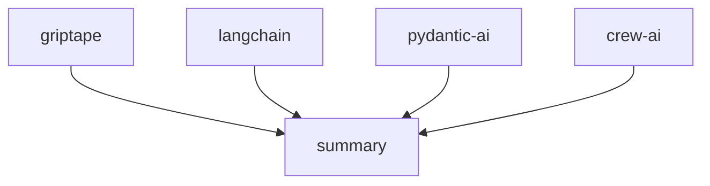

# Griptape: Build AI Applications with Ease

[](https://pypi.python.org/pypi/griptape)
[](https://github.com/griptape-ai/griptape/actions/workflows/unit-tests.yml)
[](https://griptape.readthedocs.io/)
[](https://microsoft.github.io/pyright/)
[](https://github.com/astral-sh/ruff)
[](https://codecov.io/github/griptape-ai/griptape)
[](https://discord.gg/griptape)


**Griptape is a Python framework that streamlines the development of generative AI applications, offering robust tools and abstractions for building powerful, scalable AI solutions.**

## Key Features

*   **Modular Architecture:** Build AI applications using Agents, Pipelines, and Workflows.
*   **Flexible Tasks:** Utilize Tasks as core building blocks to interact with Engines, Tools, and other components.
*   **Advanced Memory Management:** Implement Conversation Memory, Task Memory, and Meta Memory for context-aware interactions.
*   **Extensive Driver Support:** Integrate with various LLMs, retrieval systems, vector databases, and external services through a wide array of Drivers.
*   **Built-in Tools:** Access a comprehensive collection of [built-in Tools](https://docs.griptape.ai/stable/griptape-framework/tools/official-tools/) and easily create [custom Tools](https://docs.griptape.ai/stable/griptape-framework/tools/custom-tools/).
*   **Powerful Engines:** Leverage specialized Engines like the RAG Engine, Extraction Engine, Summary Engine, and Eval Engine.
*   **Additional Components:** Employ Rulesets, Loaders, Artifacts, and Chunkers to refine your AI applications.

## Core Components

### Structures

*   **Agents:** Single Task configured for Agent-specific behavior.
*   **Pipelines:** Organize a sequence of Tasks.
*   **Workflows:** Configure Tasks to operate in parallel.

### Tasks

Tasks are the core building blocks within Structures, enabling interaction with Engines, Tools, and other Griptape components.

### Memory

*   **Conversation Memory** enables LLMs to retain and retrieve information across interactions.
*   **Task Memory** keeps large or sensitive Task outputs off the prompt that is sent to the LLM.
*   **Meta Memory** enables passing in additional metadata to the LLM, enhancing the context and relevance of the interaction.

### Drivers

Drivers facilitate interactions with external resources and services in Griptape. They allow you to swap out functionality and providers with minimal changes to your business logic.

#### LLM & Orchestration

*   **Prompt Drivers**: Manage textual and image interactions with LLMs.
*   **Assistant Drivers**: Enable interactions with various “assistant” services.
*   **Ruleset Drivers**: Load and apply rulesets from external sources.
*   **Conversation Memory Drivers**: Store and retrieve conversational data.
*   **Event Listener Drivers**: Forward framework events to external services.
*   **Structure Run Drivers**: Execute structures locally or in the cloud.

#### Retrieval & Storage

*   **Embedding Drivers**: Generate vector embeddings from textual inputs.
*   **Rerank Drivers**: Rerank search results for improved relevance.
*   **Vector Store Drivers**: Manage the storage and retrieval of embeddings.
*   **File Manager Drivers**: Handle file operations on local and remote storage.
*   **SQL Drivers**: Interact with SQL databases.

#### Multimodal

*   **Image Generation Drivers**: Create images from text descriptions.
*   **Text to Speech Drivers**: Convert text to speech.
*   **Audio Transcription Drivers**: Convert audio to text.

#### Web

*   **Web Search Drivers**: Search the web for information.
*   **Web Scraper Drivers**: Extract data from web pages.

#### Observability

*   **Observability Drivers**: Send trace and event data to observability platforms.

### Tools

Tools provide capabilities for LLMs to interact with data and services.
Griptape includes a variety of [built-in Tools](https://docs.griptape.ai/stable/griptape-framework/tools/official-tools/), and makes it easy to create [custom Tools](https://docs.griptape.ai/stable/griptape-framework/tools/custom-tools/).

### Engines

Engines wrap Drivers and provide use-case-specific functionality:

*   **RAG Engine** is an abstraction for implementing modular Retrieval Augmented Generation (RAG) pipelines.
*   **Extraction Engine** extracts JSON or CSV data from unstructured text.
*   **Summary Engine** generates summaries from textual content.
*   **Eval Engine** evaluates and scores the quality of generated text.

### Additional Components

*   **Rulesets** steer LLM behavior with minimal prompt engineering.
*   **Loaders** load data from various sources.
*   **Artifacts** allow for passing data of different types between Griptape components.
*   **Chunkers** segment texts into manageable pieces for diverse text types.
*   **Tokenizers** count the number of tokens in a text to not exceed LLM token limits.

## Examples

### Hello World

```python
from griptape.drivers.prompt.openai import OpenAiChatPromptDriver
from griptape.rules import Rule
from griptape.tasks import PromptTask

task = PromptTask(
    prompt_driver=OpenAiChatPromptDriver(model="gpt-4.1"),
    rules=[Rule("Keep your answer to a few sentences.")],
)

result = task.run("How do I do a kickflip?")

print(result.value)
```

### Task and Workflow

```python
from griptape.drivers.prompt.openai_chat_prompt_driver import OpenAiChatPromptDriver
from griptape.drivers.web_search.duck_duck_go import DuckDuckGoWebSearchDriver
from griptape.rules import Rule, Ruleset
from griptape.structures import Workflow
from griptape.tasks import PromptTask, TextSummaryTask
from griptape.tools import WebScraperTool, WebSearchTool
from griptape.utils import StructureVisualizer
from pydantic import BaseModel


class Feature(BaseModel):
    name: str
    description: str
    emoji: str


class Output(BaseModel):
    answer: str
    key_features: list[Feature]


projects = ["griptape", "langchain", "crew-ai", "pydantic-ai"]

prompt_driver = OpenAiChatPromptDriver(model="gpt-4.1")
workflow = Workflow(
    tasks=[
        [
            PromptTask(
                id=f"project-{project}",
                input="Tell me about the open source project: {{ project }}.",
                prompt_driver=prompt_driver,
                context={"project": projects},
                output_schema=Output,
                tools=[
                    WebSearchTool(
                        web_search_driver=DuckDuckGoWebSearchDriver(),
                    ),
                    WebScraperTool(),
                ],
                child_ids=["summary"],
            )
            for project in projects
        ],
        TextSummaryTask(
            input="{{ parents_output_text }}",
            id="summary",
            rulesets=[
                Ruleset(
                    name="Format", rules=[Rule("Be detailed."), Rule("Include emojis.")]
                )
            ],
        ),
    ]
)

workflow.run()

print(StructureVisualizer(workflow).to_url())
```



## Documentation

Explore detailed guides and examples in the [official documentation](https://docs.griptape.ai/).

## Further Resources

*   Check out [Griptape Trade School](https://learn.griptape.ai/) for free online courses.

## Versioning

Griptape uses [Semantic Versioning](https://semver.org/).

## Contributing

We welcome contributions! Please refer to the [Contributing Guidelines](https://github.com/griptape-ai/griptape/blob/main/CONTRIBUTING.md).

## License

Griptape is available under the [Apache 2.0 License](https://github.com/griptape-ai/griptape).

[Back to top](#griptape-build-ai-applications-with-ease)